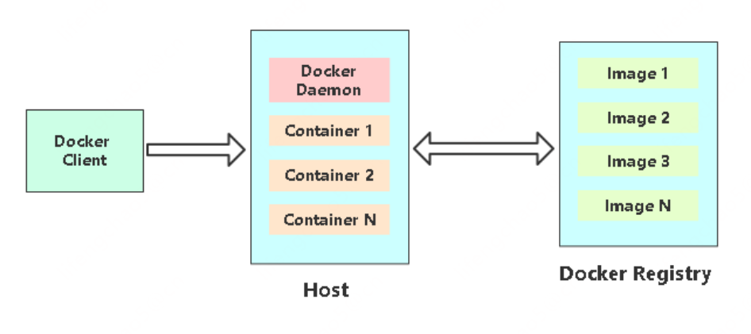
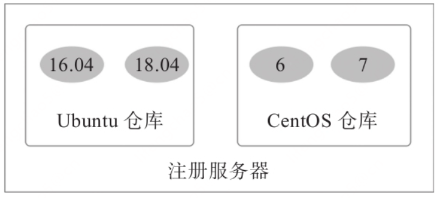

## Docker是什么
Docker，翻译过来就是码头工人

* 使用最广泛的开源容器引擎
* 一种操作系统级的虚拟化技术
* 依赖于Linux内核特性： Namespace（资源隔离）和Cgroups（资源限制）
* 一个简单的应用程序打包工具Docker基本组成版本与支持平台

## Docker基本组成



## 核心概念
**Docker的三大核心概念**：

* 镜像（Image）

* 容器（Container）

* 仓库（Repository）

只有理解了这三个核心概念，才能顺利地理解Docker容器的整个生命周期。

### Docker镜像

Docker镜像类似于虚拟机镜像，可以将它理解为一个只读的模板。

例如，一个镜像可以包含一个基本的操作系统环境，里面仅安装了Apache应用程序（或用户需要的其他软件）。可以把它称为一个Apache镜像。

镜像是创建Docker容器的基础。

通过版本管理和增量的文件系统，Docker提供了一套十分简单的机制来创建和更新现有的镜像，用户甚至可以从网上下载一个已经做好的应用镜像，并直接使用。

### Docker容器

Docker容器类似于一个轻量级的沙箱，Docker利用容器来运行和隔离应用。

容器是从镜像创建的应用运行实例。它可以启动、开始、停止、删除，而这些容器都是彼此相互隔离、互不可见的。

可以把容器看作一个简易版的Linux系统环境（包括root用户权限、进程空间、用户空间和网络空间等）以及运行在其中的应用程序打包而成的盒子。

注意：镜像自身是只读的。容器从镜像启动的时候，会在镜像的最上层创建一个可写层。

### Docker仓库

Docker仓库类似于代码仓库，是Docker集中存放镜像文件的场所。

有时候我们会将Docker仓库和仓库注册服务器（Registry）混为一谈，并不严格区分。实际上，仓库注册服务器是存放仓库的地方，其上往往存放着多个仓库。每个仓库集中存放某一类镜像，往往包括多个镜像文件，通过不同的标签（tag）来进行区分。例如存放Ubuntu操作系统镜像的仓库，被称为Ubuntu仓库，其中可能包括16.04、18.04等不同版本的镜像。仓库注册服务器的示例如图所示。



注册服务器与仓库

根据所存储的镜像公开分享与否，Docker仓库可以分为公开仓库（Public）和私有仓库（Private）两种形式。

目前，最大的公开仓库是官方提供的Docker Hub，其中存放着数量庞大的镜像供用户下载。国内不少云服务提供商（如腾讯云、阿里云等）也提供了仓库的本地源，可以提供稳定的国内访问。

当然，用户如果不希望公开分享自己的镜像文件，Docker也支持用户在本地网络内创建一个只能自己访问的私有仓库。

当用户创建了自己的镜像之后就可以使用push命令将它上传到指定的公有或者私有仓库。这样用户下次在另外一台机器上使用该镜像时，只需要将其从仓库上pull下来就可以了。

注意：可以看出，Docker利用仓库管理镜像的设计理念与Git代码仓库的概念非常相似，实际上Docker设计上借鉴了Git的很多优秀思想。


## Docker安装
https://docs.docker.com/engine/install/centos/

**卸载自带的docker**：
```
[root@single ~]# yum list installed  | grep docker
containerd.io.x86_64                         1.5.11-3.1.el7            @docker-ce-stable
docker-ce.x86_64                             3:20.10.14-3.el7          @docker-ce-stable
docker-ce-cli.x86_64                         1:20.10.14-3.el7          @docker-ce-stable
docker-ce-rootless-extras.x86_64             20.10.14-3.el7            @docker-ce-stable
docker-scan-plugin.x86_64                    0.17.0-3.el7              @docker-ce-stable
```
卸载：
```
yum remove docker \
  docker-client \
  docker-client-latest \
  docker-common \
  docker-latest \
  docker-latest-logrotate \
  docker-logrotate \
  docker-engine

yum remove docker-ce docker-ce-cli containerd.io docker-buildx-plugin docker-compose-plugin docker-ce-rootless-extras docker-scan-plugin
```

**安装：**
```sh
# 配置yum源
wget https://mirrors.aliyun.com/docker-ce/linux/centos/docker-ce.repo -O /etc/yum.repos.d/docker-ce.repo

# 安装最新版本的docke
yum -y install docker-ce docker-ce-cli containerd.io

# 阿里云镜像加速
mkdir -p /etc/docker

tee /etc/docker/daemon.json <<-'EOF'
{
  "registry-mirrors": ["https://d4vtehcm.mirror.aliyuncs.com"]
}
EOF

# 启动docker
systemctl restart docker
systemctl enable docker

# 检查docker状态和版本
docker version
```

安装过程日志：
```
[root@single ~]# wget https://mirrors.aliyun.com/docker-ce/linux/centos/docker-ce.repo -O /etc/yum.repos.d/docker-ce.repo
--2023-06-04 14:50:27--  https://mirrors.aliyun.com/docker-ce/linux/centos/docker-ce.repo
Resolving mirrors.aliyun.com (mirrors.aliyun.com)... 175.146.189.233, 2408:8719:64:9f:3::3f9, 2408:8719:64:9f:3::3fa, ...
Connecting to mirrors.aliyun.com (mirrors.aliyun.com)|175.146.189.233|:443... connected.
HTTP request sent, awaiting response... 200 OK
Length: 2081 (2.0K) [application/octet-stream]
Saving to: ‘/etc/yum.repos.d/docker-ce.repo’

100%[======================================================================================================================>] 2,081       --.-K/s   in 0s

2023-06-04 14:50:27 (36.2 MB/s) - ‘/etc/yum.repos.d/docker-ce.repo’ saved [2081/2081]

[root@single ~]# yum -y install docker-ce docker-ce-cli containerd.io
Loaded plugins: fastestmirror
Loading mirror speeds from cached hostfile
 * base: mirrors.bupt.edu.cn
 * extras: mirrors.bupt.edu.cn
 * updates: mirrors.bupt.edu.cn
Resolving Dependencies
--> Running transaction check
---> Package containerd.io.x86_64 0:1.6.21-3.1.el7 will be installed
---> Package docker-ce.x86_64 3:24.0.2-1.el7 will be installed
--> Processing Dependency: docker-ce-rootless-extras for package: 3:docker-ce-24.0.2-1.el7.x86_64
---> Package docker-ce-cli.x86_64 1:24.0.2-1.el7 will be installed
--> Processing Dependency: docker-buildx-plugin for package: 1:docker-ce-cli-24.0.2-1.el7.x86_64
--> Processing Dependency: docker-compose-plugin for package: 1:docker-ce-cli-24.0.2-1.el7.x86_64
--> Running transaction check
---> Package docker-buildx-plugin.x86_64 0:0.10.5-1.el7 will be installed
---> Package docker-ce-rootless-extras.x86_64 0:24.0.2-1.el7 will be installed
---> Package docker-compose-plugin.x86_64 0:2.18.1-1.el7 will be installed
--> Finished Dependency Resolution

Dependencies Resolved

================================================================================================================================================================
 Package                                         Arch                         Version                              Repository                              Size
================================================================================================================================================================
Installing:
 containerd.io                                   x86_64                       1.6.21-3.1.el7                       docker-ce-stable                        34 M
 docker-ce                                       x86_64                       3:24.0.2-1.el7                       docker-ce-stable                        24 M
 docker-ce-cli                                   x86_64                       1:24.0.2-1.el7                       docker-ce-stable                        13 M
Installing for dependencies:
 docker-buildx-plugin                            x86_64                       0.10.5-1.el7                         docker-ce-stable                        12 M
 docker-ce-rootless-extras                       x86_64                       24.0.2-1.el7                         docker-ce-stable                       9.1 M
 docker-compose-plugin                           x86_64                       2.18.1-1.el7                         docker-ce-stable                        12 M

Transaction Summary
================================================================================================================================================================
Install  3 Packages (+3 Dependent packages)

Total download size: 104 M
Installed size: 372 M
Downloading packages:
(1/6): docker-buildx-plugin-0.10.5-1.el7.x86_64.rpm                                                                                      |  12 MB  00:00:15
(2/6): containerd.io-1.6.21-3.1.el7.x86_64.rpm                                                                                           |  34 MB  00:00:42
(3/6): docker-ce-24.0.2-1.el7.x86_64.rpm                                                                                                 |  24 MB  00:00:30
(4/6): docker-ce-rootless-extras-24.0.2-1.el7.x86_64.rpm                                                                                 | 9.1 MB  00:00:10
(5/6): docker-ce-cli-24.0.2-1.el7.x86_64.rpm                                                                                             |  13 MB  00:00:16
(6/6): docker-compose-plugin-2.18.1-1.el7.x86_64.rpm                                                                                     |  12 MB  00:00:13
----------------------------------------------------------------------------------------------------------------------------------------------------------------
Total                                                                                                                           1.5 MB/s | 104 MB  00:01:10
Running transaction check
Running transaction test
Transaction test succeeded
Running transaction
  Installing : docker-buildx-plugin-0.10.5-1.el7.x86_64                                                                                                     1/6
  Installing : containerd.io-1.6.21-3.1.el7.x86_64                                                                                                          2/6
  Installing : docker-compose-plugin-2.18.1-1.el7.x86_64                                                                                                    3/6
  Installing : 1:docker-ce-cli-24.0.2-1.el7.x86_64                                                                                                          4/6
  Installing : docker-ce-rootless-extras-24.0.2-1.el7.x86_64                                                                                                5/6
  Installing : 3:docker-ce-24.0.2-1.el7.x86_64                                                                                                              6/6
  Verifying  : 3:docker-ce-24.0.2-1.el7.x86_64                                                                                                              1/6
  Verifying  : docker-compose-plugin-2.18.1-1.el7.x86_64                                                                                                    2/6
  Verifying  : containerd.io-1.6.21-3.1.el7.x86_64                                                                                                          3/6
  Verifying  : 1:docker-ce-cli-24.0.2-1.el7.x86_64                                                                                                          4/6
  Verifying  : docker-ce-rootless-extras-24.0.2-1.el7.x86_64                                                                                                5/6
  Verifying  : docker-buildx-plugin-0.10.5-1.el7.x86_64                                                                                                     6/6

Installed:
  containerd.io.x86_64 0:1.6.21-3.1.el7                  docker-ce.x86_64 3:24.0.2-1.el7                  docker-ce-cli.x86_64 1:24.0.2-1.el7

Dependency Installed:
  docker-buildx-plugin.x86_64 0:0.10.5-1.el7         docker-ce-rootless-extras.x86_64 0:24.0.2-1.el7         docker-compose-plugin.x86_64 0:2.18.1-1.el7

Complete!
[root@single ~]# mkdir -p /etc/docker
[root@single ~]# tee /etc/docker/daemon.json <<-'EOF'
> {
>   "registry-mirrors": ["https://d4vtehcm.mirror.aliyuncs.com"]
> }
> EOF
{
  "registry-mirrors": ["https://d4vtehcm.mirror.aliyuncs.com"]
}
[root@single ~]# systemctl restart docker

[root@single ~]# systemctl enable docker
Created symlink from /etc/systemd/system/multi-user.target.wants/docker.service to /usr/lib/systemd/system/docker.service.
[root@single ~]# docker version
Client: Docker Engine - Community
 Version:           24.0.2
 API version:       1.43
 Go version:        go1.20.4
 Git commit:        cb74dfc
 Built:             Thu May 25 21:55:21 2023
 OS/Arch:           linux/amd64
 Context:           default

Server: Docker Engine - Community
 Engine:
  Version:          24.0.2
  API version:      1.43 (minimum version 1.12)
  Go version:       go1.20.4
  Git commit:       659604f
  Built:            Thu May 25 21:54:24 2023
  OS/Arch:          linux/amd64
  Experimental:     false
 containerd:
  Version:          1.6.21
  GitCommit:        3dce8eb055cbb6872793272b4f20ed16117344f8
 runc:
  Version:          1.1.7
  GitCommit:        v1.1.7-0-g860f061
 docker-init:
  Version:          0.19.0
  GitCommit:        de40ad0
[root@single ~]#

```


```

```