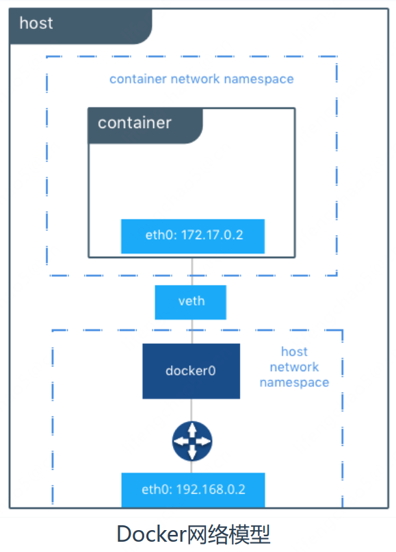
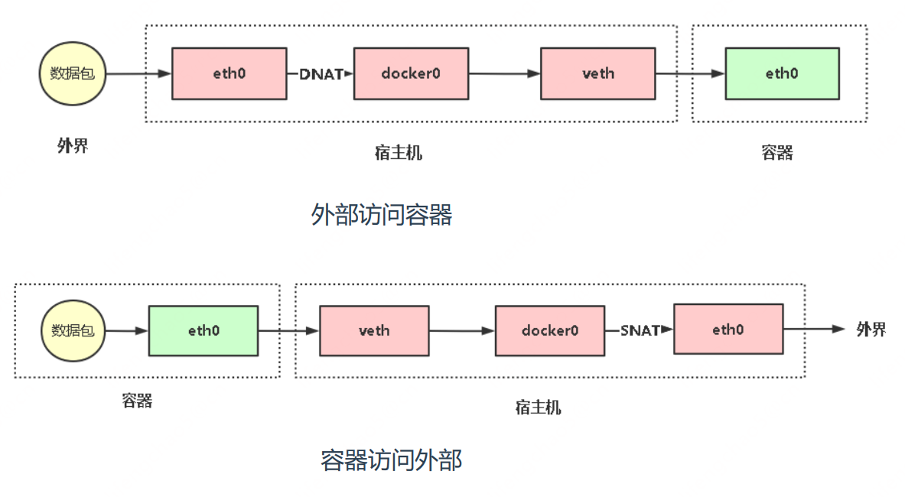

## 创建容器常用选项
命令格式： `docker run [OPTIONS] IMAGE [COMMAND] [ARG...]`

| 选项                                      | 描述                                                      |
| ----------------------------------------- | --------------------------------------------------------- |
| -i, –interactive                          | 交互式                                                    |
| -t, –tty                                  | 分配一个伪终端                                            |
| -d, –detach                               | 运行容器到后台                                            |
| -e, –env                                  | 设置环境变量                                              |
| -p, –publish list                         | 发布容器端口到主机                                        |
| -P, –publish-all                          | 发布容器所有EXPOSE的端口到宿主机随机端口                  |
| --name string                             | 指定容器名称                                              |
| -h, –hostname                             | 设置容器主机名                                            |
| --ip string                               | 指定容器IP，只能用于自定义网络                            |
| --network                                 | 连接容器到一个网络                                        |
| -v, –volume list <br/> --mount mount（新方式） | 将文件系统附加到容器                                      |
| --restart string                          | 容器退出时重启策略，默认no，可选值： [always\|on-failure] |
| -m， –memory                              | 容器可以使用的最大内存量                                  |
| –memory-swap                              | 允许交换到磁盘的内存量                                    |
| –memory-swappiness=<0-100>                | 容器使用SWAP分区交换的百分比（0-100，默认为-1）           |
| –oom-kill-disable                         | 禁用OOM Killer                                            |
| --cpus                                    | 可以使用的CPU数量                                         |
| –cpuset-cpus                              | 限制容器使用特定的CPU核心，如(0-3, 0,1)                   |
| –cpu-shares                               | CPU共享（相对权重）                                       |

## 常用管理命令
命令格式： `docker container COMMAND`容器数据持久化
| 指令               | 命令                                        | 描述                                                      |
| ------------------ | ------------------------------------------- | --------------------------------------------------------- |
| ls                 | docker container ls 或者 docker ps          | 列出容器                                                  |
| inspect            | docker container inspect test               | 查看一个或多个容器详细信息                                |
| exec               | docker  [container] exec -it test /bin/bash | 在运行容器中执行命令                                      |
| commit             |                                             | 创建一个新镜像来自一个容器                                |
| cp                 | docker [container] cp data test:/tmp/       | 拷贝文件/文件夹到一个容器                                 |
| logs               | docker [container] logs test                | 获取一个容器日志                                          |
| port               | docker container port test                  | 列出或指定容器端口映射                                    |
| top                | docker [container] top test                 | 显示一个容器运行的进程                                    |
| stats              | docker [container] stats test               | 显示容器资源使用统计                                      |
| create             | docker [container] create                   | 新建一个容器                                              |
| run                | docker [container] run                      | 新建并启动容器，等价于先执行create命令，再执行start命令。 |
| stop/start/restart | docker [container] stop/start/restart       | 停止/启动一个或多个容器                                   |
| rm                 | docker [container] rm                       | 删除一个或多个容器                                        |
| prune              | docker container prune                      | 自动移除已停止的容器                                      |

## 容器数据持久化
Docker提供2种方式将数据从宿主机挂载到容器中：

* volumes： Docker管理宿主机文件系统的一部分（/var/lib/docker/volumes） 。
* bind mounts：将宿主机上的任意位置的文件或者目录挂载到容器中。

volumes方式可以忽略，基本使用bind mounts方式。

volumes示例：
1、创建数据卷
```
# docker volume create nginx-vol
# docker volume ls
# docker volume inspect nginx-vol
```
2、使用数据卷
```
# docker run -d --name=nginx-test --mount src=nginxvol,dst=/usr/share/nginx/html nginx
# docker run -d --name=nginx-test -v nginxvol:/usr/share/nginx/html nginx
```

**bind mounts示例**：

**挂载宿主机目录到容器**
```
# docker run -d --name=nginx-test --mount type=bind,src=/app/wwwroot,dst=/usr/share/nginx/html nginx
# docker run -d --name=nginx-test -v /app/wwwroot:/usr/share/nginx/html nginx
```

## 容器网络


* veth pair：成对出现的一种虚拟网络设备，数据从一端进,从另一端出。 用于解决网络命名空间之间隔离。  
* docker0：网桥是一个二层网络设备，通过网桥可以将Linux支持的不同的端口连接起来，并实现类似交换机那样的多对多的通信。  

Docker使用iptables实现网络通信。



```
外部访问容器：
# iptables -t nat -vnL DOCKER
容器访问外部：
# iptables -t nat -vnL POSTROUTING
```

## 命令测试
```sh
# 列举镜像
[root@single ~]# docker images
REPOSITORY    TAG       IMAGE ID       CREATED         SIZE
python        3.7       ad37de9b03ef   17 months ago   903MB
hello-world   latest    feb5d9fea6a5   20 months ago   13.3kB
[root@single ~]# docker image ls
REPOSITORY    TAG       IMAGE ID       CREATED         SIZE
python        3.7       ad37de9b03ef   17 months ago   903MB
hello-world   latest    feb5d9fea6a5   20 months ago   13.3kB

# 删除镜像，必须先删除对应的容器
[root@single ~]# docker rmi hello-world
Untagged: hello-world:latest
Untagged: hello-world@sha256:10d7d58d5ebd2a652f4d93fdd86da8f265f5318c6a73cc5b6a9798ff6d2b2e67
Deleted: sha256:feb5d9fea6a5e9606aa995e879d862b825965ba48de054caab5ef356dc6b3412
Deleted: sha256:e07ee1baac5fae6a26f30cabfe54a36d3402f96afda318fe0a96cec4ca393359
[root@single ~]# docker image ls
REPOSITORY   TAG       IMAGE ID       CREATED         SIZE
python       3.7       ad37de9b03ef   17 months ago   903MB

# 拉取镜像
[root@single ~]# docker pull nginx:1.17
1.17: Pulling from library/nginx
afb6ec6fdc1c: Pull complete
b90c53a0b692: Pull complete
11fa52a0fdc0: Pull complete
Digest: sha256:6fff55753e3b34e36e24e37039ee9eae1fe38a6420d8ae16ef37c92d1eb26699
Status: Downloaded newer image for nginx:1.17
docker.io/library/nginx:1.17
[root@single ~]# docker images
REPOSITORY   TAG       IMAGE ID       CREATED         SIZE
python       3.7       ad37de9b03ef   17 months ago   903MB
nginx        1.17      9beeba249f3e   3 years ago     127MB

# 在前端启动
[root@single ~]# docker run -p 80:80 --name web nginx:1.17
192.168.216.1 - - [04/Jun/2023:12:06:03 +0000] "GET / HTTP/1.1" 200 612 "-" "Mozilla/5.0 (Windows NT 10.0; WOW64) AppleWebKit/537.36 (KHTML, like Gecko) Chrome/108.0.5359.95 Safari/537.36" "-"
192.168.216.1 - - [04/Jun/2023:12:06:22 +0000] "GET / HTTP/1.1" 304 0 "-" "Mozilla/5.0 (Windows NT 10.0; WOW64) AppleWebKit/537.36 (KHTML, like Gecko) Chrome/108.0.5359.95 Safari/537.36" "-"
172.17.0.1 - - [04/Jun/2023:12:06:58 +0000] "GET / HTTP/1.1" 200 612 "-" "curl/7.29.0" "-"
172.17.0.1 - - [04/Jun/2023:12:07:35 +0000] "GET / HTTP/1.1" 200 612 "-" "curl/7.29.0" "-"
^C[root@single ~]#

# 本机访问nginx
[root@single ~]# curl localhost

# 删除容器
[root@single ~]# docker ps -a
CONTAINER ID   IMAGE        COMMAND                  CREATED         STATUS                      PORTS     NAMES
05fcae4b89ba   nginx:1.17   "nginx -g 'daemon of…"   4 minutes ago   Exited (0) 27 seconds ago             web
[root@single ~]# docker rm web
web
[root@single ~]# docker ps -a
CONTAINER ID   IMAGE     COMMAND   CREATED   STATUS    PORTS     NAMES
[root@single ~]#

# 后台启动
[root@single ~]# docker run -p 80:80 --name web -d nginx:1.17
2760d38cf8d84e8bb339a0b1999769864aa7e96ccdb627642d6ea7173cdf7611
[root@single ~]# docker ps
CONTAINER ID   IMAGE        COMMAND                  CREATED          STATUS          PORTS                               NAMES
2760d38cf8d8   nginx:1.17   "nginx -g 'daemon of…"   17 seconds ago   Up 16 seconds   0.0.0.0:80->80/tcp, :::80->80/tcp   web
[root@single ~]# docker rm -f web

# 设置环境变量
[root@single ~]# docker run -p 80:80 --name web -e aa=test -e bb=test2 -d nginx:1.17
a67584d4905cb239786c94f5c8c1b6b5df6178f30634bc1069d1c4a9920e9bd0
[root@single ~]# docker exec -it web bash
root@a67584d4905c:/# echo $aa
test
root@a67584d4905c:/# echo $bb
test2
root@a67584d4905c:/# exit
exit
[root@single ~]# docker stop web
web
[root@single ~]# docker rm web
web
[root@single ~]#
```

```
# 修改容器的文件，停止容器不影响。只有重新用镜像起一个容器才会重置。
[root@single ~]# docker run -p 80:80 --name web -d nginx:1.17
ccb4268695cb582fbd6716c60c930cdd0106096af976ae8d0c716046ed679964
[root@single ~]# docker exec -it web bash
root@ccb4268695cb:/# echo "<h2>hellow nginx</h2>" > /usr/share/nginx/html/index.html
root@ccb4268695cb:/# exit
exit
[root@single ~]# curl localhost
<h2>hellow nginx</h2>

[root@single ~]# docker stop web
web
[root@single ~]# docker start web
web
[root@single ~]# curl localhost
<h2>hellow nginx</h2>


# 重启一个就是一个全新的环境
[root@single ~]# docker rm -f web
web
[root@single ~]# docker run -p 80:80 --name web -d nginx:1.17
1d22434d20f2949401d92025356685bc4958b0d8d232f9630ad8f4d93e0af828
[root@single ~]# curl localhost
<!DOCTYPE html>
<html>
<head>
<title>Welcome to nginx!</title>
<style>
    body {
        width: 35em;
        margin: 0 auto;
        font-family: Tahoma, Verdana, Arial, sans-serif;
    }
</style>
</head>
<body>
<h1>Welcome to nginx!</h1>
<p>If you see this page, the nginx web server is successfully installed and
working. Further configuration is required.</p>

<p>For online documentation and support please refer to
<a href="http://nginx.org/">nginx.org</a>.<br/>
Commercial support is available at
<a href="http://nginx.com/">nginx.com</a>.</p>

<p><em>Thank you for using nginx.</em></p>
</body>
</html>
[root@single ~]#


# 使用目录映射后相当于数据持久化了，就是容器删除，换个环境也不影响
[root@single ~]# docker cp web:/usr/share/nginx/html ./
Successfully copied 4.1kB to /root/./
[root@single ~]# echo "<h2>hellow aaa</h2>" >  html/index.html
[root@single ~]# docker rm -f web
web
[root@single ~]# docker run -p 80:80 --name web -v /root/html:/usr/share/nginx/html -d nginx:1.17
03dcbbeece9508b397138963c0edd06a5e16342e244c6bcf05c405e549b3df76
[root@single ~]# curl localhost
<h2>hellow aaa</h2>
[root@single ~]# docker rm -f web
web
[root@single ~]# docker run -p 80:80 --name web -v /root/html:/usr/share/nginx/html -d nginx:1.17
f3281f7d5d1dcf7b0f814855e034b83e04d5a0615fecfc980017cc1988c8eb4b
[root@single ~]# curl localhost
<h2>hellow aaa</h2>
```

容器重启测试
```
# 默认是不会重启的
[root@single ~]# docker run -p 80:80 --name web -v /root/html:/usr/share/nginx/html -d nginx:1.17
0b9f3690c78483216771f89205b052c057cd19a4993c5344f82902198e723de5
[root@single ~]# docker top web
UID                 PID                 PPID                C                   STIME               TTY                 TIME                CMD
root                3298                3279                0                   20:53               ?                   00:00:00            nginx: master process nginx -g daemon off;
101                 3329                3298                0                   20:53               ?                   00:00:00            nginx: worker process
[root@single ~]# ps aux | grep "nginx"
root       3298  0.0  0.0  10620  3432 ?        Ss   20:53   0:00 nginx: master process nginx -g daemon off;
101        3329  0.0  0.0  11076  1496 ?        S    20:53   0:00 nginx: worker process
root       3436  0.0  0.0 112812   980 pts/0    S+   20:56   0:00 grep --color=auto nginx
[root@single ~]# kill 3298
[root@single ~]# docker ps
CONTAINER ID   IMAGE     COMMAND   CREATED   STATUS    PORTS     NAMES
[root@single ~]# docker rm web
web

# 异常退出会重启
[root@single ~]# docker run -p 80:80 --name web -v /root/html:/usr/share/nginx/html --restart=always -d nginx:1.17
5352d51c8cafb03ecce41e0f41e2cfcd381ae336a27a10897925d5e9ef86f438
[root@single ~]# docker ps
CONTAINER ID   IMAGE        COMMAND                  CREATED         STATUS         PORTS                               NAMES
5352d51c8caf   nginx:1.17   "nginx -g 'daemon of…"   8 seconds ago   Up 7 seconds   0.0.0.0:80->80/tcp, :::80->80/tcp   web
[root@single ~]# docker top web
UID                 PID                 PPID                C                   STIME               TTY                 TIME                CMD
root                3599                3579                0                   20:59               ?                   00:00:00            nginx: master process nginx -g daemon off;
101                 3620                3599                0                   20:59               ?                   00:00:00            nginx: worker process
[root@single ~]# ps aux | grep "nginx"
root       3599  0.1  0.0  10620  3428 ?        Ss   20:59   0:00 nginx: master process nginx -g daemon off;
101        3620  0.0  0.0  11076  1496 ?        S    20:59   0:00 nginx: worker process
root       3643  0.0  0.0 112812   980 pts/0    S+   20:59   0:00 grep --color=auto nginx
[root@single ~]# kill 3599
[root@single ~]# docker ps
CONTAINER ID   IMAGE        COMMAND                  CREATED          STATUS         PORTS                               NAMES
5352d51c8caf   nginx:1.17   "nginx -g 'daemon of…"   54 seconds ago   Up 3 seconds   0.0.0.0:80->80/tcp, :::80->80/tcp   web
[root@single ~]# docker ps
CONTAINER ID   IMAGE        COMMAND                  CREATED              STATUS          PORTS                               NAMES
5352d51c8caf   nginx:1.17   "nginx -g 'daemon of…"   About a minute ago   Up 19 seconds   0.0.0.0:80->80/tcp, :::80->80/tcp   web
[root@single ~]# docker top web
UID                 PID                 PPID                C                   STIME               TTY                 TIME                CMD
root                3733                3714                0                   21:00               ?                   00:00:00            nginx: master process nginx -g daemon off;
101                 3756                3733                0                   21:00               ?                   00:00:00            nginx: worker process
[root@single ~]# ps aux | grep "nginx"
root       3733  0.0  0.0  10620  3432 ?        Ss   21:00   0:00 nginx: master process nginx -g daemon off;
101        3756  0.0  0.0  11076  1496 ?        S    21:00   0:00 nginx: worker process
root       3785  0.0  0.0 112812   980 pts/0    S+   21:00   0:00 grep --color=auto nginx

# 手动stop不会重启
[root@single ~]# docker stop web
web
[root@single ~]# docker ps
CONTAINER ID   IMAGE     COMMAND   CREATED   STATUS    PORTS     NAMES
[root@single ~]# docker ps
CONTAINER ID   IMAGE     COMMAND   CREATED   STATUS    PORTS     NAMES

# 然后再start，还是依然会异常自动重启
[root@single ~]# docker start web
web
[root@single ~]# docker ps
CONTAINER ID   IMAGE        COMMAND                  CREATED         STATUS         PORTS                               NAMES
5352d51c8caf   nginx:1.17   "nginx -g 'daemon of…"   2 minutes ago   Up 2 seconds   0.0.0.0:80->80/tcp, :::80->80/tcp   web
[root@single ~]# ps aux | grep "nginx"
root       3929  0.4  0.0  10620  3436 ?        Ss   21:01   0:00 nginx: master process nginx -g daemon off;
101        3954  0.0  0.0  11076  1500 ?        S    21:01   0:00 nginx: worker process
root       3963  0.0  0.0 112812   980 pts/0    S+   21:01   0:00 grep --color=auto nginx
[root@single ~]# kill 3929
[root@single ~]# docker ps
CONTAINER ID   IMAGE        COMMAND                  CREATED         STATUS         PORTS                               NAMES
5352d51c8caf   nginx:1.17   "nginx -g 'daemon of…"   3 minutes ago   Up 2 seconds   0.0.0.0:80->80/tcp, :::80->80/tcp   web
[root@single ~]# docker ps
CONTAINER ID   IMAGE        COMMAND                  CREATED         STATUS         PORTS                               NAMES
5352d51c8caf   nginx:1.17   "nginx -g 'daemon of…"   3 minutes ago   Up 7 seconds   0.0.0.0:80->80/tcp, :::80->80/tcp   web
[root@single ~]# ps aux | grep "nginx"
root       4063  0.4  0.0  10620  3436 ?        Ss   21:02   0:00 nginx: master process nginx -g daemon off;
101        4083  0.0  0.0  11076  1504 ?        S    21:02   0:00 nginx: worker process
root       4099  0.0  0.0 112812   980 pts/0    S+   21:02   0:00 grep --color=auto nginx
[root@single ~]# docker top web
UID                 PID                 PPID                C                   STIME               TTY                 TIME                CMD
root                4063                4042                0                   21:02               ?                   00:00:00            nginx: master process nginx -g daemon off;
101                 4083                4063                0                   21:02               ?                   00:00:00            nginx: worker process
[root@single ~]# curl localhost
<h2>hellow aaa</h2>
[root@single ~]#
```
