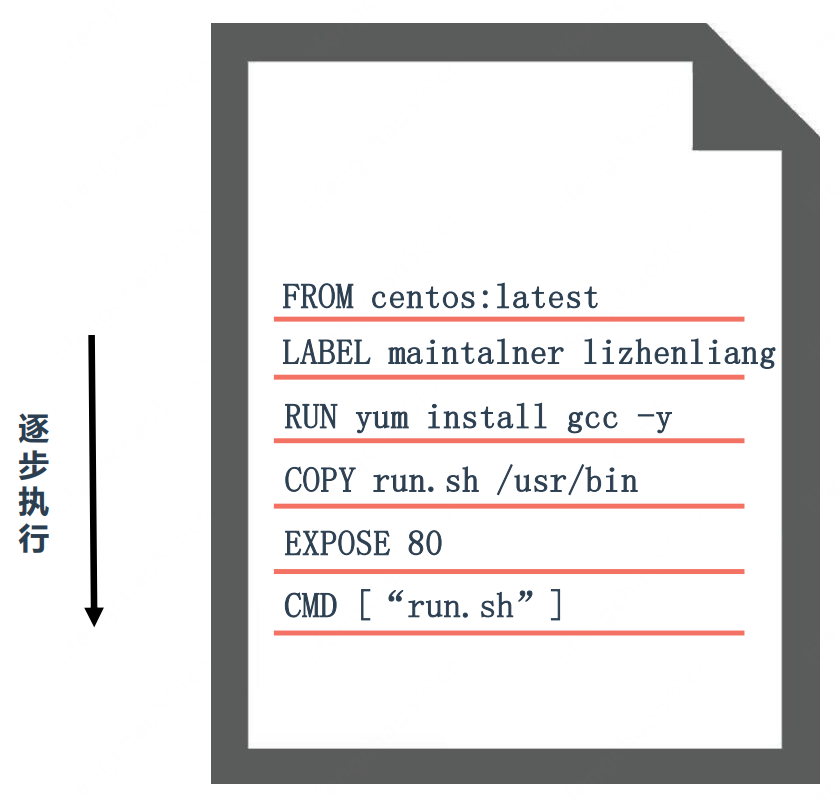

## Dockerfile概述
Docker通过Dockerfile自动构建镜像， Dockerfile是一个包含用于组建镜像的文本文件，由一条一条的指令组成。


## Dockerfile常用指令
| 指令    | 描述                                                |
| ------- | --------------------------------------------------- |
| FROM    | 构建新镜像是基于哪个镜像                            |
| LABEL   | 标签                                                |
| RUN     | 构建镜像时运行的Shell命令                           |
| COPY    | 拷贝文件或目录到镜像中                              |
| ADD     | 解压压缩包并拷贝                                    |
| ENV     | 设置环境变量                                        |
| USER    | 为RUN、 CMD和ENTRYPOINT执行命令指定运行用户         |
| EXPOSE  | 声明容器运行的服务端口                              |
| WORKDIR | 为RUN、 CMD、 ENTRYPOINT、 COPY和ADD设置工作目录    |
| CMD     | 运行容器时默认执行，如果有多个CMD指令，最后一个生效 |

## 构建镜像命令
Usage: `docker build [OPTIONS] PATH | URL | - [flags]`

Options:  
* -t, --tag list # 镜像名称  
* -f, --file string # 指定Dockerfile文件位置  

```
# docker build -t shykes/myapp .
# docker build -t shykes/myapp -f /path/Dockerfile /path
# docker build -t shykes/myapp http://www.example.com/Dockerfile
```

## 构建Nginx镜像
```
FROM centos:7
LABEL maintainer www.ctnrs.com
RUN yum install -y gcc gcc-c++ make \
    openssl-devel pcre-devel gd-devel \
    iproute net-tools telnet wget curl && \
    yum clean all && \
    rm -rf /var/cache/yum/*

ADD nginx-1.15.5.tar.gz /
RUN cd nginx-1.15.5 && \
    ./configure --prefix=/usr/local/nginx \
    --with-http_ssl_module \
    --with-http_stub_status_module && \
    make -j 4 && make install && \
    mkdir /usr/local/nginx/conf/vhost && \
    cd / && rm -rf nginx* && \
    ln -sf /usr/share/zoneinfo/Asia/Shanghai /etc/localtime

ENV PATH $PATH:/usr/local/nginx/sbin
COPY nginx.conf /usr/local/nginx/conf/nginx.conf
WORKDIR /usr/local/nginx
EXPOSE 80
CMD ["nginx", "-g", "daemon off;"]

```

## 构建Tomcat镜像
```
FROM centos:7
MAINTAINER www.ctnrs.com

ENV VERSION=8.5.43

RUN yum install java-1.8.0-openjdk wget curl unzip iproute net-tools -y && \
    yum clean all && \
    rm -rf /var/cache/yum/*

ADD apache-tomcat-${VERSION}.tar.gz /usr/local/
RUN mv /usr/local/apache-tomcat-${VERSION} /usr/local/tomcat && \
    sed -i '1a JAVA_OPTS="-Djava.security.egd=file:/dev/./urandom"' /usr/local/tomcat/bin/catalina.sh && \
    ln -sf /usr/share/zoneinfo/Asia/Shanghai /etc/localtime

ENV PATH $PATH:/usr/local/tomcat/bin

WORKDIR /usr/local/tomcat

EXPOSE 8080
CMD ["catalina.sh", "run"]

```


