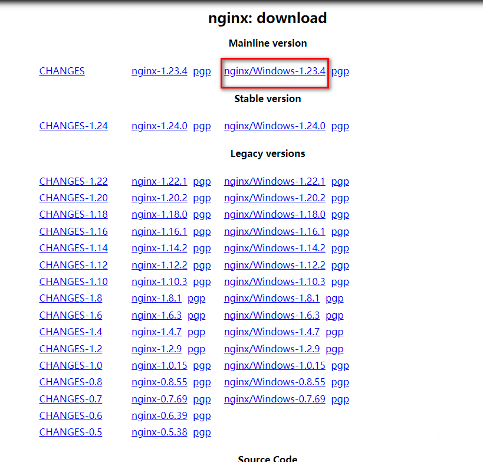
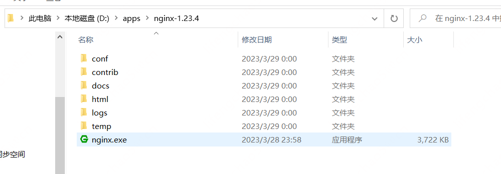
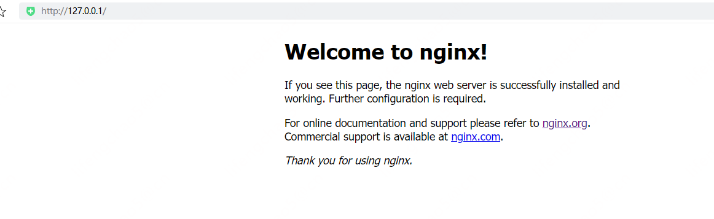
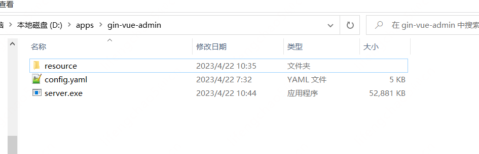
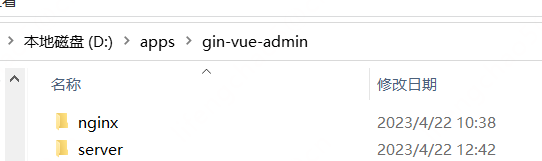
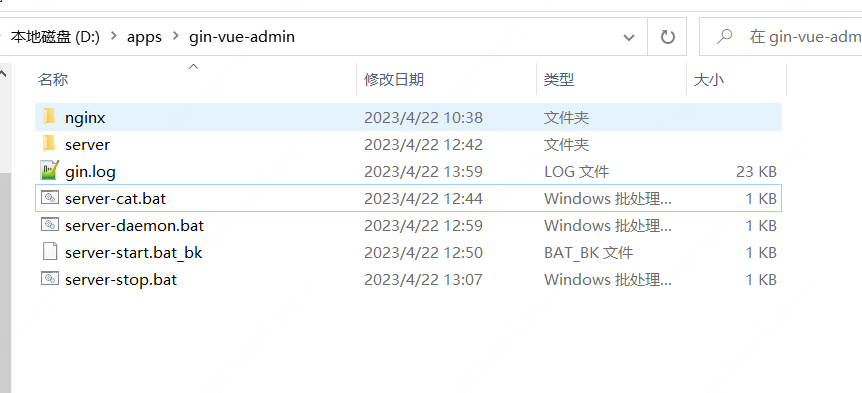
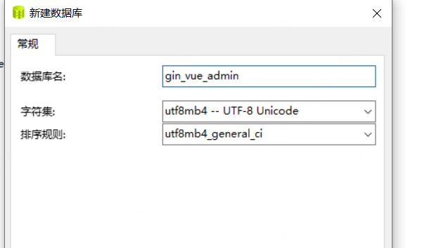
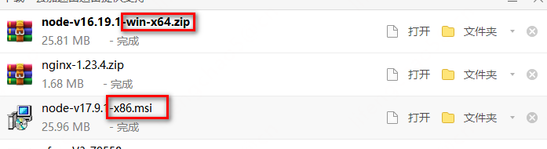

就是自己简单在windos使用用于做些笔记，看看在windos怎么部署。

## 前端部署
### 下载安装Nginx
去到Nginx官网：http://nginx.org/  ，然后点击“download”

在下载界面选择自己想要下载的版本，点击对应版本，下载Nginx


解压Nginx压缩包：


启动nginx服务，启动时会一闪而过是正常的
```
D:\apps\nginx-1.23.4>start nginx
```
查看任务进程是否存在，dos或打开任务管理器都行
```
D:\apps\nginx-1.23.4>tasklist /fi "imagename eq nginx.exe"

映像名称                       PID 会话名              会话#       内存使用
========================= ======== ================ =========== ============
nginx.exe                     8328 Console                    1      8,740 K
nginx.exe                     3260 Console                    1      8,616 K
```


### 启动、停止、重启等命令
启动：
```
start nginx
或
nginx.exe
```
注：建议使用第一种，第二种会使你的cmd窗口一直处于执行中，不能进行其他命令操作。

停止：
```
nginx.exe -s stop
或
nginx.exe -s quit
```
注：stop是快速停止nginx，可能并不保存相关信息；quit是完整有序的停止nginx，并保存相关信息。

重新载入Nginx：
```
nginx.exe -s reload
```
当配置信息修改，需要重新载入这些配置时使用此命令。

### 修改Nginx的配置 
把前端打包的dist文件夹复制到nginx目录

修改nginx.conf:
```
server {
    listen  80;
    server_name localhost;

    #charset koi8-r;
    #access_log  logs/host.access.log  main;

    location / {
        root dist;
        add_header Cache-Control 'no-store, no-cache, must-revalidate, proxy-revalidate, max-age=0';
        try_files $uri $uri/ /index.html;
    }

    location /api {
        proxy_set_header Host $http_host;
        proxy_set_header  X-Real-IP $remote_addr;
        proxy_set_header X-Forwarded-For $proxy_add_x_forwarded_for;
        proxy_set_header X-Forwarded-Proto $scheme;
        rewrite ^/api/(.*)$ /$1 break;  #重写
        proxy_pass http://127.0.0.1:8888; # 设置代理服务器的协议和地址
     }
    location  /form-generator {
        proxy_set_header Host $http_host;
        proxy_set_header X-Real-IP $remote_addr;
        proxy_set_header X-Forwarded-For $proxy_add_x_forwarded_for;
        proxy_set_header X-Forwarded-Proto $scheme;
        proxy_pass http://127.0.0.1:8888;
    }
    location /api/swagger/index.html {
        proxy_pass http://127.0.0.1:8888/swagger/index.html;
    
```

重新载入Nginx：
```
nginx.exe -s reload
```

### 前端打包
```
# 先增加node的内存
npm install -g cross-env
npm install -g increase-memory-limit
npm run fix-memory-limit

# 打包编译
npm run build
```

## 后端部署

打包
```
# 去除调试信息，减少文件大小
go build -ldflags="-s -w"
go build -ldflags="-s -w" -o gin-vue-admin.exe 
```

把需要的文件复制到新建的app目录，运行exe即可

后端只需要exe，config.yaml,resource三个文件，点击exe即可打开


## 命令一键启动停止
把前端和后端放在一个目录：


写的命令:

在后台启动前端后端,server-daemon:
```powershell
@echo off

%1 start mshta vbscript:createobject("wscript.shell").run("""%~0"" ::",0)(window.close)&&exit

tasklist /nh | find /i "nginx.exe" > nul
if errorlevel 1 (
    cd nginx
    REM start /b nginx.exe > ../nginx.log
    start nginx
    cd ..
)else (
    echo nginx.exe exist!
REM exit
    echo nginx.exe exist!
)

tasklist /nh | find /i "gin-vue-admin.exe" > nul
if errorlevel 1 (
    cd server
    start /b gin-vue-admin.exe > ../gin.log
    cd ..
REM gin-vue-admin.exe
)else (
    echo gin-vue-admin.exe exist!
    exit
)

REM pause

```

停止应用:
```powershell
@echo off


tasklist /nh | find /i "nginx.exe" > nul
if errorlevel 1 (
    echo no nginx start
)else (
    echo stop nginx
    taskkill /im nginx.exe /f
)

tasklist /nh | find /i "gin-vue-admin.exe" > nul
if errorlevel 1 (
    echo no gin-vue-admin start
)else (
    echo stop gin-vue-admin
    taskkill /im gin-vue-admin.exe /f
)

pause

```

查看应用:
```powershell
@echo off

tasklist /fi "imagename eq nginx.exe"

tasklist /fi "imagename eq gin-vue-admin.exe"


pause
```

## 修改端口
修改端口和数据库，省的和测试冲突不能同时启动，只需修改前端配置重新打包即可，后端读取的是配置文件。

后端端口：8086
数据库：gin_vue_admin

**还得修改nginx转发后端端口**

修改前端访问后端的端口为8086


```sh
set NODE_OPTIONS=--max_old_space_size=4096
# 先增加node的内存
npm run fix-memory-limit


# 打包编译
npm run build

go build -ldflags="-s -w" -o gin-vue-admin.exe 
```

## 内存不够的一次大坑
试了好久参数都不行，后来发现装的是32位，应该装x64的代表64位时间长了，忘了妈的。


重新安装yarn、yrm，重新安装依赖(之前装的依赖似乎也是32的)：
```
npm i
```

装了对的64位的明显不一样了，什么参数都不设置，node内存占用快到4g也没报错，之前怎么设置内存大概到1.5g就报错。


