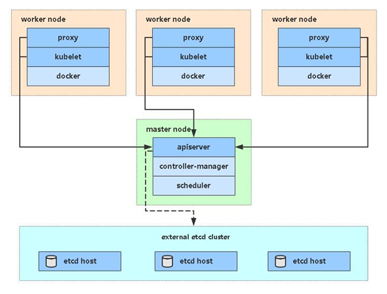
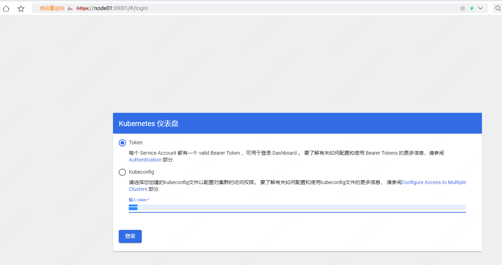
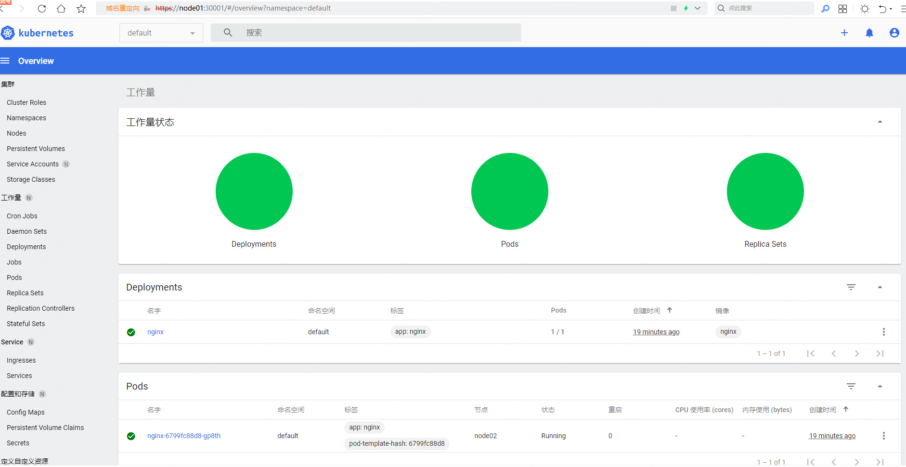
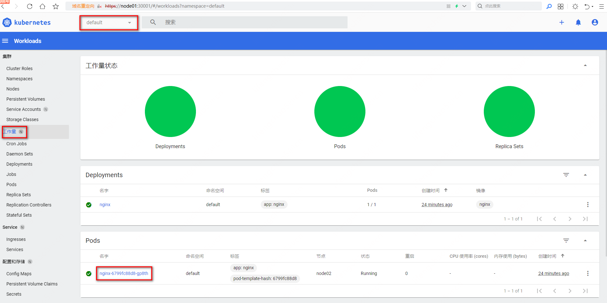
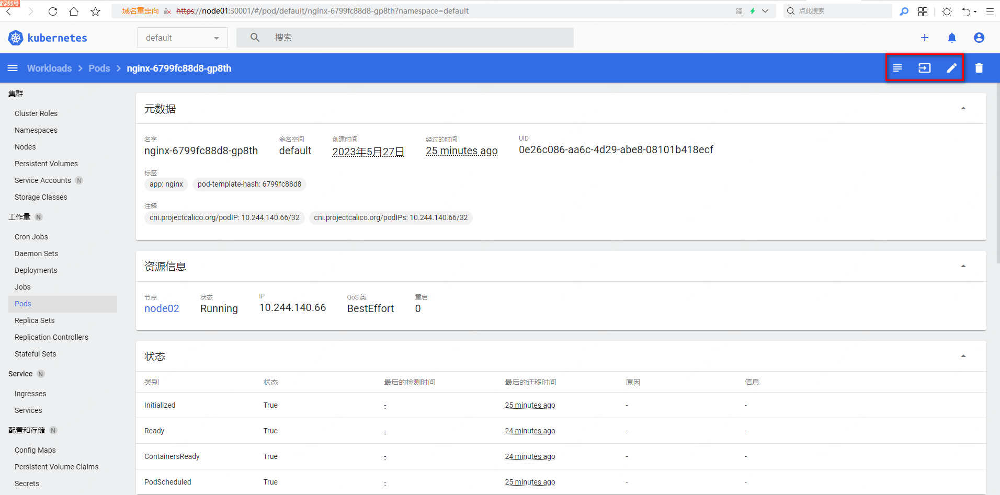

## 虚拟机准备
准备3台虚拟机，hosts配置：
`C:\Windows\System32\drivers\etc\hosts`
```
192.168.216.31 node01
192.168.216.32 node02
192.168.216.33 node03
```

服务器规划：
| 角色       | IP     |
| ---------- | ------ |
| k8s-master | node01 |
| k8s-node1  | node02 |
| k8s-node2  | node03 |
	
架构图：



### 配置ip

ip配置：
/etc/sysconfig/network-scripts/ifcfg-ens33

```
TYPE="Ethernet"
PROXY_METHOD="none"
BROWSER_ONLY="no"
BOOTPROTO="static"
DEFROUTE="yes"
IPV4_FAILURE_FATAL="no"
IPV6INIT="yes"
IPV6_AUTOCONF="yes"
IPV6_DEFROUTE="yes"
IPV6_FAILURE_FATAL="no"
IPV6_ADDR_GEN_MODE="stable-privacy"
NAME="ens33"
UUID="a70af39f-675a-415e-8a1b-a9647bb23g31"
DEVICE="ens33"
ONBOOT="yes"
IPADDR="192.168.216.31"
NETMASK="255.255.255.0"
GATEWAY="192.168.216.2"
DNS1="192.168.216.2"
```

```
# 修改完文件后，重启网络服务
service network restart
```

### 配置host
修改主机名：
```
# 也可以直接修改/etc/hostname
[root@node7 ~]# hostnamectl set-hostname node01
[root@node7 ~]# bash
bash
[root@node01 ~]#  cat /etc/hostname
node01
```
设置hosts：
```
[root@node01 ~]# cat /etc/hosts
127.0.0.1   localhost localhost.localdomain localhost4 localhost4.localdomain4
::1         localhost localhost.localdomain localhost6 localhost6.localdomain6
192.168.216.31 node01
192.168.216.32 node02
192.168.216.33 node03
```

## 环境准备

### 关闭防火墙
```sh
# 查看防火墙状态
systemctl status firewalld.service
# 关闭防火墙
systemctl stop firewalld.service
# 查看防火墙状态
systemctl status firewalld.service
# 永久防火墙，下次开机后防火墙也是关闭
systemctl disable firewalld.service
```

### 关闭selinux
```sh
# 当前SELinux mode状态
getenforce
# 永久修改，需要重启
sed -i 's/enforcing/disabled/' /etc/selinux/config
# 临时
setenforce 0
# 当前SELinux mode状态
getenforce
```

### 关闭swap
swap分区指的是虚拟内存分区，它的作用是在物理内存使用完之后，将磁盘空间虚拟成内存来使用启用swap设备会对系统的性能产生非常负面的影响，因此kubernetes要求每个节点都要禁用swap设备但是如果因为某些原因确实不能关闭swap分区，就需要在集群安装过程中通过明确的参数进行配置说明

```powershell
# 编辑分区配置文件/etc/fstab，注释掉swap分区一行
# 注意修改完毕之后需要重启linux服务
 UUID=455cc753-7a60-4c17-a424-7741728c44a1 /boot    xfs     defaults        0 0
 /dev/mapper/centos-home /home                      xfs     defaults        0 0
# /dev/mapper/centos-swap swap                      swap    defaults        0 0

# 临时
swapoff -a
# 永久
sed -ri 's/.*swap.*/#&/' /etc/fstab
```

```sh
[root@node03 ~]# free -m
              total        used        free      shared  buff/cache   available
Mem:           3931         243        3562          11         126        3501
Swap:          2047           0        2047
[root@node03 ~]# cat /etc/fstab

#
# /etc/fstab
# Created by anaconda on Sat Apr 30 11:40:34 2022
#
# Accessible filesystems, by reference, are maintained under '/dev/disk'
# See man pages fstab(5), findfs(8), mount(8) and/or blkid(8) for more info
#
UUID=a0db66f8-b099-44f2-9646-3a8bed5f446b /                       ext4    defaults        1 1
UUID=e994d8e7-b3cb-4398-b243-fafc00631881 /boot                   ext4    defaults        1 2
UUID=084a1856-f660-4e97-8879-c22de1b8a744 swap                    swap    defaults        0 0
[root@node03 ~]# sed -ri 's/.*swap.*/#&/' /etc/fstab
[root@node03 ~]# cat /etc/fstab

#
# /etc/fstab
# Created by anaconda on Sat Apr 30 11:40:34 2022
#
# Accessible filesystems, by reference, are maintained under '/dev/disk'
# See man pages fstab(5), findfs(8), mount(8) and/or blkid(8) for more info
#
UUID=a0db66f8-b099-44f2-9646-3a8bed5f446b /                       ext4    defaults        1 1
UUID=e994d8e7-b3cb-4398-b243-fafc00631881 /boot                   ext4    defaults        1 2
#UUID=084a1856-f660-4e97-8879-c22de1b8a744 swap                    swap    defaults        0 0
[root@node03 ~]# free -m
              total        used        free      shared  buff/cache   available
Mem:           3931         243        3562          11         126        3502
Swap:          2047           0        2047
[root@node03 ~]# swapoff -a
[root@node03 ~]# free -m
              total        used        free      shared  buff/cache   available
Mem:           3931         242        3562          11         126        3502
Swap:             0           0           0
[root@node03 ~]#

```

### 网桥过滤和地址转发
```
# 修改linux的内核参数，添加网桥过滤和地址转发功能
# 编辑/etc/sysctl.d/k8s.conf文件，添加如下配置:
net.bridge.bridge-nf-call-ip6tables = 1
net.bridge.bridge-nf-call-iptables = 1
net.ipv4.ip_forward = 1

# 生效
sysctl --system
```

## 安装Docker/kubeadm/kubelet(所有节点)

### 安装Docker
发现似乎自带的20.10的docker,先删除掉
```
[root@node03 ~]# yum list installed  | grep docker
containerd.io.x86_64            1.5.11-3.1.el7                 @docker-ce-stable
docker-ce.x86_64                3:20.10.14-3.el7               @docker-ce-stable
docker-ce-cli.x86_64            1:20.10.14-3.el7               @docker-ce-stable
docker-ce-rootless-extras.x86_64
                                20.10.14-3.el7                 @docker-ce-stable
docker-scan-plugin.x86_64       0.17.0-3.el7                   @docker-ce-stable

[root@node03 ~]# yum remove -y docker docker-client containerd.io docker-ce-cli  docker-scan-plugin  docker-ce
[root@node03 ~]# yum list installed  | grep docker

```

```sh
# 配置yum源
wget https://mirrors.aliyun.com/docker-ce/linux/centos/docker-ce.repo -O /etc/yum.repos.d/docker-ce.repo

#查看当前镜像源中支持的docker版本
yum list docker-ce --showduplicates

# 安装特定版本的docker-ce
# 必须指定--setopt=obsoletes=0，否则yum会自动安装更高版本
yum install --setopt=obsoletes=0  -y docker-ce-19.03.15 docker-ce-cli-19.03.15 containerd.io

# 阿里云镜像加速
mkdir -p /etc/docker

tee /etc/docker/daemon.json <<-'EOF'
{
  "registry-mirrors": ["https://d4vtehcm.mirror.aliyuncs.com"]
}
EOF

# 启动docker
systemctl restart docker
systemctl enable docker

# 检查docker状态和版本
docker version
```

### kubernetes镜像源
由于kubernetes的镜像源在国外，速度比较慢，这里切换成国内的镜像源
下面的命令相当于编辑/etc/yum.repos.d/kubernetes.repo，添加下面的配置 
```sh
cat > /etc/yum.repos.d/kubernetes.repo << EOF
[kubernetes]
name=Kubernetes
baseurl=https://mirrors.aliyun.com/kubernetes/yum/repos/kubernetes-el7-x86_64
enabled=1
gpgcheck=0
repo_gpgcheck=0
gpgkey=https://mirrors.aliyun.com/kubernetes/yum/doc/yum-key.gpg https://mirrors.aliyun.com/kubernetes/yum/doc/rpm-package-key.gpg
EOF
```

### 安装kubeadm，kubelet和kubectl
由于版本更新频繁，这里指定版本号部署
```
# 安装
yum install -y kubelet-1.20.15 kubeadm-1.20.15 kubectl-1.20.15
# 设置kubelet开机自启
systemctl enable kubelet
```

## 部署Kubernetes Master
在Master节点192.168.216.31(node01)执行
```
kubeadm init \
--apiserver-advertise-address=192.168.216.31 \
--image-repository registry.aliyuncs.com/google_containers \
--kubernetes-version v1.20.15 \
--service-cidr=10.96.0.0/12 \
--pod-network-cidr=10.244.0.0/16 \
--ignore-preflight-errors=all

```

•--apiserver-advertise-address 集群通告地址
•--image-repository 由于默认拉取镜像地址k8s.gcr.io国内无法访问，这里指定阿里云镜像仓库地址
•--kubernetes-version K8s版本，与上面安装的一致
•--service-cidr 集群内部虚拟网络，Pod统一访问入口
•--pod-network-cidr Pod网络，，与下面部署的CNI网络组件yaml中保持一致

初始化完成后，最后会输出一个join命令，先记住，下面用。
拷贝kubectl使用的连接k8s认证文件到默认路径：
```
mkdir -p $HOME/.kube
sudo cp -i /etc/kubernetes/admin.conf $HOME/.kube/config
sudo chown $(id -u):$(id -g) $HOME/.kube/config
```

查看工作节点：
```
[root@node01 ~]# kubectl get nodes
NAME     STATUS     ROLES                  AGE    VERSION
node01   NotReady   control-plane,master   3m4s   v1.20.15
```
注：由于网络插件还没有部署，还没有准备就绪 NotReady
参考资料：
https://kubernetes.io/zh/docs/reference/setup-tools/kubeadm/kubeadm-init/#config-file 
https://kubernetes.io/docs/setup/production-environment/tools/kubeadm/create-cluster-kubeadm/#initializing-your-control-plane-node

## 加入Kubernetes Node
在192.168.216.32/23（Node）执行。
向集群添加新节点，执行在kubeadm init输出的kubeadm join命令：
```
kubeadm join 192.168.216.31:6443 --token gjiiy5.aucadjv1mfocc0i7 \
    --discovery-token-ca-cert-hash sha256:fe541ed9b38fdd5b35bd8cd3846567d2ab1e606cd9b498a64289b01842262ac5
```

```
[root@node01 ~]# kubectl get nodes
NAME     STATUS     ROLES                  AGE     VERSION
node01   NotReady   control-plane,master   5m58s   v1.20.15
node02   NotReady   <none>                 40s     v1.20.15
node03   NotReady   <none>                 37s     v1.20.15

```

默认token有效期为24小时，当过期之后，该token就不可用了。这时就需要重新创建token，可以直接使用命令快捷生成：
```
kubeadm token create --print-join-command
```
参考资料：https://kubernetes.io/docs/reference/setup-tools/kubeadm/kubeadm-join/

## 部署容器网络（CNI） 
Calico是一个纯三层的数据中心网络方案，是目前Kubernetes主流的网络方案。
下载YAML：
```
wget https://docs.projectcalico.org/manifests/calico.yaml
```

下载完后还需要修改里面定义Pod网络（CALICO_IPV4POOL_CIDR），与前面kubeadm init的 --pod-network-cidr指定的一样。
修改完后文件后，部署：
```
kubectl apply -f calico.yaml

kubectl get pods -n kube-system
```
等Calico Pod都Running，节点也会准备就绪：
参考资料：https://kubernetes.io/docs/setup/production-environment/tools/kubeadm/create-cluster-kubeadm/#pod-network

```
[root@node01 ~]# kubectl get nodes
NAME     STATUS   ROLES                  AGE     VERSION
node01   Ready    control-plane,master   14m     v1.20.15
node02   Ready    <none>                 9m15s   v1.20.15
node03   Ready    <none>                 9m12s   v1.20.15

```

## 测试kubernetes集群
在Kubernetes集群中创建一个pod，验证是否正常运行：
```
kubectl create deployment nginx --image=nginx
kubectl expose deployment nginx --port=80 --type=NodePort
kubectl get pod,svc
```

```sh
[root@node01 ~]# kubectl get pod,svc
NAME                         READY   STATUS    RESTARTS   AGE
pod/nginx-6799fc88d8-gp8th   1/1     Running   0          38s

NAME                 TYPE        CLUSTER-IP       EXTERNAL-IP   PORT(S)        AGE
service/kubernetes   ClusterIP   10.96.0.1        <none>        443/TCP        17m
service/nginx        NodePort    10.108.194.249   <none>        80:31968/TCP   31s

# 在集群内部访问
[root@node01 ~]# curl 10.108.194.249

```
虚拟机外的笔记本可以这样访问，http://node01:31968、http://node02:31968、http://node03:31968

## 部署 Dashboard
Dashboard是官方提供的一个UI，可用于基本管理K8s资源。
```
wget https://raw.githubusercontent.com/kubernetes/dashboard/v2.0.3/aio/deploy/recommended.yaml
```
课件中文件名是：kubernetes-dashboard.yaml
默认Dashboard只能集群内部访问，修改Service为NodePort类型，暴露到外部：

```sh
vi recommended.yaml
...
kind: Service
apiVersion: v1
metadata:
  labels:
    k8s-app: kubernetes-dashboard
  name: kubernetes-dashboard
  namespace: kubernetes-dashboard
spec:
  ports:
    - port: 443
      targetPort: 8443
      nodePort: 30001
  selector:
    k8s-app: kubernetes-dashboard
  type: NodePort
...

```

部署：
```
kubectl apply -f kubernetes-dashboard.yaml
kubectl get pods,svc -n kubernetes-dashboard
```

```
[root@node01 ~]# kubectl get pods,svc -n kubernetes-dashboard
NAME                                             READY   STATUS    RESTARTS   AGE
pod/dashboard-metrics-scraper-7b59f7d4df-6ptzf   1/1     Running   0          118s
pod/kubernetes-dashboard-5dbf55bd9d-6l6fb        1/1     Running   0          118s

NAME                                TYPE        CLUSTER-IP       EXTERNAL-IP   PORT(S)         AGE
service/dashboard-metrics-scraper   ClusterIP   10.101.180.240   <none>        8000/TCP        118s
service/kubernetes-dashboard        NodePort    10.105.162.103   <none>        443:30001/TCP   118s

```

得使用https访问：https://node03:30001/，https://node01:30001/



创建service account并绑定默认cluster-admin管理员集群角色：
```
# 创建用户
kubectl create serviceaccount dashboard-admin -n kube-system
# 用户授权
kubectl create clusterrolebinding dashboard-admin --clusterrole=cluster-admin --serviceaccount=kube-system:dashboard-admin
# 获取用户Token
kubectl describe secrets -n kube-system $(kubectl -n kube-system get secret | awk '/dashboard-admin/{print $1}')
```
使用输出的token登录Dashboard。使用输出的token登录Dashboard。







```

```