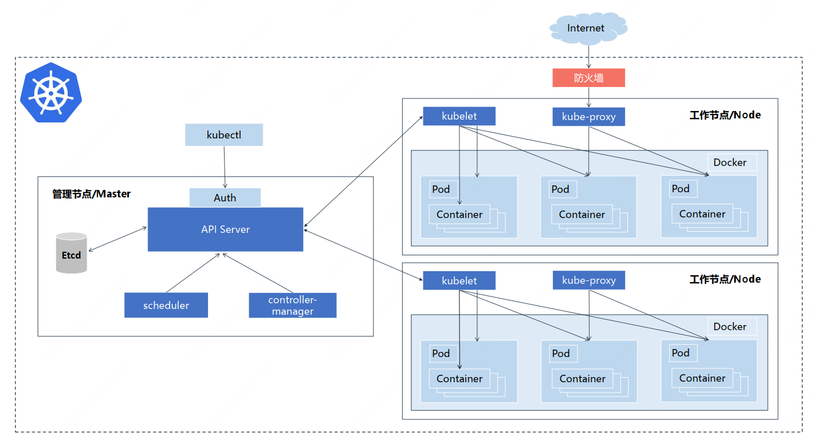
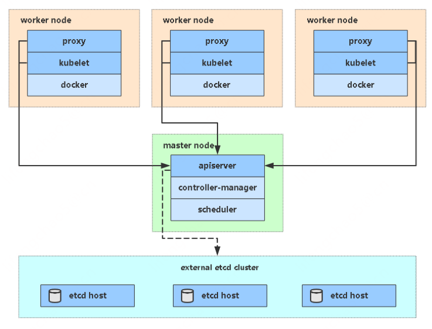
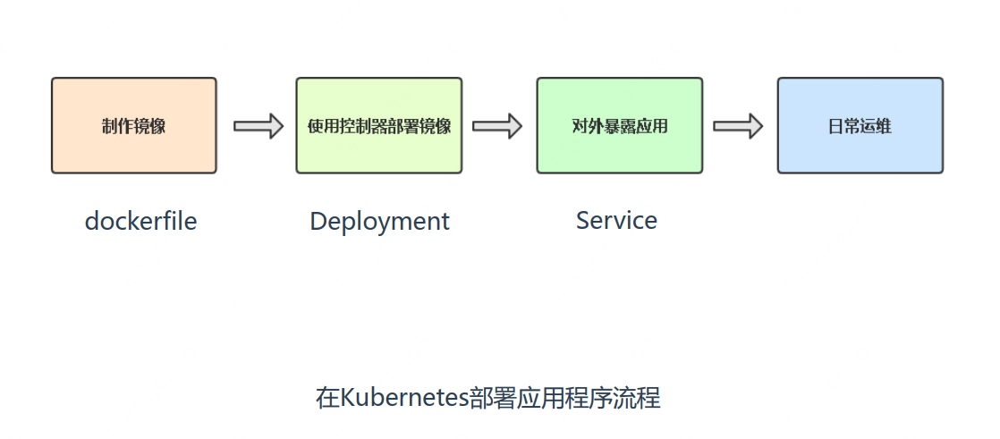
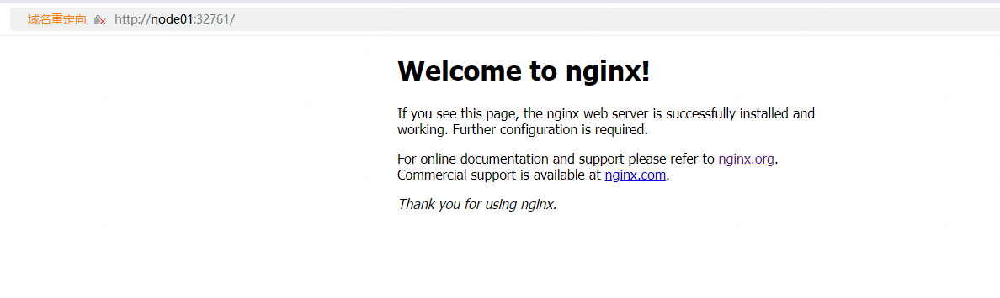
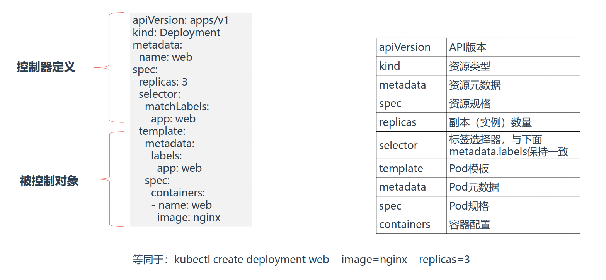
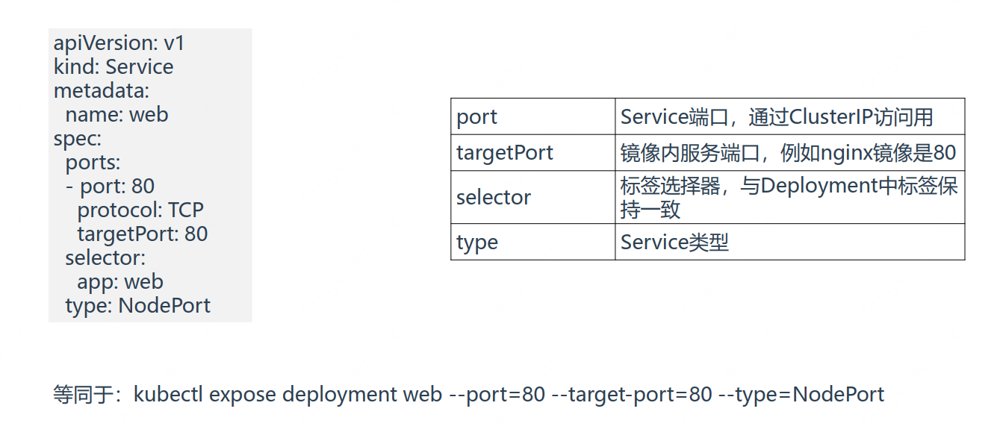

## Kubernetes 核心概念与基本使用

### Kubernetes是什么
* Kubernetes是Google在2014年开源的一个容器集群管理系统， Kubernetes简称K8S。  
* Kubernetes用于容器化应用程序的部署，扩展和管理，目标是让部署容器化应用简单高效。  

官方网站： http://www.kubernetes.io
官方文档： https://kubernetes.io/zh/docs/home/

### Kubernetes集群架构与组件




**Master组件**

* **kube-apiserver**：Kubernetes API，集群的统一入口，各组件协调者，以RESTful API提供接口服务，所有对象资源的增删改查和监听操作都交给APIServer处理后再提交给Etcd存储。

* **kube-controller-manager**：处理集群中常规后台任务，一个资源对应一个控制器，而ControllerManager就是负责管理这些控制器的。例如Deployment、 Service

* **kube-scheduler**：根据调度算法为新创建的Pod选择一个Node节点，可以任意部署,可以部署在同一个节点上,也可以部署在不同的节点上。

* **etcd**：分布式键值存储系统。 用于保存集群状态数据，比如Pod、 Service等对象信息。

**Node组件**

* **kubelet**：kubelet是Master在Node节点上的Agent，管理本机运行容器的生命周期，比如创建容器、 Pod挂载数据卷、下载secret、获取容器和节点状态等工作。 kubelet将每个Pod转换成一组容器。
* **kube-proxy**：在Node节点上实现Pod网络代理，维护网络规则和四层负载均衡工作。
* **第三方容器引擎**：例如docker、 containerd、 podman，容器引擎，运行容器。

### kubectl命令行管理工具
kubectl使用kubeconfig认证文件连接K8s集群， 可使用kubectl config指令生成kubeconfig文件。默认路径： ~/.kube/config

官方文档参考地址： https://kubernetes.io/zh/docs/reference/kubectl/overview/

| 类型               | 命令          | 描述                                                                                   |
| ------------------ | ------------- | -------------------------------------------------------------------------------------- |
| 基础命令           | create        | 通过文件名或标准输入创建资源                                                           |
|                    | expose        | 为Deployment， Pod创建Service                                                          |
|                    | run           | 在集群中运行一个特定的镜像                                                             |
|                    | set           | 在对象上设置特定的功能                                                                 |
|                    | explain       | 文档参考资料                                                                           |
|                    | get           | 显示一个或多个资源                                                                     |
|                    | edit          | 使用系统编辑器编辑一个资源。                                                           |
|                    | delete        | 通过文件名、 标准输入、 资源名称或标签选择器来删除资源。                               |
| 部署命令           | rollout       | 管理Deployment， Daemonset资源的发布（例如状态、 发布记录、 回滚等）                   |
|                    | scale         | 对Deployment、 ReplicaSet、 RC或Job资源扩容或缩容Pod数量                               |
|                    | autoscale     | 为Deploy, RS, RC配置自动伸缩规则（依赖metrics-server和hpa）                            |
| 集群管理命令       | certificate   | 修改证书资源                                                                           |
|                    | cluster-info  | 显示集群信息                                                                           |
|                    | top           | 查看资源利用率（依赖metrics-server）                                                   |
|                    | cordon        | 标记节点不可调度                                                                       |
|                    | uncordon      | 标记节点可调度                                                                         |
|                    | drain         | 驱逐节点上的应用， 准备下线维护                                                        |
|                    | taint         | 修改节点taint标记                                                                      |
| 故障诊断和调试命令 | describe      | 显示资源详细信息                                                                       |
|                    | logs          | 查看Pod内容器日志， 如果Pod有多个容器， -c参数指定容器名称                             |
|                    | attach        | 附加到Pod内的一个容器                                                                  |
|                    | exec          | 在容器内执行命令                                                                       |
|                    | port-forward  | 为Pod创建本地端口映射                                                                  |
|                    | proxy         | 为Kubernetes API server创建代理                                                        |
|                    | cp            | 拷贝文件或目录到容器中， 或者从容器内向外拷贝                                          |
|                    | auth          | 检查授权                                                                               |
|                    | debug         | 创建调试会话，用于排查工作负载和工作节点故障                                           |
| 高级命令           | diff          | 将在线配置与指定的文件对比                                                             |
|                    | apply         | 从文件名或标准输入对资源创建/更新                                                      |
|                    | patch         | 使用补丁方式修改、 更新资源的某些字段                                                  |
|                    | replace       | 从文件名或标准输入替换一个资源                                                         |
|                    | kustomize     | 从目录或者URL构建kustomization目标                                                     |
| 设置命令           | label         | 给资源设置、 更新标签                                                                  |
|                    | annotate      | 给资源设置、 更新注解                                                                  |
|                    | completion    | kubectl工具自动补全， source <(kubectl completion bash) （依赖软件包 bash-completion） |
| 其他命令           | api-resources | 查看所有资源                                                                           |
|                    | api-versions  | 打印受支持的API版本                                                                    |
|                    | config        | 修改kubeconfig文件（用于访问API， 比如配置认证信息）                                   |
|                    | version       | 查看kubectl和k8s版本                                                                   |

### 牛刀小试，快速部署一个网站


使用Deployment控制器部署镜像：
```
kubectl create deployment web --image=nginx --replicas=3
kubectl get deploy,pods
```
使用Service将Pod暴露出去：
```
kubectl expose deployment web --port=80 --target-port=80 --type=NodePort
kubectl get service
```

浏览器访问应用：
```
http://NodeIP:Port # 端口随机生成，通过get svc获取
```

```
[root@node01 ~]# kubectl create deployment web --image=nginx --replicas=3
deployment.apps/web created

[root@node01 ~]# kubectl get deploy,pods
NAME                    READY   UP-TO-DATE   AVAILABLE   AGE
deployment.apps/nginx   1/1     1            1           21h
deployment.apps/web     3/3     3            3           47s

NAME                         READY   STATUS    RESTARTS   AGE
pod/nginx-6799fc88d8-gp8th   1/1     Running   2          21h
pod/web-96d5df5c8-5hpxp      1/1     Running   0          47s
pod/web-96d5df5c8-g5s8x      1/1     Running   0          47s
pod/web-96d5df5c8-x8569      1/1     Running   0          47s

[root@node01 ~]# kubectl expose deployment web --port=80 --target-port=80 --type=NodePort
service/web exposed

[root@node01 ~]# kubectl get service
NAME         TYPE        CLUSTER-IP       EXTERNAL-IP   PORT(S)        AGE
kubernetes   ClusterIP   10.96.0.1        <none>        443/TCP        22h
nginx        NodePort    10.108.194.249   <none>        80:31968/TCP   21h
web          NodePort    10.108.179.45    <none>        80:32761/TCP   14s
```

访问：http://node01:32761/


K8s是一个容器编排引擎，使用YAML文件编排要部署应用，因此在学习之前，应先了解YAML语法格式：

* 缩进表示层级关系  
* 不支持制表符“tab” 缩进，使用空格缩进  
* 通常开头缩进 2 个空格  
* 字符后缩进 1 个空格，如冒号、逗号等  
* “---” 表示YAML格式，一个文件的开始  
* “#” 注释  




```
等同于： kubectl create deployment web --image=nginx --replicas=3
等同于： kubectl expose deployment web --port=80 --target-port=80 --type=NodePort
```

###  Kubernetes基本资源概念
#### 基本资源概念

* **Pod**： K8s最小部署单元， 一组容器的集合  
* **Deployment**： 最常见的控制器，用于更高级别部署和管理Pod  
* **Service**： 为一组Pod提供负载均衡，对外提供统一访问入口  
* **Label**： 标签，附加到某个资源上，用于关联对象、查询和筛选  

#### 命名空间
**Namespaces**：
命名空间， 将资源对象逻辑上隔离， 从而形成多个虚拟集群， 也利于权限控制。

**应用场景**：
* 根据不同团队划分命名空间
* 根据项目划分命名空间

**kubectl get namespace**  
* default：默认命名空间  
* kube-system： K8s系统方面的命名空间  
* kube-public：公开的命名空间，谁都可以访问，  
* kube-node-lease： K8s内部命名空间  

**两种方法指定资源命名空间**： 
* 命令行加 -n  
* yaml资源元数据里指定namespace字段  


```

```
