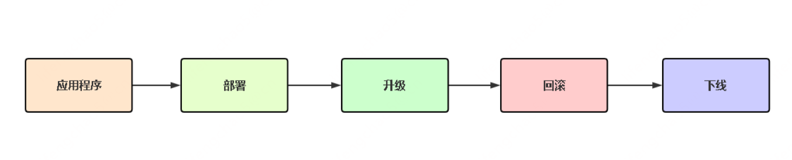
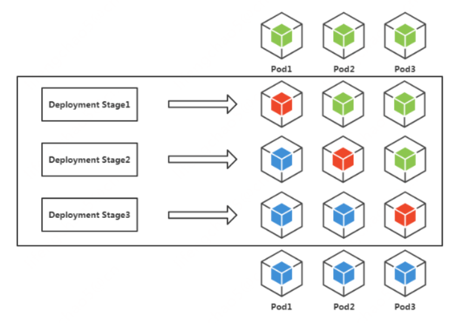
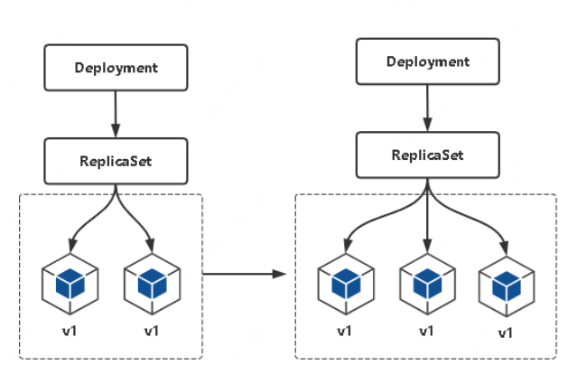
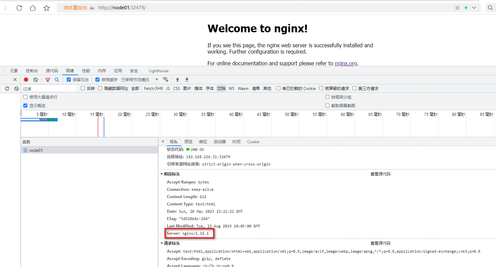
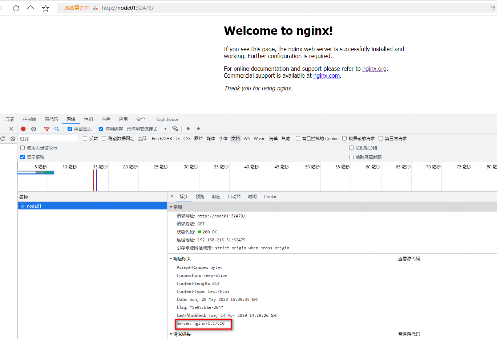

## Deployment控制器（管理应用）

### Deployment介绍

Deployment是最常用的K8s工作负载控制器（Workload Controllers），是K8s的一个抽象概念，用于更高级层次对象，部署和管理Pod。

Deployment的主要功能：
* 管理Pod，即应用程序
* 具有上线部署、副本设定、滚动升级、回滚等功能

应用场景： 网站、 API、微服务

### 应用生命周期管理流程


### 应用部署
第一步：部署镜像
```
kubectl apply -f xxx.yaml
# 命令方式
kubectl create deployment web --image=nginx:1.16 --replicas=3
```

```yaml
apiVersion: apps/v1
kind: Deployment
metadata:
  name: web
  namespace: default
spec:
  replicas: 3 # Pod副本预期数量
  selector:
    matchLabels:
      app: web
  template:
    metadata:
      labels:
        app: web # Pod副本的标签
    spec:
      containers:
        - name: web
        image: nginx:1.16
```

### 应用升级
第二步：应用升级（更新镜像2种方式，自动触发滚动升级）
```
kubectl apply -f xxx.yaml
# 命令方式
kubectl set image deployment/web nginx=nginx:1.17
```

滚动升级： K8s对Pod升级的默认策略，通过使用新版本Pod逐步更新旧版本Pod，实现零停机发布，用户无感知。



### 应用水平扩容和缩容
第三步：水平扩缩容（启动多实例，提高并发）
```
修改yaml里replicas值，再apply
# 命令方式
kubectl scale deployment web --replicas=10
```


### 应用发布失败回滚
第四步：应用发布失败回滚（项目升级失败恢复到正常版本）
```
kubectl rollout history deployment/web # 查看历史发布版本
kubectl rollout undo deployment/web # 回滚上一个版本
kubectl rollout undo deployment/web --to-revision=2 # 回滚历史指定版本
```
注：回滚是重新部署某一次部署时的状态，即当时版本所有配置

### 应用下线
最后，项目下线，将资源删除：
```
kubectl delete deploy/web
kubectl delete svc/web
```

### 测试
先删除之前测试的pod等：
先删除nginx：
```
# 查看
[root@node01 ~]# kubectl get deploy,pods,svc
NAME                    READY   UP-TO-DATE   AVAILABLE   AGE
deployment.apps/nginx   1/1     1            1           22h
deployment.apps/web     3/3     3            3           51m

NAME                         READY   STATUS    RESTARTS   AGE
pod/nginx-6799fc88d8-gp8th   1/1     Running   2          22h
pod/web-96d5df5c8-5hpxp      1/1     Running   0          51m
pod/web-96d5df5c8-g5s8x      1/1     Running   0          51m
pod/web-96d5df5c8-x8569      1/1     Running   0          51m

NAME                 TYPE        CLUSTER-IP       EXTERNAL-IP   PORT(S)        AGE
service/kubernetes   ClusterIP   10.96.0.1        <none>        443/TCP        22h
service/nginx        NodePort    10.108.194.249   <none>        80:31968/TCP   22h
service/web          NodePort    10.108.179.45    <none>        80:32761/TCP   49m
# 删除deploy/nginx
[root@node01 ~]# kubectl delete deploy/nginx
deployment.apps "nginx" deleted
[root@node01 ~]# kubectl get deploy,pods,svc
NAME                  READY   UP-TO-DATE   AVAILABLE   AGE
deployment.apps/web   3/3     3            3           53m

NAME                      READY   STATUS    RESTARTS   AGE
pod/web-96d5df5c8-5hpxp   1/1     Running   0          53m
pod/web-96d5df5c8-g5s8x   1/1     Running   0          53m
pod/web-96d5df5c8-x8569   1/1     Running   0          53m

NAME                 TYPE        CLUSTER-IP       EXTERNAL-IP   PORT(S)        AGE
service/kubernetes   ClusterIP   10.96.0.1        <none>        443/TCP        23h
service/nginx        NodePort    10.108.194.249   <none>        80:31968/TCP   22h
service/web          NodePort    10.108.179.45    <none>        80:32761/TCP   51m
# 删除svc/nginx
[root@node01 ~]# kubectl delete svc/nginx
service "nginx" deleted
[root@node01 ~]# kubectl get deploy,pods,svc
NAME                  READY   UP-TO-DATE   AVAILABLE   AGE
deployment.apps/web   3/3     3            3           54m

NAME                      READY   STATUS    RESTARTS   AGE
pod/web-96d5df5c8-5hpxp   1/1     Running   0          54m
pod/web-96d5df5c8-g5s8x   1/1     Running   0          54m
pod/web-96d5df5c8-x8569   1/1     Running   0          54m

NAME                 TYPE        CLUSTER-IP      EXTERNAL-IP   PORT(S)        AGE
service/kubernetes   ClusterIP   10.96.0.1       <none>        443/TCP        23h
service/web          NodePort    10.108.179.45   <none>        80:32761/TCP   51m
[root@node01 ~]#

```

删除web：
```
[root@node01 ~]# kubectl delete deploy/web
deployment.apps "web" deleted
[root@node01 ~]# kubectl delete svc/web
service "web" deleted
[root@node01 ~]# kubectl get deploy,pods,svc
NAME                 TYPE        CLUSTER-IP   EXTERNAL-IP   PORT(S)   AGE
service/kubernetes   ClusterIP   10.96.0.1    <none>        443/TCP   23h
[root@node01 ~]#
```

Deployment：
https://kubernetes.io/zh-cn/docs/concepts/workloads/controllers/deployment/

web_deployment.yaml:
```yaml
apiVersion: apps/v1
kind: Deployment
metadata:
  name: web
  namespace: default
spec:
  replicas: 3
  selector:
    matchLabels:
      app: web
  template:
    metadata:
      labels:
        app: web
    spec:
      containers:
      - name: web
        image: nginx:1.16
```

```
[root@node01 apps]# vi web_deployment.yaml
[root@node01 apps]# kubectl apply -f web_deployment.yaml
deployment.apps/web created
```

https://kubernetes.io/zh-cn/docs/concepts/services-networking/service/

web_service.yaml:
```yaml
apiVersion: v1
kind: Service
metadata:
  name: web
spec:
  selector:
    app: web
  type: NodePort
  ports:
    - protocol: TCP
      port: 80
      targetPort: 80
```

```
[root@node01 apps]# vi web_service.yaml
[root@node01 apps]# kubectl apply -f web_service.yaml
service/web created
[root@node01 apps]# kubectl get deploy,pods,svc
NAME                  READY   UP-TO-DATE   AVAILABLE   AGE
deployment.apps/web   3/3     3            3           9m26s

NAME                       READY   STATUS    RESTARTS   AGE
pod/web-65798c9f74-czz8j   1/1     Running   0          9m26s
pod/web-65798c9f74-l6fp9   1/1     Running   0          9m26s
pod/web-65798c9f74-zl2jx   1/1     Running   0          9m26s

NAME                 TYPE        CLUSTER-IP       EXTERNAL-IP   PORT(S)        AGE
service/kubernetes   ClusterIP   10.96.0.1        <none>        443/TCP        23h
service/web          NodePort    10.106.153.189   <none>        80:32479/TCP   10s

```
10.106.153.189:80可以在集群内访问，node01:32479可以在集群外访问。


模拟升级，直接把版本改成1.17。web_deployment.yaml、web_service.yaml可以放在一个文件里，一起发布、修改、删除。

web_deploy_svc.yaml:
```yaml
apiVersion: apps/v1
kind: Deployment
metadata:
  name: web
  namespace: default
spec:
  replicas: 3
  selector:
    matchLabels:
      app: web
  template:
    metadata:
      labels:
        app: web
    spec:
      containers:
      - name: web
        image: nginx:1.17

---
apiVersion: v1
kind: Service
metadata:
  name: web
spec:
  selector:
    app: web
  type: NodePort
  ports:
    - protocol: TCP
      port: 80
      targetPort: 80
```

可以看到是一个一个替换的：
```
[root@node01 apps]# vi web_deploy_svc.yaml
[root@node01 apps]# kubectl apply -f web_deploy_svc.yaml
deployment.apps/web configured
service/web unchanged
[root@node01 apps]# kubectl get pods
NAME                       READY   STATUS              RESTARTS   AGE
pod/web-65798c9f74-czz8j   1/1     Running             0          17m
pod/web-65798c9f74-l6fp9   1/1     Running             0          17m
pod/web-65798c9f74-zl2jx   1/1     Running             0          17m
pod/web-75868cf59c-nnwm8   0/1     ContainerCreating   0          18s
[root@node01 apps]# kubectl get pods
NAME                       READY   STATUS              RESTARTS   AGE
pod/web-65798c9f74-czz8j   0/1     Terminating         0          17m
pod/web-65798c9f74-l6fp9   1/1     Running             0          17m
pod/web-65798c9f74-zl2jx   1/1     Running             0          17m
pod/web-75868cf59c-nnwm8   1/1     Running             0          53s
pod/web-75868cf59c-v92rt   0/1     ContainerCreating   0          11s
[root@node01 apps]# kubectl get pods
NAME                       READY   STATUS              RESTARTS   AGE
pod/web-65798c9f74-l6fp9   1/1     Running             0          17m
pod/web-65798c9f74-zl2jx   1/1     Running             0          17m
pod/web-75868cf59c-nnwm8   1/1     Running             0          64s
pod/web-75868cf59c-v92rt   0/1     ContainerCreating   0          22s
[root@node01 apps]# kubectl get pods
NAME                       READY   STATUS        RESTARTS   AGE
pod/web-65798c9f74-l6fp9   1/1     Terminating   0          18m
pod/web-65798c9f74-zl2jx   0/1     Terminating   0          18m
pod/web-75868cf59c-msw88   1/1     Running       0          3s
pod/web-75868cf59c-nnwm8   1/1     Running       0          80s
pod/web-75868cf59c-v92rt   1/1     Running       0          38s
[root@node01 apps]# kubectl get pods
NAME                   READY   STATUS    RESTARTS   AGE
web-75868cf59c-msw88   1/1     Running   0          18s
web-75868cf59c-nnwm8   1/1     Running   0          95s
web-75868cf59c-v92rt   1/1     Running   0          53s
```



扩容：
web_deploy_svc.yaml:
```yaml
apiVersion: apps/v1
kind: Deployment
metadata:
  name: web
  namespace: default
spec:
  replicas: 5
...
```

```
[root@node01 apps]# vi web_deploy_svc.yaml
[root@node01 apps]# kubectl apply -f web_deploy_svc.yaml
deployment.apps/web configured
service/web unchanged
[root@node01 apps]# kubectl get pods
NAME                   READY   STATUS    RESTARTS   AGE
web-75868cf59c-5h6mn   1/1     Running   0          7s
web-75868cf59c-msw88   1/1     Running   0          7m18s
web-75868cf59c-nnwm8   1/1     Running   0          8m35s
web-75868cf59c-pzdvs   1/1     Running   0          7s
web-75868cf59c-v92rt   1/1     Running   0          7m53s
```

缩容：
web_deploy_svc.yaml:
```yaml
apiVersion: apps/v1
kind: Deployment
metadata:
  name: web
  namespace: default
spec:
  replicas: 2
...
```

```
[root@node01 apps]# vi web_deploy_svc.yaml
[root@node01 apps]# kubectl apply -f web_deploy_svc.yaml
deployment.apps/web configured
service/web unchanged
[root@node01 apps]# kubectl get pods
NAME                   READY   STATUS        RESTARTS   AGE
web-75868cf59c-5h6mn   1/1     Running       0          50s
web-75868cf59c-msw88   0/1     Terminating   0          8m1s
web-75868cf59c-nnwm8   1/1     Running       0          9m18s
web-75868cf59c-pzdvs   0/1     Terminating   0          50s
web-75868cf59c-v92rt   0/1     Terminating   0          8m36s
[root@node01 apps]# kubectl get pods
NAME                   READY   STATUS    RESTARTS   AGE
web-75868cf59c-5h6mn   1/1     Running   0          55s
web-75868cf59c-nnwm8   1/1     Running   0          9m23s
```

```
[root@node01 apps]# kubectl describe pods
Name:         web-75868cf59c-5h6mn
Namespace:    default
Priority:     0
Node:         node03/192.168.216.33
Start Time:   Sun, 28 May 2023 23:34:53 +0800
Labels:       app=web
              pod-template-hash=75868cf59c
Annotations:  cni.projectcalico.org/podIP: 10.244.186.205/32
              cni.projectcalico.org/podIPs: 10.244.186.205/32
Status:       Running
IP:           10.244.186.205
IPs:
  IP:           10.244.186.205
Controlled By:  ReplicaSet/web-75868cf59c
Containers:
  web:
    Container ID:   docker://bd073012fe14f1b1fad4d9c519728968caa4f691554c48af24856c9d1cbe28d4
    Image:          nginx:1.17
    Image ID:       docker-pullable://nginx@sha256:6fff55753e3b34e36e24e37039ee9eae1fe38a6420d8ae16ef37c92d1eb26699
    Port:           <none>
    Host Port:      <none>
    State:          Running
      Started:      Sun, 28 May 2023 23:34:54 +0800
    Ready:          True
    Restart Count:  0
    Environment:    <none>
    Mounts:
      /var/run/secrets/kubernetes.io/serviceaccount from default-token-xfpr2 (ro)
Conditions:
  Type              Status
  Initialized       True
  Ready             True
  ContainersReady   True
  PodScheduled      True
Volumes:
  default-token-xfpr2:
    Type:        Secret (a volume populated by a Secret)
    SecretName:  default-token-xfpr2
    Optional:    false
QoS Class:       BestEffort
Node-Selectors:  <none>
Tolerations:     node.kubernetes.io/not-ready:NoExecute op=Exists for 300s
                 node.kubernetes.io/unreachable:NoExecute op=Exists for 300s
Events:
  Type    Reason     Age    From               Message
  ----    ------     ----   ----               -------
  Normal  Scheduled  7m31s  default-scheduler  Successfully assigned default/web-75868cf59c-5h6mn to node03
  Normal  Pulled     7m30s  kubelet            Container image "nginx:1.17" already present on machine
  Normal  Created    7m30s  kubelet            Created container web
  Normal  Started    7m30s  kubelet            Started container web


Name:         web-75868cf59c-nnwm8
Namespace:    default
Priority:     0
Node:         node03/192.168.216.33
Start Time:   Sun, 28 May 2023 23:26:25 +0800
Labels:       app=web
              pod-template-hash=75868cf59c
Annotations:  cni.projectcalico.org/podIP: 10.244.186.204/32
              cni.projectcalico.org/podIPs: 10.244.186.204/32
Status:       Running
IP:           10.244.186.204
IPs:
  IP:           10.244.186.204
Controlled By:  ReplicaSet/web-75868cf59c
Containers:
  web:
    Container ID:   docker://71ef0233cd8bc4c43cf5d2f3c59d72897ffef0a4f4da61f76143f32efceaaf73
    Image:          nginx:1.17
    Image ID:       docker-pullable://nginx@sha256:6fff55753e3b34e36e24e37039ee9eae1fe38a6420d8ae16ef37c92d1eb26699
    Port:           <none>
    Host Port:      <none>
    State:          Running
      Started:      Sun, 28 May 2023 23:27:05 +0800
    Ready:          True
    Restart Count:  0
    Environment:    <none>
    Mounts:
      /var/run/secrets/kubernetes.io/serviceaccount from default-token-xfpr2 (ro)
Conditions:
  Type              Status
  Initialized       True
  Ready             True
  ContainersReady   True
  PodScheduled      True
Volumes:
  default-token-xfpr2:
    Type:        Secret (a volume populated by a Secret)
    SecretName:  default-token-xfpr2
    Optional:    false
QoS Class:       BestEffort
Node-Selectors:  <none>
Tolerations:     node.kubernetes.io/not-ready:NoExecute op=Exists for 300s
                 node.kubernetes.io/unreachable:NoExecute op=Exists for 300s
Events:
  Type    Reason     Age   From               Message
  ----    ------     ----  ----               -------
  Normal  Scheduled  15m   default-scheduler  Successfully assigned default/web-75868cf59c-nnwm8 to node03
  Normal  Pulling    15m   kubelet            Pulling image "nginx:1.17"
  Normal  Pulled     15m   kubelet            Successfully pulled image "nginx:1.17" in 39.128420918s
  Normal  Created    15m   kubelet            Created container web
  Normal  Started    15m   kubelet            Started container web
[root@node01 apps]#

```
docker ps：
```
[root@node01 apps]# docker ps
CONTAINER ID        IMAGE                                               COMMAND                  CREATED             STATUS              PORTS               NAMES
2a4beb9f5a13        1470783b1474                                        "start_runit"            3 hours ago         Up 3 hours                              k8s_calico-node_calico-node-sgdcs_kube-system_27812974-941e-46a4-9f22-114873c200d8_2
f9fa78e5b732        registry.aliyuncs.com/google_containers/pause:3.2   "/pause"                 3 hours ago         Up 3 hours                              k8s_POD_calico-node-sgdcs_kube-system_27812974-941e-46a4-9f22-114873c200d8_2
51e766044ae5        46e2cd1b2594                                        "/usr/local/bin/kube…"   3 hours ago         Up 3 hours                              k8s_kube-proxy_kube-proxy-cx9ql_kube-system_afe635f4-fd05-4c5f-a128-83bd1c85c865_2
e58342416c94        registry.aliyuncs.com/google_containers/pause:3.2   "/pause"                 3 hours ago         Up 3 hours                              k8s_POD_kube-proxy-cx9ql_kube-system_afe635f4-fd05-4c5f-a128-83bd1c85c865_2
f67bf22baed1        0369cf4303ff                                        "etcd --advertise-cl…"   3 hours ago         Up 3 hours                              k8s_etcd_etcd-node01_kube-system_747140cb20bb7e16a7db740768a326a1_2
cd2946145e49        registry.aliyuncs.com/google_containers/pause:3.2   "/pause"                 3 hours ago         Up 3 hours                              k8s_POD_etcd-node01_kube-system_747140cb20bb7e16a7db740768a326a1_2
010f56e065a1        d6296d0e06d2                                        "kube-controller-man…"   3 hours ago         Up 3 hours                              k8s_kube-controller-manager_kube-controller-manager-node01_kube-system_dc1df29249bfbffb2c2bed124be399e9_2
d3e0b5038126        9155e4deabb3                                        "kube-scheduler --au…"   3 hours ago         Up 3 hours                              k8s_kube-scheduler_kube-scheduler-node01_kube-system_ada4880bccca948595cd15b8773be9ab_2
410ac24ef246        registry.aliyuncs.com/google_containers/pause:3.2   "/pause"                 3 hours ago         Up 3 hours                              k8s_POD_kube-controller-manager-node01_kube-system_dc1df29249bfbffb2c2bed124be399e9_2
11ee5f938647        registry.aliyuncs.com/google_containers/pause:3.2   "/pause"                 3 hours ago         Up 3 hours                              k8s_POD_kube-scheduler-node01_kube-system_ada4880bccca948595cd15b8773be9ab_2
846d72fd3d9f        323f6347f5e2                                        "kube-apiserver --ad…"   3 hours ago         Up 3 hours                              k8s_kube-apiserver_kube-apiserver-node01_kube-system_5cf130dbb8b6b7001f51143137cf554e_2
45501204520f        registry.aliyuncs.com/google_containers/pause:3.2   "/pause"                 3 hours ago         Up 3 hours                              k8s_POD_kube-apiserver-node01_kube-system_5cf130dbb8b6b7001f51143137cf554e_2

[root@node02 ~]# docker ps
CONTAINER ID        IMAGE                                               COMMAND                  CREATED             STATUS              PORTS               NAMES
fa6d2c669045        86262685d9ab                                        "/metrics-sidecar"       3 hours ago         Up 3 hours                              k8s_dashboard-metrics-scraper_dashboard-metrics-scraper-7b59f7d4df-6ptzf_kubernetes-dashboard_2541030d-0e79-40dd-b2ab-10e62954bfa1_2
c8a6db053acf        registry.aliyuncs.com/google_containers/pause:3.2   "/pause"                 3 hours ago         Up 3 hours                              k8s_POD_dashboard-metrics-scraper-7b59f7d4df-6ptzf_kubernetes-dashboard_2541030d-0e79-40dd-b2ab-10e62954bfa1_2
9235f88272ea        1470783b1474                                        "start_runit"            3 hours ago         Up 3 hours                              k8s_calico-node_calico-node-nchn4_kube-system_cae3d3f8-b264-4253-a58f-913bf413b322_2
dbdf55929bb7        bfe3a36ebd25                                        "/coredns -conf /etc…"   3 hours ago         Up 3 hours                              k8s_coredns_coredns-7f89b7bc75-rwgbq_kube-system_d334f99f-1e81-43d9-94ca-6a316d91c69a_2
075aaab9c7d8        registry.aliyuncs.com/google_containers/pause:3.2   "/pause"                 3 hours ago         Up 3 hours                              k8s_POD_coredns-7f89b7bc75-rwgbq_kube-system_d334f99f-1e81-43d9-94ca-6a316d91c69a_46
c82f4b481ce3        46e2cd1b2594                                        "/usr/local/bin/kube…"   3 hours ago         Up 3 hours                              k8s_kube-proxy_kube-proxy-5nb87_kube-system_07b3258d-256c-4f1f-b64a-c6de6b935b2d_2
525cf2f7c2a3        registry.aliyuncs.com/google_containers/pause:3.2   "/pause"                 3 hours ago         Up 3 hours                              k8s_POD_calico-node-nchn4_kube-system_cae3d3f8-b264-4253-a58f-913bf413b322_2
87c88ae1996f        registry.aliyuncs.com/google_containers/pause:3.2   "/pause"                 3 hours ago         Up 3 hours                              k8s_POD_kube-proxy-5nb87_kube-system_07b3258d-256c-4f1f-b64a-c6de6b935b2d_2

[root@node03 ~]# docker ps
CONTAINER ID        IMAGE                                               COMMAND                  CREATED             STATUS              PORTS               NAMES
bd073012fe14        9beeba249f3e                                        "nginx -g 'daemon of…"   12 minutes ago      Up 12 minutes                           k8s_web_web-75868cf59c-5h6mn_default_828e16d8-5be4-4de4-8431-3de0a82b23d5_0
2b1cf638c809        registry.aliyuncs.com/google_containers/pause:3.2   "/pause"                 12 minutes ago      Up 12 minutes                           k8s_POD_web-75868cf59c-5h6mn_default_828e16d8-5be4-4de4-8431-3de0a82b23d5_0
71ef0233cd8b        nginx                                               "nginx -g 'daemon of…"   20 minutes ago      Up 20 minutes                           k8s_web_web-75868cf59c-nnwm8_default_7313bc71-16ec-4bea-9a35-7db8dd3a11cd_0
b18545d11e64        registry.aliyuncs.com/google_containers/pause:3.2   "/pause"                 20 minutes ago      Up 20 minutes                           k8s_POD_web-75868cf59c-nnwm8_default_7313bc71-16ec-4bea-9a35-7db8dd3a11cd_0
b9e3d1c2fb38        kubernetesui/dashboard                              "/dashboard --insecu…"   3 hours ago         Up 3 hours                              k8s_kubernetes-dashboard_kubernetes-dashboard-5dbf55bd9d-6l6fb_kubernetes-dashboard_c21c0dc7-654c-4b24-8f2c-f0597e5fd76c_3
fcae7c9b6b47        8ed9dbffe350                                        "/usr/bin/kube-contr…"   3 hours ago         Up 3 hours                              k8s_calico-kube-controllers_calico-kube-controllers-97769f7c7-jv7c8_kube-system_a32feb09-a44a-4b46-b18e-1bd25d74e99d_3
4b89a2d1a931        registry.aliyuncs.com/google_containers/pause:3.2   "/pause"                 3 hours ago         Up 3 hours                              k8s_POD_calico-kube-controllers-97769f7c7-jv7c8_kube-system_a32feb09-a44a-4b46-b18e-1bd25d74e99d_61
073fb21a7d44        bfe3a36ebd25                                        "/coredns -conf /etc…"   3 hours ago         Up 3 hours                              k8s_coredns_coredns-7f89b7bc75-lnlhj_kube-system_041f1f7f-20b2-416d-a15f-0e106d807a09_2
07ebe8f9fd4e        registry.aliyuncs.com/google_containers/pause:3.2   "/pause"                 3 hours ago         Up 3 hours                              k8s_POD_coredns-7f89b7bc75-lnlhj_kube-system_041f1f7f-20b2-416d-a15f-0e106d807a09_58
bc22be0ce8be        1470783b1474                                        "start_runit"            3 hours ago         Up 3 hours                              k8s_calico-node_calico-node-bm7gt_kube-system_ceda711f-fbff-4791-8408-e292713dd58e_2
e106acd01c55        registry.aliyuncs.com/google_containers/pause:3.2   "/pause"                 3 hours ago         Up 3 hours                              k8s_POD_kubernetes-dashboard-5dbf55bd9d-6l6fb_kubernetes-dashboard_c21c0dc7-654c-4b24-8f2c-f0597e5fd76c_2
fdc072c12ad3        46e2cd1b2594                                        "/usr/local/bin/kube…"   3 hours ago         Up 3 hours                              k8s_kube-proxy_kube-proxy-wqv4n_kube-system_aa375031-82c5-4e0f-ab52-2bbdc9342f51_2
f6b5dc4493cb        registry.aliyuncs.com/google_containers/pause:3.2   "/pause"                 3 hours ago         Up 3 hours                              k8s_POD_calico-node-bm7gt_kube-system_ceda711f-fbff-4791-8408-e292713dd58e_2
6fd17a763519        registry.aliyuncs.com/google_containers/pause:3.2   "/pause"                 3 hours ago         Up 3 hours                              k8s_POD_kube-proxy-wqv4n_kube-system_aa375031-82c5-4e0f-ab52-2bbdc9342f51_2

```


```

```