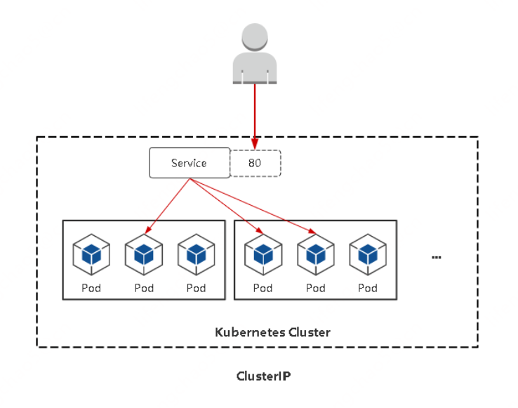

## Service对外暴露应用

### Service存在的意义
**Service引入主要是解决Pod的动态变化，提供统一访问入口**： 
* 防止Pod失联，准备找到提供同一个服务的Pod（服务发现）  
* 定义一组Pod的访问策略（负载均衡）  


### Pod与Service的关系
* Service通过标签关联一组Pod  
* Service为一组Pod提供负载均衡能力  


### Service定义与创建
定义Service
```yaml
apiVersion: v1
kind: Service
metadata:
  name: web
spec:
  type: ClusterIP # 服务类型
  ports:
  - port: 80 # Service端口
    protocol: TCP # 协议
    targetPort: 80 # 容器端口（应用程序监听端口）
  selector:
    app: web # 指定关联Pod的标签
```

```
创建service：
kubectl apply -f service.yaml
查看service：
kubectl get service
```

### Service三种常用类型
* ClusterIP：集群内部使用  
* NodePort：对外暴露应用  
* LoadBalancer：对外暴露应用，适用公有云  

#### ClusterIP
ClusterIP： 默认， 分配一个稳定的IP地址，即VIP，只能在集群内部访问。



```yaml
spec:
  type: ClusterIP
  ports:
  - port: 80
    protocol: TCP
    targetPort: 80
  selector:
    app: web
```

#### NodePort
NodePort： 在每个节点上启用一个端口来暴露服务，可以在集群外部访问。也会分配一个稳定内部集群IP地址。
```
访问地址： <任意NodeIP>:<NodePort>
端口默认范围： 30000-32767
```


#### LoadBalancer
LoadBalancer： 与NodePort类似，在每个节点上启用一个端口来暴露服务。除此之外， Kubernetes会请求底层云平台（例如阿里云、腾讯云、 AWS等）上的负载均衡器，将每个Node（`[NodeIP]:[NodePort]`）作为后端添加进去。


