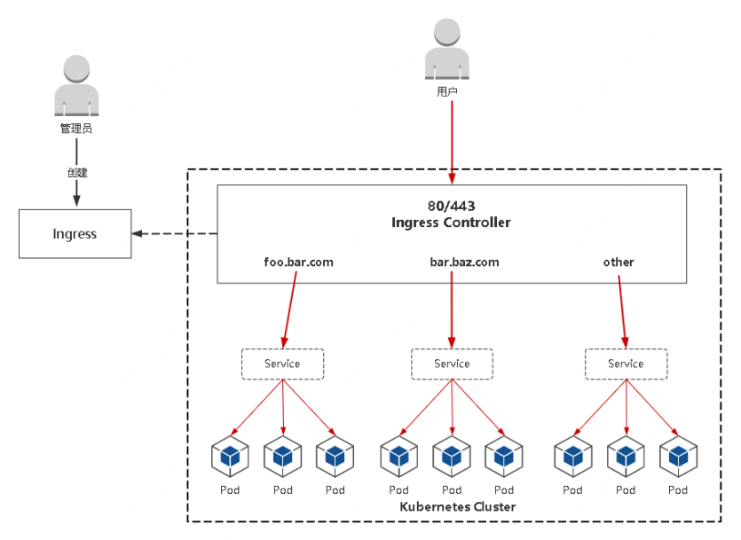

## Ingress对外暴露应用

### Ingress为弥补NodePort不足而生
NodePort存在的不足：

* 一个端口只能一个服务使用，端口需提前规划  
* 只支持4层负载均衡  

### Ingress是什么
Ingress： Ingress公开了从集群外部到集群内服务的HTTP和HTTPS路由的规则集合，而具体实现流量路由则是由Ingress Controller负责。



**Ingress**： K8s中的一个抽象资源，给管理员提供一个暴露应用的入口定义方法  
**Ingress Controller**： 根据Ingress生成具体的路由规则，并对Pod负载均衡器  

**使用流程**：  
* 1. 部署Ingress Controller  
* 2. 创建Ingress规则  

### Ingress Controller
Ingress Controller有很多实现，我们这里采用官方维护的Nginx控制器。

项目地址： https://github.com/kubernetes/ingress-nginx

下载YAML： wget https://raw.githubusercontent.com/kubernetes/ingress-nginx/nginx-0.30.0/deploy/static/mandatory.yaml （课件中名称是ingress-controller.yaml）

修改YAML：
* 镜像地址修改成国内的： lizhenliang/nginx-ingress-controller:0.30.0
* 将Ingress Controller暴露，一般使用宿主机网络（hostNetwork: true）或者使用NodePort

其他控制器： https://kubernetes.io/docs/concepts/services-networking/ingress-controllers/

### Ingress规则配置

```yaml
apiVersion: networking.k8s.io/v1
kind: Ingress
metadata:
  name: aliangedu
spec:
  rules:
  - host: web.aliangedu.cn
    http:
      paths:
      - path: /
        pathType: Prefix
        backend:
          service:
            name: web
            port:
              number: 80
```

```
创建：
kubectl apply -f xxx.yaml
查看：
kubectl get ingress
测试：本地电脑绑定hosts记录对应ingress里面配置的域名
例： <Ingress Controller Pod所在Node IP> web.aliangedu.cn
```

### 测试


