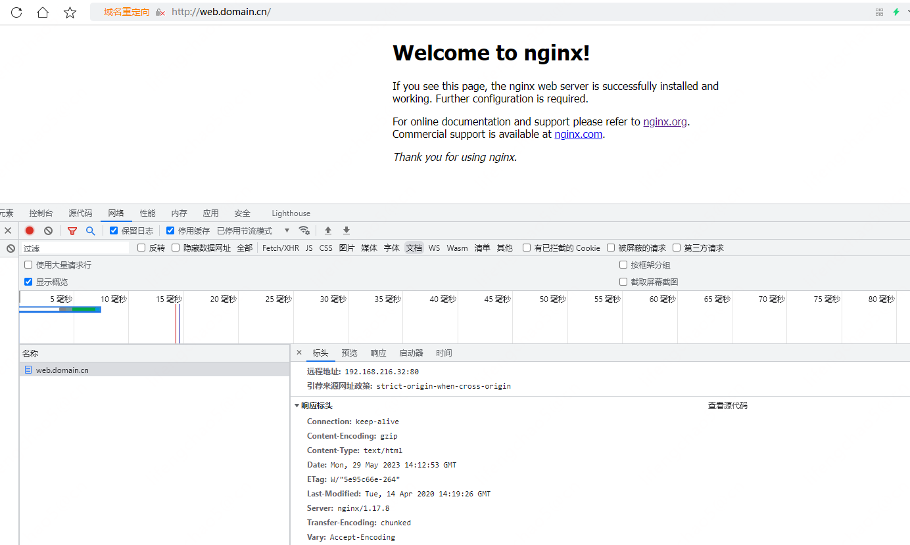

## Ingress对外暴露应用

### Ingress为弥补NodePort不足而生
NodePort存在的不足：

* 一个端口只能一个服务使用，端口需提前规划  
* 只支持4层负载均衡  

### Ingress是什么
Ingress： Ingress公开了从集群外部到集群内服务的HTTP和HTTPS路由的规则集合，而具体实现流量路由则是由Ingress Controller负责。


**Ingress**： K8s中的一个抽象资源，给管理员提供一个暴露应用的入口定义方法  
**Ingress Controller**： 根据Ingress生成具体的路由规则，并对Pod负载均衡器  

**使用流程**：  
* 1. 部署Ingress Controller  
* 2. 创建Ingress规则  

### Ingress Controller
Ingress Controller有很多实现，我们这里采用官方维护的Nginx控制器。

项目地址： https://github.com/kubernetes/ingress-nginx

下载YAML： wget https://raw.githubusercontent.com/kubernetes/ingress-nginx/nginx-0.30.0/deploy/static/mandatory.yaml （课件中名称是ingress-controller.yaml）

修改YAML：
* 镜像地址修改成国内的： lizhenliang/nginx-ingress-controller:0.30.0
* 将Ingress Controller暴露，一般使用宿主机网络（hostNetwork: true）或者使用NodePort

其他控制器： https://kubernetes.io/docs/concepts/services-networking/ingress-controllers/

### Ingress规则配置

```yaml
apiVersion: networking.k8s.io/v1
kind: Ingress
metadata:
  name: aliangedu
spec:
  rules:
  - host: web.aliangedu.cn
    http:
      paths:
      - path: /
        pathType: Prefix
        backend:
          service:
            name: web
            port:
              number: 80
```

```
创建：
kubectl apply -f xxx.yaml
查看：
kubectl get ingress
测试：本地电脑绑定hosts记录对应ingress里面配置的域名
例： <Ingress Controller Pod所在Node IP> web.aliangedu.cn
```

### 测试
先删除之前测试的pod等：
```
[root@node01 ~]# kubectl get deploy,pods,svc
NAME                  READY   UP-TO-DATE   AVAILABLE   AGE
deployment.apps/web   2/2     2            2           22h

NAME                       READY   STATUS    RESTARTS   AGE
pod/web-75868cf59c-5h6mn   1/1     Running   0          22h
pod/web-75868cf59c-nnwm8   1/1     Running   0          22h

NAME                 TYPE        CLUSTER-IP       EXTERNAL-IP   PORT(S)        AGE
service/kubernetes   ClusterIP   10.96.0.1        <none>        443/TCP        46h
service/web          NodePort    10.106.153.189   <none>        80:32479/TCP   22h

[root@node01 ~]# kubectl delete deploy/web
deployment.apps "web" deleted

[root@node01 ~]# kubectl delete svc/web
service "web" deleted

[root@node01 ~]# kubectl get deploy,pods,svc
NAME                 TYPE        CLUSTER-IP   EXTERNAL-IP   PORT(S)   AGE
service/kubernetes   ClusterIP   10.96.0.1    <none>        443/TCP   46h
[root@node01 ~]# 
```
测试
```
[root@node01 ~]# kubectl apply -f ingress-controller.yaml

[root@node01 ~]# kubectl get pod -n ingress-nginx -o wide
NAME                             READY   STATUS              RESTARTS   AGE   IP               NODE     NOMINATED NODE   READINESS GATES
nginx-ingress-controller-c5gnf   0/1     ContainerCreating   0          67s   192.168.216.33   node03   <none>           <none>
nginx-ingress-controller-m8wxx   0/1     ContainerCreating   0          67s   192.168.216.32   node02   <none>           <none>
```
两个node都运行了ingress-controller

创建文件web_deploy_svc_ingress.yaml：
```yaml
apiVersion: apps/v1
kind: Deployment
metadata:
  name: web
  namespace: default
spec:
  replicas: 2
  selector:
    matchLabels:
      app: web
  template:
    metadata:
      labels:
        app: web
    spec:
      containers:
      - name: web
        image: nginx:1.17

---
apiVersion: v1
kind: Service
metadata:
  name: web
spec:
  selector:
    app: web
  type: ClusterIP
  ports:
    - protocol: TCP
      port: 80
      targetPort: 80

---
apiVersion: networking.k8s.io/v1
kind: Ingress
metadata:
  name: webdomain
spec:
  rules:
  - host: web.domain.cn
    http:
      paths:
      - path: /
        pathType: Prefix
        backend:
          service:
            name: web
            port:
              number: 80
```

```
[root@node01 apps]# vi web_deploy_svc_ingress.yaml 
[root@node01 apps]# kubectl apply -f web_deploy_svc_ingress.yaml
deployment.apps/web created
service/web created
ingress.networking.k8s.io/webdomain created
[root@node01 apps]# kubectl get deploy,pods,svc
NAME                  READY   UP-TO-DATE   AVAILABLE   AGE
deployment.apps/web   2/2     2            2           107s

NAME                       READY   STATUS    RESTARTS   AGE
pod/web-75868cf59c-9gmh8   1/1     Running   0          107s
pod/web-75868cf59c-t6r4f   1/1     Running   0          107s

NAME                 TYPE        CLUSTER-IP      EXTERNAL-IP   PORT(S)   AGE
service/kubernetes   ClusterIP   10.96.0.1       <none>        443/TCP   46h
service/web          ClusterIP   10.104.181.90   <none>        80/TCP    107s
[root@node01 apps]# kubectl get ingress
NAME        CLASS    HOSTS           ADDRESS   PORTS   AGE
webdomain   <none>   web.domain.cn             80      117s
[root@node01 apps]# curl 10.104.181.90
<!DOCTYPE html>
<html>
<head>
<title>Welcome to nginx!</title>
<style>
    body {
        width: 35em;
        margin: 0 auto;
        font-family: Tahoma, Verdana, Arial, sans-serif;
    }
</style>
</head>
<body>
<h1>Welcome to nginx!</h1>
<p>If you see this page, the nginx web server is successfully installed and
working. Further configuration is required.</p>

<p>For online documentation and support please refer to
<a href="http://nginx.org/">nginx.org</a>.<br/>
Commercial support is available at
<a href="http://nginx.com/">nginx.com</a>.</p>

<p><em>Thank you for using nginx.</em></p>
</body>
</html>
[root@node01 apps]#
```

外面可以通过域名访问：
```
# C:\Windows\System32\drivers\etc\hosts
192.168.216.32 web.domain.cn
```



```

```