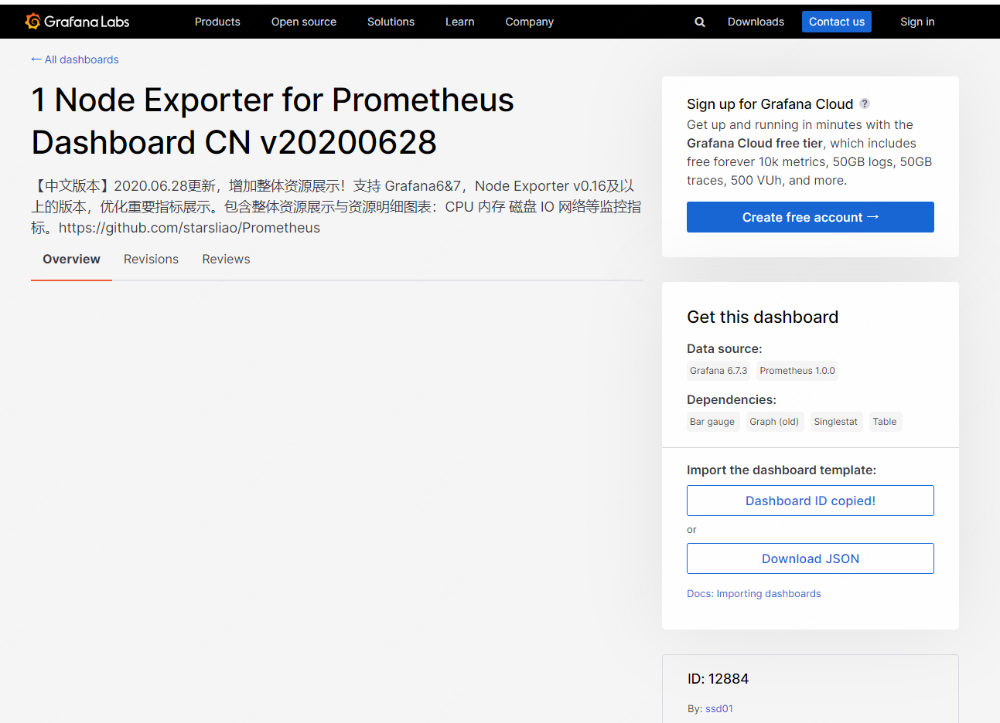
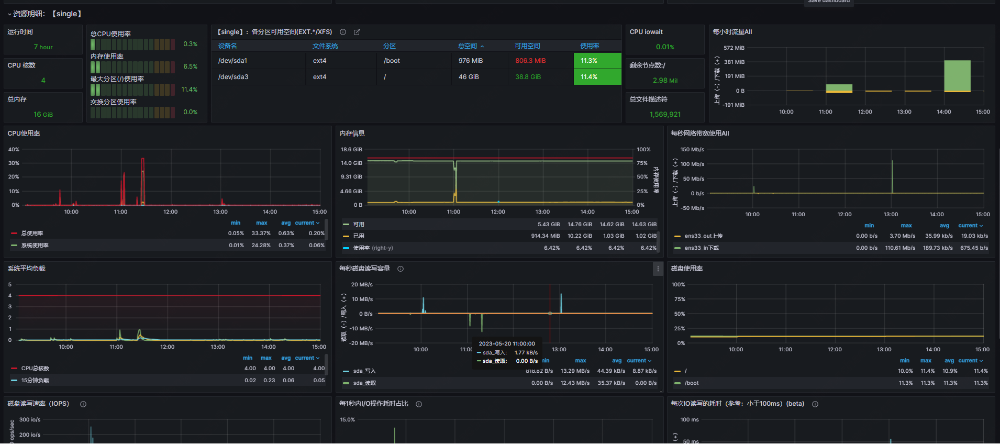

## 基本原理
Prometheus的基本架构如下图所示：


从上图可以看到，整个 Prometheus 可以分为四大部分，分别是：

* **Prometheus 服务器**
Prometheus Server 是 Prometheus组件中的核心部分，负责实现对监控数据的获取，存储以及查询。

* **NodeExporter 业务数据源**
业务数据源通过 Pull/Push 两种方式推送数据到 Prometheus Server。

* **AlertManager 报警管理器**
Prometheus 通过配置报警规则，如果符合报警规则，那么就将报警推送到 AlertManager，由其进行报警处理。

* **可视化监控界面**
Prometheus 收集到数据之后，由 WebUI 界面进行可视化图标展示。目前我们可以通过自定义的 API 客户端进行调用数据展示，也可以直接使用 Grafana 解决方案来展示。

## 安装运行 Prometheus 服务端
Prometheus 服务端负责数据的收集，因此我们应该首先安装并运行 Prometheus Server。

从 https://prometheus.io/download/ 找到最新版本的Prometheus Sevrer软件包：


解压：
```
[root@single software]# tar -zxf prometheus-2.37.8.linux-amd64.tar.gz -C /opt/module/
[root@single software]# cd /opt/module/
[root@single module]# ll
total 20
drwxr-xr-x. 10 root root   4096 May 14 01:21 druid-0.22.1
drwxr-xr-x.  7   10    143 4096 Jul  7  2018 jdk1.8.0_181
drwxr-xr-x.  9 root root   4096 May 13 21:16 kafka_2.12-2.8.2
drwxr-xr-x.  4 1001 docker 4096 May  5 14:34 prometheus-2.37.8.linux-amd64
drwxr-xr-x.  9 root root   4096 May 13 17:08 zookeeper-3.5.7
[root@single module]# mv prometheus-2.37.8.linux-amd64 prometheus-2.37.8
[root@single module]# ll
total 20
drwxr-xr-x. 10 root root   4096 May 14 01:21 druid-0.22.1
drwxr-xr-x.  7   10    143 4096 Jul  7  2018 jdk1.8.0_181
drwxr-xr-x.  9 root root   4096 May 13 21:16 kafka_2.12-2.8.2
drwxr-xr-x.  4 1001 docker 4096 May  5 14:34 prometheus-2.37.8
drwxr-xr-x.  9 root root   4096 May 13 17:08 zookeeper-3.5.7
[root@single module]# cd prometheus-2.37.8/
[root@single prometheus-2.37.8]# ll
total 207048
drwxr-xr-x. 2 1001 docker      4096 May  5 14:30 console_libraries
drwxr-xr-x. 2 1001 docker      4096 May  5 14:30 consoles
-rw-r--r--. 1 1001 docker     11357 May  5 14:30 LICENSE
-rw-r--r--. 1 1001 docker      3773 May  5 14:30 NOTICE
-rwxr-xr-x. 1 1001 docker 109128753 May  5 14:06 prometheus
-rw-r--r--. 1 1001 docker       934 May  5 14:30 prometheus.yml
-rwxr-xr-x. 1 1001 docker 102856799 May  5 14:08 promtool
[root@single prometheus-2.37.8]#

```
默认的配置文件prometheus.yml：
```yml
# my global config
global:
  scrape_interval: 15s # Set the scrape interval to every 15 seconds. Default is every 1 minute.
  evaluation_interval: 15s # Evaluate rules every 15 seconds. The default is every 1 minute.
  # scrape_timeout is set to the global default (10s).

# Alertmanager configuration
alerting:
  alertmanagers:
    - static_configs:
        - targets:
          # - alertmanager:9093

# Load rules once and periodically evaluate them according to the global 'evaluation_interval'.
rule_files:
  # - "first_rules.yml"
  # - "second_rules.yml"

# A scrape configuration containing exactly one endpoint to scrape:
# Here it's Prometheus itself.
scrape_configs:
  # The job name is added as a label `job=<job_name>` to any timeseries scraped from this config.
  - job_name: "prometheus"

    # metrics_path defaults to '/metrics'
    # scheme defaults to 'http'.

    static_configs:
      - targets: ["localhost:9090"]
```
修改prometheus监控拉取数据间隔覆盖默认值：
```yml
# my global config
global:
  scrape_interval: 15s # Set the scrape interval to every 15 seconds. Default is every 1 minute.
  evaluation_interval: 15s # Evaluate rules every 15 seconds. The default is every 1 minute.
  # scrape_timeout is set to the global default (10s).

# Alertmanager configuration
alerting:
  alertmanagers:
    - static_configs:
        - targets:
          # - alertmanager:9093

# Load rules once and periodically evaluate them according to the global 'evaluation_interval'.
rule_files:
  # - "first_rules.yml"
  # - "second_rules.yml"

# A scrape configuration containing exactly one endpoint to scrape:
# Here it's Prometheus itself.
scrape_configs:
  # The job name is added as a label `job=<job_name>` to any timeseries scraped from this config.
  - job_name: "prometheus"

    # metrics_path defaults to '/metrics'
    # scheme defaults to 'http'.
    
    # Override the global default and scrape targets from this job every 10 seconds.
    scrape_interval: 10s

    static_configs:
      - targets: ["localhost:9090"]
```

启动prometheus服务，其会默认加载当前路径下的prometheus.yaml文件。当然我们也可以手动指定配置文件地址：
```
# Start Prometheus.
# By default, Prometheus stores its database in ./data (flag --storage.tsdb.path).
./prometheus --config.file=prometheus.yml
```

启动：
```
[root@single prometheus-2.37.8]# ./prometheus --config.file=prometheus.yml
ts=2023-05-19T23:45:00.125Z caller=main.go:491 level=info msg="No time or size retention was set so using the default time retention" duration=15d
ts=2023-05-19T23:45:00.125Z caller=main.go:535 level=info msg="Starting Prometheus Server" mode=server version="(version=2.37.8, branch=HEAD, revision=3a804ec5688b3d88eb9718b0093a8fffae69ccf4)"
ts=2023-05-19T23:45:00.125Z caller=main.go:540 level=info build_context="(go=go1.19.9, user=root@aa533a6b7ace, date=20230505-06:03:04)"
ts=2023-05-19T23:45:00.125Z caller=main.go:541 level=info host_details="(Linux 3.10.0-1160.el7.x86_64 #1 SMP Mon Oct 19 16:18:59 UTC 2020 x86_64 single (none))"
ts=2023-05-19T23:45:00.125Z caller=main.go:542 level=info fd_limits="(soft=4096, hard=4096)"
ts=2023-05-19T23:45:00.125Z caller=main.go:543 level=info vm_limits="(soft=unlimited, hard=unlimited)"
ts=2023-05-19T23:45:00.127Z caller=web.go:553 level=info component=web msg="Start listening for connections" address=0.0.0.0:9090
ts=2023-05-19T23:45:00.129Z caller=main.go:972 level=info msg="Starting TSDB ..."
ts=2023-05-19T23:45:00.129Z caller=tls_config.go:195 level=info component=web msg="TLS is disabled." http2=false
ts=2023-05-19T23:45:00.150Z caller=head.go:493 level=info component=tsdb msg="Replaying on-disk memory mappable chunks if any"
ts=2023-05-19T23:45:00.150Z caller=head.go:536 level=info component=tsdb msg="On-disk memory mappable chunks replay completed" duration=5.994µs
ts=2023-05-19T23:45:00.150Z caller=head.go:542 level=info component=tsdb msg="Replaying WAL, this may take a while"
ts=2023-05-19T23:45:00.151Z caller=head.go:613 level=info component=tsdb msg="WAL segment loaded" segment=0 maxSegment=0
ts=2023-05-19T23:45:00.151Z caller=head.go:619 level=info component=tsdb msg="WAL replay completed" checkpoint_replay_duration=23.302µs wal_replay_duration=205.322µs total_replay_duration=250.767µs
ts=2023-05-19T23:45:00.152Z caller=main.go:993 level=info fs_type=EXT4_SUPER_MAGIC
ts=2023-05-19T23:45:00.152Z caller=main.go:996 level=info msg="TSDB started"
ts=2023-05-19T23:45:00.152Z caller=main.go:1177 level=info msg="Loading configuration file" filename=prometheus.yml
ts=2023-05-19T23:45:00.339Z caller=main.go:1214 level=info msg="Completed loading of configuration file" filename=prometheus.yml totalDuration=187.1223ms db_storage=543ns remote_storage=1.059µs web_handler=309ns query_engine=664ns scrape=186.77808ms scrape_sd=46.49µs notify=33.725µs notify_sd=8.004µs rules=33.519µs tracing=15.672µs
ts=2023-05-19T23:45:00.339Z caller=main.go:957 level=info msg="Server is ready to receive web requests."
ts=2023-05-19T23:45:00.339Z caller=manager.go:941 level=info component="rule manager" msg="Starting rule manager..."
```

访问web：http://single:9090


prometheus自己的metrics：http://single:9090/metrics


## 使用表达式浏览器
查询go_goroutines，协程数：


查询prometheus_target_interval_length_seconds：

该度量名表示每次抓取数据的间隔时间，比如第一次抓取是10:15:05，第二次抓取是10:15:10，则间隔时间是5s。

使用自带的图标显示：
go_goroutines


prometheus_target_interval_length_seconds


prometheus_target_interval_length_seconds{quantile='0.99'}


## 使用NodeExporter采集数据
NodeExporter 是 Prometheus 提供的一个可以采集到主机信息的应用程序，它能采集到机器的 CPU、内存、磁盘等信息。

我们从 https://prometheus.io/download/ 获取最新的 Node Exporter 版本的二进制包。


下载解压后运行 Node Exporter，我们指定用 8080 端口运行

解压：
```
[root@single software]# tar -zxf node_exporter-1.5.0.linux-amd64.tar.gz -C /opt/module/
[root@single software]# cd /opt/module/
[root@single module]# ll
total 24
drwxr-xr-x. 10 root root   4096 May 14 01:21 druid-0.22.1
drwxr-xr-x.  7   10    143 4096 Jul  7  2018 jdk1.8.0_181
drwxr-xr-x.  9 root root   4096 May 13 21:16 kafka_2.12-2.8.2
drwxr-xr-x.  2 3434   3434 4096 Nov 30 03:05 node_exporter-1.5.0.linux-amd64
drwxr-xr-x.  5 1001 docker 4096 May 20 07:45 prometheus-2.37.8
drwxr-xr-x.  9 root root   4096 May 13 17:08 zookeeper-3.5.7
[root@single module]# mv node_exporter-1.5.0.linux-amd64 node_exporter-1.5.0
[root@single module]# ll
total 24
drwxr-xr-x. 10 root root   4096 May 14 01:21 druid-0.22.1
drwxr-xr-x.  7   10    143 4096 Jul  7  2018 jdk1.8.0_181
drwxr-xr-x.  9 root root   4096 May 13 21:16 kafka_2.12-2.8.2
drwxr-xr-x.  2 3434   3434 4096 Nov 30 03:05 node_exporter-1.5.0
drwxr-xr-x.  5 1001 docker 4096 May 20 07:45 prometheus-2.37.8
drwxr-xr-x.  9 root root   4096 May 13 17:08 zookeeper-3.5.7

```
运行
```

[root@single module]# cd node_exporter-1.5.0/
[root@single node_exporter-1.5.0]# ll
total 19336
-rw-r--r--. 1 3434 3434    11357 Nov 30 03:05 LICENSE
-rwxr-xr-x. 1 3434 3434 19779640 Nov 30 02:59 node_exporter
-rw-r--r--. 1 3434 3434      463 Nov 30 03:05 NOTICE
[root@single node_exporter-1.5.0]# ./node_exporter --web.listen-address 127.0.0.1:8080
# 能在其他机器访问
[root@single node_exporter-1.5.0]# ./node_exporter --web.listen-address 0.0.0.0:8080
```
访问 http://single:8080/ 可以看到以下页面：

访问 http://single:8080/metrics，可以看到当前 node exporter 获取到的当前主机的所有监控数据，如下所示：


每一个监控指标之前都会有一段类似于如下形式的信息：
```sh
# HELP node_cpu Seconds the cpus spent in each mode.
# TYPE node_cpu counter
node_cpu{cpu="cpu0",mode="idle"} 362812.7890625
# HELP node_load1 1m load average.
# TYPE node_load1 gauge
node_load1 3.0703125

```
其中 HELP 用于解释当前指标的含义，TYPE 则说明当前指标的数据类型。

在上面的例子中 node_cpu 的注释表明当前指标是 cpu0 上 idle 进程占用 CPU 的总时间，CPU 占用时间是一个只增不减的度量指标，从类型中也可以看出 node_cpu 的数据类型是计数器(counter)，与该指标的实际含义一致。

又例如node_load1该指标反映了当前主机在最近一分钟以内的负载情况，系统的负载情况会随系统资源的使用而变化，因此node_load1反映的是当前状态，数据可能增加也可能减少，从注释中可以看出当前指标类型为仪表盘(gauge)，与指标反映的实际含义一致。

除了这些以外，在当前页面中根据物理主机系统的不同，你还可能看到如下监控指标：
```sh
node_boot_time：系统启动时间
node_cpu：系统CPU使用量
nodedisk*：磁盘IO
nodefilesystem*：文件系统用量
node_load1：系统负载
nodememeory*：内存使用量
nodenetwork*：网络带宽
node_time：当前系统时间
go_*：node exporter中go相关指标
process_*：node exporter自身进程相关运行指标

```

## 配置监控NodeExporter数据源
```yml
scrape_configs:
  # The job name is added as a label `job=<job_name>` to any timeseries scraped from this config.
  - job_name: "prometheus"

    # metrics_path defaults to '/metrics'
    # scheme defaults to 'http'.
    
    # Override the global default and scrape targets from this job every 10 seconds.
    scrape_interval: 30s

    static_configs:
      - targets: ["localhost:9090"]

  - job_name: "node"
    scrape_interval: 30s
    static_configs:
      - targets: ["localhost:8080"]

```
上面配置文件配置了两个任务。一个是名为 prometheus 的任务，其从「localhost:9090」地址读取数据。另一个是名为 node 的任务，其从「localhost:8080」地址读取数据。

配置完成后，我们重新启动 Prometheus。
```
[root@single prometheus-2.37.8]# ./prometheus --config.file=prometheus.yml
```

使用的内存：`(node_memory_MemTotal_bytes - node_memory_MemFree_bytes - node_memory_Buffers_bytes - node_memory_Cached_bytes)/(1024*1024*1024)`


剩余的内存：`(node_memory_MemFree_bytes + node_memory_Buffers_bytes + node_memory_Cached_bytes)/(1024*1024*1024)`


使用内存趋势：

增加一点内存：
```
[root@single ~]# python
Python 2.7.5 (default, Oct 14 2020, 14:45:30)
[GCC 4.8.5 20150623 (Red Hat 4.8.5-44)] on linux2
Type "help", "copyright", "credits" or "license" for more information.
>>> s = "#" * 1000000
>>> len(s)
1000000
>>> s = "#" * 10000000
>>> s = ["#"]  * 10000000
>>> datas = [{"id":i} for i in range(1000000)]
```

```
[root@single ~]# free -m
              total        used        free      shared  buff/cache   available
Mem:          16027         664       15101          11         262       15091
Swap:             0           0           0
[root@single ~]# free -m
              total        used        free      shared  buff/cache   available
Mem:          16027        1071       14693          11         262       14684
Swap:             0           0           0
```


减少内存：
```
>>> del datas
>>> del s
```

```
[root@single ~]# free -m
              total        used        free      shared  buff/cache   available
Mem:          16027         714       15050          11         262       15041
Swap:             0           0           0
```


```
>>> exit()
```
```
[root@single ~]# free -m
              total        used        free      shared  buff/cache   available
Mem:          16027         670       15057          11         299       15080
Swap:             0           0           0
```


## 安装Grafana
Prometheus UI 提供了快速验证 PromQL 以及临时可视化支持的能力，但其可视化能力却比较弱。一般情况下，我们都用 Grafana 来实现对 Prometheus 的可视化实现。

首先我们从 https://grafana.com/grafana/download 下载对应系统的安装包
```
Standalone Linux Binaries(64 Bit)SHA256: bd2c559e9ed17afa38c20b0ffffa6cb8024e7f8ca9fa9fab90f319060fa0ba0c
wget https://dl.grafana.com/enterprise/release/grafana-enterprise-9.5.2.linux-amd64.tar.gz
tar -zxvf grafana-enterprise-9.5.2.linux-amd64.tar.gz
```
从https://dl.grafana.com/enterprise/release/grafana-enterprise-9.5.2.linux-amd64.tar.gz下载文件，解压就行。
```
[root@single software]# tar -zxf grafana-enterprise-9.5.2.linux-amd64.tar.gz -C /opt/module/
[root@single software]# cd /opt/module/
[root@single module]# ll
total 28
drwxr-xr-x. 10 root root   4096 May 14 01:21 druid-0.22.1
drwxr-xr-x.  6 root root   4096 May 20 10:01 grafana-9.5.2
drwxr-xr-x.  7   10    143 4096 Jul  7  2018 jdk1.8.0_181
drwxr-xr-x.  9 root root   4096 May 13 21:16 kafka_2.12-2.8.2
drwxr-xr-x.  2 3434   3434 4096 Nov 30 03:05 node_exporter-1.5.0
drwxr-xr-x.  5 1001 docker 4096 May 20 07:45 prometheus-2.37.8
drwxr-xr-x.  9 root root   4096 May 13 17:08 zookeeper-3.5.7
[root@single module]#
```

启动：
```
[root@single module]# cd grafana-9.5.2/
[root@single grafana-9.5.2]# ll
total 40
drwxr-xr-x.  2 root root  4096 May  8 23:20 bin
drwxr-xr-x.  3 root root  4096 May  8 23:20 conf
-rw-r--r--.  1 root root 12155 May  8 23:18 LICENSE
-rw-r--r--.  1 root root   105 May  8 23:18 NOTICE.md
drwxr-xr-x.  3 root root  4096 May  8 23:20 plugins-bundled
drwxr-xr-x. 17 root root  4096 May  8 23:20 public
-rw-r--r--.  1 root root  2008 May  8 23:18 README.md
-rw-r--r--.  1 root root     5 May  8 23:20 VERSION
[root@single grafana-9.5.2]# ll bin
total 119208
-rwxr-xr-x. 1 root root 119079840 May  8 23:20 grafana
-rwxr-xr-x. 1 root root   1483286 May  8 23:20 grafana-cli
-rw-r--r--. 1 root root        33 May  8 23:20 grafana-cli.md5
-rw-r--r--. 1 root root        33 May  8 23:20 grafana.md5
-rwxr-xr-x. 1 root root   1483286 May  8 23:20 grafana-server
-rw-r--r--. 1 root root        33 May  8 23:20 grafana-server.md5
[root@single grafana-9.5.2]# bin/grafana-server web
```

Grafana 默认使用 3000 端口启动，我们访问：http://single:3000 查看对应页面。

默认的账号密码是 admin/admin，第一次登陆会提示修改密码，修改成123456。登陆进去后是这样的。


## Grafana配置Prometheus数据源


之后输入对应的名字和 URL 地址即可：

## Grafana配置面板
在 Grafana 中有「Dashboard」和「Panel」的概念，Dashboard 可以理解成「看板」，而 Panel 可以理解成「图表，一个看看板中包含了无数个图表。例如下图就是一个看板（Dashboard）：

里面一个个小的图表，就是一个个小的图表（Panel）。

添加一个面板：


在这添加单个组件：


cpu压测
```
[root@single ~]# cat /dev/urandom |md5sum
```

配置：
```
cpu使用(%)
(sum(rate(node_cpu_seconds_total[1m])) by (instance) - sum(rate(node_cpu_seconds_total{mode="idle"}[1m])) by (instance)) * 100
cpu使用比例(%)
(1 - sum(rate(node_cpu_seconds_total{mode="idle"}[1m])) by (instance) / sum(rate(node_cpu_seconds_total[1m])) by (instance) ) * 100
cpu空闲(%)
sum(rate(node_cpu_seconds_total{mode="idle"}[1m])) by (instance) * 100
cpu空闲比例(%)
(sum(rate(node_cpu_seconds_total{mode="idle"}[1m])) by (instance) / sum(rate(node_cpu_seconds_total[1m])) by (instance) ) * 100
上行带宽
sum by(instance) (irate(node_network_receive_bytes_total{device!~"bond.*?|lo"}[1m]))
下行带宽
sum by(instance) (irate(node_network_transmit_bytes_total{device!~"bond.*?|lo"}[1m]))
```


底部颜色：


## Grafana模板中心
对于线上监控来讲，如果我们每个面板都需要自己从零开始，那么就太累了。事实上，我们用到的许多监控信息都是类似的。因此[Grafana官网 - Dashboards 模块](https://grafana.com/grafana/dashboards "Grafana官网 - Dashboards 模块")提供了下载 Dashboard 模板的功能。

Dashboards 里有许多各种类型的 Dashboard 面板，例如 JVM 监控、MySQL 数据库监控等。你只需找到合适自己的监控面板，之后根据 ID 添加即可。

例如我找到的这个这个面板包含了各种常见的资源监控，例如：CPU、内存等。


你只需要复制它的 ID 并使用 Grafana 的 import 功能导入即可，如下图所示：


什么都有：


这还有个中文版：

导入：


这些模板都是比较成熟的，可以选择主机，没必要自己配置，浪费时间：


```

```