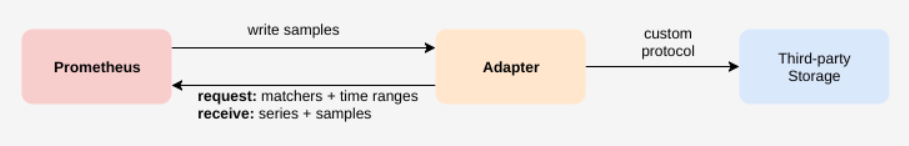

## Prometheus学习（九）之Prometheus 存储
https://www.cnblogs.com/even160941/p/15118602.html

### 0.前言


本文来自[Prometheus官网手册](https://prometheus.io/docs/introduction/first_steps/ "Prometheus官网手册")和[Prometheus简介](https://prometheus.fuckcloudnative.io/ "Prometheus简介")


### 1.存储


Prometheus是一个本地磁盘时间序列数据库，但也可选择与远程存储系统集成，其本地时间序列数据库以自定义格式在磁盘上存储时间序列数据。


#### 1.1磁盘布局


采集的样本按每两个小时的时间段保存到一个目录，该目录包含一个或多个块文件，该文件包含该时间窗口的所有时间序列样本，以及元数据文件和索引文件（用于将度量名称和标签索引到块文件中的时间序列）。通过API删除系列时，删除记录存储在单独的逻辑删除文件中（而不是立即从块文件中删除数据）


当前传入样本的块保存在内存中，但尚未完全保留。通过预写日志（WAL）防止崩溃，可以在崩溃后重新启动Prometheus服务器时重放。预写日志文件以128MB段存储在wal目录中。这些文件包含尚未压缩的原始数据，因此它们比常规块文件大得多。 Prometheus将保留至少3个预写日志文件，但是高流量服务器可能会看到三个以上的WAL文件，因为它需要保留至少两个小时的原始数据。


Prometheus服务器的数据目录的目录结构如下所示：


```sh
./data
├── 01BKGV7JBM69T2G1BGBGM6KB12
│   └── meta.json
├── 01BKGTZQ1SYQJTR4PB43C8PD98
│   ├── chunks
│   │   └── 000001
│   ├── tombstones
│   ├── index
│   └── meta.json
├── 01BKGTZQ1HHWHV8FBJXW1Y3W0K
│   └── meta.json
├── 01BKGV7JC0RY8A6MACW02A2PJD
│   ├── chunks
│   │   └── 000001
│   ├── tombstones
│   ├── index
│   └── meta.json
└── wal
    ├── 00000002
    └── checkpoint.000001

```


注意，本地存储的局限性在于它不是集群或复制的。 因此，面对磁盘或节点中断，它不是任意可伸缩的或持久的，应该像对待任何其他类型的单节点数据库一样对待它。 建议将RAID用于磁盘可用性，[快照](https://prometheus.io/docs/prometheus/latest/querying/api/#snapshot "快照")用于备份，容量规划等，以提高耐用性。 通过适当的存储耐久性和计划，可以在本地存储中存储多年的数据。


或者，可以通过[远程读/写API](https://prometheus.io/docs/operating/integrations/#remote-endpoints-and-storage "远程读/写API")使用外部存储。 这些系统在耐用性，性能和效率上差异很大，因此需要仔细评估。有关文件格式的更多详细信息，请参见[TSDB格式](https://github.com/prometheus/prometheus/blob/main/tsdb/docs/format/README.md "TSDB格式")。


#### 1.2压缩方面


最初的两个小时的块最终会在后台压缩为更长的块。压缩将创建较大的块，按最多保留时间的10％，或21天，以较小者为准。


#### 1.3运营方面


Prometheus具有几个允许配置本地存储的标志。最重要的是：


```sh
--storage.tsdb.path: 这决定了Prometheus写入数据库的位置。 默认为data/。
--storage.tsdb.retention.time: 这决定了何时删除旧数据。默认为15d。 如果此标志设置为默认值以外的任何值，则覆盖storage.tsdb.retention。
--storage.tsdb.retention.size: [EXPERIMENTAL]这确定了存储块可以使用的最大字节数（请注意，这不包括WAL大小，这可能很大）。 最早的数据将被删除。默认为0或禁用。 此标志是实验性的，可以在将来的版本中进行更改。支持的单位: KB，MB，GB，PB。 例如: "512MB"
--storage.tsdb.retention: 不推荐使用此标志，而使用storage.tsdb.retention.time。
--storage.tsdb.wal-compression: 此标志启用预写日志（WAL）的压缩。 根据您的数据，您可以预期WAL大小将减少一半，而额外的CPU负载却很少。 请注意，如果启用此标志，然后将Prometheus降级到2.11.0以下的版本，则您将需要删除WAL，因为它将不可读。

```


平均而言，Prometheus每个样本仅使用大约1-2个字节。 因此，要计划Prometheus服务器的容量，可以使用以下粗略公式:


```sh
needed_disk_space = retention_time_seconds * ingested_samples_per_second * bytes_per_sample

```


要调整每秒采集样本的速率，您可以减少抓取的时间序列数（每个目标的目标更少或更少的系列），或者可以增加抓取时间间隔。但是，由于压缩序列中的样本，减少序列数可能更有效。


如果您的本地存储由于某种原因而损坏，最好的选择是关闭Prometheus并删除整个存储目录。 Prometheus的本地存储不支持不兼容POSIX的文件系统，可能会发生损坏，无法恢复。 NFS仅是潜在的POSIX，大多数实现不是。您可以尝试删除单个块目录来解决该问题，这意味着每个块目录将损失大约两个小时的数据时间窗口。同样，Prometheus的本地存储并不意味着持久的长期存储。


如果同时指定了时间和大小保留策略，则在那一刻将使用第一个触发的策略。过期的块清除将在后台计划中进行。删除过期的数据块可能最多需要两个小时。过期的块在清除之前必须完全过期。


#### 1.4远程存储集成


Prometheus的本地存储在可伸缩性和持久性方面受到单个节点的限制。 Prometheus并没有尝试解决Prometheus本身中的群集存储，而是提供了一组允许与远程存储系统集成的接口。


##### 1.4.1概述


Prometheus通过两种方式与远程存储系统集成：


* Prometheus可以将提取的样本以标准格式写入远程URL。    
* Prometheus可以以标准化格式从远程URL读取（返回）样本数据。





读写协议都使用基于HTTP的快速压缩协议缓冲区编码。该协议尚未被认为是稳定的API，当可以安全地假定Prometheus和远程存储之间的所有跃点都支持HTTP2.0时，该协议将来可能会更改为在HTTP2.0上使用gRPC。


有关在Prometheus中配置远程存储集成的详细信息，请参阅Prometheus配置文档的“[远程写入](https://prometheus.io/docs/prometheus/latest/configuration/configuration/#remote_write "远程写入")”和“[远程读取](https://prometheus.io/docs/prometheus/latest/configuration/configuration/#remote_read "远程读取")”部分，有关请求和响应消息的详细信息，请参阅[远程存储协议缓冲区定义](https://github.com/prometheus/prometheus/blob/main/prompb/remote.proto "远程存储协议缓冲区定义")。


注意，在读取路径上，Prometheus仅从远端获取一组标签选择器和时间范围的原始系列数据。 PromQL对原始数据的所有评估仍然在Prometheus本身中进行。这意味着远程读取查询具有一定的可伸缩性限制，因为所有必需的数据都需要先加载到查询的Prometheus服务器中，然后在那里进行处理。但是，支持PromQL的完全分布式评估暂时被认为是不可行的。


##### 1.4.2现有集成


要了解有关与远程存储系统的现有集成的更多信息，请参阅[集成文档](https://prometheus.io/docs/operating/integrations/#remote-endpoints-and-storage "集成文档")。

