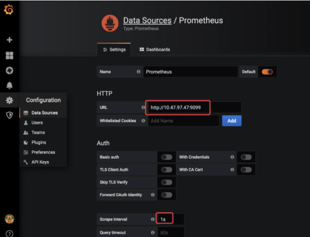
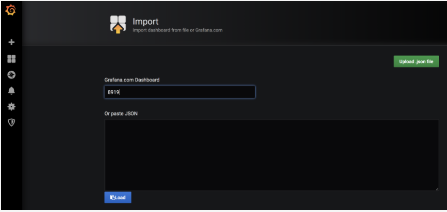
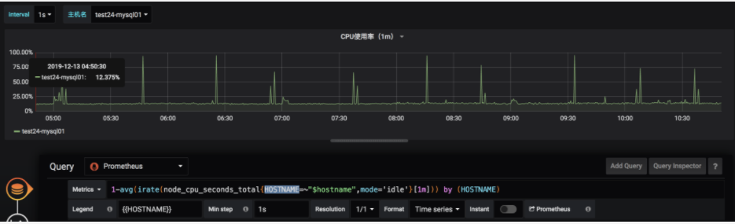

## Prometheus学习（十一）之Prometheus+Grafana部署说明
https://www.cnblogs.com/even160941/p/15119344.html


### 0.说明


在前面的Prometheus学习系列文章里，大致介绍说明了Prometheus和Grafana的一些使用，现在开始介绍如何从头开始部署Prometheus+Grafana，来监控各个相关的指标数据来进行展示。


### 1.部署


Prometheus基于Golang编写（需要安装），编译后的软件包，不依赖于任何的第三方依赖。用户只需要下载对应平台的二进制包，解压并且添加基本的配置即可正常启动Prometheus Server。


#### 1.1部署流程


##### 1.1.1环境


```sh
系统:
centos-release-7-4.1708.el7.centos.x86_64
IP：10.47.97.47

Prometheus:
prometheus-2.14.0

Grafana:
grafana-6.5.1-1

```


##### 1.1.2下载


```sh
1: Prometheus
wget https://github.com/prometheus/prometheus/releases/download/v2.14.0/prometheus-2.14.0.linux-amd64.tar.gz

2: Grafana：
wget https://dl.grafana.com/oss/release/grafana-6.5.1-1.x86_64.rpm

```


##### 1.1.3安装Prometheus


* 添加用户prometheus:


```sh
useradd --no-create-home --shell /bin/false prometheus

```


* 创建相关目录:


```sh
mkdir /etc/prometheus
mkdir /var/lib/prometheus

```


* 改目录权限:


```sh
chown prometheus:prometheus /etc/prometheus
chown prometheus:prometheus /var/lib/prometheus

```


* 解压 & 移动到相应目录:


```sh
tar xvf prometheus-2.14.0.linux-amd64.tar.gz 

cp prometheus-2.14.0.linux-amd64/prometheus /usr/local/bin/
cp prometheus-2.14.0.linux-amd64/promtool /usr/local/bin/

cp -r prometheus-2.14.0.linux-amd64/consoles/ /etc/prometheus/
cp -r prometheus-2.14.0.linux-amd64/console_libraries/ /etc/prometheus/
cp prometheus-2.14.0.linux-amd64/prometheus.yml /etc/prometheus/

chown prometheus:prometheus /usr/local/bin/prometheus
chown prometheus:prometheus /usr/local/bin/promtool

chown -R prometheus:prometheus /etc/prometheus/consoles
chown -R prometheus:prometheus /etc/prometheus/console_libraries
chown -R prometheus:prometheus /etc/prometheus/prometheus.yml 

```


* 配置Prometheus service，端口为9099:


```sh
vim /etc/systemd/system/prometheus.service

[Unit]
Description=Prometheus
Wants=network-online.target
After=network-online.target

[Service]
User=prometheus
Group=prometheus
Type=simple
ExecStart=/usr/local/bin/prometheus \
    --config.file /etc/prometheus/prometheus.yml \
    --storage.tsdb.path /var/lib/prometheus/ \
    --web.console.templates=/etc/prometheus/consoles \
    --web.console.libraries=/etc/prometheus/console_libraries \
    --web.listen-address=:9099

[Install]
WantedBy=multi-user.target

```


* 加载systemd服务 & 启动:


```sh
# 加载 
systemctl daemon-reload
# 开机启动
systemctl enable prometheus.service
# 启动
systemctl start prometheus
# 查看状态
systemctl status prometheus

```


* 查看状态:


```sh
systemctl status prometheus
● prometheus.service - Prometheus
   Loaded: loaded (/etc/systemd/system/prometheus.service; enabled; vendor preset: disabled)
   Active: active (running) since Mon 2019-12-09 18:35:00 CST; 1min 8s ago
 Main PID: 18875 (prometheus)
   CGroup: /system.slice/prometheus.service
           └─18875 /usr/local/bin/prometheus --config.file /etc/prometheus/prometheus.yml --storage.tsdb.path /var/lib/prometheus/ --web.console.templates=/etc/prometheus/consoles --web.console.librari...

Dec 09 18:35:00 test26-mysql03 prometheus[18875]: level=info ts=2019-12-09T10:35:00.175Z caller=head.go:583 component=tsdb msg="WAL segment loaded" segment=4 maxSegment=8
Dec 09 18:35:00 test26-mysql03 prometheus[18875]: level=info ts=2019-12-09T10:35:00.175Z caller=head.go:583 component=tsdb msg="WAL segment loaded" segment=5 maxSegment=8
Dec 09 18:35:00 test26-mysql03 prometheus[18875]: level=info ts=2019-12-09T10:35:00.176Z caller=head.go:583 component=tsdb msg="WAL segment loaded" segment=6 maxSegment=8
Dec 09 18:35:00 test26-mysql03 prometheus[18875]: level=info ts=2019-12-09T10:35:00.178Z caller=head.go:583 component=tsdb msg="WAL segment loaded" segment=7 maxSegment=8
Dec 09 18:35:00 test26-mysql03 prometheus[18875]: level=info ts=2019-12-09T10:35:00.178Z caller=head.go:583 component=tsdb msg="WAL segment loaded" segment=8 maxSegment=8
Dec 09 18:35:00 test26-mysql03 prometheus[18875]: level=info ts=2019-12-09T10:35:00.180Z caller=main.go:672 fs_type=EXT4_SUPER_MAGIC
Dec 09 18:35:00 test26-mysql03 prometheus[18875]: level=info ts=2019-12-09T10:35:00.180Z caller=main.go:673 msg="TSDB started"
Dec 09 18:35:00 test26-mysql03 prometheus[18875]: level=info ts=2019-12-09T10:35:00.180Z caller=main.go:743 msg="Loading configuration file" filename=/etc/prometheus/prometheus.yml
Dec 09 18:35:00 test26-mysql03 prometheus[18875]: level=info ts=2019-12-09T10:35:00.182Z caller=main.go:771 msg="Completed loading of configuration file" filename=/etc/prometheus/prometheus.yml
Dec 09 18:35:00 test26-mysql03 prometheus[18875]: level=info ts=2019-12-09T10:35:00.182Z caller=main.go:626 msg="Server is ready to receive web requests."

```


* 命令行启动:


```sh
sudo -u prometheus /usr/local/bin/prometheus --config.file /etc/prometheus/prometheus.yml --storage.tsdb.path /var/lib/prometheus/ --web.console.templates=/etc/prometheus/consoles --web.console.libraries=/etc/prometheus/console_libraries --web.listen-address=:9099

```


* 访问URL: `http://10.47.97.47:9099/graph`    
* 配置文件:


```sh
# my global config
global:
  scrape_interval:     15s # Set the scrape interval to every 15 seconds. Default is every 1 minute.
  evaluation_interval: 15s # Evaluate rules every 15 seconds. The default is every 1 minute.
  # scrape_timeout is set to the global default (10s).

# Alertmanager configuration
alerting:
  alertmanagers:
  - static_configs:
    - targets:
      # - alertmanager:9093

# Load rules once and periodically evaluate them according to the global 'evaluation_interval'.
rule_files:
  # - "first_rules.yml"
  # - "second_rules.yml"

# A scrape configuration containing exactly one endpoint to scrape:
# Here it's Prometheus itself.
scrape_configs:
  # The job name is added as a label `job=<job_name>` to any timeseries scraped from this config.
  - job_name: 'prometheus'

    # metrics_path defaults to '/metrics'
    # scheme defaults to 'http'.

    static_configs:
    - targets: ['localhost:9099']


  - job_name: 'node_exporter'
    scrape_interval: 1s
    static_configs:
    - targets: ['a:9199','b:9199','c:9199','d:9199']
    relabel_configs:
    - action: replace
      source_labels: ['__address__']  # 源标签
      regex: (.*):(.*)             # 正则，会匹配到__address__值
      replacement: $1       # 引用正则匹配到的内容
      target_label: HOSTNAME    # 赋予新的标签，名为HOSTNAME

```


之后可以访问到Prometheus的Web界面。到此Prometheus的安装结束。更多的参数可以看Prometheus学习（二）之Prometheus FIRST STEPS和Prometheus学习（四）之Prometheus配置说明


##### 1.1.4安装Grafana


* 下载完rpm包之后，直接执行:


```sh
sudo yum localinstall grafana-6.5.1-1.x86_64.rpm

```


安装完之后进行Grafana配置的修改：修改端口`vim /etc/grafana/grafana.ini`,关于配置说明请见: 官方文档、Grafana配置和Grafana 配置文件详解


* 修改开启端口:


```sh
http_port = 3333

```


* 加载systemd服务 & 启动:


```sh
直接启动
$ sudo service grafana-server start

#配置为在引导时启动
$ sudo /sbin/chkconfig --add grafana-server

#加载
$ systemctl daemon-reload

#开启
$ systemctl start grafana-server

#查看状态
$ systemctl status grafana-server

#开启启动
sudo systemctl enable grafana-server.service

```


* 日志&数据目录


```sh
日志目录：配置为在引导时启动
数据目录：/var/lib/grafana/grafana.db

```


* 访问URL: `http://10.47.97.47:3333`


Prometheus和Grafana安装完毕，现在开始安装Exporter来采集数据。


Exporter是Prometheus的一类数据采集组件的总称。它负责从目标处搜集数据，并将其转化为Prometheus支持的格式。与传统的数据采集组件不同的是，它并不向中央服务器发送数据，而是等待中央服务器主动前来抓取，默认的抓取地址为http://CURRENT_IP:9199/metrics。


#### 1.2Exporter 安装


[exporter官网地址](https://prometheus.io/download/ "exporter官网地址")


##### 1.2.1node_exporter安装


[node_exporter](https://prometheus.io/download/#node_exporter "node_exporter")的作用是用于机器系统数据收集，监控服务器CPU、内存、磁盘、I/O、网络等等信息。


* 下载:


```sh
wget https://github.com/prometheus/node_exporter/releases/download/v0.18.1/node_exporter-0.18.1.linux-amd64.tar.gz

```


* 安装:


```sh
#解压
tar xvf node_exporter-0.18.1.linux-amd64.tar.gz
cp node_exporter /usr/sbin/

#帮助
node_exporter --help

#开启，端口：9199
node_exporter --web.listen-address=:9199

```


* 加载systemd服务 & 启动:


```sh
vim /etc/systemd/system/node_exporter.service
[Unit]
Description=node_exporter
Documentation=https://prometheus.io/
After=network.target
[Service]
Type=simple
User=prometheus
ExecStart=/usr/sbin/node_exporter --web.listen-address=:9199
Restart=on-failure
[Install]
WantedBy=multi-user.target

```


* systemctl 启动:


```sh
#加载 
systemctl daemon-reload

#开机启动
systemctl enable node_exporter.service

#启动
systemctl start node_exporter

#查看状态
systemctl status node_exporter

```


此时，node_exporter启动后已经开始采集指标信息，可以通过地址访问：`http://10.47.97.47:9199/metrics`


##### 1.2.2mysqld_exporter 安装


[mysqld_exporter](https://prometheus.io/download/#mysqld_exporter "mysqld_exporter")的作用是用于MySQL数据库数据收集。


* 下载:


```sh
wget https://github.com/prometheus/mysqld_exporter/releases/download/v0.12.1/mysqld_exporter-0.12.1.linux-amd64.tar.gz

```


* 安装:


```sh
#解压
tar xvf mysqld_exporter-0.12.1.linux-amd64.tar.gz
cp mysqld_exporter /usr/sbin/

#帮助
mysqld_exporter --help

#连接被监控数据库，数据库信息保存在以下的任意一个地方
1: 环境变量
export DATA_SOURCE_NAME='user:password@(hostname:3306)/'
./mysqld_exporter <flags>

2: 配置文件
vim ~/.my.cnf

[client]
host=10.27.27.27
port=5381
user=root
password=root

```


* 启动:


```sh
可以放到systemctl里启动，也可以直接运行：
./mysqld_exporter 
INFO[0000] Starting mysqld_exporter (version=0.12.1, branch=HEAD, revision=48667bf7c3b438b5e93b259f3d17b70a7c9aff96)  source="mysqld_exporter.go:257"
INFO[0000] Build context (go=go1.12.7, user=root@0b3e56a7bc0a, date=20190729-12:35:58)  source="mysqld_exporter.go:258"
INFO[0000] Enabled scrapers:                             source="mysqld_exporter.go:269"
INFO[0000]  --collect.global_status                      source="mysqld_exporter.go:273"
INFO[0000]  --collect.global_variables                   source="mysqld_exporter.go:273"
INFO[0000]  --collect.slave_status                       source="mysqld_exporter.go:273"
INFO[0000]  --collect.info_schema.innodb_cmp             source="mysqld_exporter.go:273"
INFO[0000]  --collect.info_schema.innodb_cmpmem          source="mysqld_exporter.go:273"
INFO[0000]  --collect.info_schema.query_response_time    source="mysqld_exporter.go:273"
INFO[0000] Listening on :9104                            source="mysqld_exporter.go:283"

```


其他的exporter可以见[官网](https://prometheus.io/download/ "官网")。


#### 1.3可视化监控


上面已经安装部署好了Prometheus、Grafana和Exporter，现在需要把这3者联系起来进行数据展示。如已经安装了node_exporter，需要把node_exporter采集的信息配置到Prometheus上，即修改Prometheus配置文件。


在scrape_configs选项组下面添加:


```sh
  - job_name: 'node_exporter'
    scrape_interval: 1s
    static_configs:
    - targets: ['localhost:9199']

```


重启Prometheus:


```sh
systemctl restart prometheus

```


此时可以在Prometheus上进行出图了: 通过相关的PromSQL得到各种数据指标，如node_load5。Prometheus上面比较适合做一些调试，不适合看监控指标，需要把结果放到Grafana上进行展示。


在Grafana上`http://10.47.97.47:3333`进行配置数据源。把Prometheus`http://10.47.97.47:9099`做为数据源添加进去。如:


根据实际情况设置好各个值，保存完成。 然后去[官网](https://grafana.com/grafana/dashboards "官网")找个模板导入，比如导入的ID是8919:





完成之后，可以看到相关的监控图标了。现在根据表达式自定义一个图，如定义一个CPU使用率:


```sh
1-avg(irate(node_cpu_seconds_total{HOSTNAME=~"$hostname",mode='idle'}[1m])) by (HOSTNAME)
HOSTNAME：node_cpu_seconds_total metrice里的一个label。

```


`$hostname`: 在设置里设置的一个变量。最终展示图如:


关于更多的图可以自行定义，关于PromSQL可以见我的前几篇文章————Prometheus学习（七）之Prometheus PromQL说明

