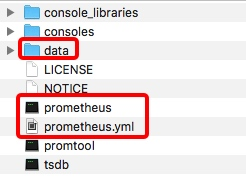
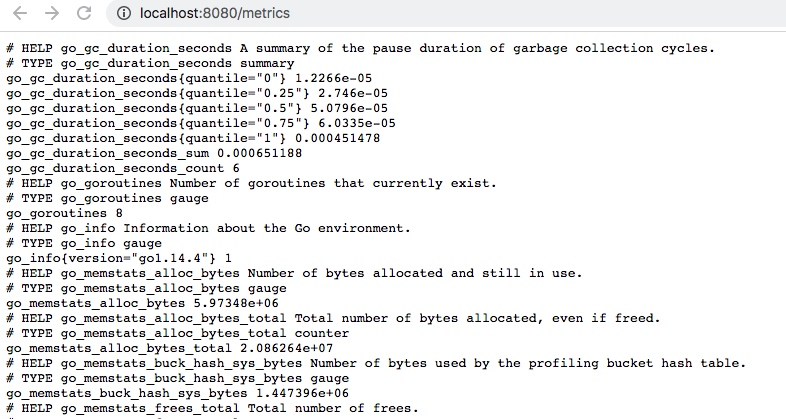
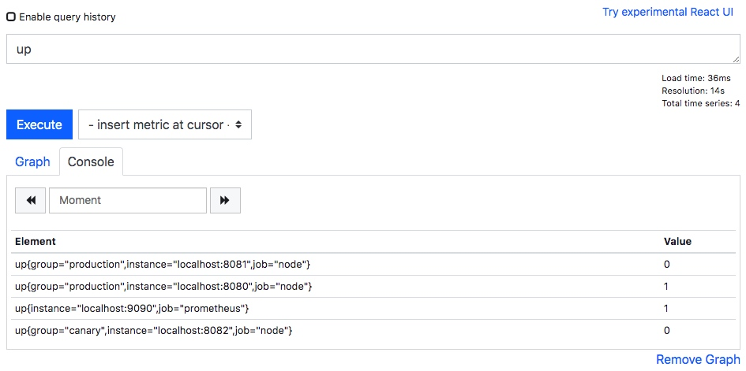
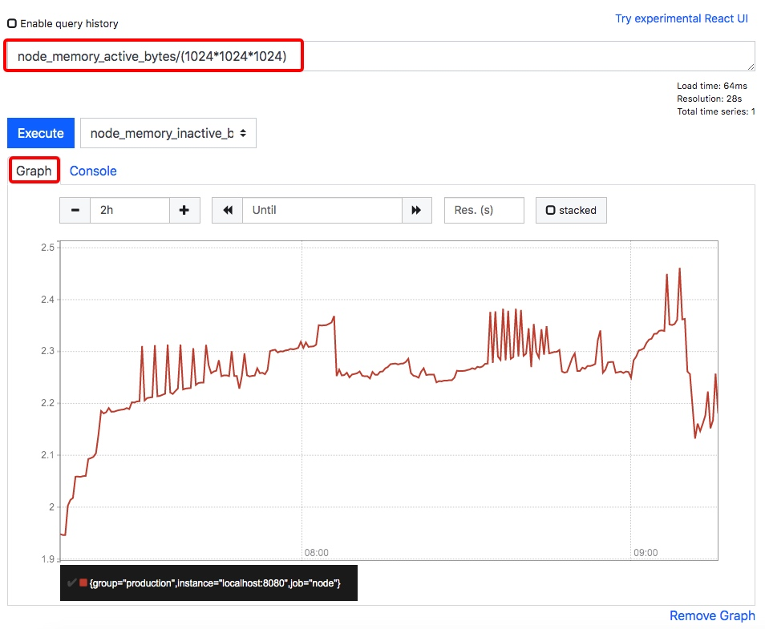

## Prometheus 快速入门教程（一）：Prometheus 快速入门
摘抄自：https://www.cnblogs.com/chanshuyi/p/01_head_first_of_prometheus.html


Prometheus 是任何一个高级工程师必须要掌握的技能。那么如何从零部署一套 Prometheus 监控系统呢？本篇文章将从 Prometheus 的原理讲起，手把手带你用一个最简单的例子部署一套 Prometheus 监控系统。


### 基本原理


Prometheus的基本架构如下图所示：


从上图可以看到，整个 Prometheus 可以分为四大部分，分别是：


* **Prometheus 服务器**


Prometheus Server 是 Prometheus组件中的核心部分，负责实现对监控数据的获取，存储以及查询。


* **NodeExporter 业务数据源**


业务数据源通过 Pull/Push 两种方式推送数据到 Prometheus Server。


* **AlertManager 报警管理器**


Prometheus 通过配置报警规则，如果符合报警规则，那么就将报警推送到 AlertManager，由其进行报警处理。


* **可视化监控界面**


Prometheus 收集到数据之后，由 WebUI 界面进行可视化图标展示。目前我们可以通过自定义的 API 客户端进行调用数据展示，也可以直接使用 Grafana 解决方案来展示。


简单地说，Prometheus 的实现架构也并不复杂。**其实就是收集数据、处理数据、可视化展示，再进行数据分析进行报警处理。**但其珍贵之处在于提供了一整套可行的解决方案，并且形成了一整个生态，能够极大地降低我们的研发成本。


### 快速入门


下面我们通过一个简单的例子来实现对服务器 CPU、内存等硬件信息的监控。


#### 安装运行 Prometheus 服务端


Prometheus 服务端负责数据的收集，因此我们应该首先安装并运行 Prometheus Server。


从[https://prometheus.io/download/](https://prometheus.io/download/ "https://prometheus.io/download/")找到最新版本的Prometheus Sevrer软件包：


下载后解压，可以看到如下目录结构：





其中 data 目录是数据的存储路径，也可以通过运行时的`--storage.tsdb.path="data/"`命令另行指定。Prometheus.yml 是 Prometheus的配置文件，prometheus 是运行的命令。


启动prometheus服务，其会默认加载当前路径下的prometheus.yaml文件。当然我们也可以手动指定配置文件地址：


```go
./prometheus --config.file=prometheus.yml

```

正常的情况下，你可以看到以下输出内容：


```go
level=info ts=2020-07-18T06:48:52.454Z caller=main.go:694 fs_type=18
level=info ts=2020-07-18T06:48:52.454Z caller=main.go:695 msg="TSDB started"
level=info ts=2020-07-18T06:48:52.454Z caller=main.go:799 msg="Loading configuration file" filename=prometheus.yml
level=info ts=2020-07-18T06:48:53.056Z caller=main.go:827 msg="Completed loading of configuration file" filename=prometheus.yml
level=info ts=2020-07-18T06:48:53.056Z caller=main.go:646 msg="Server is ready to receive web requests."

```


输入`http://localhost:9090/graph`可以看到如下页面，这个是 Prometheus 自带的监控管理界面。


#### 运行 NodeExporter 客户端数据源


NodeExporter 是 Prometheus 提供的一个可以采集到主机信息的应用程序，它能采集到机器的 CPU、内存、磁盘等信息。


我们从[https://prometheus.io/download/](https://prometheus.io/download/ "https://prometheus.io/download/")获取最新的 Node Exporter 版本的二进制包。


下载解压后运行 Node Exporter，我们指定用 8080 端口运行:


```go
./node_exporter --web.listen-address 127.0.0.1:8080

```


启动成功后，可以看到以下输出：


```go
level=info ts=2020-07-18T06:52:42.132Z caller=node_exporter.go:191 msg="Listening on" address=127.0.0.1:8080
level=info ts=2020-07-18T06:52:42.132Z caller=tls_config.go:170 msg="TLS is disabled and it cannot be enabled on the fly." http2=false

```


访问`http://localhost:8080/`可以看到以下页面：


访问`http://localhost:8080/metrics`，可以看到当前 node exporter 获取到的当前主机的所有监控数据，如下所示：





每一个监控指标之前都会有一段类似于如下形式的信息：


```go
# HELP node_cpu Seconds the cpus spent in each mode.
# TYPE node_cpu counter
node_cpu{cpu="cpu0",mode="idle"} 362812.7890625
# HELP node_load1 1m load average.
# TYPE node_load1 gauge
node_load1 3.0703125

```


其中 HELP 用于解释当前指标的含义，TYPE 则说明当前指标的数据类型。


在上面的例子中 node_cpu 的注释表明当前指标是 cpu0 上 idle 进程占用 CPU 的总时间，CPU 占用时间是一个只增不减的度量指标，从类型中也可以看出 node_cpu 的数据类型是计数器(counter)，与该指标的实际含义一致。


又例如node_load1该指标反映了当前主机在最近一分钟以内的负载情况，系统的负载情况会随系统资源的使用而变化，因此node_load1反映的是当前状态，数据可能增加也可能减少，从注释中可以看出当前指标类型为仪表盘(gauge)，与指标反映的实际含义一致。


除了这些以外，在当前页面中根据物理主机系统的不同，你还可能看到如下监控指标：


```go
node_boot_time：系统启动时间
node_cpu：系统CPU使用量
nodedisk*：磁盘IO
nodefilesystem*：文件系统用量
node_load1：系统负载
nodememeory*：内存使用量
nodenetwork*：网络带宽
node_time：当前系统时间
go_*：node exporter中go相关指标
process_*：node exporter自身进程相关运行指标

```


#### 配置 Prometheus 的监控数据源


现在我们运行了 Prometheus 服务器，也运行了业务数据源 NodeExporter。但此时 Prometheus 还获取不到任何数据，我们还需要配置下 prometheus.yml 文件，让其去拉取  Node Exporter 的数据。


我们配置一下 Prometheus 的配置文件，让 Prometheus 服务器定时去业务数据源拉取数据。编辑prometheus.yml 并在 scrape_configs 节点下添加以下内容:


```go
scrape_configs:
  - job_name: 'prometheus'
    static_configs:
      - targets: ['localhost:9090']
  # 采集node exporter监控数据
  - job_name: 'node'
    static_configs:
      - targets: ['localhost:8080']

```


上面配置文件配置了两个任务。一个是名为 prometheus 的任务，其从「localhost:9090」地址读取数据。另一个是名为 node 的任务，其从「localhost:8080」地址读取数据。


配置完成后，我们重新启动 Prometheus。


```go
./prometheus --config.file=prometheus.yml

```


#### 查询监控数据


配置完 Prometheus 读取的数据源之后，Prometheus 便可以从 Node Exporter 获取到数据了。那么接下来我们如何查看到这些数据呢？答案是：Prometheus UI！


Prometheus UI 是 Prometheus 内置的一个可视化管理界面，我们通过`http://localhost:9090`就可以访问到该页面。


通过 Prometheus UI 可以查询 Prometheus 收集到的数据，而 Prometheus 定义了 PromQL 语言来作为查询监控数据的语言，其余 SQL 类似。


接下来我们访问`http://localhost:9090`，进入到 Prometheus Server。如果输入「up」并且点击执行按钮以后，可以看到如下结果：





可以看到`Element`处有几条记录，其中 instance 值为 localhost:8080 的记录，value 是 1，这代表对应应用是存活状态。


```go
up{group="production",instance="localhost:8080",job="node"}	1

```


例如查看我们所运行 NodeExporter 节点所在机器的内存使用情况，可以输入`node_memory_active_bytes/(1024*1024*1024)`查看。





查看 NodeExporter 节点所在机器 CPU 1 分钟的负载情况，可以输入`node_load1`即可查看。


到这里，我们基本上为完成了数据的收集过程，即数据从业务侧收集到 Prometheus 侧，并且还学会了如何使用 Prometheus 自带的控制台。


### 总结


这篇文章我们从 Prometheus 的原理入门，剖析了 Prometheus 实现的原理，并且用一个简单的例子从零实现了一套业务监控系统。通过 Prometheus UI，我们可以实时获取到机器的存活信息、CPU、内存信息。


