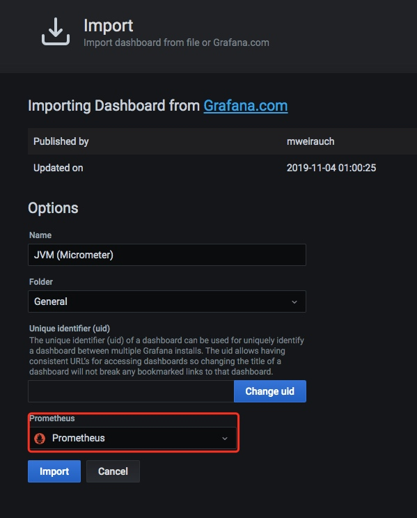

## Prometheus 快速入门教程（六）：Spring Boot Actuator 实现应用监控
摘抄自：https://www.cnblogs.com/chanshuyi/p/06_prometheus_with_springboot_actuator.html


前面的例子中，我们学习的都是 Prometheus 自身的内容，即监控的都是机器或者系统层面的指标。那么如果我们需要对 Java 应用做监控，例如：监控 JVM 的信息，监控 Spring Bean 的信息。那我们应该怎么实现呢？


从这篇文章开始，我们就开始学习如何去监控 Java 应用的状态信息，并且最终实现自定义业务监控指标的监控。


### Spring 监控机制


在学习如何监控 Java 应用之前，我们需要先了解下 SpringBoot 的监控机制。在 Spring 2.x 之前，SpringBoot 使用 Actuator 模块进行监控，而在 Spring 2.x 之后，SpringBoot 使用了 Micrometer 进行监控。


Spring Boot Actuator 模块提供了生产级别的功能，比如健康检查，审计，指标收集，HTTP 跟踪等，帮助我们监控和管理 Spring Boot 应用。这个模块是一个采集应用内部信息暴露给外部的模块，上述的功能都可以通过 HTTP 和 JMX 访问。


在 Spring 2.x 之后，Actuator 使用 Micrometer 与这些外部应用程序监视系统集成。这样一来，只需很少的配置即可轻松集成外部的监控系统。


那什么是 Micrometer 呢？


```go
Micrometer 为 Java 平台上的性能数据收集提供了一个通用的 API，应用程序只需要使用 Micrometer 的通用 API 来收集性能指标即可。Micrometer 会负责完成与不同监控系统的适配工作。这就使得切换监控系统变得很容易。

```


**简单地说，actuator 是真正去采集数据的模块，而 Micrometer 更像是一个适配器，将 actuator 采集到的数据适合给各种监控工具。**


### Spring Actuator 快速入门


接下来我们快速创建一个简单的项目，来让你明白 Spring Boot Actuator 能做什么。


我们到[Spring Initializr](https://start.spring.io/ "Spring Initializr")创建一个名为`spring-web-actuator-demo`的项目，依赖选择：Spring Web、Spring Boot Actuator 即可。


将生成的项目下载下来后打开，查看 pom.xml 文件，可以看到对应的依赖为：


打开项目后，直接运行`SpringWebActuatorDemoApplication.java`文件，正常情况下会使用 8080 端口作为服务端口。


访问[localhost:8080/actuator/health](http://localhost:8080/actuator/health "localhost:8080/actuator/health")查看应用的健康状态，正常情况下会返回 UP 信息。


除了提供最基本的健康检查外，actuator 还提供了许多其他的端点（Endpoints）信息。通过这些端点信息，我们可以掌握 99% 的应用状态信息。


#### 端点暴露配置


不同于 Actuator 1.x，Actuator 2.x 的大多数端点默认被禁掉。所以在查看对应端点之前，我们需要做好配置，否则我们是无法访问对应端点的。


我们可以通过以下配置，来配置通过 JMX 和 HTTP 暴露的端点。


| 属性 | 默认值 |
| -- | -- |
| management.endpoints.jmx.exposure.exclude |  |
| management.endpoints.jmx.exposure.include | * |
| management.endpoints.web.exposure.exclude |  |
| management.endpoints.web.exposure.include | info, health |


我们可以选择打开所有的监控点，例如：


```go
management.endpoints.web.exposure.include=*

```


也可以选择打开部分端点，例如下面的配置打开 beans 和 trace 两个端点。


```go
management.endpoints.web.exposure.exclude=beans,trace

```


Actuator 默认所有的监控点路径都在`/actuator/*`，当然如果有需要这个路径也支持定制。例如下面的配置将前缀改成了 monitor，那么访问路径就变成了`/monitor/*`。


```go
management.endpoints.web.base-path=/minitor

```


这里我们在 application.yml 中加入如下配置，默认打开所有端点。


```go
management.endpoints.web.exposure.include=*

```


接着我们访问地址：[localhost:8080/actuator/metrics](http://localhost:8080/actuator/metrics "localhost:8080/actuator/metrics")，可以看到所有的指标地址。


如果我们要查看`process.uptime`指标，那么我们只需要访问[localhost:8080/actuator/metrics/process.uptime](http://localhost:8080/actuator/metrics/process.uptime "localhost:8080/actuator/metrics/process.uptime")，就可以看到具体的信息。


#### 常用端点介绍


Spring Boot Actuator 提供了 Endpoints（端点）给外部来与应用程序进行访问和交互。


例如`/health`端点提供了关于应用健康情况的一些基础信息。`/metrics`端点提供了一些有用的应用程序指标（JVM 内存使用、系统 CPU 使用等）。


一般来说，端点可以分为几类：


* 应用配置类：获取应用程序中加载的应用配置、环境变量、自动化配置报告等与 Spring Boot 应用密切相关的配置类信息。    
* 度量指标类：获取应用程序运行过程中用于监控的度量指标，比如：内存信息、线程池信息、HTTP 请求统计等。    
* 操作控制类：提供了对应用的关闭等操作类功能。

详细的原生端点介绍，请以官网为准，这里就不赘述徒增篇幅。


##### health端点


`/health`端点会聚合你程序的健康指标，来检查程序的健康情况。端点公开的应用健康信息取决于参数`management.endpoint.health.show-details`，该属性值可选项为：


| 属性值 | 描述 |
| -- | -- |
| never | 不展示详细信息，up 或者 down 的状态，默认配置 |
| when-authorized | 详细信息将会展示给通过认证的用户。授权的角色可以通过management.endpoint.health.roles 配置 |
| always | 对所有用户暴露详细信息 |


配置成 always 之后，启动应用，访问[localhost:8080/actuator/health](http://localhost:8080/actuator/health "localhost:8080/actuator/health")查看应用的健康状态，正常情况下会返回 UP 信息。


在这里我们看到除了 status 状态之外，并没有其他信息。


这是因为我们应用中并没有其他依赖。当你的项目有依赖对应组件的时候，这些健康指示器就会被自动装配，继而采集对应的信息。


现在我们在 pom.xml 文件中增加 redis 依赖：


```go
<dependency>
    <groupId>org.springframework.boot</groupId>
    <artifactId>spring-boot-starter-data-redis</artifactId>
</dependency>

```


接着在 application.yml 中增加如下参数，允许对所有用户暴露详细信息：


```go
management.endpoint.health.show-details=always

```


最终我们再次访问地址：[localhost:8080/actuator/health](http://localhost:8080/actuator/health "localhost:8080/actuator/health")。从图中我们可以看到 redis 的信息了。


我们也可以通过配置禁用某个组件的健康监测。例如下面的配置禁用了 mongodb 的组件健康监测。


```go
management.health.mongo.enabled: false

```


或者我们可以禁用所有自动配置的健康指示器：


```go
management.health.defaults.enabled: false

```


常见的指示器有下面这些：


除了使用自动引入的健康指示器之外，我们也可以自定义一个 Health Indicator，只需要实现 HealthIndicator 接口或者继承 AbstractHealthIndicator 类。


例如下面我们创建了一个 CustomHealthIndicator 类，继承了 AbstractHealthIndicator 类，并返回了一些健康信息。


```go
@Component
public class CustomHealthIndicator extends AbstractHealthIndicator {
    @Override
    protected void doHealthCheck(Health.Builder builder) throws Exception {
        // 使用 builder 来创建健康状态信息
        // 如果你throw 了一个 exception，那么status 就会被置为DOWN，异常信息会被记录下来
        builder.up()
                .withDetail("app", "陈树义向你报告：项目很健康哦！")
                .withDetail("error", "陈树义向你报告：项目有点问题哦！");
    }
}

```


我们重启应用并访问地址：[localhost:8080/actuator/health](http://localhost:8080/actuator/health "localhost:8080/actuator/health")，我们可以看到自定义的健康信息。


##### metrics端点


/metrics 端点用来返回当前应用的各类重要度量指标，比如：内存信息、线程信息、垃圾回收信息、tomcat、数据库连接池等。当我们访问：[localhost:8080/actuator/metrics](http://localhost:8080/actuator/metrics "localhost:8080/actuator/metrics")时，会返回 SpringBoot Actuator 的所有可查看端点信息。


```go
{
	"names": [
		"http.server.requests",
		"jvm.buffer.count",
		"jvm.buffer.memory.used",
		"jvm.buffer.total.capacity",
		"jvm.classes.loaded",
		"jvm.classes.unloaded",
		"jvm.gc.live.data.size",
		"jvm.gc.max.data.size",
		"jvm.gc.memory.allocated",
		"jvm.gc.memory.promoted",
		"jvm.gc.pause",
		"jvm.memory.committed",
		"jvm.memory.max",
		"jvm.memory.used",
		"jvm.threads.daemon",
		"jvm.threads.live",
		"jvm.threads.peak",
		"jvm.threads.states",
		"logback.events",
		"process.cpu.usage",
		"process.files.max",
		"process.files.open",
		"process.start.time",
		"process.uptime",
		"system.cpu.count",
		"system.cpu.usage",
		"system.load.average.1m",
		"tomcat.sessions.active.current",
		"tomcat.sessions.active.max",
		"tomcat.sessions.alive.max",
		"tomcat.sessions.created",
		"tomcat.sessions.expired",
		"tomcat.sessions.rejected"
	]
}

```


我们可以进一步使用如下格式的 URL 访问到对应的信息：


```go
http://localhost:8080/actuator/metrics/{MetricName}

```


例如我想访问`system.cpu.count`这个指标，那么我访问这个链接即可：[localhost:8080/actuator/metrics/system.cpu.count](http://localhost:8080/actuator/metrics/system.cpu.count "localhost:8080/actuator/metrics/system.cpu.count")，返回值为：


```go
{
	"name": "system.cpu.count",
	"description": "The number of processors available to the Java virtual machine",
	"baseUnit": null,
	"measurements": [{
		"statistic": "VALUE",
		"value": 4.0
	}],
	"availableTags": []
}

```


##### loggers端点


/loggers 端点暴露了我们程序内部配置的所有 logger 的信息，我们访问这个链接就可以看到：[localhost:8080/actuator/loggers](http://localhost:8080/actuator/loggers "localhost:8080/actuator/loggers")。


我们也可以通过下述方式访问某一个 logger


```go
http://localhost:8080/actuator/loggers/{name}

```


例如我想访问 Root Logger，就可以访问这个链接：[localhost:8080/actuator/loggers/ROOT](http://localhost:8080/actuator/loggers/ROOT "localhost:8080/actuator/loggers/ROOT")，返回信息如下：


```go
{
	"configuredLevel": "INFO",
	"effectiveLevel": "INFO"
}

```


##### info端点


`/info`端点可以用来查看配置文件`application.properties`中 info 节点下的配置信息，默认情况下`application.properties`中并没有 info 节点配置，所以当我们访问[localhost:8080/actuator/info](http://localhost:8080/actuator/info "localhost:8080/actuator/info")时会访问空 JSON 串。


接下来我们在`application.properties`中增加了如下配置：


```go
info.app.name=actuator-test-demo
info.app.encoding=UTF-8
info.app.java.source=1.8
info.app.java.target=1.8

```


再次访问[localhost:8080/actuator/info](http://localhost:8080/actuator/info "localhost:8080/actuator/info")会返回 info 节点的信息：


要注意，info 端点只会返回 info 节点下的信息，而不会返回其他节点下的信息。例如我在配置文件中添加如下配置：


```go
student.name=ronald

```


这时候通过 info 端点是访问不到该配置信息的。


##### beans端点


`/beans`端点会返回 Spring 容器中所有 bean 的别名、类型、是否单例、依赖等信息。


当我们访问[localhost:8080/actuator/beans](http://localhost:8080/actuator/beans "localhost:8080/actuator/beans")时，会返回如下信息：


##### heapdump端点


访问[http://localhost:8080/actuator/heapdump](http://localhost:8080/actuator/heapdump "http://localhost:8080/actuator/heapdump")会自动生成一个 JVM 的堆文件 heapdump。


我们可以使用 JDK 自带的 JVM 监控工具 VisualVM 打开此文件查看内存快照。


##### threaddump端点


访问[localhost:8080/actuator/threaddump](http://localhost:8080/actuator/threaddump "localhost:8080/actuator/threaddump")会返回应用的线程信息，包括线程名、线程 ID、线程的状态、是否等待锁资源、线程堆栈等信息。


##### shutdown端点


这个端点属于操作控制类端点，可以优雅关闭 Spring Boot 应用。要使用这个功能首先需要在配置文件中开启：


```go
management.endpoint.shutdown.enabled=true

```


由于 shutdown 接口默认只支持 POST 请求，我们启动 Demo 项目，向[http://localhost:8080/actuator/shutdown](http://localhost:8080/actuator/shutdown "http://localhost:8080/actuator/shutdown")发起 POST 请求。


远程操作相对来说比较危险，所以一般在线上都不会开启这个端点。


### 使用 Prometheus + Grafana 实现监控


上面我们用 actuator 暴露应用本身的线程、bean 等信息，但是这些信息还是独立于 Prometheus 之外的。下面我们将介绍如何将 SpringBoot Actuator 与 Prometheus 结合起来。


我们同样从[Spring Initializr](https://start.spring.io/ "Spring Initializr")创建一个名为 spring-web-prometheus-demo 的项目，选取的依赖包括：


* Spring Web    
* Spring Boot Actuator    
* Prometheus


其实和上面的项目的区别是多了一个 Prometheus 包。


```go
<dependency>
    <groupId>io.micrometer</groupId>
    <artifactId>micrometer-registry-prometheus</artifactId>
    <scope>runtime</scope>
</dependency>

```


项目打开后，在`application.properties`中加入如下配置，打开相关的端口。


```go
management.endpoint.metrics.enabled=true
management.endpoints.web.exposure.include=*
management.endpoint.prometheus.enabled=true
management.metrics.export.prometheus.enabled=true

```


接着启动项目，访问[localhost:8080/actuator/prometheus](http://localhost:8080/actuator/prometheus "localhost:8080/actuator/prometheus")可以看到 SpringBoot 的应用信息都以 Prometheus 的标准形式输出了。


下面我们使用[Grafana官网 - Dashboards 模块](https://grafana.com/grafana/dashboards "Grafana官网 - Dashboards 模块")中的「JVM（Micrometer）」图表模板来展示应用的各项指标。点击[JVM (Micrometer) dashboard for Grafana | Grafana Labs](https://grafana.com/grafana/dashboards/4701 "JVM (Micrometer) dashboard for Grafana | Grafana Labs")可以获取到 dashboard 的 ID 为：4701。


接着我们在 Grafana 页面点击「Import」菜单进入导入设置页面。


我们进入「Import」页面，填入模板的 ID，并点击「Load」按钮。


系统会自动读取模板 ID 对应的信息并显示在页面上。你需要选择模板的数据源，这里我选择了「Prometheus」数据源，也就是本文应用所在的数据源。





设置完毕后点击「Import」按钮，则进入到看板页面。


从看板我们可以看到许多信息，例如：应用启动持续时间、应用启动时间、堆的使用率、CPU 使用率等信息。


### 总结


通过这篇文章，我们了解到 Spring 是利用 Spring Boot Actuator 进行监控指标收集的。与此同时，我们用一个极简单的例子讲解了如何进行应用监控。接着，我们讲解了 Spring Boot Actuator 的端点暴露配置以及常见的端点信息。最后，我们使用一个 Grafana 的模板将这些信息都展示在 Grafana 面板上。


看到这里，我们已经掌握了 Prometheus 监控的 80% 内容了。但是如果我们有一些业务指标需要监控，我们应该如何实现呢？这将是下一篇文章将要讲解的内容，敬请期待！


### 参考资料


* [Spring Boot Actuator: Production-ready Features](https://docs.spring.io/spring-boot/docs/current/reference/html/production-ready-features.html#production-ready-endpoints "Spring Boot Actuator: Production-ready Features")    
* [Spring Boot Actuator 模块 详解：健康检查，度量，指标收集和监控 | Richard Code Studio](https://ricstudio.top/archives/spring_boot_actuator_learn "Spring Boot Actuator 模块 详解：健康检查，度量，指标收集和监控 | Richard Code Studio")    
* [Spring Boot 微服务应用集成 Prometheus + Grafana 实现监控告警 - 掘金](https://juejin.im/post/5e27acf6e51d4557ea363a65 "Spring Boot 微服务应用集成 Prometheus + Grafana 实现监控告警 - 掘金")


