## Prometheus 快速入门教程（七）：SpringBoot 实现自定义指标监控
摘抄自：https://www.cnblogs.com/chanshuyi/p/07_springboot_custom_index_monitor.html


上篇文章我们已经可以在 Grafana 上看到对应的 SpringBoot 应用信息了，通过这些信息我们可以对 SpringBoot 应用有更全面的监控。但是如果我们需要对一些业务指标做监控，我们应该怎么做呢？这篇文章就带你一步步实现一个模拟的订单业务指标监控。


假设我们有一个订单系统，我们需要监控它的实时订单总额、10分钟内的下单失败率、请求失败数。那么我们应该怎么做呢？


### 添加业务监控指标


在 spring-web-prometheus-demo 项目的基础上，我们添加一个 PrometheusCustomMonitor 类。在这里面我们定义了三个业务指标：


* order_request_count：下单总次数    
* order_amount_sum：下单总金额


```java
@Component
public class PrometheusCustomMonitor {

    /**
     * 订单发起次数
     */
    private Counter orderCount;

    /**
     * 金额统计
     */
    private DistributionSummary amountSum;

    private final MeterRegistry registry;

    @Autowired
    public PrometheusCustomMonitor(MeterRegistry registry) {
        this.registry = registry;
    }

    @PostConstruct
    private void init() {
        orderCount = registry.counter("order_request_count", "order", "test-svc");
        amountSum = registry.summary("order_amount_sum", "orderAmount", "test-svc");
    }

    public Counter getOrderCount() {
        return orderCount;
    }

    public DistributionSummary getAmountSum() {
        return amountSum;
    }
}

```


### 模拟订单数据


这里我们新增一个 TestController 类，去模拟现实的订单数据。


后续应用启动后，我们可以通过[localhost:8080/order](http://localhost:8080/order "localhost:8080/order")去模拟用户下单操作。


```java
package com.chenshuyi.springwebprometheusdemo;

import org.springframework.web.bind.annotation.RequestMapping;
import org.springframework.web.bind.annotation.RequestParam;
import org.springframework.web.bind.annotation.RestController;

import javax.annotation.Resource;
import java.util.Random;

@RestController
public class TestController {

    @Resource
    private PrometheusCustomMonitor monitor;

    @RequestMapping("/order")
    public String order() throws Exception {
        // 统计下单次数
        monitor.getOrderCount().increment();
        Random random = new Random();
        int amount = random.nextInt(100);
        // 统计金额
        monitor.getAmountSum().record(amount);
        return "下单成功, 金额: " + amount;
    }
}

```


实际项目中，我们一般使用 AOP 的方式去实现业务指标上报。这里为了简单，直接写在代码里了。


### 启动项目测试


现在我们启动应用，访问[localhost:8080/order](http://localhost:8080/order "localhost:8080/order")可以成功模拟下单，每次都会有一个随机的订单金额产生。


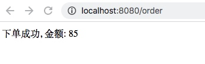


此时我们访问[localhost:8080/actuator/prometheus](http://localhost:8080/actuator/prometheus "localhost:8080/actuator/prometheus")就可以看到对应的指标已经存在。


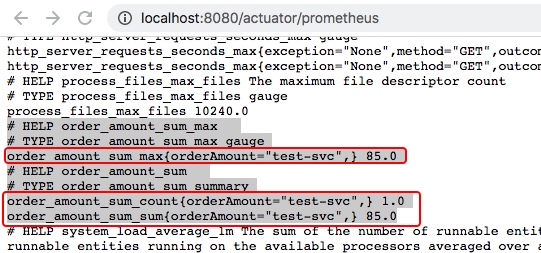


后续我们在 Grafana 中配置好相应的图表就可以看到对应的业务指标变化了。


### 配置Grafana图表


这里我们一共配置四个图表，分别是：


* 订单总数    
* 订单支付总额    
* 订单数增长率    
* 订单支付金额增长率


#### 配置订单个数图表


我们在原有面板上新建一个图表（Panel），名称命名为「订单个数」，来统计所有的订单数量。


在「数据配置区」中数据源选择「Prometheus」，Metrics 填入「order_amount_sum_count」。


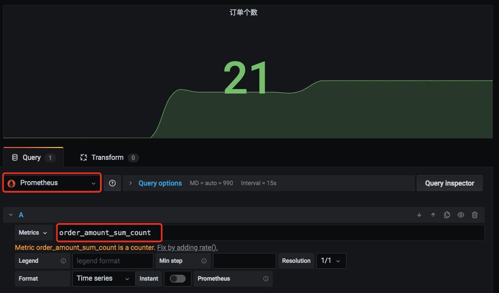


接着在「图表设置区」的「Visualization」中选择「Stat」类别，表示这是一个统计数值。


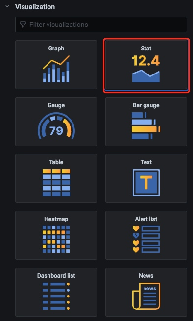


接着在「图表设置区」的「Display」中的 Value 设置为「Last」，表示其值是取最后一个数值（因为这个数值是已经统计好了的）。Fields 设置为「Numeric Fields」，表示其是一个数值字段。


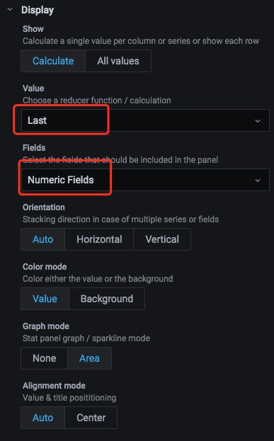


#### 配置订单总额图表


我们同样在原有面板上新建一个图表（Panel），名称命名为「订单金额」，来统计所有订单的支付总金额。


在「数据配置区」中数据源选择「Prometheus」，Metrics 填入「order_amount_sum_sum」。


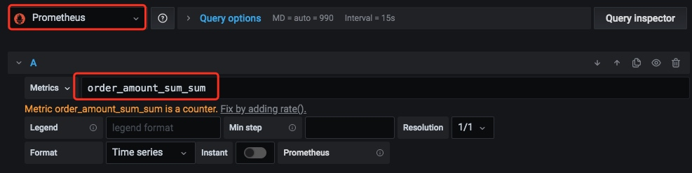


接着在「图表设置区」的「Visualization」中选择「Stat」类别，表示这是一个统计数值。


接着在「图表设置区」的「Display」中的 Value 设置为「Last」，表示其值是取最后一个数值（因为这个数值是已经统计好了的）。Fields 设置为「Numeric Fields」，表示其是一个数值字段。


#### 配置订单增长率


这里我们配置一个订单数的增长率，同样在原有面板上新建一个图表（Panel），名称命名为「订单增长率」，来统计订单数的增长率。


在「数据配置区」中数据源选择「Prometheus」，Metrics 填入「rate(order_amount_sum_count[1m])」，Legend 填入「{{instance}}」。


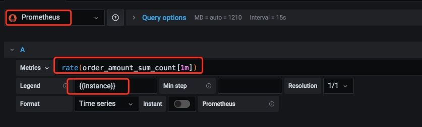


接着在「图表设置区」的「Visualization」中选择「Graph」类别，表示这是一个图形。


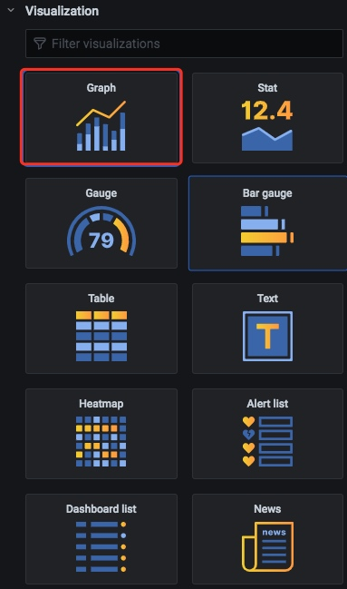


在「图表设置区」的「Axes」中设置「Left Y」的「Unit」设置其单位为：percent(0.0-1.0)。


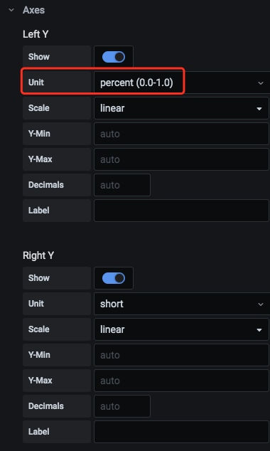


#### 配置订单金额增长率


与配置订单增长率相似，只不过这里的 Metrics 需要填入「rate(order_amount_sum_sum[1m])」。


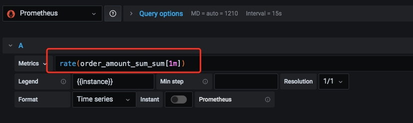


在「图表设置区」的「Axes」中设置「Left Y」的「Unit」设置其单位为：percent(0-100)。


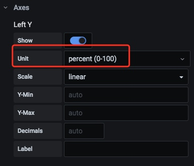


设置完之后的监控界面如下图所示：


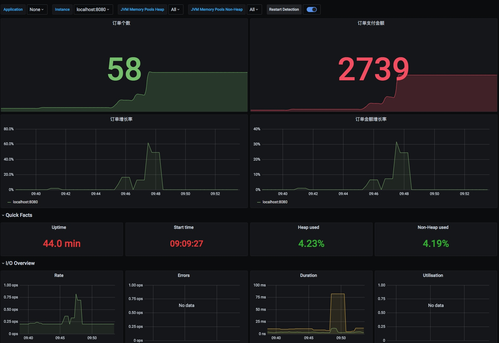


接下来我们模拟一下订单的增长，访问下[localhost:8080/order](http://localhost:8080/order "localhost:8080/order")模拟下单。多访问几次，以便看到更明显的增长效果。


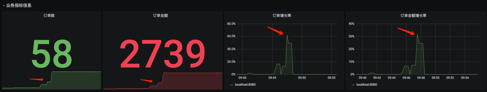


我们可以看到各项指标都有明显的变化，这说明我们的监控生效了！

### 总结


我们通过一个简单的订单业务，模拟了实际的订单数、订单金额变化情况。接着，我们通过配置订单总数、订单总金额、订单数增长率、订单金额增长率这几个图表来实现自定义指标的监控。


实现自定义指标监控，有利于我们监控关键的业务指标，从而在线上问题发生之前提前预支问题，最终减少线上问题带来的损失。


