## Node Exporter 常用监控指标详解与实践
https://blog.csdn.net/qq_34556414/article/details/123443187


### 常用监控指标

本节我们来了解一些关于节点监控的常用指标，比如 CPU、内存、IO 监控等。


#### CPU 监控


对于节点我们首先能想到的就是要先对 CPU 进行监控，因为 CPU 是处理任务的核心，根据 CPU 的状态可以分析出当前系统的健康状态。要对节点进行 CPU 监控，需要用到`node_cpu_seconds_total`这个监控指标，在 metrics 接口中该指标内容如下所示：


cpu在每种模式下花费的时间


```sh
# HELP node_cpu_seconds_total Seconds the CPUs spent in each mode.
# TYPE node_cpu_seconds_total counter
node_cpu_seconds_total{cpu="0",mode="idle"} 13172.76
node_cpu_seconds_total{cpu="0",mode="iowait"} 0.25
node_cpu_seconds_total{cpu="0",mode="irq"} 0
node_cpu_seconds_total{cpu="0",mode="nice"} 0.01
node_cpu_seconds_total{cpu="0",mode="softirq"} 87.99
node_cpu_seconds_total{cpu="0",mode="steal"} 0
node_cpu_seconds_total{cpu="0",mode="system"} 309.38
node_cpu_seconds_total{cpu="0",mode="user"} 79.93
node_cpu_seconds_total{cpu="1",mode="idle"} 13168.98
..............................................................
```


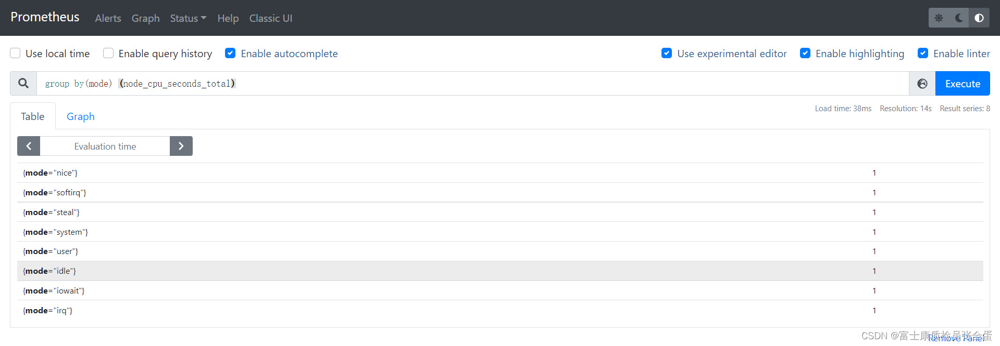从接口中描述可以看出该指标是用来统计 CPU 每种模式下所花费的时间，**是一个 Counter 类型的指标，也就是会一直增长，这个数值其实是 CPU 时间片的一个累积值，意思就是从操作系统启动起来 CPU 开始工作，就开始记录自己总共使用的时间，然后保存下来**，而且这里的累积的**CPU 使用时间还会分成几个不同的模式，**比如用户态使用时间、空闲时间、中断时间、内核态使用时间等等，也就是平时我们使用 top 命令查看的 CPU 的相关信息，而我们这里的这个指标会分别对这些模式进行记录。


接下来我们来对节点的 CPU 进行监控，我们也知道一个一直增长的 CPU 时间对我们意义不大，一般我们更希望监控的是节点的 CPU 使用率，也就是我们使用 top 命令看到的百分比。


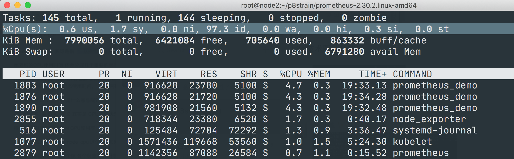


要计算 CPU 的使用率，那么就需要搞清楚这个使用率的含义，**CPU 使用率是 CPU 除空闲（idle）状态之外的其他所有 CPU 状态的时间总和除以总的 CPU 时间得到的结果**，理解了这个概念后就可以写出正确的 promql 查询语句了。


要计算除空闲状态之外的 CPU 时间总和，**更好的方式是不是直接计算空闲状态的 CPU 时间使用率，然后用 1 减掉就是我们想要的结果了，**所以首先我们先过滤`idle`模式的指标，在[Prometheus](https://so.csdn.net/so/search?q=Prometheus&spm=1001.2101.3001.7020 "Prometheus")的 WebUI 中输入`node_cpu_seconds_total{mode="idle"}`进行过滤：(increase其实就是第一个样本和最后一个样本之间的差值)


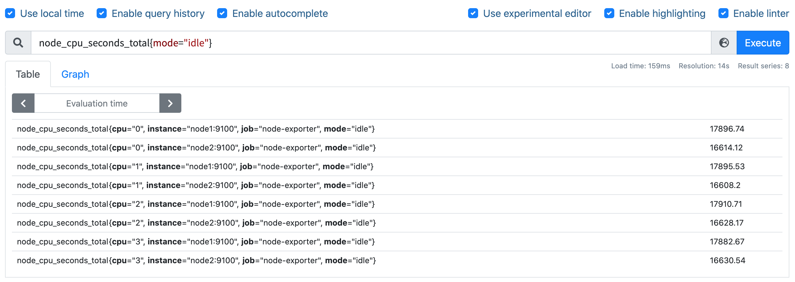


要计算使用率，肯定就需要知道`idle`模式的 CPU 用了多长时间，然后和总的进行对比，由于这是 Counter 指标，我们可以用`increase`函数来获取变化，使用查询语句`increase(node_cpu_seconds_total{mode="idle"}[1m])`，因为`increase`函数要求输入一个区间向量，所以这里我们取 1 分钟内的数据：


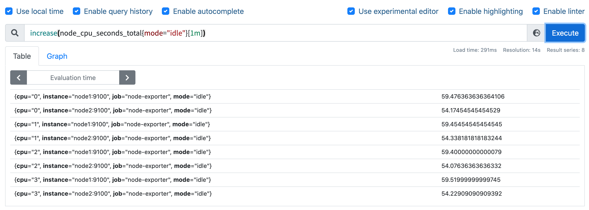


我们可以看到查询结果中有很多不同 cpu 序号的数据，我们当然需要计算所有 CPU 的时间，所以我们将它们聚合起来，我们要查询的是不同节点的 CPU 使用率，所以就需要根据`instance`标签进行聚合，使用查询语句`sum(increase(node_cpu_seconds_total{mode="idle"}[1m])) by (instance)`：(一分钟空闲CPU使用的时长)


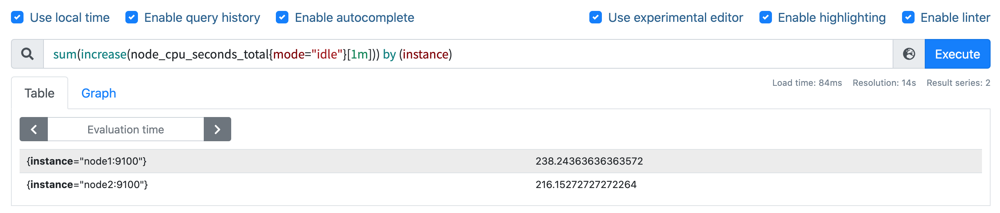


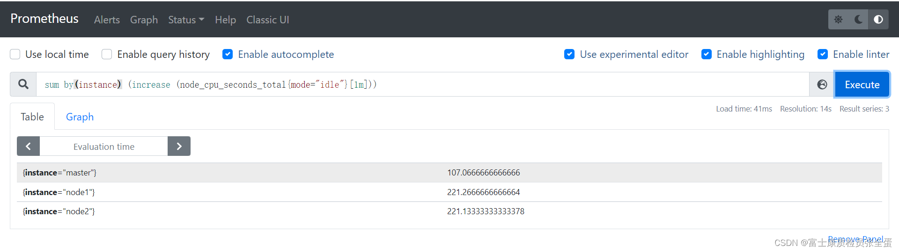这样我们就分别拿到不同节点 1 分钟内的空闲 CPU 使用时间了，然后和总的 CPU （这个时候不需要过滤状态模式）时间进行比较即可，使用查询语句`sum(increase(node_cpu_seconds_total{mode="idle"}[1m])) by (instance) / sum(increase(node_cpu_seconds_total[1m])) by (instance)`：


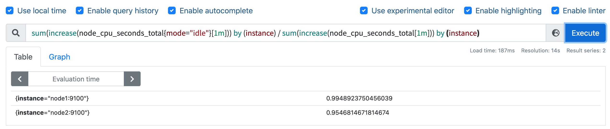


然后计算 CPU 使用率就非常简单了，使用 1 减去乘以 100 即可：`(1 - sum(increase(node_cpu_seconds_total{mode="idle"}[1m])) by (instance) / sum(increase(node_cpu_seconds_total[1m])) by (instance) ) * 100`。这就是能够想到的最直接的 CPU 使用率查询方式了，当然前面我们学习的 promql 语法中提到过更多的时候我们会去使用`rate`函数，而不是用`increase`函数进行计算，所以最终的 CPU 使用率的查询语句为：`(1 - sum(rate(node_cpu_seconds_total{mode="idle"}[1m])) by (instance) / sum(rate(node_cpu_seconds_total[1m])) by (instance) ) * 100`。


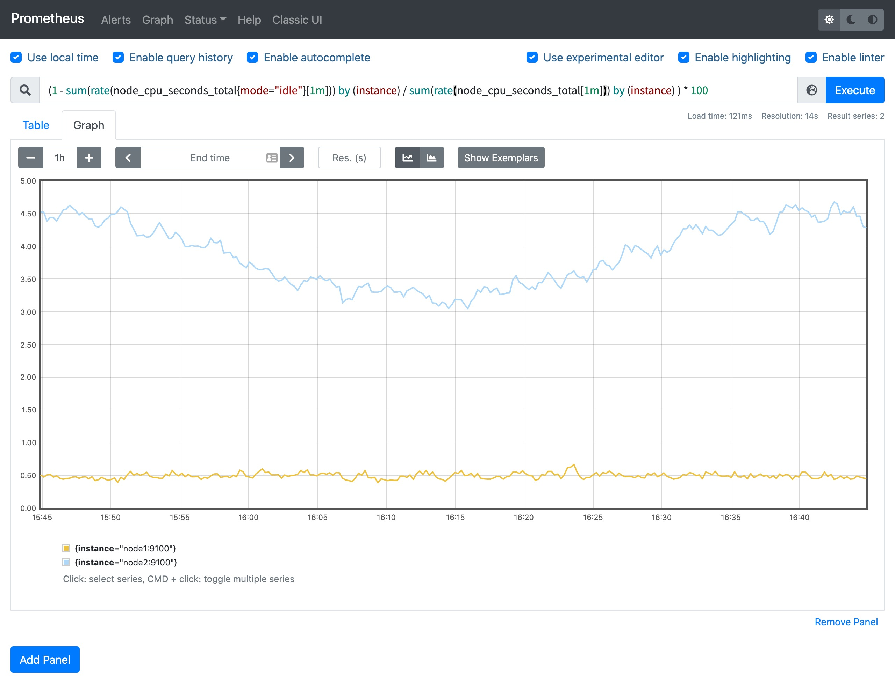


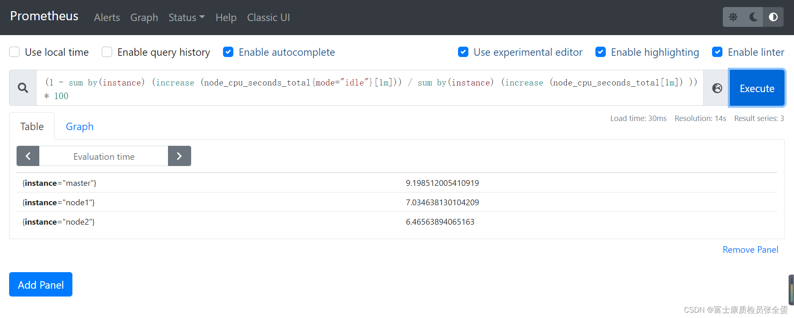


可以和 top 命令的结果进行对比（下图为 node2 节点），基本上是保持一致的，这就是监控节点 CPU 使用率的方式。


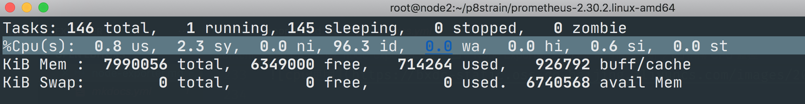


#### 内存监控


除了 CPU 监控之外，我们可能最关心的就是节点内存的监控了，平时我们查看节点的内存使用情况基本上都是使用`free`命令来查看：


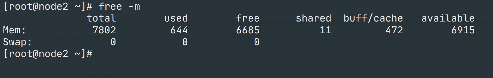


`free`命令的输出会显示系统内存的使用情况，包括物理内存、交换内存(swap)和内核缓冲区内存等，所以要对内存进行监控我们需要先了解这些概念，我们先了解下`free`命令的输出内容：


* `Mem 行`(第二行)是内存的使用情况    
* `Swap 行`(第三行)是交换空间的使用情况    
* `total`列显示系统总的可用物理内存和交换空间大小    
* `used`列显示已经被使用的物理内存和交换空间    
* `free`列显示还有多少物理内存和交换空间可用使用    
* `shared`列显示被共享使用的物理内存大小    
* `buff/cache`列显示被 buffer 和 cache 使用的物理内存大小    
* `available`列显示还可以被应用程序使用的物理内存大小


其中我们需要重点关注的`free`和`available`两列。free 是真正尚未被使用的物理内存数量，而 available 是从应用程序的角度看到的可用内存，Linux 内核为了提升磁盘操作的性能，会消耗一部分内存去缓存磁盘数据，就是 buffer 和 cache，所以对于内核来说，buffer 和 cache 都属于已经被使用的内存，只是应用程序需要内存时，如果没有足够的 free 内存可以用，内核就会从 buffer 和 cache 中回收内存来满足应用程序的请求。所以从应用程序的角度来说`available = free + buffer + cache`，不过需要注意这只是一个理想的计算方式，实际中的数据有较大的误差。


如果要在 Prometheus 中来查询内存使用，则可以用`node_memory_*`相关指标，同样的要计算使用的，我们可以计算可使用的内存，使用 promql 查询语句`node_memory_Buffers_bytes + node_memory_Cached_bytes + node_memory_MemFree_bytes`。


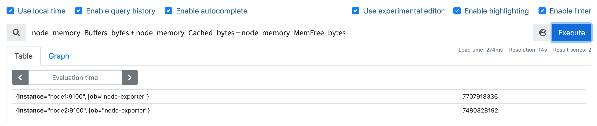


然后计算可用内存的使用率，和总的内存相除，然后同样用 1 减去即可，语句为`(1- (node_memory_Buffers_bytes + node_memory_Cached_bytes + node_memory_MemFree_bytes) / node_memory_MemTotal_bytes) * 100`，这样计算出来的就是节点内存使用率。


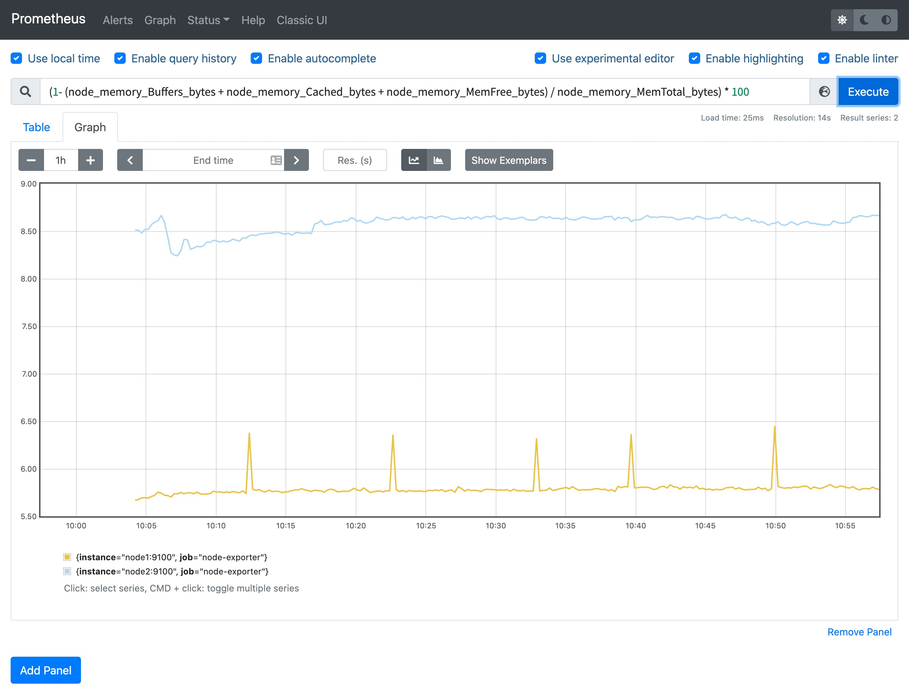


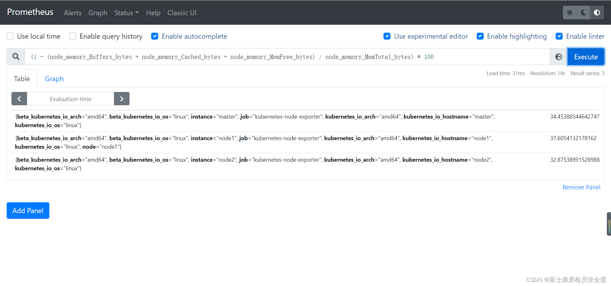当然如果想要查看各项内存使用直接使用对应的监控指标即可，比如要查看节点总内存，直接使用`node_memory_MemTotal_bytes`指标即可获取。


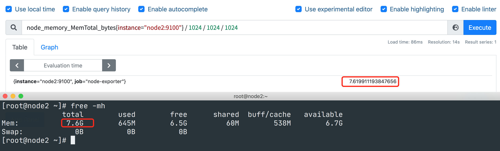


#### 磁盘监控


接下来是比较中的磁盘监控，对于磁盘监控我们不仅对磁盘使用情况感兴趣，一般来说对于磁盘 IO 的监控也是非常有必要的。


**磁盘容量监控**


要监控磁盘容量，需要用到`node_filesystem_*`相关的指标，比如要查询节点磁盘空间使用率，则可以同样用总的减去可用的来进行计算，磁盘可用空间使用`node_filesystem_avail_bytes`指标，但是由于会有一些我们不关心的磁盘信息，所以我们可以使用`fstype`标签过滤关心的磁盘信息，比如`ext4`或者`xfs`格式的磁盘(过滤一下，得到自己想要的文件系统)：


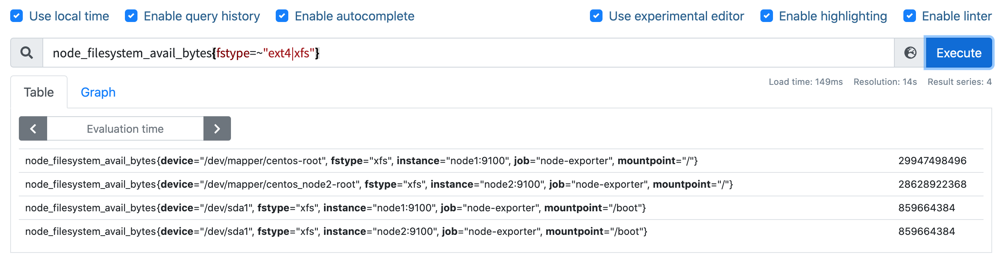


要查询磁盘空间使用率，则使用查询语句`(1 - node_filesystem_avail_bytes{fstype=~"ext4|xfs"} / node_filesystem_size_bytes{fstype=~"ext4|xfs"}) * 100`即可：


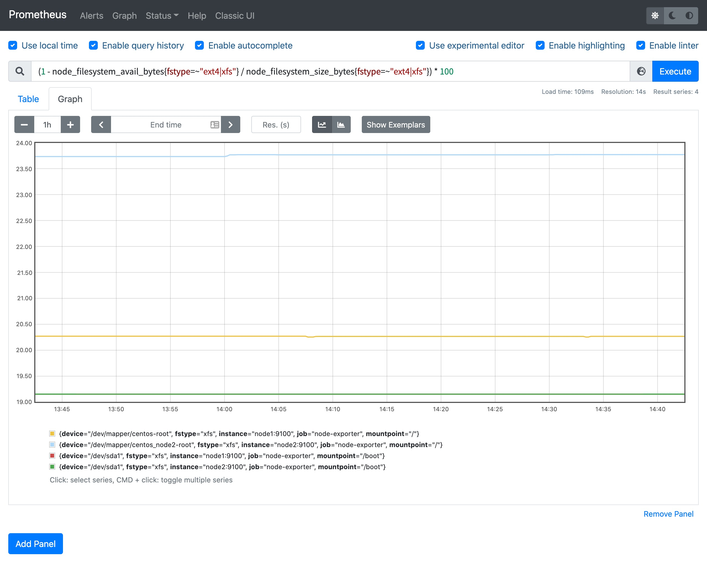


这样就可以得到我们关心的磁盘空间使用率了。


**磁盘 IO 监控**


**要监控磁盘 IO，就要区分是读的 IO，还是写的 IO，**读 IO 使用`node_disk_reads_completed`指标，写 IO 使用`node_disk_writes_completed_total`指标。


磁盘读 IO 使用`sum by (instance) (rate(node_disk_reads_completed_total[5m]))`查询语句即可：


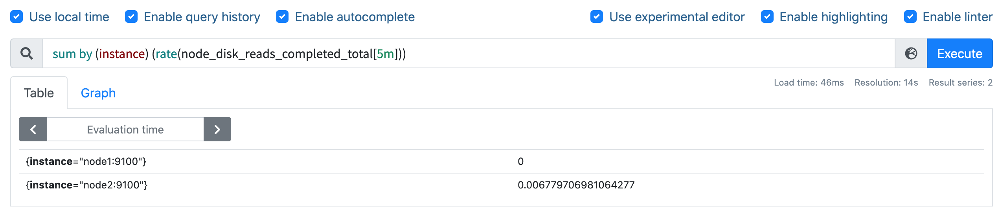


当然如果你想根据`device`进行聚合也是可以的，我们这里是全部聚合在一起了。


磁盘写 IO 使用`sum by (instance) (rate(node_disk_writes_completed_total[5m]))`查询语句即可：


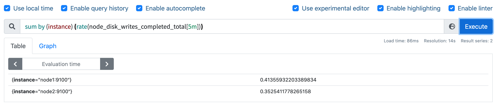


如果要计算总的读写 IO，则加起来即可 `rate(node_disk_reads_completed_total[5m]) + rate(node_disk_writes_completed_total[5m])


#### 网络 IO 监控


上行带宽需要用到的指标是`node_network_receive_bytes`，由于我们对网络带宽的**瞬时变化**比较关注，所以一般我们会使用`irate`函数来计算网络 IO，比如计算上行带宽用查询语句`sum by(instance) (irate(node_network_receive_bytes_total{device!~"bond.*?|lo"}[5m]))`即可：(这样就能够反应网络的峰值变化)


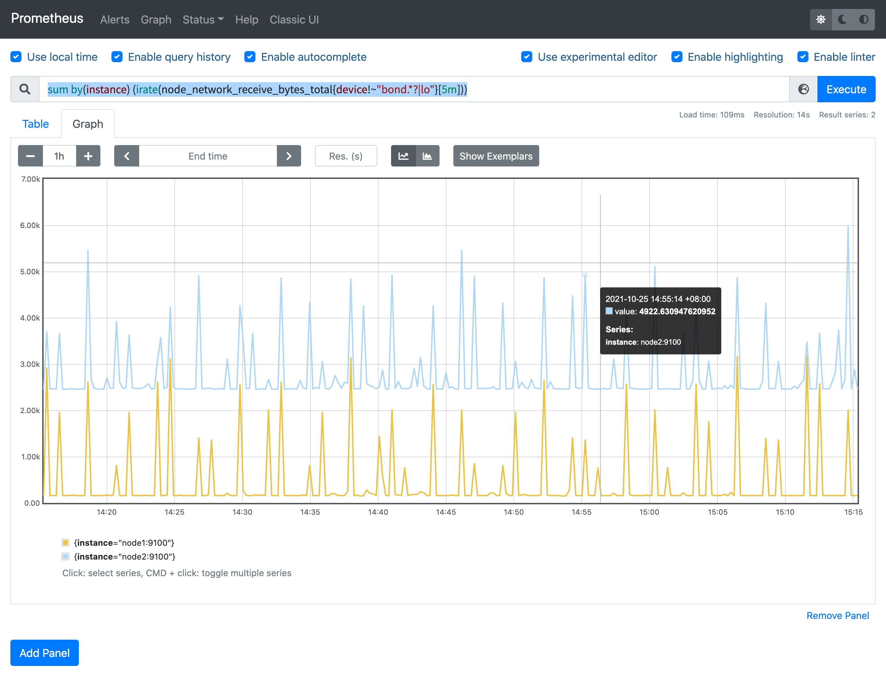


下行带宽用到的指标为`node_network_transmit_bytes`，同样的方式查询语句为`sum by(instance) (irate(node_network_transmit_bytes{device!~"bond.*?|lo"}[5m]))`：


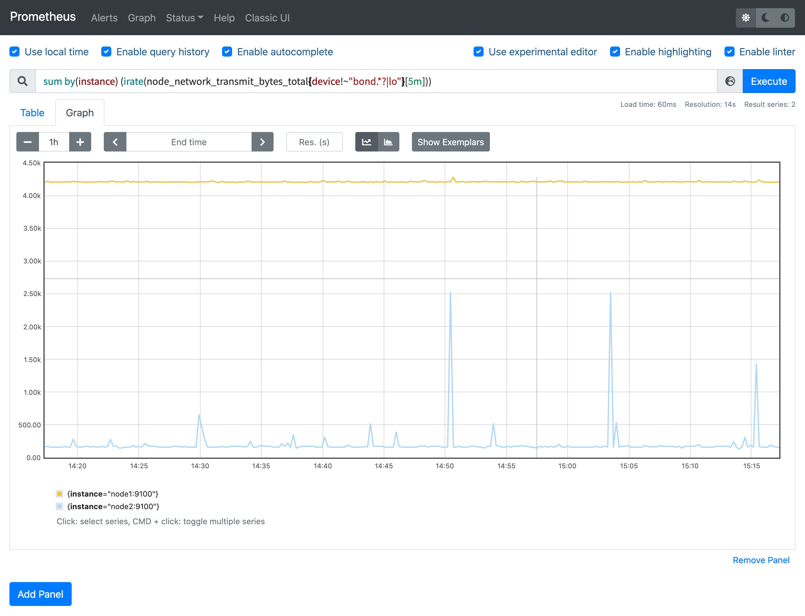


当然我们还可以根据网卡设备进行分别聚合计算，最后还可以根据自己的需求将结果进行单位换算。

