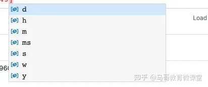
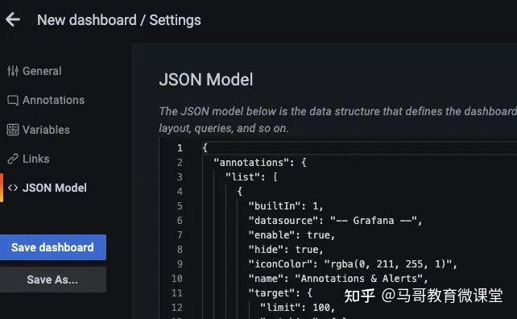

## 一文带你了解 Prometheus
https://zhuanlan.zhihu.com/p/513657268


> 作者：kevinkrcai，腾讯 IEG 后台开发工程师
Prometheus 是一个开源的完整监控解决方案，本文将从指标抓取到查询及可视化展示，以及最后的监控告警，对 Prometheus 做一个基本的认识。

### 1. 简介

下面就是我们 CRUD Boy 所了解的 Prometheus，下面是其官网封面图引导语：From metrics to insight，从指标到洞察力，通过指标去洞察你的系统，为我们的系统提供指标收集和监控的开源解决方案。也就是说，Prometheus 是一个数据监控的解决方案，让我们能随时掌握系统运行的状态，快速定位问题和排除故障。


Prometheus 发展速度很快，12 年开发完成，16 年加入 CNCF，成为继 K8s 之后第二个 CNCF 托管的项目，目前 Github 42k 的  ，而且社区很活跃，维护频率很高，基本稳定在 1 个月 1 个小版本的迭代速度。


### 2. 整体生态

Prometheus 提供了从指标暴露，到指标抓取、存储和可视化，以及最后的监控告警等一系列组件。


#### 2.1 指标暴露

每一个被 Prometheus 监控的服务都是一个 Job，Prometheus 为这些 Job 提供了官方的 SDK ，利用这个 SDK 可以自定义并导出自己的业务指标，也可以使用 Prometheus 官方提供的各种常用组件和中间件的 Exporter（比如常用的 MySQL，Consul 等等）。对于短时间执行的脚本任务或者不好直接 Pull 指标的服务，Prometheus 提供了 PushGateWay 网关给这些任务将服务指标主动推 Push 到网关，Prometheus 再从这个网关里 Pull 指标。

#### 2.2 指标抓取

上面提到了 Push 和 Pull，其实这是两种指标抓取模型。

* Pull 模型：监控服务主动拉取被监控服务的指标


被监控服务一般通过主动暴露 metrics 端口或者通过 Exporter 的方式暴露指标，监控服务依赖服务发现模块发现被监控服务，从而去定期的抓取指标。

* Push 模型：被监控服务主动将指标推送到监控服务，可能需要对指标做协议适配，必须得符合监控服务要求的指标格式


对于 Prometheus 中的指标抓取，采用的是 Pull 模型，默认是一分钟去拉取一次指标，通过 Prometheus.yaml 配置文件中的 scrape_interval 配置项配置，Prometheus 对外都是用的 Pull 模型，一个是 Pull Exporter 的暴露的指标，一个是 Pull PushGateway 暴露的指标。

#### 2.3 指标存储和查询

指标抓取后会存储在内置的时序数据库中，Prometheus 也提供了 PromQL 查询语言给我们做指标的查询，我们可以在 Prometheus 的 WebUI 上通过 PromQL，可视化查询我们的指标，也可以很方便的接入第三方的可视化工具，例如 grafana。

#### 2.4 监控告警

prometheus 提供了 alertmanageer 基于 promql 来做系统的监控告警，当 promql 查询出来的指标超过我们定义的阈值时，prometheus 会发送一条告警信息到 alertmanager，manager 会将告警下发到配置好的邮箱或者微信。

#### 3. 工作原理

Prometheus 的从被监控服务的注册到指标抓取到指标查询的流程分为五个步骤：


#### 3.1 服务注册

被监控服务在 Prometheus 中是一个 Job 存在，被监控服务的所有实例在 Prometheus 中是一个 target 的存在，所以被监控服务的注册就是在 Prometheus 中注册一个 Job 和其所有的 target，这个注册分为：

* 静态注册    
* 动态注册

静态注册：静态的将服务的 IP 和抓取指标的端口号配置在 Prometheus yaml 文件的 scrape_configs 配置下:


```sh
scrape_configs:
 - job_name: "prometheus"
   static_configs:
   - targets: ["localhost:9090"]

```

以上就是注册了一个名为 prometheus 的服务，这个服务下有一个实例，暴露的抓取地址是 localhost:9090。

动态注册：动态注册就是在 Prometheus yaml 文件的 scrape_configs 配置下配置服务发现的地址和服务名，Prometheus 会去该地址，根据你提供的服务名动态发现实例列表，在 Prometheus 中，支持 consul，DNS，文件，K8s 等多种服务发现机制。

基于 consul 的服务发现：


```sh
 - job_name: "node_export_consul"
  metrics_path: /node_metrics
  scheme: http
  consul_sd_configs:
   - server: localhost:8500
     services:
     - node_exporter

```

我们 consul 的地址就是：localhost:8500，服务名是 node_exporter，在这个服务下有一个 exporter 实例：localhost:9600。


注意：如果是动态注册，最好加上这两配置，静态注册指标拉取的路径会默认的帮我们指定为 metrics_path:/metrics，所以如果暴露的指标抓取路径不同或者是动态的服务注册，最好加上这两个配置。不然会报错“INVALID“ is not a valid start token，演示下，百度了一下，这里可能是数据格式不统一导致。


```sh
metrics_path: /node_metrics
scheme: http

```

最后可以在 webUI 中查看发现的实例：


目前，Prometheus 支持多达二十多种服务发现协议：


```sh
<azure_sd_config>
<consul_sd_config>
<digitalocean_sd_config>
<docker_sd_config>
<dockerswarm_sd_config>
<dns_sd_config>
<ec2_sd_config>
<openstack_sd_config>
<file_sd_config>
<gce_sd_config>
<hetzner_sd_config>
<http_sd_config>
<kubernetes_sd_config>
<kuma_sd_config>
<lightsail_sd_config>
<linode_sd_config>
<marathon_sd_config>
<nerve_sd_config>
<serverset_sd_config>
<triton_sd_config>
<eureka_sd_config>
<scaleway_sd_config>
<static_config>

```

#### 3.2 配置更新

在更新完 Prometheus 的配置文件后，我们需要更新我们的配置到程序内存里，这里的更新方式有两种，第一种简单粗暴，就是重启 Prometheus，第二种是动态更新的方式。如何实现动态的更新 Prometheus 配置。

第一步：首先要保证启动 Prometheus 的时候带上启动参数：--web.enable-lifecycle


```sh
prometheus --config.file=/usr/local/etc/prometheus.yml --web.enable-lifecycle

```

第二步：去更新我们的 Prometheus 配置:

第三步：更新完配置后，我们可以通过 Post 请求的方式，动态更新配置：


```sh
curl -v --request POST 'http://localhost:9090/-/reload'

```

原理：

Prometheus 在 web 模块中，注册了一个 handler：


```sh
if o.EnableLifecycle {
  router.Post("/-/quit", h.quit)
  router.Put("/-/quit", h.quit)
  router.Post("/-/reload", h.reload) // reload配置
  router.Put("/-/reload", h.reload)
}

```

通过 h.reload 这个 handler 方法实现：这个 handler 就是往一个 channle 中发送一个信号：


```sh
func (h *Handler) reload(w http.ResponseWriter, r *http.Request) {
  rc := make(chan error)
  h.reloadCh <- rc  // 发送一个信号到channe了中
  if err := <-rc; err != nil {
   http.Error(w, fmt.Sprintf("failed to reload config: %s", err), http.StatusInternalServerError)
  }
}

```

在 main 函数中会去监听这个 channel，只要有监听到信号，就会做配置的 reload，重新将新配置加载到内存中：


```sh
case rc := <-webHandler.Reload():
  if err := reloadConfig(cfg.configFile, cfg.enableExpandExternalLabels, cfg.tsdb.EnableExemplarStorage, logger, noStepSubqueryInterval, reloaders...); err != nil {
   level.Error(logger).Log("msg", "Error reloading config", "err", err)
   rc <- err
  } else {
   rc <- nil
  }

```

#### 3.3 指标抓取和存储

Prometheus 对指标的抓取采取主动 Pull 的方式，即周期性的请求被监控服务暴露的 metrics 接口或者是 PushGateway，从而获取到 Metrics 指标，默认时间是 15s 抓取一次，配置项如下：


```sh
global:
 scrape_interval: 15s

```

抓取到的指标会被以时间序列的形式保存在内存中，并且定时刷到磁盘上，默认是两个小时回刷一次。并且为了防止 Prometheus 发生崩溃或重启时能够恢复数据，Prometheus 也提供了类似 MySQL 中 binlog 一样的预写日志，当 Prometheus 崩溃重启时，会读这个预写日志来恢复数据。

### 4. Metric 指标

#### 4.1 数据模型


Prometheus 采集的所有指标都是以时间序列的形式进行存储，每一个时间序列有三部分组成：

* 指标名和指标标签集合：metric_name{    
* 时间戳：描述当前时间序列的时间，单位：毫秒。    
* 样本值：当前监控指标的具体数值，比如 http_request_total 的值就是请求数是多少。

可以通过查看 Prometheus 的 metrics 接口查看所有上报的指标：


所有的指标也都是通过如下所示的格式来标识的：


```sh
# HELP  // HELP：这里描述的指标的信息，表示这个是一个什么指标，统计什么的
# TYPE  // TYPE：这个指标是什么类型的
<metric name>{<label name>=<label value>, ...} value  // 指标的具体格式，<指标名>{标签集合} 指标值

```

#### 4.2 指标类型

Prometheus 底层存储上其实并没有对指标做类型的区分，都是以时间序列的形式存储，但是为了方便用户的使用和理解不同监控指标之间的差异，Prometheus 定义了 4 种不同的指标类型：计数器 counter，仪表盘 gauge，直方图 histogram，摘要 summary。


Counter 计数器：

Counter 类型和 redis 的自增命令一样，只增不减，通过 Counter 指标可以统计 Http 请求数量，请求错误数，接口调用次数等单调递增的数据。同时可以结合 increase 和 rate 等函数统计变化速率，后续我们会提到这些内置函数。


Gauge 仪表盘：

和 Counter 不同，Gauge 是可增可减的，可以反映一些动态变化的数据，例如当前内存占用，CPU 利用，Gc 次数等动态可上升可下降的数据，在 Prometheus 上通过 Gauge，可以不用经过内置函数直观的反映数据的变化情况，如下图表示堆可分配的空间大小：


上面两种是数值指标，代表数据的变化情况，Histogram 和 Summary 是统计类型的指标，表示数据的分布情况。

Histogram 直方图：

Histogram 是一种直方图类型，可以观察到指标在各个不同的区间范围的分布情况，如下图所示：可以观察到请求耗时在各个桶的分布。


有一点要注意的是，Histogram 是累计直方图，即每一个桶的是只有上区间，例如下图表示小于 0.1 毫秒（le="0.1"）的请求数量是 18173 个，小于 0.2 毫秒（le="0.2")的请求是 18182 个，在 le="0.2"这个桶中是包含了 le="0.1"这个桶的数据，如果我们要拿到 0.1 毫秒到 0.2 毫秒的请求数量，可以通过两个桶想减得到。


在直方图中，还可以通过 histogram_quantile 函数求出百分位数，比如 P50，P90，P99 等数据

Summary 摘要

Summary 也是用来做统计分析的，和 Histogram 区别在于，Summary 直接存储的就是百分位数，如下所示：可以直观的观察到样本的中位数，P90 和 P99。


Summary 的百分位数是客户端计算好直接让 Prometheus 抓取的，不需要 Prometheus 计算，直方图是通过内置函数 histogram_quantile 在 Prometheus 服务端计算求出。

#### 4.3 指标导出

指标导出有两种方式，一种是使用 Prometheus 社区提供的定制好的 Exporter 对一些组件诸如 MySQL，Kafka 等的指标作导出，也可以利用社区提供的 Client 来自定义指标导出。

[http://github.com/prometheus/client_golang/prometheus/promhttp](https://link.zhihu.com/?target=http%3A//github.com/prometheus/client_golang/prometheus/promhttp "http://github.com/prometheus/client_golang/prometheus/promhttp")

自定义 Prometheus exporter：


```sh
package main
import (
  "net/http"
  "github.com/prometheus/client_golang/prometheus/promhttp"
)

func main() {
  http.Handle("/metrics", promhttp.Handler())
  http.ListenAndServe(":8080", nil)
}

```

访问：http://localhost:8080/metrics，即可看到导出的指标，这里我们没有自定义任何的指标，但是能看到一些内置的Go的运行时指标和promhttp相关的指标，这个Client默认为我们暴露的指标，go_：以 go 为前缀的指标是关于 Go 运行时相关的指标，比如垃圾回收时间、goroutine 数量等，这些都是 Go 客户端库特有的，其他语言的客户端库可能会暴露各自语言的其他运行时指标。promhttp**：来自 promhttp 工具包的相关指标，用于跟踪对指标请求的处理。


添加自定义指标：


```sh
package main
import (
  "net/http"

  "github.com/prometheus/client_golang/prometheus"
  "github.com/prometheus/client_golang/prometheus/promhttp"
)

func main() {

  // 1.定义指标（类型，名字，帮助信息）
  myCounter := prometheus.NewCounter(prometheus.CounterOpts{
   Name: "my_counter_total",
   Help: "自定义counter",
  })
  // 2.注册指标
  prometheus.MustRegister(myCounter)
  // 3.设置指标值
  myCounter.Add(23)

  http.Handle("/metrics", promhttp.Handler())
  http.ListenAndServe(":8080", nil)

}

```

运行：


模拟下在业务中上报接口请求量：


```sh
package main

import (
  "fmt"
  "net/http"
  "github.com/prometheus/client_golang/prometheus"
)

var (
  MyCounter prometheus.Counter
)


// init 注册指标
func init() {
  // 1.定义指标（类型，名字，帮助信息）
  MyCounter = prometheus.NewCounter(prometheus.CounterOpts{
   Name: "my_counter_total",
   Help: "自定义counter",
  })

  // 2.注册指标
  prometheus.MustRegister(MyCounter)
}

// Sayhello
func Sayhello(w http.ResponseWriter, r *http.Request) {
  // 接口请求量递增
  MyCounter.Inc()
  fmt.Fprintf(w, "Hello Wrold!")
}

```

main.go：


```sh
package main
import (
  "net/http"
  "github.com/prometheus/client_golang/prometheus/promhttp"
)
func main() {
  http.Handle("/metrics", promhttp.Handler())
  http.HandleFunc("/counter",Sayhello)
  http.ListenAndServe(":8080", nil)
}

```

一开始启动时，指标 counter 是 0：


调用：/counter 接口后，指标数据发生了变化，这样就可以简单实现了接口请求数的统计：


对于其他指标定义方式是一样的：


```sh
var (
  MyCounter prometheus.Counter
  MyGauge prometheus.Gauge
  MyHistogram prometheus.Histogram
  MySummary prometheus.Summary

)

// init 注册指标
func init() {
  // 1.定义指标（类型，名字，帮助信息）
  MyCounter = prometheus.NewCounter(prometheus.CounterOpts{
   Name: "my_counter_total",
   Help: "自定义counter",
  })

  // 定义gauge类型指标
  MyGauge = prometheus.NewGauge(prometheus.GaugeOpts{
   Name: "my_gauge_num",
   Help: "自定义gauge",

  })

  // 定义histogram
  MyHistogram = prometheus.NewHistogram(prometheus.HistogramOpts{
   Name: "my_histogram_bucket",
   Help: "自定义histogram",
   Buckets: []float64{0.1,0.2,0.3,0.4,0.5},  // 需要指定桶

  })

  // 定义Summary
  MySummary = prometheus.NewSummary(prometheus.SummaryOpts{
   Name: "my_summary_bucket",
   Help: "自定义summary",
   // 这部分可以算好后在set
   Objectives: map[float64]float64{
     0.5: 0.05,
     0.9: 0.01,
     0.99: 0.001,
   },
  })

  // 2.注册指标
  prometheus.MustRegister(MyCounter)
  prometheus.MustRegister(MyGauge)
  prometheus.MustRegister(MyHistogram)
  prometheus.MustRegister(MySummary)
}

```


上面的指标都是没有设置标签的，我们一般的指标都是带有标签的，如何设置指标的标签呢？

如果我要设置带标签的 counter 类型指标，只需要将原来的 NewCounter 方法替换为 NewCounterVec 方法即可，并且传入标签集合。


```sh
MyCounter *prometheus.CounterVec
// 1.定义指标（类型，名字，帮助信息）
MyCounter = prometheus.NewCounterVec(
  prometheus.CounterOpts{
  Name: "my_counter_total",
  Help: "自定义counter",
  },
  // 标签集合
  []string{"label1","label2"},
)
// 带标签的set指标值
MyCounter.With(prometheus.Labels{"label1":"1","label2":"2"}).Inc()

```


其他同理。

#### 5. PromQL

刚刚提到了 Prometheus 中指标有哪些类型以及如何导出我们的指标，现在指标导出到 Prometheus 了，利用其提供的 PromQL 可以查询我们导出的指标。

PromQL 是 Prometheus 为我们提供的函数式的查询语言，查询表达式有四种类型：

* 字符串：只作为某些内置函数的参数出现    
* 标量：单一的数字值，可以是函数参数，也可以是函数的返回结果    
* 瞬时向量：某一时刻的时序数据    
* 区间向量：某一时间区间内的时序数据集合

#### 5.1 瞬时查询

直接通过指标名即可进行查询，查询结果是当前指标最新的时间序列，比如查询 Gc 累积消耗的时间：

go_gc_duration_seconds_count


我们可以看到查询出来有多个同名指标结果，可以用{}做标签过滤查询：比如我们想查指定实例的指标。

go_gc_duration_seconds_count{instance="127.0.0.1:9600"}


而且也支持则表达式，通过=~指定正则表达式，如下所示：查询所有 instance 是 localhost 开头的指标。

go_gc_duration_seconds_count{instance=~"localhost.*"}


#### 5.2 范围查询

范围查询的结果集就是区间向量，可以通过[]指定时间来做范围查询，查询 5 分钟内的 Gc 累积消耗时间：

go_gc_duration_seconds_count{}[5m]

注意：这里范围查询第一个点并不一定精确到刚刚好 5 分钟前的那个时序样本点，他是以 5 分钟作为一个区间，寻找这个区间的第一个点到最后一个样本点。


时间单位：



d：天，h：小时，m：分钟，ms：毫秒，s：秒，w：周，y：年

同样支持类似 SQL 中的 offset 查询，如下：查询一天前当前 5 分钟前的时序数据集：

go_gc_duration_seconds_count{}[5m] offset 1d

#### 5.3 内置函数

Prometheus 内置了很多函数，这里主要记录下常用的几个函数的使用：

rate 和 irate 函数：

rate 函数可以用来求指标的平均变化速率

rate函数=时间区间前后两个点的差 / 时间范围

一般 rate 函数可以用来求某个时间区间内的请求速率，也就是我们常说的 QPS：


但是 rate 函数只是算出来了某个时间区间内的平均速率，没办法反映突发变化，假设在一分钟的时间区间里，前 50 秒的请求量都是 0 到 10 左右，但是最后 10 秒的请求量暴增到 100 以上，这时候算出来的值可能无法很好的反映这个峰值变化。这个问题可以通过 irate 函数解决，irate 函数求出来的就是瞬时变化率。

时间区间内最后两个样本点的差 / 最后两个样本点的时间差


可以通过图像看下两者的区别：irate 函数的图像峰值变化大，rate 函数变化较为平缓。

rate 函数：


irate 函数：


聚合函数：Sum() by() without()

也是上边的例子，我们在求指定接口的 QPS 的时候，可能会出现多个实例的 QPS 的计算结果，如下是存在多个接口，三个服务的 QPS。

rate(demo_api_request_duration_seconds_count{job="demo", method="GET", status="200"}[5m])


利用 sum 函数可以将三个 QPS 聚合，即可得到整个服务该接口的 QPS：其实 Sum 就是将指标值做相加。


但是这样直接的相加太笼统抽象了，可以配合 by 和 without 函数在 sum 的时候，基于某些标签分组，类似 SQL 中的 group by

例如，我可以根据请求接口标签分组：这样拿到的就是具体接口的 QPS：

sum(rate(demo_api_request_duration_seconds_count{job="demo", method="GET", status="200"}[5m])) by(path)


也可以不根据接口路径分组：通过 without 指定：

sum(rate(demo_api_request_duration_seconds_count{job="demo", method="GET", status="200"}[5m])) without(path)


可以通过 histogram_quantile 函数做数据统计：可以用来统计百分位数：第一个参数是百分位，第二个 histogram 指标，这样计算出来的就是中位数，即 P50

histogram_quantile(0.5,go_gc_pauses_seconds_total_bucket)


分享之前和同事一起发现的坑：

在刚刚写的自定义 exporter 上新增几个 histogram 的样本点：


```sh
MyHistogram.Observe(0.3)
MyHistogram.Observe(0.4)
MyHistogram.Observe(0.5)

```

histogram 的桶设置：


```sh
MyHistogram = prometheus.NewHistogram(prometheus.HistogramOpts{
  Name: "my_histogram_bucket",
  Help: "自定义histogram",
  Buckets: []float64{0,2.5,5,7.5,10},  // 需要指定桶
})

```

如果这样的话，所有指标都会直接进入到第一个桶，即 0 到 2.5 这个桶，如果我要计算中位数，那么这个中位数按照数学公式来算的话，肯定是在 0 到 2.5 之间的，而且肯定是 0.3 到 0.5 之间。

我用histogram_quantile 函数计算下：计算结果是 1.25，其实已经不对了。

histogram_quantile(0.5,my_histogram_bucket_bucket)


我在计算下 P99，等于 2.475：

histogram_quantile(0.99,my_histogram_bucket_bucket)


我的指标都是不大于 1 的，为啥算出来的 P50 和 P99 都这么离谱呢？

这是因为 Prometheus 他是不保存你具体的指标数值的，他会帮你把指标放到具体的桶，但是他不会保存你指标的值，计算的分位数是一个预估的值，怎么预估呢？就是假设每个桶内的样本分布是均匀的，线性分布来计算的，比如刚刚的 P50，其实就是算排在第 50%位置的样本值，因为刚刚所有的数据都落在了第一个桶，那么他在计算的时候就会假定这个 50%值在第一个桶的中点，他就会假定这个数就是 0.5 _ 2.5，P99 就是第一个桶的 99%的位置，他就会假定这个数就是 0.99 _ 2.5。

导致这个误差较大的原因就是我们的 bucket 设置的不合理。

重新定义桶：


```sh
// 定义histogram
MyHistogram = prometheus.NewHistogram(prometheus.HistogramOpts{
  Name: "my_histogram_bucket",
  Help: "自定义histogram",
  Buckets: []float64{0.1,0.2,0.3,0.4,0.5},  // 需要指定桶
})

```

上报数据：


```sh
MyHistogram.Observe(0.1)
MyHistogram.Observe(0.3)
MyHistogram.Observe(0.4)

```


重新计算 P50，P99：


桶设置的越合理，计算的误差越小

#### 6. Grafana 可视化

除了可以利用 Prometheus 提供的 webUI 可视化我们的指标外，还可以接入 Grafana 来做指标的可视化。

第一步，对接数据源：


配置好 prometheus 的地址：


第二步：创建仪表盘


编辑仪表盘：


在 metrics 处编写 PromQL 即可完成查询和可视化：


仪表盘编辑完后，可以导出对应的 json 文件，方便下次导入同样的仪表盘：



以上是我之前搭建的仪表盘：


#### 7. 监控告警

AlertManager 是 prometheus 提供的告警信息下发组件，包含了对告警信息的分组，下发，静默等策略。配置完成后可以在 webui 上看到对应的告警策略信息。告警规则也是基于 PromQL 进行定制的。

编写告警配置：当 Http_srv 这个服务挂了，Prometheus 采集不到指标，并且持续时间 1 分钟，就会触发告警


```sh
groups:
\- name: simulator-alert-rule
 rules:
 \- alert: HttpSimulatorDown
  expr: sum(up{job="http_srv"}) == 0
  for: 1m
  labels:
   severity: critical

```

在 prometheus.yml 中配置告警配置文件，需要配置上 alertmanager 的地址和告警文件的地址


```sh
\# Alertmanager configuration
alerting:
 alertmanagers:
 \- static_configs:
  \- targets: ['localhost:9093']
\# Load rules once and periodically evaluate them according to the global 'evaluation_interval'.
rule_files:
  \- "alert_rules.yml"
  \#- "first_rules.yml"

```

配置告警信息，例如告警发送地址，告警内容模版，分组策略等都在 alertmanager 的配置文件中配置：


```sh
global:
 smtp_smarthost: 'smtp.qq.com:465'
 smtp_from: 'xxxx@qq.com'
 smtp_auth_username: 'xxxx@qq.com'
 smtp_auth_password: 'xxxx'
 smtp_require_tls: false

route:
 group_interval: 1m
 repeat_interval: 1m
 receiver: 'mail-receiver'


# group_by       //采用哪个标签作为分组
# group_wait      //分组等待的时间，收到报警不是立马发送出去，而是等待一段时间，看看同一组中是否有其他报警，如果有一并发送
# group_interval    //告警时间间隔
# repeat_interval   //重复告警时间间隔，可以减少发送告警的频率
# receiver       //接收者是谁
# routes        //子路由配置

receivers:
\- name: 'mail-receiver'
 email_configs:
  \- to: 'xxxx@qq.com'
```

当我 kill 进程：


prometheus 已经触发告警：


在等待 1 分钟，如果持续还是符合告警策略，则状态为从 pending 变为 FIRING 会发送邮件到我的邮箱


此时我的邮箱收到了一条告警消息：


alertmanager 也支持对告警进行静默，在 alertmanager 的 WEBUI 中配置即可：


间隔了 4 分钟，没有收到告警，静默生效：


一个小时没有收到告警信息：


### 8. 参考文献

* Pull or Push？监控系统如何选型-阿里云开发者社区    
* 为 go 应用添加 prometheus 监控指标 - SegmentFault 思否    
* GitHub - prometheus/client_golang: Prometheus instrumentation library for Go applications    
* Material for MkDocs - Prometheus 入门到实战    
* 终于有人把 Prometheus 入门讲明白了 - [http://DockOne.io](https://link.zhihu.com/?target=http%3A//DockOne.io "http://DockOne.io")    
* Prometheus 报警 AlertManager 实战-阳明的博客|Kubernetes|Istio|Prometheus|Python|Golang|云原生    
* 如何热加载新配置 · Prometheus 实战    
* [https://www.youtube.com/watch?v=qB40kqhTyYM&t=2261s](https://link.zhihu.com/?target=https%3A//www.youtube.com/watch%3Fv%3DqB40kqhTyYM%26t%3D2261s "https://www.youtube.com/watch?v=qB40kqhTyYM&t=2261s")    
* [https://www.youtube.com/watch?v=SOTxSSiLtuA&t=141s](https://link.zhihu.com/?target=https%3A//www.youtube.com/watch%3Fv%3DSOTxSSiLtuA%26t%3D141s "https://www.youtube.com/watch?v=SOTxSSiLtuA&t=141s")


**E N D**

**关注**

[@码农玛卡巴卡](//www.zhihu.com/people/e731b64efd36bccab52ded1b4c2b0f4f "@码农玛卡巴卡")


