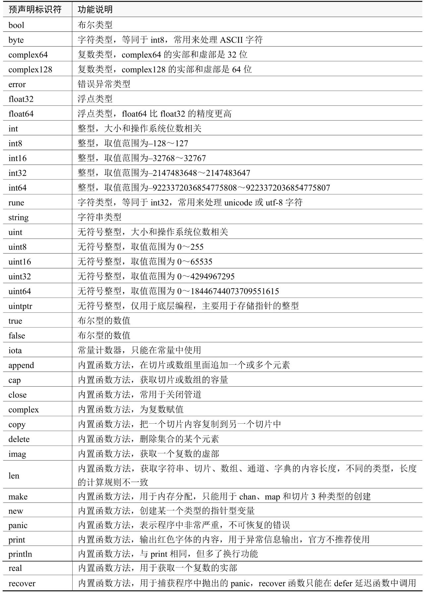

## Go语言关键字
每一种编程语言都有特定的关键字（也称保留字），这些关键字是在编程语言中赋予特定意义的单词。

开发者在编写程序时，不能使用关键字作为标识符。Go语言设置了25个关键字，在Go语言安装目录doc文件夹的go_spec.html文件中能找到具体关键字，如下所示。

file:///D:/apps/go/doc/go_spec.html:
```
Keywords
The following keywords are reserved and may not be used as identifiers.

break        default      func         interface    select
case         defer        go           map          struct
chan         else         goto         package      switch
const        fallthrough  if           range        type
continue     for          import       return       var
```

每个关键字在代码中代表不同的功能含义，说明如下。
```
1.break：用于跳出循环
2.default：用于选择结构的默认选项（switch、select）
3.func：函数定义
4.interface：定义接口
5.select：go语言特有的channel选择结构
6.case：选择结构标签
7.chan：定义channel
8.const：定义常量
9.continue：跳过本次循环
10.defer：延迟执行内容（收尾工作）有点类似C++的析构，但是它是再函数结尾的时候去执行（也就是栈即将被释放的时候）
11.go：并发执行
12.map：map类型
13.struct：定义结构体
14.else：选择结构
15.goto：跳转语句
16.package：包
17.switch：选择结构
18.fallthrough：如果case带有fallthrough，程序会继续执行下一条case,不会再判断下一条case的值
19.if：选择结构
20.range：从slice、map等结构中取元素
21.type：定义类型
22.for：循环
23.import：导入包
24.return：返回
25.var：定义变量
```

## 标识符
变量名称是编程语言常用的标识符之一。标识符是用来标识某个实体的符号，在不同应用环境下有不同的含义。

### 标识符命名规范
在计算机编程语言中，标识符是用户编程时使用的名字，用于给变量、常量、函数、语句块等命名。简而言之，标识符就是一个名字，就好比我们每个人都有属于自己的名字，它的主要作用是作为变量、函数、类、模块以及其他变量的名称。每种编程语言对标识符都有其命名规则，Go语言对标识符的命名规则如下：

* 1）标识符是由字符（A-Z和a-z）、下划线和数字组成的，但第一个字符不能是数字。
* 2）标识符不能和Go语言的关键字相同。
* 3）标识符中不能包含空格、@、%以及$等特殊字符。
* 4）标识符严格区分大小写，比如A和a是两个不同的标识符。


**理论上名字里可以有汉字，甚至可以全是汉字，但实际中不要这么做。**

编写程序的时候，我们经常使用标识符实现某些功能，只要标识符符合命名规则即可，但为了使代码具有可读性，业界对标识符设有一套命名标准，说明如下：

* 1）标识符的命名要尽量简短且有意义。
* 2）命名标识符时尽量做到看一眼就知道什么意思（提高代码的可读性），比如名字定义为name，年龄定义为age。
* 3）如果无法使用一个单词命名标识符，建议使用驼峰命名法。小驼峰式命名法（Lower Camel Case）第一个单词以小写字母开始，第二个单词的首字母大写，例如myName、aDog。大驼峰式命名法（Upper Camel Case）每一个单词的首字母都采用大写字母，例如FirstName、LastName。还有一种较为流行的命名方法，即使用下划线“_”来连接所有单词，比如last_name。

### 空白标识符
空白标识符仅由下划线（_）表示，作为匿名占位符，因为Go语言定义变量且不被使用的时候，程序会提示异常，对于不被使用且存在的变量，可以使用空白标识符表示，并且能减少内存空间开支，一般用于3种场合，具体说明如下：

1）导入某个包，只执行包的初始化函数init()，不调用包的任何变量或函数，使用import _ XXX可以避免编译错误。

2）函数设有多个返回值，但程序中只使用一个返回值，不被使用的返回值可以使用空白标识符表示。

3）类型断言，判断某个类型是否实现了接口，否则编译出错。

根据上述3种应用场合，使用代码加以说明，代码如下：
```go
package main
// 场合一
// 只使用net/http/pprof的初始化函数init()
import (
	"fmt"
	_ "net/http/pprof"
)

func myfunc() (int, string){
	// 自定义函数，设置两个返回值
	a := 10
	b := "golang"
	return a, b
}

type Foo interface {
	// 定义接口
	Say()
}
type Dog struct {
	// 定义结构体
	name string
}
func (d Dog) Say() {
	// 结构体实现接口Foo的使用
	fmt.Println(d.name + " say hi")
}

func main(){
	// 场合二
	// 调用函数myfunc()并只获取第一个返回值
	a, _ := myfunc()
	fmt.Printf("只获取函数myfunc的第一个返回值%d：\n", a)

	// 场合三
	// 判断结构体Dog是否实现接口Foo的使用
	// 等同于判定有没有定义func (d Dog) Say(){}
	// 用作类型断言，如果Dog没有实现Foo，则会报编译错误
	var _ Foo = Dog{"black dog"}
}

```

### 预声明标识符
预声明标识符包含Go语言的基础数据类型和内置函数方法，这些预声明标识符也不可以当作标识符来使用。

预声明标识符与关键字的区别在于：预声明标识符只设置变量的基础数据类型或使用Go语言内置函数方法，关键字定义变量、数据结构和流程控制语句。比如使用关键字var定义变量A，必须定义变量A才能给变量赋值。简单来说，先使用关键字定义变量，再使用预声明标识符设置变量的数据类型，两者在使用上有明显的先后顺序。

以变量Student为例，将变量定义为结构体，结构体就是变量Student的数据类型，但进一步分析，结构体里面每个元素的数据类型都是由预声明标识符定义的，代码如下：

```go
type Student struct {
   Name string
   Age int
   Score int
}
```

结构体里面由一个或多个独立元素组成，比如结构体Student含有成员Name、Age和Score，它们的数据类型是字符串、整型和整型，换句话说，结构体是将多个变量按照一定规则组合而成的数据结构。

Go语言的预声明标识符如表所示。


### 导出标识符
导出标识符是程序导入某个包，并允许调用包中已定义的变量或函数方法，如字符串、整型、接口、结构体、函数方法等。导出标识符首个字母必须为大写格式，否则无法调用。

当我们在代码中导入某个包的时候，只要该包中定义的变量或函数方法的首个字母以大写开头，它们都可以再被调用。

### 唯一标识符
唯一标识符是标识符的特性之一，在程序所有标识符集合中，每个标识符的命名与其他标识符的命名不同，那么该标识符是唯一标识符。比如在go文件中分别定义3个标识符，每个标识符的名称如下：    
```go
var name string
var Name int
var name int
```

在上述3个标识符中，第一个标识符命名为name，数据类型为字符串；第二个标识符命名为Name，数据类型为整型；第三个标识符命名为name，数据类型为整型。

由于第一个标识符和第三个标识符的命名相同，数据类型不同，两个命名相同的标识符在执行程序将会提示redeclared in this block异常。

Go语言区分大小写，第一个标识符和第二个标识符的大小写不同导致它们是两个不同的标识符，分别具有唯一性。

## 变量、常量、字面量

### 变量类型

|   类型   |                         go变量类型                         | fmt输出  |
|:--------:|:----------------------------------------------------------:|:--------:|
|   整型   | int int8 int16 int32 int64 uint uint8 uint16 uint32 uint64 |    %d    |
|  浮点型  |                      float32 float64                       | %f %e %g |
|  布尔型  |                            bool                            |    %t    |
|   指针   |                          uintptr                           |    %p    |
|   引用   |                     map slice channel                      |    %v    |
|   字节   |                            byte                            |    %c    |
| 任意字符 |                            rune                            |    %c    |
|  字符串  |                           string                           |    %s    |
|   错误   |                           error                            |    %v    |

### 变量定义与赋值
```go
package main

import (
	"fmt"
)

func main()  {
	// 定义变量，不设初始值
	var a int
	a = 10
	// 定义变量并设置初始值
	var b int = 10
	// 批量定义变量，可根据情况是否设置初始值
	var (
		//c int
		//d string
		_ string
		e int = 10
	)
	// 多个变量同一数据类型
	var f, g int
	// 批量赋值
	f, g = 10, 10
	f = f+g
	// 定义变量并赋值，通过数值设置变量的数据类型
	h := 10
	fmt.Printf("定义变量，不设初始值：%d\n", a)
	fmt.Printf("定义变量并设置初始值：%d\n", b)
	fmt.Printf("批量定义变量，可根据情况是否设置初始值：%d\n", e)
	fmt.Printf("多个变量同一数据类型：%d\n", f)
	fmt.Printf("定义变量并赋值，通过数值设置变量的数据类型：%d\n", h)
}
```
输出：
```
定义变量，不设初始值：10
定义变量并设置初始值：10
批量定义变量，可根据情况是否设置初始值：10
多个变量同一数据类型：20
定义变量并赋值，通过数值设置变量的数据类型：10
```

### 常量与iota
在Go语言中，使用关键字const定义常量，常量在定义时必须赋值，且程序运行期间其值不能改变。

```go
package main

import (
    "fmt"
)

func main()  {
    // 单个常量定义方式一
    const a int = 10
    // 单个常量定义方式二
    const b = 20
    // 多个常量定义方式一
    const (
        c int = 10
        d = "golang"
    )
    // 多个常量定义方式二
    const e, f = true, 20
    fmt.Printf("单个常量定义方式一：%d\n", a)
    fmt.Printf("单个常量定义方式二：%d\n", b)
    fmt.Printf("多个常量定义方式一：%d\n", c)
    fmt.Printf("多个常量定义方式二：%d\n", f)
}
```

关键字iota是一个特殊常量，它是一个可以被编译器修改的常量。iota在关键字const出现时将被重置为0，如果关键字const定义多个常量，iota会为每个常量进行计数累加，示例如下：
```go
package main

import "fmt"

func main(){
    const (
         a = iota // iota设为0，常量a的值为iota的值
         b        // iota累加1，常量b的值为iota的值
         c = 10   // iota累加1，常量c的值为10
         d        // iota累加1，常量d的值为10
         e = iota // iota累加1，常量e的值为iota的值
    )

    fmt.Printf("a的值为：%d\n", a)
    fmt.Printf("b的值为：%d\n", b)
    fmt.Printf("c的值为：%d\n", c)
    fmt.Printf("d的值为：%d\n", d)
    fmt.Printf("e的值为：%d\n", e)
}
```

输出：
```
a的值为：0
b的值为：1
c的值为：10
d的值为：10
e的值为：4
```

从代码和运行结果分析得知：

1）关键字const定义多个常量，关键字iota从0开始计算，每增加一个常量会使iota自动增加1。

2）如果常量值设为iota的值，并且下一个常量没有赋值，那么没有赋值的常量与它上一个常量的值相同。例如常量b没有赋值，它上一个常量a的值设为iota，每增加一个常量会使iota自动累加1，所以常量b的值为1；常量d没有赋值，它上一个常量c设为10，因此它的值为10。

3）无论常量是否赋值，只要在const中定义多个常量，iota都会根据常量的数量进行计数。

4）iota只能在关键字const中使用，不能在关键字const之外使用。

总的来说，iota只对const中定义的常量进行计数。iota的典型案例是实现数据存储转换，实现代码如下：

```go
package main

import "fmt"

func main(){
	var x, y = 8, 5
	fmt.Printf("加法运算符：%d\n", x+y)
	fmt.Printf("减法运算符：%d\n", x-y)
	fmt.Printf("乘法运算符：%d\n", x*y)
	fmt.Printf("除法运算符：%d\n", x/y)
	fmt.Printf("取模运算符：%d\n", x%y)
	x++
	fmt.Printf("幂运算符：%d\n", x)
	y--
	fmt.Printf("取整运算符：%d\n", y)
}

```

```go
const(
    a=iota	//0
    b		//1
    c		//2
    d		//3
)

const(
    a=iota 	//0
    b		//1
    _		//2
    d		//3
)

const(
    a=iota 	//0
    b=30    
    c=iota 	//2
    d		//3
)

const(
    _=iota		// iota =0
    KB=1<<(10* iota) 	// iota =1
    MB=1<<(10* iota) 	// iota =2
    GB=1<<(10* iota) 	// iota =3
    TB=1<<(10* iota) 	// iota =4
)

const(
    a,b=iota+1, iota+2	//1,2  iota =0
     c,d			//2,3  iota =1
     e,f			//3,4  iota =2
)
```

### 字面量
字面量--没有出现变量名，直接出现了值。基础类型的字面量相当于是常量。

```Go
fmt.Printf("%t\n", 04 == 4.00) //用到了整型字面量和浮点型字面量
fmt.Printf("%v\n", .4i) //虚数字面量 0.4i
fmt.Printf("%t\n", '\u4f17' == '众') //Unicode和rune字面量
fmt.Printf("Hello\nWorld\n!\n") //字符串字面量
```

## 变量作用域
对于全局变量，如果以大写字母开头，所有地方都可以访问，跨package访问时需要带上package名称；如果以小写字母开头，则本package内都可以访问。  

函数内部的局部变量，仅本函数内可以访问。{}可以固定一个作用域。内部声明的变量可以跟外部声明的变量有冲突，以内部的为准--就近原则。

```go
var (
    A=3	//所有地方都可以访问
    b=4	//本package内可以访问
)

func foo(){
    b:=5  //本函数内可以访问
    {
        b:=6  //本作用域内可以访问
    }
}
```

## 操作符与表达式

### 算法术运算符

| 运算符 | 描述 |
| :----: | :--: |
|   +    | 相加 |
|   -    | 相减 |
|   *    | 相乘 |
|   /    | 相除 |
|   %    | 求余 |

```Go
//arithmetic 算术运算
func arithmetic() {
	var a float32 = 8
	var b float32 = 3
	var c float32 = a + b
	var d float32 = a - b
	var e float32 = a * b
	var f float32 = a / b
	fmt.Printf("a=%.3f, b=%.3f, c=%.3f, d=%.3f, e=%.3f, f=%.3f\n", a, b, c, d, e, f)
}
```

### 关系运算符  

| 运算符 | 描述                                                         |
| :----: | :----------------------------------------------------------- |
|   ==   | 检查两个值是否相等，如果相等返回 True 否则返回 False         |
|   !=   | 检查两个值是否不相等，如果不相等返回 True 否则返回 False     |
|   >    | 检查左边值是否大于右边值，如果是返回 True 否则返回 False     |
|   >=   | 检查左边值是否大于等于右边值，如果是返回 True 否则返回 False |
|   <    | 检查左边值是否小于右边值，如果是返回 True 否则返回 False     |
|   <=   | 检查左边值是否小于等于右边值，如果是返回 True 否则返回 False |

```Go
//relational 关系运算符
func relational() {
	var a float32 = 8
	var b float32 = 3
	var c float32 = 8
	fmt.Printf("a==b吗 %t\n", a == b)
	fmt.Printf("a!=b吗 %t\n", a != b)
	fmt.Printf("a>b吗 %t\n", a > b)
	fmt.Printf("a>=b吗 %t\n", a >= b)
	fmt.Printf("a<c吗 %t\n", a < b)
	fmt.Printf("a<=c吗 %t\n", a <= c)
}
```

### 逻辑运算符  

| 运算符 | 描述                                                         |
| :----: | :----------------------------------------------------------- |
|   &    | 逻辑 AND 运算符。 如果两边的操作数都是 True，则为 True，否则为 False |
|  \|\|  | 逻辑 OR 运算符。 如果两边的操作数有一个 True，则为 True，否则为 False |
|   !    | 逻辑 NOT 运算符。 如果条件为 True，则为 False，否则为 True   |

```Go
//logistic 逻辑运算符
func logistic() {
	var a float32 = 8
	var b float32 = 3
	var c float32 = 8
	fmt.Printf("a>b && b>c吗 %t\n", a > b && b > c)
	fmt.Printf("a>b || b>c吗 %t\n", a > b || b > c)
	fmt.Printf("a>b不成立，对吗 %t\n", !(a > b))
	fmt.Printf("b>c不成立，对吗 %t\n", !(b > c))
}
```

### 位运算符

| 运算符 | 描述                                                                                                                     |
|:------:|:------------------------------------------------------------------------------------------------------------------------ |
|   &    | 参与运算的两数各对应的二进位相与（两位均为1才为1）                                                                       |
|   \|   | 参与运算的两数各对应的二进位相或（两位有一个为1就为1）                                                                   |
|   ^    | 参与运算的两数各对应的二进位相异或，当两对应的二进位相同时为0，不同时为1。作为一元运算符时表示按位取反，，符号位也跟着变 |
|   <<   | 左移n位就是乘以2的n次方。a<<b是把a的各二进位全部左移b位，高位丢弃，低位补0。通过左移，符号位可能会变                     |
|   >>   | 右移n位就是除以2的n次方。a>>b是把a的各二进位全部右移b位，正数高位补0，负数高位补1                                        |

```Go
//bit_op 位运算
func bit_op() {
	fmt.Printf("os arch %s, int size %d\n", runtime.GOARCH, strconv.IntSize) //int是4字节还是8字节，取决于操作系统是32位还是64位
	var a int32 = 260
	fmt.Printf("260     %s\n", util.BinaryFormat(a))
	fmt.Printf("-260    %s\n", util.BinaryFormat(-a)) //负数用补码表示。在对应正数二进制表示的基础上，按拉取反，再末位加1
	fmt.Printf("260&4   %s\n", util.BinaryFormat(a&4))
	fmt.Printf("260|3   %s\n", util.BinaryFormat(a|3))
	fmt.Printf("260^7   %s\n", util.BinaryFormat(a^7))     //^作为二元运算符时表示异或
	fmt.Printf("^-260   %s\n", util.BinaryFormat(^-a))     //^作为一元运算符时表示按位取反，符号位也跟着变
	fmt.Printf("-260>>10 %s\n", util.BinaryFormat(-a>>10)) //正数高位补0，负数高位补1
	fmt.Printf("-260<<3 %s\n", util.BinaryFormat(-a<<3))   //负数左移，可能变成正数
	//go语言没有循环（无符号）左/右移符号   >>>  <<<
}
```

### 赋值运算符

| 运算符 | 描述                                           |
| :----: | :--------------------------------------------- |
|   =    | 简单的赋值运算符，将一个表达式的值赋给一个左值 |
|   +=   | 相加后再赋值                                   |
|   -=   | 相减后再赋值                                   |
|   *=   | 相乘后再赋值                                   |
|   /=   | 相除后再赋值                                   |
|   %=   | 求余后再赋值                                   |
|  <<=   | 左移后赋值                                     |
|  >>=   | 右移后赋值                                     |
|   &=   | 按位与后赋值                                   |
|  \|=   | 按位或后赋值                                   |
|   ^=   | 按位异或后赋值                                 |

```Go
//assignment 赋值运算
func assignment() {
	var a, b int = 8, 3
	a += b
	fmt.Printf("a+=b %d\n", a)
	a, b = 8, 3
	a -= b
	fmt.Printf("a-=b %d\n", a)
	a, b = 8, 3
	a *= b
	fmt.Printf("a*=b %d\n", a)
	a, b = 8, 3
	a /= b
	fmt.Printf("a/=b %d\n", a)
	a, b = 8, 3
	a %= b
	fmt.Printf("a%%=b %d\n", a) //%在fmt里有特殊含意，所以需要前面再加个%转义一下
	a, b = 8, 3
	a <<= b
	fmt.Printf("a<<=b %d\n", a)
	a, b = 8, 3
	a >>= b
	fmt.Printf("a>>=b %d\n", a)
	a, b = 8, 3
	a &= b
	fmt.Printf("a&=b %d\n", a)
	a, b = 8, 3
	a |= b
	fmt.Printf("a|=b %d\n", a)
	a, b = 8, 3
	a ^= b
	fmt.Printf("a^=b %d\n", a)
}
```

## 变量


## 注释

### 注释的形式

- 单行注释，以//打头。
- 多行注释有2种形式：
  1. 连续多行以//打头，注意多行注释之间不能出现空行。
  2. 在段前使用/\*，段尾使用*/。
- 注释行前加缩进即可写go代码。
- 注释中给定的关键词。NOTE: 引人注意，TODO: 将来需要优化，Deprecated: 变量或函数强烈建议不要再使用。

```go
//Add 2个整数相加
//返回和。
//
//NOTE: 注释可以有多行，但中间不能出现空行（仅有//不算空行）。
func Add(a, b int) int {
	return a + b
}

/*
Sub 函数使用示例：
  for i:=0;i<3;i++{
	  Sub(i+1, i)
  }
看到了吗？只需要行前缩进，注释里就可以写go代码，是不是很简单。
*/
func Sub(a, b int) int {
	return a - b
}

//TODO: Prod 该函数不能并发调用，需要优化
func Prod(a, b int) int {
	return a * b
}

//Deprecated: Div 不要再调用了
func Div(a, b int) int {
	return a / b
}
```

### 注释的位置
针对行的注释在行上方或右侧。函数的上方在func xxx()上方。结构体的注释在type xxx struct上方。包注释在package xxx的上方。一个包只需要在一个地方写包注释，通常会专门写一个doc.go，里面只有一行package xxx和关于包的注释。
```
// FormatBool, FormatFloat, FormatInt, and FormatUint convert values to strings:
//
//	s := strconv.FormatBool(true)
//	s := strconv.FormatFloat(3.1415, 'E', -1, 64)
//	s := strconv.FormatInt(-42, 16)
//	s := strconv.FormatUint(42, 16)
package fmt
```


```

```