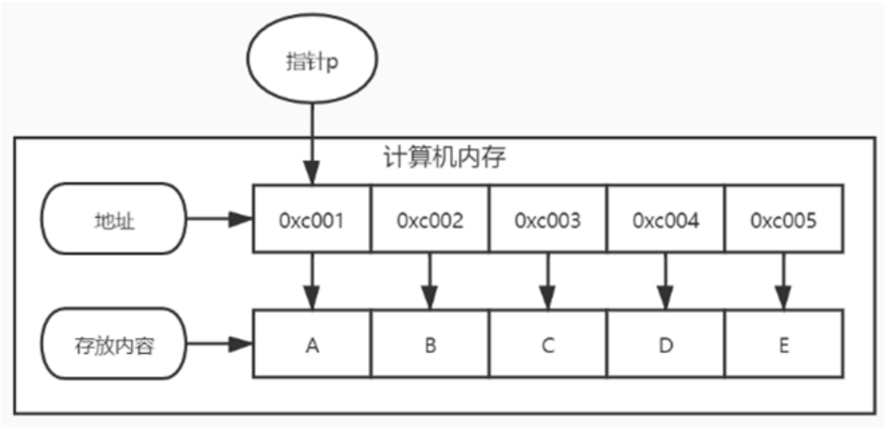

## 指针的概念
指针是一个用来指向内存地址的变量，指针一般出现在机器语言中，如汇编语言或C语言等。指针图解如图所示。


指针图解

在定义变量的时候，计算机都会为变量自动分配内存地址，指针用来存储这些变量的内存地址。为什么Go语言定义变量必须声明数据类型？因为不同类型的数据占用不同的存储空间，导致内存地址分配大小各不相同，所以指针只能存放同一类型变量的内存地址，比如整型的指针只能存储整型变量的内存地址。

Go语言的指针变量也会分配内存地址，但它的值用来存放其他变量的内存地址，指针变量分为两种：类型指针和切片指针，两者说明如下：

* 类型指针允许对数据进行修改，直接使用指针传递数据，无须复制数据，但类型指针不能进行偏移和运算。
* 切片指针是切片类型的指针，它包含起始元素的原始指针、元素数量和容量。

Go语言对指针的使用不同于C语言，它对指针设置了约束和拆分，但仍拥有指针高效访问的特点，并且不会发生指针偏移，从而避免了非法修改数据的问题，并且指针的释放和回收也是由Go语言的资源回收机制实现。

在学习Go语言的指针之前，还需要了解指针的相关概念，如指针变量、指针类型、指针赋值和指针取值。

* 1）指针也称为指针变量，即用来存放内存地址的变量，一般情况下，内存地址的数据格式以0xcXXXXXXX表示，如0xc0000180a8或0xc0000ac058等。指针是一个变量，也有自己的内存地址，它存放的内存地址是另一个变量的内存地址，这一概念必须梳理清楚。
* 2）指针类型是指针存放的内存地址的大小，比如指针a定义为int类型，它只能存放整型变量的内存地址，所以在使用指针的时候必须声明指针类型，确保指针只能存放一种数据类型。
* 3）指针赋值将某个变量的内存地址赋值给指针，在某个变量前面使用取地址操作符“&”即可获取变量的内存地址。
* 4）指针取值从指针变量中通过某个变量的内存地址获取对应的数值，只需在指针变量前面使用取值操作符“*”即可。

## 指针定义与空指针
在Go语言中使用关键字var定义指针变量，在指针变量的数据类型前面加上符号“*”，语法格式如下：
```
var name *type
```

语法说明如下：

* name代表指针变量名，可自行命名，但必须遵从标识符命名规则。
* type是指针变量的数据类型，如数字、字符串、切片等Go语言内置的数据类型。

根据指针的定义语法，我们可以定义不同数据类型的指针变量，示例代码如下：
```go
package main

import "fmt"

func main() {
	// 定义int类型的指针变量
	var pint *int
	fmt.Printf("指针值为：%v，空间地址：%v\n", pint, &pint)
	// 定义float64类型的指针变量
	var pfloat *float64
	fmt.Printf("指针值为：%v，空间地址：%v\n", pfloat, &pfloat)
	// 定义string类型的指针变量
	var pstr *string
	fmt.Printf("指针值为：%v，空间地址：%v\n", pstr, &pstr)
	// 定义bool类型的指针变量
	var pbool *bool
	fmt.Printf("指针值为：%v，空间地址：%v\n", pbool, &pbool)
	// 定义byte类型的指针变量
	var pbyte *byte
	fmt.Printf("指针值为：%v，空间地址：%v\n", pbyte, &pbyte)
	
	ptr := new(int)
	fmt.Printf("ptr指向的变量值为：%v，空间地址：%v\n", *ptr, &ptr)
}
```

运行上述代码，运行结果
```
指针值为：<nil>，空间地址：0xc00000a028
指针值为：<nil>，空间地址：0xc00000a038
指针值为：<nil>，空间地址：0xc00000a040
指针值为：<nil>，空间地址：0xc00000a048
指针值为：<nil>，空间地址：0xc00000a050
ptr指向的变量值为：0，空间地址：0xc00000a058
```

当指针定义之后，它仅仅是一个特殊变量，Go语言自动为其分配内存地址，但它的值是空值（Go语言的空值以nil表示），也称为空指针。

定义指针还可以使用内置函数方法new()实现，但定义的指针会为其设置默认值，比如定义字符串类型的指针，它将会指向一个空字符串的内存地址；定义一个整型类型的指针，它将会指向一个数值为0的内存地址，示例如下：
```go
package main

import "fmt"

func main() {
	ptr := new(int)
	fmt.Printf("ptr指向的变量值为：%v，空间地址：%v\n", *ptr, &ptr)
}
```
运行上述代码，运行结果
```
ptr指向的变量值为：0，空间地址：0xc0000ca018
```

## 指针赋值与取值
在Go语言编程中，所有变量先定义后使用，当指针变量定义之后，下一步对变量进行操作。指针赋值是设置指针变量的值，但指针变量的值只能是某个变量的内存地址；指针取值是通过指针变量的值得到某个变量的内存地址，再从内存地址获取该变量的值。

指针赋值与取值的语法格式如下：
```go
var name int = 200
var ptr *int

// 指针赋值，将name的内存地址赋值给ptr
ptr = &name
// 指针取值，在ptr前面使用“*”获取name的值
name1 := *ptr
```

指针赋值和取值是通过取地址操作符“&”和取值操作符“*”实现的，它们是一对互补操作符。“&”取出内存地址，“*”根据内存地址取出对应的数值。我们根据语法格式编写应用示例，代码如下：
```go
package main

import "fmt"

func main() {
	//var a int = 200
	//fmt.Printf("变量a的空间地址：%v\n", &a)
	//// 定义int类型的指针变量
	//var pint *int
	//fmt.Printf("指针值为：%v，空间地址：%v\n", pint, &pint)
	//pint = &a
	//fmt.Printf("指针值为：%v，空间地址：%v\n", pint, &pint)
	//fmt.Printf("指针值的值为：%v，空间地址：%v\n", *pint, &pint)

	var b int = 100
	var pint *int
	fmt.Printf("指针值的值为：%v，空间地址：%v\n", pint, &pint)
	// 将变量b的内存地址赋值给指针pint
	pint = &b
	fmt.Printf("指针值的值为：%v，空间地址：%v\n", *pint, &pint)
	// 通过取值操作符“*”修改变量b的值
	*pint = 666
	fmt.Printf("指针值的值为：%v，空间地址：%v\n", *pint, &pint)
}
```

```
变量a的空间地址：0xc00000e0a8
指针值为：<nil>，空间地址：0xc00000a030
指针值为：0xc00000e0a8，空间地址：0xc00000a030
指针值的值为：200，空间地址：0xc00000a030
```

从上述示例看到，指针pint分别经过定义、赋值和取值操作，说明如下：

* 1）指针pint定义的时候为空指针，其内存地址为0xc0000d8020。
* 2）通过取地址操作符“&”将变量a的内存地址赋值给指针pint，指针pint的内存地址保持不变，其值变为变量a的内存地址。
* 3）最后在指针pint前面使用取值操作符“*”，从指针pint的值（即变量a的内存地址）取出变量a的数据，指针pint的内存地址保持不变。

我们将指针赋值和取值的过程通过图解方式演示，如图所示。


综上所述，指针是Go语言的一种特殊变量，它存放的数据是计算机的内存地址，它的数据来自某个变量的内存地址，通过取地址操作符“&”将某个变量的内存地址完成赋值。如果直接从指针取值，只能获得某个变量的内存地址，若要获得某个变量的数值，需要在指针前面使用取值操作符“*”。

取值操作符“*”不仅能通过指针获取某个变量的数值，还能通过指针修改某个变量的数值，示例如下：
```go
package main

import "fmt"

func main() {
	var b int = 100
	var pint *int
	fmt.Printf("指针值的值为：%v，空间地址：%v\n", pint, &pint)
	// 将变量b的内存地址赋值给指针pint
	pint = &b
	fmt.Printf("指针值的值为：%v，空间地址：%v\n", *pint, &pint)
	// 通过取值操作符“*”修改变量b的值
	*pint = 666
	fmt.Printf("指针值的值为：%v，空间地址：%v\n", *pint, &pint)
}
```

```
指针值的值为：<nil>，空间地址：0xc00000a028
指针值的值为：100，空间地址：0xc00000a028
指针值的值为：666，空间地址：0xc00000a028
```

## 切片指针
切片是一种比较特殊的数据结构，这种数据结构更便于使用和管理数据集合。切片是围绕动态数组的概念构建的，可以按需自动增长和缩小，总的来说，切片可理解为动态数组，并根据切片里的元素自动调整切片长度。

Go语言的切片指针是以切片表示的，切片的每个元素只能存放内存地址，切片指针的语法定义如下：
```go
// 定义方式一
var name []*type

// 定义方式二
name := []*type{}
```

语法说明如下：
* name代表指针变量名，可自行命名，但必须遵从标识符命名规则。
* type是指针变量的数据类型，如数字、字符串等Go语言内置的数据类型。

切片指针的定义与切片定义是相同的，只要在数据类型前面使用符号“*”即可变为切片指针。由于切片有多种不同的定义方式，因此切片指针也会有多种定义方式，上述语法只列举了常用的定义方式，有关切片定义将会在后续章节中详细讲述。

切片指针可以将多个变量的内存地址存放在切片中，这样方便管理多个变量，当需要修改某个变量的时候，由于变量的内存地址是不会改变的，直接修改变量或者从切片指针修改变量即可，修改后的数据都会同步到变量和切片指针中，示例如下：
```go
package main

import "fmt"

func main() {
	// 定义一个空的字符串类型的切片指针
	var pslice []*string
	fmt.Printf("切片指针的元素：%v，内存地址：%v\n", pslice, &pslice)
	// 定义变量a、b、c并赋值
	var a, b string
	a, b = "a", "b"
	fmt.Printf("变量a、b的内存地址：%v、%v\n", &a, &b)
	// 使用内置函数append()将变量a、b、c的内存地址添加到切片指针
	pslice = append(pslice, &a)
	pslice = append(pslice, &b)
	fmt.Printf("切片指针的元素：%v\n", pslice)
	// 输出切片指针的元素所对应的数值
	// 使用取值操作符“*”从内存地址取值
	for _, k := range pslice{
		fmt.Printf("切片指针的元素所对应值：%v\n", *k)
	}
	// 从切片指针修改变量a的值，输出变量a
	*pslice[0] = "hello"
	fmt.Printf("修改后的变量值为：%v\n", a)
	// 修改变量b的值，输出切片指针的变量b的值
	b = "Golang"
	fmt.Printf("修改后的变量值为：%v\n", *pslice[1])
}
```

```go
切片指针的元素：[]，内存地址：&[]
变量a、b的内存地址：0xc000088230、0xc000088240
切片指针的元素：[0xc000088230 0xc000088240]
切片指针的元素所对应值：a
切片指针的元素所对应值：b
修改后的变量值为：hello
修改后的变量值为：Golang
```

分析上述代码，我们能得出以下结论：

* 1）切片指针定义后，如果没有设置初始值，默认为空，由于切片是动态数组，其数据长度能自动调整，Go语言不会分配内存地址，因此无法通过取地址操作符“&”获取切片指针的内存地址。
* 2）若将变量a、b写入切片指针，只能将变量a、b的内存地址写入切片指针，切片指针只能存放内存地址的数据格式。
* 3）使用for-range循环输出切片指针，只能输出存放在切片指针的内存地址，如果要通过内存地址获取对应数值，需要使用取值操作符“*”。
* 4）修改变量的值不会改变变量的内存地址，所以修改变量a或变量b的值，再从切片指针中获取变量a或变量b的值，输出结果都是变量a或变量b修改后的数值。同理，如果从切片指针中修改变量a或变量b的值，输出的变量a或变量b的值都是修改后的数值。

如果不掌握切片指针的基本原理，在实际开发中程序很容易埋下难以寻找的bug，示例如下：
```go
package main

import (
    "fmt"
    "strconv"
)

func main() {
    // 定义一个空的字符串类型的切片指针
    var pslice []*string
    // 定义字符串类型的变量a
    var a string
    // 循环5次，当前循环次数赋值给变量a，再写入切片指针
    for i := 0; i < 5; i++ {
        a = strconv.Itoa(i)
        pslice = append(pslice, &a)
    }
    // 输出切片指针的元素的数值
    for _, k := range pslice {
        fmt.Printf("切片指针的元素：%v，元素的值：%v\n", k, *k)
    }
}
```
输出：
```
切片指针的元素：0xc000054260，元素的值：4
切片指针的元素：0xc000054260，元素的值：4
切片指针的元素：0xc000054260，元素的值：4
切片指针的元素：0xc000054260，元素的值：4
切片指针的元素：0xc000054260，元素的值：4
```
切片指针pslice的所有元素都是同一个内存地址，元素值皆为4，这说明在for循环中，每次循环都是将同一个内存地址的变量a写入切片指针pslice，变量a的值不断被修改，直到最后一次循环为止，由于指针pslice的所有元素都是来自同一个变量a，因此它们的内存地址和数值都是相同的。

如果要修改上述问题，只能在第一次for循环中重新定义变量a，每次循环为变量a重新赋予新的内存地址，代码如下：
```go
package main

import (
    "fmt"
    "strconv"
)

func main() {
    // 定义一个空的字符串类型的切片指针
    var pslice []*string
    // 循环5次，当前循环次数赋值给变量a，再写入切片指针
    for i := 0; i < 5; i++ {
        // 定义字符串类型的变量a
        var a string
        a = strconv.Itoa(i)
        pslice = append(pslice, &a)
    }
    // 输出切片指针的元素的数值
    for _, k := range pslice {
        fmt.Printf("切片指针的元素：%v，元素的值：%v\n", k, *k)
    }
}

```
输出：
```
切片指针的元素：0xc000054260，元素的值：0
切片指针的元素：0xc000054270，元素的值：1
切片指针的元素：0xc000054290，元素的值：2
切片指针的元素：0xc0000542a0，元素的值：3
切片指针的元素：0xc0000542b0，元素的值：4
```

```go
package main

import (
    "fmt"
    "strconv"
)

func main() {
    // 定义一个空的字符串类型的切片指针
    var pslice []*string
    // 循环5次，当前循环次数赋值给变量a，再写入切片指针
    for i := 0; i < 5; i++ {
        // 定义字符串类型的变量a
        a := strconv.Itoa(i)
        pslice = append(pslice, &a)
    }
    // 输出切片指针的元素的数值
    for _, k := range pslice {
        fmt.Printf("切片指针的元素：%v，元素的值：%v\n", k, *k)
    }
}
```
输出：
```
切片指针的元素：0xc000054260，元素的值：0
切片指针的元素：0xc000054270，元素的值：1
切片指针的元素：0xc000054290，元素的值：2
切片指针的元素：0xc0000542a0，元素的值：3
切片指针的元素：0xc0000542b0，元素的值：4
```

## 指针的指针

指针的指针是一个指针变量指向另一个指针变量，另一个指针变量指向某个变量，如指针A的值是指针B的内存地址，指针B的值是某个变量的内存地址，如图所示。


从图看到，指针的指针（指针A）、指针变量（指针B）和某个变量的内存地址之间形成了一种递进关系。指针的指针的使用方式与指针的使用方式略有不同，其语法格式如下：
```go
// 定义指针的指针
var name **type

// 从指针的指针获取某个变量的值
v := **name
```
语法说明如下：

* name代表指针变量名，使用两个取值操作符“*”定义为指针的指针。
* type是指针变量的数据类型，如数字、字符串、切片等Go语言内置的数据类型。
* v是从指针的指针获取某个变量的值，必须使用两个取值操作符“*”实现。


根据指针的指针的语法格式，我们编写简单的应用示例，代码如下：
```go
package main

import (
    "fmt"
)

func main() {
    var str string = "hello"
    var ptr *string
    var pptr **string
    ptr = &str
    pptr = &ptr
    fmt.Printf("字符串str为：%v，空间地址为：%v\n", str, &str)
    fmt.Printf("指针变量ptr为：%v，空间地址为：%v\n", ptr, &ptr)
    fmt.Printf("指针的指针pptr为：%v，空间地址为：%v\n", pptr, &pptr)
    // 从指针的指针取某个变量值
    fmt.Printf("指针的指针pptr取变量str的值：%v\n", **pptr)
}
```


```go

```

