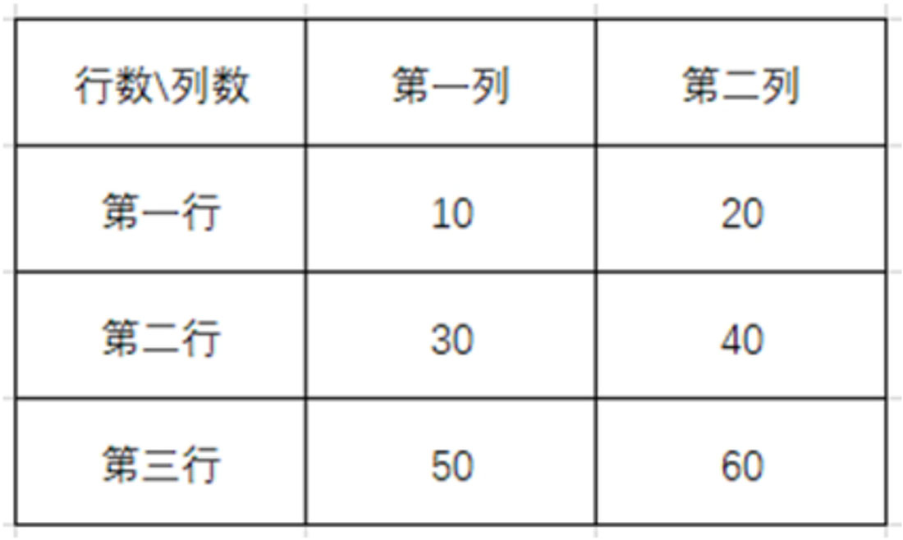
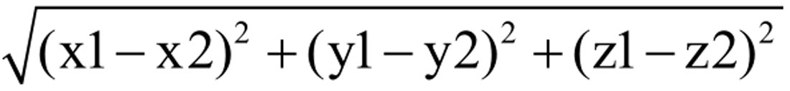

## 数组
数组是一个由固定长度的特定类型元素组成的序列，一个数组可以由0或多个元素组成。由于数组的长度是固定的，在开发中缺乏一定的灵活性，因此在Go语言中很少使用数组。

### 数组定义与操作
Go语言的数组定义语法如下：
```go
// 定义数组
var name [number]type
```

语法说明如下：

* name定义数组及使用时的变量名。
* number是数组的元素数量，允许使用表达式，但最终结果必须是整型数值。
* type设置数组元素的数据类型。

数组的每个元素可以通过索引下标来访问，索引下标的范围是从0开始计算的，具体示例如下
```go
package main

import "fmt"

func main() {
    // 定义长度为2的数组
    var s [2]string
    // 输出数组元素
    for i := 0; i < len(s); i++ {
        fmt.Printf("数组第%v个元素是：%v\n", i+1, s[i])
    }
    // 修改数组的元素值
    s[0] = "100"
    // 输出数组元素
    for i := 0; i < len(s); i++ {
        fmt.Printf("数组第%v个元素是：%v\n", i+1, s[i])
    }
}
```
输出：
```go
数组第1个元素是：
数组第2个元素是：
数组第1个元素是：100
数组第2个元素是：
```
从运行结果看到，我们定义长度为2的数组，数组的每个元素的默认值为空字符串，这是Go语言自动分配的，如果数组定义为int类型，那么默认值为0。

### 数组初始化定义
由于数组在定义的时候，Go语言自动为数组元素设置默认值，每次修改数组元素都要通过索引下标，这样会为开发过程带来不便，因此Go语言在定义数组的时候，可以为每个元素设置初始化数值，其语法格式如下：
```go
// 定义并初始化
var name = [number]type{v1, v2, v3}

// 根据初始化值设置数组长度
var name = [...]type{v1, v2, v3}
```

定义数组的时候，只需在数组的数据类型后面加上中括号“{}”，并在中括号里面设置元素的数值即可。根据上述语法格式，通过应用示例加以说明，代码如下：
```go
package main

import "fmt"

func main() {
    // 定义长度为2的数组并设置每个元素值
    var s = [2]int{100, 200}
    // 输出数组元素
    for i := 0; i < len(s); i++ {
        fmt.Printf("数组s第%v个元素是：%v\n", i+1, s[i])
    }

    // 定义数组并设置每个元素值，数值长度根据元素个数自动设置
    var ss = [...]int{300, 400}
    // 输出数组元素
    for i := 0; i < len(ss); i++ {
        fmt.Printf("数组ss第%v个元素是：%v\n", i+1, ss[i])
    }

    // 定义数组并设置第一个和第四个元素值
    var sss = [...]int{0: 300, 3: 500}
    // 输出数组元素
    for i := 0; i < len(sss); i++ {
        fmt.Printf("数组sss第%v个元素是：%v\n", i+1, sss[i])
    }
}
```
输出：
```
数组s第1个元素是：100
数组s第2个元素是：200
数组ss第1个元素是：300
数组ss第2个元素是：400
数组sss第1个元素是：300
数组sss第2个元素是：0
数组sss第3个元素是：0
数组sss第4个元素是：500
```

上述代码中，分别演示了数组定义并初始化的3种方式，说明如下：

* 1）在数组的数据类型后面加上中括号“{}”，并且根据数据类型为每个元素设置具体的元素值，这种方式是最常用的方式之一。
* 2）使用“…”设置数组长度，Go语言将元素值的个数作为数组长度，使用此方式必须设置每个元素的初始值，否则Go语言无法编译，比如将代码改为var ss […]int，程序将提示“array outside of array literal”异常。
* 3）如果只需对数组中的个别元素设置初始值，可以使用“索引下标：元素值”的方式进行设置。数组若以“…”方式设置长度，Go语言获取最大索引下标作为数组长度，比如var sss= […]int{0: 300, 3:500}，最大索引下标为3，所以数组长度为4。

### 多维数组
多维数组是在一个数组中嵌套了多个数组，数组之间是层层嵌套的，形成递进关系，语法定义如下：
```go
// 定义长度固定的多维数组
var name [number1][number2]...[number3]type
```

语法说明如下：

* name定义数组及使用时的变量名。
* number为数组的元素数量，允许使用表达式，但数值必须是整型，每一个元素数量代表数组的一个维数。
* type设置数组元素的数据类型，数组所有维数的数据类型必须相同。

二维数组和三维数组是开发中最常用的多维数组，二维数组主要实现表格类功能，如数据排列、汇总分析等；三维数组可以在二维数组的基础上再进行分类。下面分别通过两个应用示例说明二维数组和三维数组的定义与使用。

```go
package main

import (
    "fmt"
)

func main() {
    var result int = 0
    // 定义3行2列长度的二维数组
    var s [3][2]int
    // 为二维数组赋值
    s = [3][2]int{{10, 20}, {30, 40}, {50, 60}}
    for i := 0; i < len(s); i++ {
        // 循环每一行数据
        for k := 0; k < len(s[i]); k++ {
            // 循环每一列数据
            result = result + s[i][k]
            fmt.Printf("当前元素值为：%v\n", s[i][k])
        }
    }
    fmt.Printf("二维数组的总行数为：%v\n", len(s))
    fmt.Printf("二维数组的总列数为：%v\n", len(s[0]))
    fmt.Printf("二维数组的总值为：%v\n", result)
}
```

```go
当前元素值为：10
当前元素值为：20
当前元素值为：30
当前元素值为：40
当前元素值为：50
当前元素值为：60
二维数组的总行数为：3
二维数组的总列数为：2
二维数组的总值为：210
```
上述代码中定义了3行2列的二维数组，并为数组设置了初始值，我们将二维数组以表格形式展示，如图6-3所示。

如果要遍历二维数组的所有元素，需要使用循环嵌套，第一层循环是遍历数组的行数，第二层循环是遍历数组的列数。总的来说，遍历二维数组的元素必须遵守从上到下（先遍历行数），再从左到右（后遍历列数）的规则。



下一步使用三维数组计算两个空间坐标点的距离，现有坐标点A为（x1, y1, z1），坐标点B为（x2, y2, z2），AB两点距离的计算公式为：，实现代码如下：
```go
package main

import (
    "fmt"
    "math"
)

func main() {
    // 定义2*1*3长度的三维数组
    var point [2][1][3]int
    point = [2][1][3]int{{{3, 5, 7}}, {{5, 3, 2}}}
    // 获取坐标点
    pointA := point[0][0]
    pointB := point[1][0]
    fmt.Printf("坐标点A：%v\n", pointA)
    fmt.Printf("坐标点B：%v\n", pointB)
    // 计算两个坐标点距离
    // 计算两坐标的x坐标之差的平方
    x := (pointA[0] - pointB[0]) * (pointA[0] - pointB[0])
    // 计算两坐标的y坐标之差的平方
    y := (pointA[1] - pointB[1]) * (pointA[1] - pointB[1])
    // 计算两坐标的z坐标之差的平方
    z := (pointA[2] - pointB[2]) * (pointA[2] - pointB[2])
    result := math.Sqrt(float64(x+y+z))
    fmt.Printf("两坐标点距离为：%v\n", result)
}
```

从上述代码看到，空间坐标点x、y、z都存放在三维数组的最内层，前两层主要限制数据格式，比如var point [2][1][3]int的数值2代表两个坐标点，数值1代表每个坐标点只能设置一个数组，数值3代表坐标点x、y、z的坐标值。

二维数组也能记录空间坐标点，并且在使用上更加便捷，如果空间坐标点较多，三维数组就能对有规律性的坐标点进行归类。比如var point [2][5][3]int的数值5能记录5个同一规律的坐标点。

```
坐标点A：[3 5 7]
坐标点B：[5 3 2]
两坐标点距离为：5.744562646538029
```

## 切片
切片是一种比较特殊的数据结构，这种数据结构更便于使用和管理数据集合。切片是围绕动态数组的概念构建的，可以按需自动增长和缩小，总的来说，切片可理解为动态数组，并根据切片中的元素自动调整切片长度。

### 切片定义与操作
切片是动态数组，可以根据切片中的元素自动调整切片长度，切片的定义方式与数组定义十分相似，但定义过程中不用设置切片长度，其语法格式如下：
```go
// 定义切片
var name []type

/ 定义切片并赋值
var name = []type{value1, value2}
// 简写
name := []type{value1, value2}

// 使用make()定义切片
var name []type = make([]type, len)

// 简写
name := make([]type, len)
```

切片的定义语法说明如下：

* name定义切片及使用时的变量名。
* type设置切片元素的数据类型。
* value为切片中的某个元素值。
* make是内置函数方法，它为切片、集合和通道分配内存和初始化。
* len设置切片长度，切片长度等于切片元素个数。

定义切片一共划分为3种方式：只定义、定义并赋值、使用make()函数定义，它们的使用方式如下：
```go
package main

import "fmt"

func main() {
    var s []int
    var ss = []int{1, 2}
    var sss []int = make([]int, 3)
    fmt.Printf("只定义：%v，内存地址为：%v\n", s, &s)
    fmt.Printf("定义并赋值：%v，内存地址为：%v\n", ss, &ss)
    fmt.Printf("使用make()函数定义：%v，内存地址为：%v\n", sss, &sss)
}
```
输出
```
只定义：[]，内存地址为：&[]
定义并赋值：[1 2]，内存地址为：&[1 2]
使用make()函数定义：[0 0 0]，内存地址为：&[0 0 0]
```

不同定义方式使切片的元素值各有不同，具体说明如下：

* 只定义切片只生成一个空切片，切片中没有任何元素。
* 定义并赋值根据元素个数设置切片长度，每一个值将作为切片的一个元素。
* 使用make()函数定义必须设置参数len，该参数是设置切片长度，并且切片的每个元素将会设置相应的默认值。
* 由于切片支持动态变化，因此Go语言不会为切片分配内存地址。

如果定义的切片不是空切片，使用切片的索引下标修改切片中已有的元素值，比如切片ss =[]int{1, 2}，修改第一个元素值的实现代码如下：
```go
package main

import "fmt"

func main() {
    var ss = []int{1, 2}
    fmt.Printf("切片变量ss的元素值为：%v\n", ss)
    // 修改第一个元素值
    ss[0] = 100
    fmt.Printf("切片变量ss的元素值为：%v\n", ss)
}
```
```
切片变量ss的元素值为：[1 2]
切片变量ss的元素值为：[100 2]
```
如果索引下标的数值大于切片长度，那么程序无法编译成功，比如ss[10]=100，程序将提示索引超出范围
```
切片变量ss的元素值为：[1 2]
panic: runtime error: index out of range [10] with length 2

goroutine 1 [running]:
main.main()
```

### 新增切片元素
由于切片是动态数组，即使在定义的时候设置了切片长度，我们还能向切片添加新的元素。在切片中新增元素必须使用内置函数方法append()实现，它通常需要设置两个参数，语法格式如下：
```go
ss := append(slice, elems)
```
内置函数方法append()说明如下：

* 参数slice代表待新增元素的切片。
* 参数elems代表新增元素的元素值，其数据类型必须与切片的数据类型相同。
* ss是内置函数方法append()的返回值，代表新增元素后的切片。

使用append()对切片新增元素，如果函数返回值（称为切片变量B）与原有切片变量A的命名相同，那么新增元素后的切片变量B将覆盖原有切片变量A。

如果原有切片变量A与新增元素后的切片变量B的命名不相同，那么新增元素后的切片变量B与原有切片变量A是两个独立的切片变量，

示例如下：
```go
package main

import "fmt"

func main() {
    var ss = []int{1, 2}
    fmt.Printf("新增元素前的切片ss：%v\n", ss)
    // 新增元素不覆盖原有切片
    sss := append(ss, 3)
    fmt.Printf("新增元素后的切片ss：%v\n", ss)
    fmt.Printf("新切片sss：%v\n", sss)
    // 新增元素并覆盖原有切片
    ss = append(ss, 4)
    fmt.Printf("新增元素后的切片ss：%v\n", ss)
    // 添加多个元素
    ss = append(ss, 5, 6, 7, 8)
    fmt.Printf("新增元素后的切片ss：%v\n", ss)
}
```
```
新增元素前的切片ss：[1 2]
新增元素后的切片ss：[1 2]
新切片sss：[1 2 3]
新增元素后的切片ss：[1 2 4]
新增元素后的切片ss：[1 2 4 5 6 7 8]
```

内置函数方法append()还可以实现两个切片之间的拼接，只要append()的参数elems与参数slice是相同数据类型的切片即可实现拼接，示例代码如下：
```go
package main

import "fmt"

func main() {
    var s1 = []int{1, 2, 3}
    var s2 = []int{4, 5, 6, 7}
    ss := append(s1, s2...)

    fmt.Printf("切片变量s1：%v\n", s1)
    fmt.Printf("切片变量s2：%v\n", s2)
    fmt.Printf("切片变量ss：%v\n", ss)
}
```

```
切片变量s1：[1 2 3]
切片变量s2：[4 5 6 7]
切片变量ss：[1 2 3 4 5 6 7]
```
实现两个数据类型相同的切片拼接，参数elems将作为其中一个切片变量，必须在切片变量后面添加“…”，这是对切片进行解包处理，如上述代码的切片变量s2…，它是将切片变量s2的元素批量添加到切片s1中。

如果不对切片变量s2执行解包处理，程序就无法实现切片拼接，并提示异常信息。

### 截取切片元素
如果需要截取切片的部分元素，截取方式是使用索引下标进行定位和截取，截取语法如下：
```go
s := slice[startIndex: endIndex]
```
如果截取后的切片变量与截取前的切片变量命名相同，那么截取后的切片变量会覆盖截取前的切片变量；如果两者命名不相同，程序默认设置为两个独立的切片变量。

截取的起始位置和终止位置可以根据实际需要进行设定，并不强制要求，如果没有设置起始位置或终止位置，程序默认为第一个或最后一个元素的位置，示例如下：
```go
package main

import "fmt"

func main() {
    var ss = []int{1, 2, 3, 4, 5, 6, 7}
    // 截取第二个到第五个元素
    s1 := ss[1:4]
    fmt.Printf("截取第二个到第五个元素：%v\n", s1)
    // 截取第三个元素之后的所有元素
    s2 := ss[2:]
    fmt.Printf("截取第三个元素之后的所有元素：%v\n", s2)
    // 截取第三个元素之前的所有元素
    s3 := ss[:2]
    fmt.Printf("截取第三个元素之前的所有元素：%v\n", s3)
    // 如果切片ss没被覆盖，经过截取后不改变原有的切片数据
    fmt.Printf("切片变量ss的值：%v\n", ss)
}
```

```
截取第二个到第五个元素：[2 3 4]
截取第三个元素之后的所有元素：[3 4 5 6 7]
截取第三个元素之前的所有元素：[1 2]
切片变量ss的值：[1 2 3 4 5 6 7]
```

若要删除切片变量的部分元素，首先使用切片截取，过滤掉不需要的切片元素，保留需要的切片元素，然后使用内置函数方法append()将两个或多个已保留的切片元素进行拼接。比如去掉切片ss = []int{1, 2, 3, 4, 5, 6, 7}的元素4、5、6，实现代码如下：

```go
package main

import "fmt"

func main() {
    var ss = []int{1, 2, 3, 4, 5, 6, 7}
    fmt.Printf("切片ss的元素：%v\n", ss)
    // 删除元素4、5、6
    ss = append(ss[:2], ss[6:]...)
    fmt.Printf("切片ss的元素：%v\n", ss)
}
```

```
切片ss的元素：[1 2 3 4 5 6 7]
切片ss的元素：[1 2 7]
```

当切片中需要删除元素的位置是隔位错开时，需要多次使用元素截取，保留有用的元素，再将这些元素拼接成新的切片，这个过程中可能需要多次使用内置函数方法append()。

### 复制切片
Go语言的内置函数方法copy()可以将一个切片（数组）复制到另一个切片（数组）中，并且两个切片的数据类型必须相同。如果两个切片（数组）的长度不同，程序按照待复制的切片元素的个数进行复制。具体语法格式如下：
```go
i := copy(slice1, slice2)
```
内置函数方法copy()的说明如下：

* slice1代表待复制的切片。
* slice2代表被复制的切片。
* i代表内置函数方法copy()的返回值，代表复制的元素数量。

下面通过代码示例说明内置函数方法copy()的使用方法，代码如下：
```go
package main

import "fmt"

func main() {
    slice1 := []int{1, 2, 3}
    slice2 := []int{4, 5, 6}
    // 将slice1的元素复制到slice2
    //copy(slice2, slice1)
    // 将slice2的元素复制到slice1
    copy(slice1, slice2)
    fmt.Printf("将slice2的元素复制到slice1：%v\n", slice1)
    fmt.Printf("将slice2的元素复制到slice1：%v\n", slice2)
    slice3 := []int{7, 8, 9, 10}
    // 将slice3的元素复制到slice1
    //copy(slice1, slice3)
    //fmt.Printf("将slice3的元素复制到slice1：%v\n", slice1)
    //fmt.Printf("将slice3的元素复制到slice1：%v\n", slice3)
    // 将slice1的元素复制到slice3
    copy(slice3, slice1)
    fmt.Printf("将slice1的元素复制到slice3：%v\n", slice1)
    fmt.Printf("将slice1的元素复制到slice3：%v\n", slice3)
}
```
输出
```
将slice2的元素复制到slice1：[4 5 6]
将slice2的元素复制到slice1：[4 5 6]
将slice1的元素复制到slice3：[4 5 6]
将slice1的元素复制到slice3：[4 5 6 10]
```
分析运行结果，可以得出以下结论：

* 1）内置函数方法copy()第一个参数slice1的切片元素将会被第二个参数slice2的切片元素覆盖，第二个参数slice2的切片元素保持不变。
* 2）如果参数slice1和参数slice2的切片元素个数不同，复制过程以参数slice1的切片元素个数为主。
* 3）如果参数slice1的切片元素个数大于参数slice2，则参数slice2的所有切片元素依次替换参数slice1的切片元素，参数slice1没有替换的切片元素保存不变。
* 4）如果参数slice1的切片元素个数小于参数slice2，则参数slice2的切片元素依次替换参数slice1的切片元素，直到参数slice1的所有元素被替换为止，参数slice2剩余的切片元素不参与复制过程。

### 切片长度与容量
使用内置函数方法make()定义切片的时候，必须设置切片长度（也称为切片大小），但内置函数方法make()还有一个可选参数cap，它用于设置切片容量，默认情况下，切片长度与容量是相同的。为了更好地讲述切片长度与容量之间的关系，我们通过示例加以说明：
```go
package main

import "fmt"

func main() {
    // 内置函数cap()获取切片容量
    // 内置函数len()获取切片长度
    s1 := make([]int, 3, 4)
    fmt.Printf("切片变量s1的值：%v\n", s1)
    fmt.Printf("切片变量s1的长度：%v\n", len(s1))
    fmt.Printf("切片变量s1的容量：%v\n", cap(s1))
    // 第一次添加元素
    s1 = append(s1, 10)
    fmt.Printf("切片变量s1的值：%v\n", s1)
    fmt.Printf("切片变量s1的长度：%v\n", len(s1))
    fmt.Printf("切片变量s1的容量：%v\n", cap(s1))
    // 第二次添加元素
    s1 = append(s1, 10)
    fmt.Printf("切片变量s1的值：%v\n", s1)
    fmt.Printf("切片变量s1的长度：%v\n", len(s1))
    fmt.Printf("切片变量s1的容量：%v\n", cap(s1))
}
```
输出
```
切片变量s1的值：[0 0 0]
切片变量s1的长度：3
切片变量s1的容量：4
切片变量s1的值：[0 0 0 10]
切片变量s1的长度：4
切片变量s1的容量：4
切片变量s1的值：[0 0 0 10 10]
切片变量s1的长度：5
切片变量s1的容量：8
```

根据运行结果进一步分析切片长度与容量之间的关系，分析如下：

* 首先定义长度为3、容量为4的切片变量s1，并且切片前3个元素的默认值为0。

* 使用内置函数方法append()往切片变量s1中添加数值10，切片变量s1的长度变为4，容量保持不变。

* 再一次使用内置函数方法append()往切片变量s1中添加数值10，切片变量s1的长度变为5，容量翻倍增长，增长为8。

综上分析，当切片长度大于容量的时候，Go语言将原有容量扩大至两倍，否则元素无法新增到切片中。换句话说，把切片容量比作停车场的停车位，每个停车位只能停一辆车，把切片长度比作停车场的车辆数量，当所有停车位停满的时候，再有一辆车进入停车场，停车场就无法提供车位，只能向外扩展开发更多停车位。同理，当切片容量等于长度的时候，程序无法存放新的元素，只能扩大切片容量，为新元素提供足够的存储空间。

## 集合
Go语言的集合称为映射（map），它是一种无序的键值对（key-value）的集合，集合是通过键（key）来快速检索值（value）的，键（key）类似于索引，它指向值（value）的数据。

### 集合定义与操作
Go语言的集合在其他编程语言中也称为字典（Python）、hash或HashTable等，它们在数据结构上都是相同的，只不过名称不一样而已。Go语言的集合语法定义如下：
```go
// 定义方式1，只定义
var name map[keytype]valuetype
name = map[keytype]valuetype{}
// 简写
var name = map[keytype]valuetype{}

// 定义方式2，定义并赋值
var name = map[keytype]valuetype{key: value}

// 定义方式3，使用make()函数定义
var name map[keytype]valuetype
name = make(map[keytype]valuetype)

// 简写
name := make(map[keytype]valuetype)
```
集合是使用关键字map定义的，语法说明如下：

* name用于设置集合变量的名称。
* keytype用于设置键（key）的数据类型。
* valuetype用于设置值（value）的数据类型。

定义集合一共划分为3种方式：只定义、定义并赋值、使用make()函数定义，它们的使用方式如下：
```go
package main

import (
    "fmt"
)

func main() {
    // 只定义
    var m1 = map[string]string{}
    m1["name"] = "Tom"
    fmt.Printf("集合m1：%v\n", m1)
    // 定义并赋值
    var m2 = map[string]string{"name": "Lily"}
    fmt.Printf("集合m2：%v\n", m2)
    // 使用make()函数定义
    m3 := make(map[string]string)
    m3["name"] = "Tim"
    fmt.Printf("集合m3：%v\n", m3)
}
```
```
集合m1：map[name:Tom]
集合m2：map[name:Lily]
集合m3：map[name:Tim]
```

### 删除集合元素
当集合定义之后，只要通过m[key]=value方式就能实现集合元素的新增或修改，如果键（key）不在集合里面，就对该集合新增键值对；如果键（key）已在集合中，则对原有的键（key）进行修改。

如果删除集合中某个键值对（key-value），可以使用内置函数方法delete()实现，内置函数方法delete()只适用于集合，它是删除集合元素的特有函数，示例如下：
```go
package main

import "fmt"

func main() {
    var m1 = map[string]string{}
    m1["name"] = "Tom"
    m1["age"] = "20"
    m1["addr"] = "GZ"
    fmt.Printf("集合m1的数据：%v\n", m1)
    // 删除key=addr的数据
    delete(m1, "addr")
    fmt.Printf("集合m1的数据：%v\n", m1)
}
```
```
集合m1的数据：map[addr:GZ age:20 name:Tom]
集合m1的数据：map[age:20 name:Tom]
```

## 编程实现集合与JSON互换
在Web开发中，JSON是一种常用的数据类型，它也是以键值对格式表示的，其数据结构和Go语言的集合非常相似，网页前端与后台系统的通信往往使用JSON数据传输较多，所以集合和JSON之间的数据转换是经常使用的。

虽然JSON也是以键值对（key-value）方式表示的，但每对键值对（key-value）的数据类型各不相同，且Go语言是静态强类型编程语言，因此集合和JSON会存在数据差异，集合与JSON的转换需要使用内置包encoding/json实现，示例如下：
```go
package main

import (
    "encoding/json"
    "fmt"
)

func main() {
    // 定义字符串，用于记录JSON数据
    var j string
    j = `{"infos": [{"name": "Tom", "age": 15}, {"name": "Lily", "age": 20}]}`
    // 定义集合，value的数据类型为接口interface类型
    var m1 = map[string]interface{}{}
    // 将JSON字符串转换为集合
    json.Unmarshal([]byte(j), &m1)
    // 遍历输出JSON
    for k, v := range m1 {
        fmt.Printf("集合m1的键为：%v\n", k)
        fmt.Printf("集合m1的值为：%v\n", v)
        // 解析JSON里面的数组
        vv := v.([]interface{})
        for i := 0; i < len(vv); i++ {
            fmt.Printf("数组vv的值为：%v\n", vv[i])
            // 解析数组里面的集合
            vvv := vv[i].(map[string]interface{})
            name := vvv["name"]
            age := vvv["age"]
            fmt.Printf("键为name的数据为：%v\n", name)
            fmt.Printf("键为age的数据为：%v\n", age)
        }
    }
}
```
```go
集合m1的键为：infos
集合m1的值为：[map[age:15 name:Tom] map[age:20 name:Lily]]
数组vv的值为：map[age:15 name:Tom]
键为name的数据为：Tom
键为age的数据为：15
数组vv的值为：map[age:20 name:Lily]
键为name的数据为：Lily
键为age的数据为：20
```
JSON一般以字符串形式进行通信传递，因此上述代码定义字符串变量j，它用于记录JSON数据，然后使用内置包encoding/json对字符串变量j进行解析，说明如下：

* 1）定义集合m1，它的键（key）设置为字符串类型，值（value）设置为空接口，它可以存储函数方法和不同数据类型的变量，它能兼容JSON不同数据类型的值（value）。
* 2）使用内置包encoding/json的Unmarshal()对字符串变量j进行JSON解析，解析过程需要将字符串变量j转为字节类型的切片格式，再将解析结果存放在集合m1中。Unmarshal()第一个参数将字符串变量j转为字节类型的切片格式；第二个参数传递集合m1的内存地址，解析结果会自动记录在集合m1中。
* 3）由于JSON数据是嵌套结构，最外层结构只有一对键值对，键为infos，值为一个切片（数组）类型的数据，当取到键为infos的值并对该值进行解析的时候，需要对该值设置数据类型，如v.([]interface{})，否则Go语言无法解析JSON里面的数组数据。
* 4）JSON里面数组的每个元素都是键值对表示的，相当于Go语言的集合，解析数组元素的时候，还需要为每个元素设置数据类型，如vv[i].(map[string]interface{})。

综上所述，Go语言解析JSON字符串需要使用内置包encoding/json的Unmarshal()，解析结果保存在集合中，并且集合的值（value）的数据类型为接口（interface）类型，如果JSON里面嵌套了数组或JSON，则需要对嵌套的数组或JSON设置相应数据类型。

切片和集合是可以组合使用的，比如切片的某个元素是集合，集合的某个键值对的值是切片，这种组合在日常开发中十分常见。

上述例子将JSON转换为集合，若要将集合转换为JSON，可以使用内置包encoding/json的Marshal()实现，示例如下：
```go
package main

import (
    "encoding/json"
    "fmt"
)

func main() {
    // 定义集合
    var m1 = map[string]interface{}{}
    m1["name"] = "Tom"
    m1["age"] = 10
    fmt.Printf("m1的数据为：%v\n", m1)
    var m2 = map[string]interface{}{}
    m2["name"] = "Lily"
    m2["age"] = 20
    fmt.Printf("m2的数据为：%v\n", m2)
    // 定义切片
    var s1 = []map[string]interface{}{m1, m2}
    fmt.Printf("s1的数据为：%v\n", s1)
    // 定义集合，键为字符串类型，值为接口类型
    var m3 = map[string]interface{}{}
    m3["infos"] = s1
    data, _ := json.Marshal(&m3)
    fmt.Printf("JSON数据为：%v\n", string(data))
}
```
```go
m1的数据为：map[age:10 name:Tom]
m2的数据为：map[age:20 name:Lily]
s1的数据为：[map[age:10 name:Tom] map[age:20 name:Lily]]
JSON数据为：{"infos":[{"age":10,"name":"Tom"},{"age":20,"name":"Lily"}]}
```
分析代码与运行结果，我们得出以下结论：

* 1）首先定义集合m1和m2并设置键值对，每对键值对的值是不同数据类型的数据。
* 2）然后定义切片s1，其数据类型是集合m1和m2的数据类型，将集合m1和m2写入切片s1，作为切片元素。
* 3）下一步定义集合m3并设置键值对，键（key）为infos，值（value）为切片s1，再使用内置包encoding/json的Marshal()将集合m3转换为JSON字符串。Marshal()的参数传递集合m3的内存地址，函数设有两个返回值，第一个返回值data表示转换结果，以字符类型的切片表示；第二个返回值是转换信息，用于记录转换失败等异常信息。
* 4）最后将转换结果从字符类型的切片转为字符串类型，使用内置函数方法string()实现数据类型转换。

综上所述，集合转换JSON首先分析集合每个元素的数据结构，如果集合嵌套了内置容器，比如数组、切片、集合等数据，必须从嵌套的数据进行构建，再把构建好的数据作为集合元素，最后使用内置包encoding/json的Marshal()和内置函数方法string()完成转换过程。

## 列表
列表是一种非连续的存储容器，由多个节点组成，节点通过一些变量记录彼此之间的关系，列表有多种实现方法，如单链表、双链表等。

### 列表定义
在Go语言中，列表使用内置包container/list实现，内部原理是双链表结构，能够高效地进行任意位置元素的插入和删除操作。列表定义有两种方式，分别是用关键字var和内置函数方法new()实现，示例如下：
```go
// 关键字var定义列表
var name list.List

// 使用内置函数方法new()定义
name := list.New()
```

列表定义后，可以调用相关函数方法对列表执行元素的新增、插入、删除操作，并且**列表元素没有限制数据类型**。

### 列表元素操作
列表操作只有新增、插入和删除元素，内置包container/list提供了6个函数方法实现新增元素，使用方法如下：
```go
package main

import (
    "container/list"
    "fmt"
)

func main() {
    // 定义列表变量
    var l2 list.List
    fmt.Printf("列表l2：%v\n", l2)
    // 在列表最末位位置新增元素，返回当前元素信息
    l2.PushBack("a")
    // 在列表最首位位置新增元素，返回当前元素信息
    l2.PushFront(67)
    fmt.Printf("列表l2：%v\n", l2)

    // 定义列表变量
    l1 := list.New()
    fmt.Printf("列表l1：%v\n", l1)
    // 在列表最末位位置新增元素，返回当前元素信息
    element := l1.PushBack("abc")
    fmt.Printf("元素element：%v\n", element)
    // 在元素element（即abc）后面添加元素
    l1.InsertAfter("edf", element)
    fmt.Printf("在元素element后面添加元素：%v\n", l1)
    // 在元素element（即abc）前面添加元素
    l1.InsertBefore("ghi", element)
    fmt.Printf("在元素element前面添加元素：%v\n", l1)
    // 列表l2的元素添加列表l1的元素后面
    l1.PushBackList(&l2)
    fmt.Printf("列表l2添加列表l1后面：%v\n", l1)
    // 将列表l2的元素添加到列表l1的元素前面
    l1.PushFrontList(&l2)
    fmt.Printf("列表l2添加列表l1前面：%v\n", l1)
}
```
```go
列表l2：{{<nil> <nil> <nil> <nil>} 0}
列表l2：{{0xc000074540 0xc000074510 <nil> <nil>} 2}
列表l1：&{{0xc0000745a0 0xc0000745a0 <nil> <nil>} 0}
元素element：&{0xc0000745a0 0xc0000745a0 0xc0000745a0 abc}
在元素element后面添加元素：&{{0xc000074600 0xc000074660 <nil> <nil>} 2}
在元素element前面添加元素：&{{0xc0000746c0 0xc000074660 <nil> <nil>} 3}
列表l2添加列表l1后面：&{{0xc0000746c0 0xc000074750 <nil> <nil>} 5}
列表l2添加列表l1前面：&{{0xc0000747e0 0xc000074750 <nil> <nil>} 7}
```
上面列举了函数方法PushBack()、PushFront()、InsertAfter()、InsertBefore()、PushBackList()、PushFrontList()的使用方式，具体说明如下：

* PushBack()由列表变量调用，函数参数是新的元素值，它在列表末位添加新元素，函数返回值是当前添加的元素信息。
* PushFront()由列表变量调用，函数参数是新的元素值，它在列表首位添加新元素，函数返回值是当前添加的元素信息。
* InsertAfter()由列表变量调用，在列表中某个元素后面添加新的元素，函数第一个参数是新的元素，第二个参数是列表中某个元素。
* InsertBefore()由列表变量调用，在列表中某个元素前面添加新的元素，函数第一个参数是新的元素，第二个参数是列表中某个元素。
* PushBackList()由列表变量调用，将一个列表变量的元素添加到另一个列表变量的元素后面，函数第一个参数是另一个列表变量的内存地址。
* PushFrontList()由列表变量调用，将一个列表变量的元素添加到另一个列表变量的元素前面，函数第一个参数是另一个列表变量的内存地址。

如果删除列表中的某个元素，可以使用内置包container/list提供的函数Remove()，但删除的变量必须为列表的元素信息，示例如下：
```go
package main

import (
    "container/list"
    "fmt"
)

func main() {
    // 定义列表变量
    var l2 list.List
    fmt.Printf("列表l2：%v\n", l2)
    // 添加元素
    element := l2.PushBack("abc")
    fmt.Printf("列表l2：%v\n", l2)
    // 删除元素
    l2.Remove(element)
    fmt.Printf("列表l2：%v\n", l2)
}
```

```go
列表l2：{{<nil> <nil> <nil> <nil>} 0}
列表l2：{{0xc000074510 0xc000074510 <nil> <nil>} 1}
列表l2：{{0xc0000744b0 0xc0000744b0 <nil> <nil>} 0}
```

### 遍历列表元素
列表是双链表结构，如果遍历列表元素，就需要使用内置包container/list的Front()函数获取列表的首个元素，下一次遍历再调用内置包container/list的Next()函数获取下一个元素，直到列表元素等于空为止，即所有元素完成遍历，示例如下：
```go
package main

import (
    "container/list"
    "fmt"
)

func main() {
    // 定义列表变量
    var l2 list.List
    // 添加元素
    l2.PushBack("Tom")
    l2.PushBack("Tim")
    l2.PushBack("Lily")
    l2.PushBack("Mary")
    // 遍历输出元素
    for i := l2.Front(); i != nil; i = i.Next() {
        fmt.Printf("列表l2的元素是：%v\n", i.Value)
    }
}
```

```go
列表l2的元素是：Tom
列表l2的元素是：Tim
列表l2的元素是：Lily
列表l2的元素是：Mary
```
如果将for循环和函数Remove()结合使用，每次循环用于删除列表的某个元素，从而删除整个列表元素，示例如下：
```go
package main

import (
    "container/list"
    "fmt"
)

func main() {
    // 定义列表变量
    var l2 list.List
    // 添加元素
    l2.PushBack("Tom")
    l2.PushBack("Tim")
    l2.PushBack("Lily")
    l2.PushBack("Mary")
    // 定义变量next
    var next *list.Element
    // 遍历输出元素
    for i := l2.Front(); i != nil; i = next {
        fmt.Printf("列表l2的元素是：%v\n", i.Value)
        // 设置变量next的值，用于执行下一次循环
        next = i.Next()
        // 删除元素
        l2.Remove(i)
    }
    fmt.Printf("列表l2的元素是：%v\n", l2)
}
```
```
列表l2的元素是：Tom
列表l2的元素是：Tim
列表l2的元素是：Lily
列表l2的元素是：Mary
列表l2的元素是：{{0xc000107440 0xc000107440 <nil> <nil>} 0}
```
上述代码将for的循环条件i=i.Next()改为i=next，next是*list.Element类型的变量，每次循环把变量i的值设为i.Next()，从而获得下一次循环的列表元素。

因为调用函数Remove()会改变列表的元素结构，Go语言为了避免内存泄漏，它默认将内置函数方法Next()和Prev()设置为nil。如果不修改for的循环条件i=i.Next()，当删除第一个元素之后，Remove()就会将Next()和Prev()设置为nil，从而终止整个for循环，程序也只会删除第一个元素。


```go

```