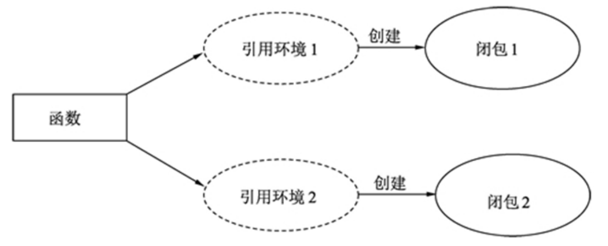

# 函数1

## 函数定义与调用
在Go语言中，函数由6个要素组成：关键字func、函数名、参数列表、返回值数据类型、函数体和返回值语句，每个程序可以编写很多函数，函数是程序的基本代码块。

由于Go语言是编译型语言，因此函数编写顺序不影响程序运行，但为了提高代码的可读性，最好把自定义函数写在主函数main()前面，自定义函数之间按照一定逻辑顺序编写，例如函数被调用的先后顺序。

编写函数的目的是将一个需要多行代码的复杂问题分解为简单任务来解决，而且同一个任务（函数）可以被多次调用，这有助于代码重用。Go语言的函数定义必须遵从以下格式：
```go
func name(parameter)(returnType){
    代码块
     return value1, value2...
}
```

函数定义说明如下：

* func是Go语言的关键字，用于定义函数和方法。
* name是函数名，可自行命名。
* parameter是函数的参数，参数个数没有要求，可根据实际设置，如果不需要参数，可以使用()表示。
* returnType设置返回值的数据类型，函数有返回值必须设置，有多个返回值必须依次为每个返回值设置数据类型，没有返回值则无须设置。
* return是Go语言的关键字，设置函数返回值，如果没有返回值，则无须编写。
* value1和value2是函数的返回值，返回值的数据类型与returnType一一对应。


根据函数定义语法可以划分4种不同类型的函数，示例如下：
```go
// 无参数无返回值
func name(){
    代码块
}

// 有参数无返回值
func name(n int){
    代码块
}


// 无参数有返回值
func name()(int){
    代码块
    return value
}


// 有参数有返回值
func name(n int)(int){
    代码块
    return value
}
```

我们以有参数有返回值的函数为例编写简单的应用示例，代码如下：
```go
package main

import (
    "fmt"
    "strconv"
)

func myfun(name string, age int) (string, bool) {
    // 参数name和age
    // (string, bool)是返回值的数据类型
    var n string
    var b bool
    if name != "" {
        // 字符串拼接
        n = name + " is existence, age is " + strconv.Itoa(age)
        b = true
    } else {
        n = "name is not existence"
        b = false
    }
    // 返回值
    return n, b
}

func main() {
    // 调用函数，并设置返回值
    s, _ := myfun("Tom", 15)
    fmt.Println(s)
    // 调用函数，虽然有返回值，但函数外不需要使用
    myfun("Tom", 15)
}
```
```
Tom is existence, age is 15
```
上述代码定义了函数myfun()，在主函数main()中调用函数myfun()，具体说明如下：

* 自定义函数myfun()设置函数参数name和age，参数name的数据类型为字符串，参数age的数据类型为整型，参数之间使用逗号隔开。如果多个参数是同一数据类型，可以写在一起，如name, addr string。
* 自定义函数可以根据需要设置返回值，如果有返回值，则必须在参数后面设置返回值的数据类型，每个返回值都有对应的数据类型。
* 返回值使用关键字return，它将函数执行结果返回给函数之外的程序再进行操作。若有多个返回值，则返回值之间使用英文格式的逗号隔开，返回值的先后顺序与返回值数据类型一一对应。比如myfun()的返回值数据类型为(string, bool)，那么关键字return后面必须有两个返回值，并且返回值的数据类型依次为字符串和布尔型。
* 函数调用是在主函数main()中调用自定义函数myfun()，在调用过程中，根据函数参数依次设置相应数值，如需使用返回值，则要为其设置变量存放函数返回值；如果没有返回值或程序不需要使用返回值，则直接调用函数即可。

在实际开发中，很多函数方法都会设置error类型的返回值，error类型的返回值通常用作函数运行结果，如果返回值为空值nil，则说明函数调用成功；如果返回值不为空值nil，则说明函数在运行过程中出现异常。

error类型是Go语言定义的接口，主要记录程序运行中出现的异常信息，因此在Go语言中经常看到这样的代码格式：
```go
fs, err := os.Open("output.txt")

if err != nil {
    fmt.Printf("调用函数Open()出现异常：%v", err)
}
```

## 不固定参数数量
在实际开发中，我们可能遇到一些大同小异的开发需求，函数为了兼容多种需求可能设置数量不一的参数，所以Go语言允许对函数设置不固定参数。

不固定参数是指不限制参数数量，但限制了参数的数据类型，不固定参数使用3个点（…）表示，它以切片形式表示，切片元素是参数的数据类型，从原理分析，不固定参数利用了切片的解。

```go
package main

import (
    "fmt"
)

func myfun2(numbers ...int) {
    for _, k := range numbers {
        fmt.Printf("参数值为：%v\n", k)
    }
}
func myfun(numbers ...interface{}) {
    for _, k := range numbers {
        fmt.Printf("参数值为：%v\n", k)
    }
}


func main() {
    var s = []string{"Mary", "Tim"}
    var m = map[string]interface{}{"name": "Mary", "age": 10}
    // 调用函数
    myfun(45, "Tom", s, m)
    myfun2(45, 44, 23, 77)
}
```

```
参数值为：45
参数值为：Tom
参数值为：[Mary Tim]
参数值为：map[age:10 name:Mary]
参数值为：45
参数值为：44
参数值为：23
参数值为：77
```

## 函数以变量表示
一个函数可以理解为一个变量，函数定义等于设置变量值，关键字func则作为变量的数据类型，具体示例如下：
```go
package main

import (
    "fmt"
)

func myfun() {
    // 定义函数
    fmt.Printf("自定义函数")
}


func main() {
    // 定义函数变量
    var m func()
    // 将函数作为变量m的值
    m = myfun
    // 调用函数
    m()
}
```
```
自定义函数
```
上述代码定义了函数myfun()，在主函数中定义函数变量m，数据类型是func()，然后将自定义函数myfun()的函数名赋值给函数变量m，最后在变量m后面使用小括号，即视为执行函数调用过程。

## 匿名函数
没有名字的函数称为匿名函数，就是这种函数没有具体的函数名，将整个函数作为变量，以变量方式使用。匿名函数有两种使用方式：函数定义并使用、函数以函数变量表示。

函数定义并使用是在函数定义的时候就开始执行函数调用，这种方式只会在程序中执行一次，因为函数只会执行一次定义，所以无法实现函数多次调用，示例如下：
```go
package main
import (
    "fmt"
)
func main(){
    res := func(n1 int, n2 int) int {
        return n1 + n2
    }(10, 30)
    
    fmt.Printf("函数执行结果为：%v\n", res)
}
```

```
函数执行结果为：40
```
上述代码的匿名函数是用关键字func定义的，关键字func后面直接设置函数参数和返回值的数据类型，函数定义之后再设置参数值，如(10, 30)是直接调用匿名函数，函数返回值赋予变量res。

如果匿名函数以函数变量方式表示，再通过函数变量方式实现匿名函数调用，这样在程序中能多次调用匿名函数，示例如下：
```go
package main
import (
    "fmt"
)
func main(){
    // 将匿名函数赋给函数变量myfun
    myfun := func (n1 int, n2 int) int {
        return n1 - n2
    }

    // 变量myfun的数据类型是函数类型，可以由该变量完成函数调用
    res2 := myfun(10, 30)
    res3 := myfun(50, 30)
    fmt.Printf("匿名函数调用第一次：%v\n", res2)
    fmt.Printf("匿名函数调用第二次：%v\n", res3)
    fmt.Printf("函数变量myfun的数据类型：%T\n", myfun)
}
```
```
匿名函数调用第一次：-20
匿名函数调用第二次：20
函数变量myfun的数据类型：func(int, int) int
```

上述代码将整个匿名函数作为函数变量表示，只要在函数变量myfun后面使用小括号，即可实现匿名函数的调用

如果匿名函数作为模块或包中的某个功能函数，需要被其他go文件的程序调用，可以将函数变量的首个字母设为大写，这是把函数变量设为导出标识符。

## 引用外部变量的函数
引用外部变量的函数称为闭包，即使已经离开了引用环境也不会被释放或者删除，在闭包中可以继续使用这个变量，简单可以理解为：函数+引用环境=闭包。同一个函数与不同引用环境组合可以形成不同的实例，如图所示。




如果单从概念上理解闭包是十分困难的，我们不妨结合实例进行分析，代码如下：
```go
package main

import "fmt"

// 闭包 = 函数 + 引用环境
func adder() func(int) int {
    // 定义函数adder()，返回值为匿名函数func(int) int
    var x int = 10
    // 匿名函数作为函数返回值
    return func(y int) int {
        x += y
        return x
    }
}

func main() {
    // 函数adder()是一个闭包:
    // 函数adder()内部有变量x（引用环境）和匿名函数
    // 匿名函数引用了其外部作用域中的变量x
    // 在函数adder()的生命周期内 变量x一直有效
    f := adder()
    fmt.Println(f(10))
    fmt.Println(f(20))
    f1 := adder()
    fmt.Println(f1(2000))
    fmt.Println(f1(5000))
}
```
```
20
40
2010
7010
```

运行上述代码，运行结果如图7-8所示。结合代码与运行结果分析得知：

* 1）自定义函数adder()实现闭包功能，函数内部定义变量x和匿名函数，并且匿名函数作为函数返回值。
* 2）匿名函数设置参数y和引用自定义函数adder()的变量x，在匿名函数内部对变量x进行赋值计算，最后将变量x的值作为返回值。
* 3）在主函数main()中调用函数adder()，函数返回值以变量f表示，变量f是匿名函数的函数变量，通过函数变量f完成匿名函数的调用。
* 4）由于函数变量f是调用函数adder()产生的，当函数变量f调用匿名函数时，匿名函数能使用函数adder()定义的变量x。
* 5）从代码的f(10)看到，第一次调用匿名函数的时候，变量x的初始值为10，参数y的值设为10，所以程序输出20；第二次调用匿名函数的时候，变量x的值经过第一次调用已经变为20，参数y的值设为20，所以程序输出40。函数变量f每调用一次都会改变变量x的值。
* 6）匿名函数除了使用函数adder()定义的变量x之外，还可以使用函数adder()的参数作为引用环境。

根据闭包原理可以实现很多实用性功能，比如在Web开发中，某些网页需要用户登录才能查看，用户登录验证可以使用闭包实现。

## 函数自身调用
函数调用是在一个函数中调用另一个函数，如果在函数中调用函数本身，就成了递归函数。递归函数是通过不断调用自身代码，当达到特定条件时才终止调用过程，它的语法格式如下：
```go
func myfunc() {
    // 函数调用自身
    myfunc()
}
```

递归函数用于斐波那契数列、阶乘、归并排序和排列组合等数学思维较强的业务场景。以斐波那契数列为例，斐波那契数列是指这样一个数列：{1,1,2,3,5,8,13,21,…}，它的首项为1，第2项也为1，且从第3项起，每一项都等于它前两项之和，实现代码如下：
```go
package main

import "fmt"

func fibonacci(n int) int {
    // 定义递归函数
    if n < 2 {
        return n
    }
    // 调用自身，传入不同参数值
    return fibonacci(n-2) + fibonacci(n-1)
}

func main() {
    var i int
    // 调用函数fibonacci()
    for i = 0; i < 10; i++ {
        fmt.Printf("%d ", fibonacci(i))
    }
}

```
```
0 1 1 2 3 5 8 13 21 34
```

上述代码定义了函数fibonacci()并设置了函数参数n，函数递归思路如下：

1）当参数n小于2的时候，直接将参数值作为函数返回值。
2）当参数n的值大于或等于2的时候，函数fibonacci()执行递归操作，分别设置n-2和n-1作为函数参数。
3）程序每次执行递归的时候，参数n都会小于上一次递归的参数值，直到参数n小于2的时候终止递归操作。

## 小结


在Go语言中，函数由6个要素组成：关键字func、函数名、参数列表、返回值数据类型、函数体和返回值语句，每个程序可以编写很多函数，函数是程序的基本代码块。

函数定义必须遵从以下格式：
```go
func name(parameter)(returnType){
    代码块
    return value1, value2...
}
```
可变参数是不限制参数数量，但限制参数的数据类型，可变参数使用3个点（…）表示。

一个函数可以理解为一个变量，函数定义等于设置变量值，关键字func则作为变量的数据类型。

匿名函数就是没有具体的函数名，将整个函数作为变量，以变量方式进行使用。匿名函数有两种使用方式：函数定义并使用、函数以函数变量表示。

引用外部变量的函数称为闭包，即使已经离开了引用环境也不会被释放或者删除，在闭包中可以继续使用这个变量，可以简单理解为：函数+引用环境=闭包。同一个函数与不同引用环境组合可以形成不同的实例。

函数调用是在一个函数中调用另一个函数，如果在函数中调用函数本身，就成了递归函数。递归函数是通过不断调用自身代码，当达到特定条件时才终止调用过程。

# 函数
## 函数的基本形式
```Go
//函数定义。a,b是形参
func argf(a int, b int) { 
    a = a + b 
}
var x, y int = 3, 6
argf(x, y) //函数调用。x,y是实参
```
- 形参是函数内部的局部变量，实参的值会拷贝给形参。
- 函数定义时的第一个的大括号不能另起一行。
- 形参可以有0个或多个。
- 参数类型相同时可以只写一次，比如argf(a,b int)。 
- 在函数内部修改形参的值，实参的值不受影响。
- 如果想通过函数修改实参，就需要指针类型。 
```Go
func argf(a, b *int) { 
    *a = *a + *b
    *b = 888
}
var x, y int = 3, 6
argf(&x, &y)
```
&#8195;&#8195;slice、map、channel都是引用类型，它们作为函数参数时其实跟普通struct没什么区别，都是对struct内部的各个字段做一次拷贝传到函数内部。  
```Go
package main

import "fmt"

func slice_arg_1(arr []int) { //slice作为参数，实际上是把slice的arrayPointer、len、cap拷贝了一份传进来
    arr[0] = 1           //修改底层数据里的首元素
    arr = append(arr, 1) //arr的len和cap发生了变化，不会影响实参
}

func main() {
    arr := []int{8}
    slice_arg_1(arr)
    fmt.Println(arr[0])   //1
    fmt.Println(len(arr)) //1
}
```
关于函数返回值
- 可以返回0个或多个参数。
- 可以在func行直接声明要返回的变量。
- return后面的语句不会执行。
- 无返回参数时return可以不写。   
```Go
func returnf(a, b int) (c int) { //返回变量c已经声明好了
    a = a + b
    c = a //直接使用c
    return //由于函数要求有返回值，即使给c赋过值了，也需要显式写return
}
```
&#8195;&#8195;不定长参数实际上是slice类型。  
```Go
func variable_ength_arg(a int, other ...int) int { 
    sum := a
    for _, ele := range other {//不定长参数实际上是slice类型
        sum += ele
    }
    fmt.Printf("len %d cap %d\n", len(other), cap(other))
    return sum
}
variable_ength_arg(1)
variable_ength_arg(1,2,3,4)
```
&#8195;&#8195;append函数接收的就是不定长参数。  
```Go
arr = append(arr, 1, 2, 3)
arr = append(arr, 7)
arr = append(arr)
slice := append([]byte("hello "), "world"...) //...自动把"world"转成byte切片，等价于[]byte("world")...
slice2 := append([]rune("hello "), []rune("world")...) //需要显式把"world"转成rune切片
```
&#8195;&#8195;在很多场景下string都隐式的转换成了byte切片，而非rune切片，比如"a中"[1]是228而非"中"。
递归函数  
```Go
func Fibonacci(n int) int {
    if n == 0 || n == 1 {
        return n //凡是递归，一定要有终止条件，否则会进入无限循环
    }
    return Fibonacci(n-1) + Fibonacci(n-2) //递归调用函数自身
}
```
## 匿名函数
&#8195;&#8195;函数也是一种数据类型。
```Go
func function_arg1(f func(a, b int) int, b int) int { //f参数是一种函数类型
    a := 2 * b
    return f(a, b)
}

type foo func(a, b int) int //foo是一种函数类型
func function_arg2(f foo, b int) int { //参数类型看上去简洁多了
    a := 2 * b
    return f(a, b)
}

type User struct {
    Name string
    bye foo //bye的类型是foo，而foo代表一种函数类型
    hello func(name string) string //使用匿名函数来声明struct字段的类型
}

ch := make(chan func(string) string, 10)
ch <- func(name string) string {  //使用匿名函数
    return "hello " + name
}
```
## 闭包
&#8195;&#8195;闭包（Closure）是引用了自由变量的函数，自由变量将和函数一同存在，即使已经离开了创造它的环境。闭包复制的是原对象的指针。  
```Go
package main

import "fmt"

//闭包（Closure）是引用了自由变量的函数。自由变量将和函数一同存在，即使已经离开了创造它的环境。
func sub() func() {
    i := 10
    fmt.Printf("%p\n", &i)
    b := func() {
        fmt.Printf("i addr %p\n", &i) //闭包复制的是原对象的指针
        i--                           //b函数内部引用了变量i
        fmt.Println(i)
    }
    return b //返回了b函数，变量i和b函数将一起存在，即使已经离开函数sub()
}

// 外部引用函数参数局部变量
func add(base int) func(int) int {
    return func(i int) int {
        fmt.Printf("base addr %p\n", &base)
        base += i
        return base
    }
}

func main() {
    b := sub()
    b()
    b()
    fmt.Println()

    tmp1 := add(10)
    fmt.Println(tmp1(1), tmp1(2)) //11,13
    // 此时tmp1和tmp2不是一个实体了
    tmp2 := add(100)
    fmt.Println(tmp2(1), tmp2(2)) //101,103
}
```
## 延迟调用defer
- defer用于注册一个延迟调用（在函数返回之前调用）。
- defer典型的应用场景是释放资源，比如关闭文件句柄，释放数据库连接等。
- 如果同一个函数里有多个defer，则后注册的先执行。
- defer后可以跟一个func，func内部如果发生panic，会把panic暂时搁置，当把其他defer执行完之后再来执行这个。
- defer后不是跟func，而直接跟一条执行语句，则相关变量在注册defer时被拷贝或计算。
```Go
func basic() {
    fmt.Println("A")
    defer fmt.Println(1) fmt.Println("B")
    //如果同一个函数里有多个defer，则后注册的先执行
    defer fmt.Println(2)
    fmt.Println("C")
}
```
```Go
func defer_exe_time() (i int) {
    i = 9
    defer func() { //defer后可以跟一个func
        fmt.Printf("first i=%d\n", i) //打印5，而非9。充分理解“defer在函数返回前执行”的含义，不是在“return语句前执行defer”
    }()
    defer func(i int) {
        fmt.Printf("second i=%d\n", i) //打印9
    }(i)
    defer fmt.Printf("third i=%d\n", i) //defer后不是跟func，而直接跟一条执行语句，则相关变量在注册defer时被拷贝或计算
    return 5
}
```
## 异常处理
&#8195;&#8195;go语言没有try catch，它提倡返回error。  
```Go
func divide(a, b int) (int, error) {
    if b == 0 {
        return -1, errors.New("divide by zero")
    }
    return a / b, nil
}
if res, err := divide(3, 0); err != nil {//函数调用方判断error是否为nil
    fmt.Println(err.Error())
}
```
&#8195;&#8195;Go语言定义了error这个接口，自定义的error要实现Error()方法。  
```Go
type PathError struct {    //自定义error
    path string
    op string
    createTime string
    message string
}
func (err PathError) Error() string {    //error接口要求实现Error() string方法
    return err.createTime + ": " + err.op + " " + err.path + " " + err.message
}
```
何时会发生panic:  
- 运行时错误会导致panic，比如数组越界、除0。
- 程序主动调用panic(error)。

panic会执行什么：  
1. 逆序执行当前goroutine的defer链（recover从这里介入）。
2. 打印错误信息和调用堆栈。
3. 调用exit(2)结束整个进程。

```Go
func soo() {
    fmt.Println("enter soo")

    defer func() { //去掉这个defer试试，看看panic的流程。把这个defer放到soo函数末尾试试
        //recover必须在defer中才能生效
        if err := recover(); err != nil {
            fmt.Printf("soo函数中发生了panic:%s\n", err)
        }
    }()
    fmt.Println("regist recover")

    defer fmt.Println("hello")
    defer func() {
        n := 0
        _ = 3 / n //除0异常，发生panic，下一行的defer没有注册成功
        defer fmt.Println("how are you")
    }()
}
```

```go

```


