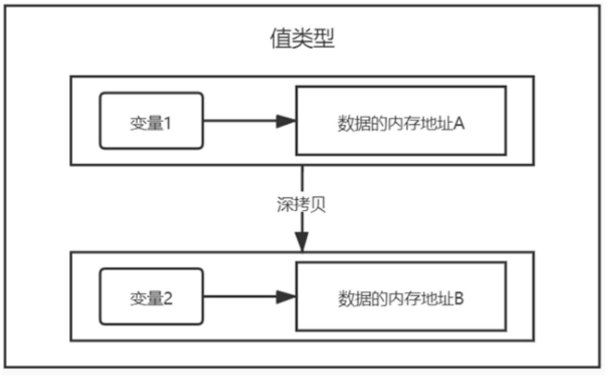
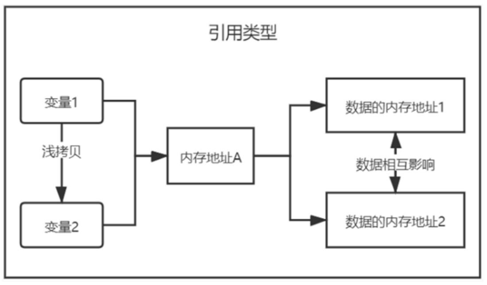

## panic触发宕机
大部分编程语言都支持异常机制，如Python的try…except，异常机制不仅能处理程序中出现的异常，还能实现程序的流程控制。

Go语言追求简洁优雅，所以不支持传统的异常机制，如果将异常与流程控制混在一起，很容易使代码变得混乱，并且开发者很容易滥用异常，为了一个小错误而抛出异常，这样不符合Go语言的设计要求。

Go语言没有异常机制，但提供了宕机功能，它与其他编程语言的自定义异常是同一概念，本书将Go语言的宕机统一称为异常。

虽然不建议使用异常机制，但在极个别的情况下不得不使用异常处理错误，比如除数为0的时候执行运行等情况，因此引入了异常处理，异常处理的关键字分别为defer、panic和recover。

关键字panic是让开发者能自主抛出异常，使程序进入宕机状态而终止运行，示例代码如下：
```go
package main

func main() {
   panic("这是自定义异常")
}
```
关键字panic在Go语言中是以内置函数panic()表示的，内置函数panic()可使程序提示异常而终止运行，它设有参数v，参数类型为空接口，参数v代表异常信息。

## defer延时执行
关键字defer具有延时执行的作用，在一个函数中，只要某行代码使用了关键字defer，它都会被最后执行，如果函数设有返回值，则在代码执行完成后和函数返回值之间执行，示例如下：
```go
package main

import "fmt"

func myFunc() int {
    defer fmt.Printf("这是defer\n")
    fmt.Printf("这是函数的业务逻辑\n")
    return 1
}

func main() {
    fmt.Printf("这是函数返回值：%v\n", myFunc())
}
```

```
这是函数的业务逻辑
这是defer
这是函数返回值：1
```

一般情况下，关键字defer建议写在函数的第一行代码中，这样便于代码阅读，并且defer可以执行任意代码，如果需要执行多行代码，建议将多行代码写在一个匿名函数里面。

关键字defer不仅能作为函数的回调函数，它在开发中也十分常用，比如在sync加锁后执行锁释放，在sync同步等待组调用Done()方法等场景。

如果关键字defer与panic结合使用，defer必须在panic前面，示例如下：
```go
func main() {
    defer fmt.Printf("这是defer\n")
    panic("这是自定义异常")
}
```
## recover宕机时恢复执行
使用panic()抛出异常，程序就会停止执行，如果让程序在异常情况下仍能继续运行，可以结合defer和recover实现异常捕捉和恢复，它与其他编程语言的异常捕捉和处理（try/catch机制）是同一概念。

关键字recover以内置函数recover()表示，函数返回值为空接口，代表程序的异常信息，它必须与关键字defer结合使用才能实现异常捕捉和处理，示例如下：
```go
package main

import "fmt"

func myFunc() {
    // 定义延时执行的匿名函数
    defer func() {
        // 使用recover()捕捉异常
        if err := recover(); err != nil {
            // err不为空值，说明主动抛出异常
            fmt.Printf("捕捉异常：%v\n", err)
        } else {
            // err为空值，说明程序没有抛出异常
            fmt.Println("程序没有异常")
        }
    }()
    // 正常执行程序
    fmt.Println("程序正常运行")
    // 主动抛出异常
    panic("这是自定义异常")
}

func main() {
    // 调用函数
    myFunc()
}
```

```
程序正常运行
捕捉异常：这是自定义异常
```

示例中的函数myFunc()实现异常抛出和捕捉，主函数main()负责调用函数myFunc()，说明如下：

* 1）在函数myFunc()中，异常捕捉必须使用defer和recover()实现，当panic()抛出异常的时候，recover()自动捕捉和处理异常信息，使程序能继续往下执行。
* 2）recover()的返回值是异常信息，如果没有捕捉异常，返回值为空值（nil）。如果能捕捉异常，则返回值为panic()设置的异常信息。换句话说，当使用panic()抛出异常的时候，panic()的参数值将会作为recover()的返回值。
* 3）通过recover()的返回值判断当前程序是否出现异常，从而执行不同的操作。换句话说，使用defer、recover()和panic()可以实现代码的流程控制，但编写的代码量较多，而且不符合Go语言的设计思想，在开发中不建议使用。
* 4）如果将panic()放在主函数main()中，程序也会因异常而终止运行，因为recover()的作用域只在函数myFunc()中，而panic()已超出recover()的作用域，所以异常无法成功捕捉。

综上所述，defer、recover()和panic()的关系说明如下：

* 1）defer具有延时执行的功能，在一个函数中，它的执行顺序在函数返回值之前。
* 2）recover()捕捉异常，必须与defer搭配使用，否则程序无法捕捉异常。
* 3）如果panic()没有搭配recover()，程序会提示异常而终止运行，如果两者在同一个函数中，程序出现异常仍能继续往下执行。

## 值类型、引用类型与深浅拷贝
变量拷贝在执行数据处理的时候发生，目的是保留数据处理前的变量而重新定义新的变量。简单来说，就是将一个变量的数据复制并存放到另一个变量中。

变量拷贝分为深拷贝和浅拷贝，深浅拷贝的区别在于变量之间是否共用一个内存地址。两者的说明如下：

* 1）深拷贝是两个变量分别使用不同的内存地址存储相同的数据，如变量a的内存地址为0xc000040240，存放数据为字符串“hello”；变量b通过变量a赋值，但变量b的内存地址为0xc000040260，此时变量a和b在不同内存地址中，两者互不干扰，仅仅是存储了相同的数据。
* 2）浅拷贝是两个变量的内存地址相同，当其中一个变量修改数据时，另一个变量的数据也会随之变化，如变量a和变量b的内存地址为0xc000040240，当变量a修改内存地址的数据后，变量b的数据也会随之变化，换句话说，浅拷贝好比一个人有两个名字。

Go语言对不同数据类型的变量设置了对应的拷贝方式，不同的数据类型分为值类型变量和引用类型变量，两者说明如下：

* 1）值类型变量是变量直接存储数据，内存通常在栈中分配。
* 2）值类型的数据类型：整型、布尔型、浮点型、字符串、数组和结构体等。
* 3）值类型变量的数据赋值到另一个变量都是深拷贝。
* 4）引用类型变量是变量存储一个内存地址，这个内存地址再存储数据，内存通常在堆上分配，通过GC回收。
* 5）引用类型的数据类型：指针、切片、集合、通道和接口等。
* 6）引用类型变量的数据赋值到另一个变量都是浅拷贝。

为了更好地理解值类型数据、引用类型数据和深浅拷贝的关系，我们通过示例加以说明，代码如下：
```go
package main

import "fmt"

func main() {
    /* 值类型变量 */
    s := "hello"
    fmt.Printf("变量s的内存地址：%p，变量值为：%v\n", s, s)
    fmt.Printf("变量s的内存地址：%p，变量值为：%v\n", &s, &s)
    // 将变量赋值给另一个变量，执行深拷贝方式
    ss := s
    fmt.Printf("变量ss的内存地址：%p，变量值为：%v\n", ss, ss)
    fmt.Printf("变量ss的内存地址：%p，变量值为：%v\n", &ss, &ss)

    /* 引用类型变量 */
    m := make(map[string]interface{})
    m["name"] = "Tom"
    fmt.Printf("变量m的内存地址：%p，变量值为：%v\n", m, m)
    fmt.Printf("变量m的内存地址：%p，变量值为：%v\n", &m, &m)
    // 将变量赋值给另一个变量，执行浅拷贝方式
    mm := m
    fmt.Printf("变量mm的内存地址：%p，变量值为：%v\n", mm, mm)
    fmt.Printf("变量mm的内存地址：%p，变量值为：%v\n", &mm, &mm)
    // 修改某个变量的值，另一个变量随之变化
    mm["name"] = "Tim"
    fmt.Printf("变量m的内存地址：%p，变量值为：%v\n", m, m)
    fmt.Printf("变量m的内存地址：%p，变量值为：%v\n", &m, &m)
    fmt.Printf("变量mm的内存地址：%p，变量值为：%v\n", mm, mm)
    fmt.Printf("变量mm的内存地址：%p，变量值为：%v\n", &mm, &mm)
}
```

```
变量s的内存地址：%!p(string=hello)，变量值为：hello
变量s的内存地址：0xc000054260，变量值为：0xc000054260
变量ss的内存地址：%!p(string=hello)，变量值为：hello
变量ss的内存地址：0xc000054290，变量值为：0xc000054290
变量m的内存地址：0xc0000744b0，变量值为：map[name:Tom]
变量m的内存地址：0xc00000a030，变量值为：&map[name:Tom]
变量mm的内存地址：0xc0000744b0，变量值为：map[name:Tom]
变量mm的内存地址：0xc00000a038，变量值为：&map[name:Tom]
变量m的内存地址：0xc0000744b0，变量值为：map[name:Tim]
变量m的内存地址：0xc00000a030，变量值为：&map[name:Tim]
变量mm的内存地址：0xc0000744b0，变量值为：map[name:Tim]
变量mm的内存地址：0xc00000a038，变量值为：&map[name:Tim]
```
分析程序的运行结果得知：

1）当变量为值类型变量的时候，如变量s为字符串类型，它仅分配了一个内存地址存储数据（即运行结果的0xc000040240，%!p(string=hello)没有获取内存地址）。

2）当变量s的值赋予变量ss，变量ss拥有独立的内存地址，如0xc000040270，变量s和ss是两个互不干扰的变量，说明值类型变量之间是通过深拷贝方式进行复制的。

3）当变量为引用类型变量时，如变量m为集合Map类型，它具有两个不同的内存地址，如0xc00007a3f0和0xc000006030，内存地址0xc000006030存储集合数据，而内存地址0xc00007a3f0作为变量m和集合数据的桥梁。

4）当变量m的值赋予变量mm时，变量mm与变量m的内存地址相同，如内存地址0xc00007a3f0，但两者的集合数据的内存地址不相同。

5）当修改变量mm的集合数据时，尽管变量m和mm集合数据的内存地址不相同，但变量m的集合数据仍会随之变化。

如果将深浅拷贝、值类型和引用类型之间的关系通过图解表示，值类型与深拷贝的图解关系如图12-7所示，引用类型与浅拷贝的图解关系如图12-8所示。


值类型与深拷贝的图解关系


引用类型与浅拷贝的图解关系

理解深浅拷贝、值类型和引用类型之间的关系之后，还需要掌握Go语言哪些数据类型是值类型；哪些数据类型是引用类型。在日常开发中，开发者常常会由于一时大意而忘记数据类型是值类型还是引用类型，导致程序出现错误而无法查明原因。

## 类型别名与自定义
类型别名与类型定义是由关键字type实现的，两者代表不同的功能，说明如下：

1）类型别名是对已有数据类型赋予新命名，如一个孩子在小时候有小名、乳名，上学后用学号或者英文名，这些名字都代表他本人。类型别名主要解决代码升级、迁移中存在的类型兼容性问题。

2）类型定义是自定义数据类型，但自定义数据类型必须在已有数据类型基础上进行定义，最常见的是类型定义为结构体和接口。

类型别名与类型定义在代码结构上十分相似，两者之间的语法差异如下：
```go
// 类型别名
type name = Type

// 类型定义
type name Type
```
为了更好地说明类型别名与类型定义的差异，我们通过简单的例子加以说明，代码如下：
```go
package main

import (
    "fmt"
)

// 将string类型取一个别名叫meString
type meString = string

// 将myString定义为string类型
type myString string

func main() {
    // 将s1声明为meString类型
    var s1 meString
    // 查看s1的类型名
    fmt.Printf("s1的数据类型为：%T\n", s1)

    // 将s2声明为myString类型
    var s2 myString
    // 查看s2的类型名
    fmt.Printf("s2的数据类型为：%T\n", s2)
}
```

```
s1的数据类型为：string
s2的数据类型为：main.myString
```

从运行结果分析得知：

* 1）将meString设置为字符串string的一个别名，它等同于字符串类型string。
* 2）将myString定义为字符串类型string，通过关键字type定义，myString成为自定义数据类型，但它依然具备字符串类型string的特性。
* 3）变量s1设置为meString类型，格式化参数%T能查看变量s1的数据类型，输出结果为字符串类型。
* 4）变量s2设置为myString类型，格式化参数%T能查看变量s2的数据类型，输出结果为自定义类型myString，并且该类型在main包中定义。

在实际开发中，通常使用类型定义对一些数据结构进行封装处理，尽管类型定义是以Go语言的数据类型为基础的，但在此基础上仍能创建或组合多种复杂的数据类型，示例如下：
```go
package main

import "fmt"

// 定义结构体
type mystruct struct {
    name string
}

// 将mystyle定义为mystruct类型
type mystyle mystruct

func main() {
    // 将s声明为mystyle类型
    var s mystyle
    // 设置属性name的值
    s.name = "Tom"
    // 输出变量s的数据
    fmt.Printf("变量s的数据：%v\n", s)
    // 输出变量s的数据类型
    fmt.Printf("变量s的数据类型：%T\n", s)
}
```

```
变量s的数据：{Tom}
变量s的数据类型：main.mystyle
```
分析上述代码，我们能得出以下结论：

* 1）使用关键字type定义结构体mystruct，并设置结构体成员name；然后使用关键字type定义类型mystyle，其数据类型来自结构体mystruct。
* 2）在主函数main()中定义变量s，其数据类型为mystyle，由变量s设置属性name的值。
* 3）分别使用格式化参数%v和%T查看变量s的数据和类型，数据类型为mystyle，从输出结果已无法得知mystyle的定义过程，从而在某程度上达到代码封装的效果。

## new和make的区别
内置函数new()和make()用于内存分配：new()只分配内存，make()为切片、集合以及通道的数据类型分配内存和初始化。

首先分析内置函数new()，在GoLand中查看new()源码信息，源码及注释说明如下：
```go
// The new built-in function allocates memory. The first argument is a type
// not a value, and the value returned is a pointer to a newly
// allocated zero value of that type
func new(Type) *Type
```

new()语法说明如下：
1）函数参数Type用于创建变量的数据类型。
2）返回值*Type以指针形式表示，说明创建的变量以指针表示。

根据语法定义分别创建整型、字符串、集合、切片和通道的变量，示例代码如下：
```go
package main

import "fmt"

func main() {
    // 为变量myInt创建Int类型的内存地址
    myInt := new(int)
    fmt.Printf("myInt类型：%T，数值：%v，地址：%v\n", *myInt,*myInt,myInt)

    // 为变量myStr创建String类型的内存地址
    myStr := new(string)
    fmt.Printf("myStr类型：%T，数值：%v，地址：%v\n", *myStr,*myStr,myStr)

    // 为变量myMap创建Map类型的内存地址
    myMap := new(map[string]string)
    fmt.Printf("myMap类型：%T，数值：%v，地址：%v\n", *myMap,*myMap,myMap)

    // 为变量mySli创建Slice类型的内存地址
    mySli := new([]int)
    fmt.Printf("mySli类型：%T，数值：%v，地址：%v\n", *mySli,*mySli,mySli)

    // 为变量myChan创建Channel类型的内存地址
    myChan := new(chan string)
    fmt.Printf("myChan类型：%T，数值：%v，地址：%v\n", *myChan,*myChan,myChan)
}
```

```
myInt类型：int，数值：0，地址：0xc00000e0a8
myStr类型：string，数值：，地址：0xc000054260
myMap类型：map[string]string，数值：map[]，地址：&map[]
mySli类型：[]int，数值：[]，地址：&[]
myChan类型：chan string，数值：<nil>，地址：0xc00000a038
```
结合运行结果与内置函数new()的特性，我们能得出以下结论：

1）内置函数new()适用于所有数据类型。
2）使用new()创建变量，其变量值以指针方式表示，并且指针存储的数据为零，如整型为0，字符串为空字符串，布尔为false，切片为空切片，集合为空集合等。

new()创建的变量以指针表示，那么它与指针之间又存在怎样的关系呢？我们通过下面的例子加以说明：
```go
package main

import "fmt"

func main() {
    // 为变量myInt创建Int类型的内存地址
    myInt := new(int)
    // 给变量myInt赋值
    *myInt = 666
    fmt.Printf("myInt类型：%T，数值：%v，地址：%v\n", *myInt,*myInt,myInt)

    // 定义指针变量myPro
    var myPro *int
    // 输出指针变量的信息
    fmt.Printf("myPro类型：%T，数值：%v，地址：%v\n", myPro,myPro,myPro)
    // 定义变量num并赋值
    num := 777
    // 将变量num的内存地址赋予指针myPro
    myPro = &num
    // 输出指针变量的信息
    fmt.Printf("myPro类型：%T，数值：%v，地址：%v\n", *myPro,*myPro,myPro)
}
```

```
myInt类型：int，数值：666，地址：0xc00000e0a8
myPro类型：*int，数值：<nil>，地址：<nil>
myPro类型：int，数值：777，地址：0xc00000e0f0
```
内置函数new()与指针的差异说明如下：

1）内置函数new()创建的变量是指针变量，并且已分配了对应的内存地址，可以直接对变量执行赋值操作。
2）使用var定义指针变量，它的数据和内存地址皆为空值（nil），操作指针变量必须设置具体的内存地址，因此还需要绑定某个变量的内存地址。
3）内置函数new()等于实现了指针的定义与赋值过程，指针赋值是指针变量设置具体的内存地址，并不是在内存地址中存放数值。

内置函数make()仅用于分配和初始化切片、集合以及通道的数据类型。

make()语法说明如下：

* 1）函数参数t是创建的变量的数据类型，仅允许设置切片、集合以及通道的数据类型。
* 2）函数参数size...IntegerType是可选参数，用于设置切片、集合、通道的长度或容量。
* 3）返回值Type是已创建的变量。

根据make()语法定义分别创建切片、集合以及通道的变量，示例代码如下：
```go
package main

import "fmt"

func main() {
    // 创建切片类型的变量mySli，切片长度和容量为10
    mySli := make([]int, 10)
    // 对切片第一个元素赋值
    mySli[0] = 666
    // 输出切片信息
    fmt.Printf("mySli数值：%v，长度：%v，容量：%v\n", mySli, len(mySli), cap(mySli))

    // 创建集合类型的变量myMap
    myMap := make(map[string]string)
    // 设置集合的成员值
    myMap["name"] = "Tom"
    // 输出集合信息
    fmt.Printf("myMap数值：%v，成员数量：%v\n", myMap, len(myMap))

    // 创建通道类型的变量myChan，容量为10
    myCh := make(chan string, 10)
    // 往通道写入数据
    myCh <- "hello"
    // 输出通道信息
    fmt.Printf("myCh数值：%v，已用缓存：%v，容量：%v\n", myCh, len(myCh), cap(myCh))
}
```

```
mySli数值：[666 0 0 0 0 0 0 0 0 0]，长度：10，容量：10
myMap数值：map[name:Tom]，成员数量：1
myCh数值：0xc00002a0c0，已用缓存：1，容量：10
```

从上述示例得知：

* 1）内置函数make()能直接创建切片、集合以及通道的变量。
* 2）变量的值为零，如切片为空切片，每个切片元素为0或空字符串；集合为空集合，没有任何成员；通道为空通道，不寄存任何数据。

综上所述，内置函数new()和make()的区别如下：

* 1）new()适用于所有数据类型，make()仅适用于切片、集合以及通道的数据类型。
* 2）new()创建的变量以指针形式表示，make()创建的变量是某个数据类型的变量。
* 3）new()仅有参数Type，代表变量的数据类型；make()的参数Type代表变量的数据类型，参数size...IntegerType是可选参数，用于设置切片、集合、通道的长度或容量。

## 泛型的概念与应用
泛型全称为泛型程序设计（Generic Programming），它是程序设计语言的一种风格或范式。泛型允许程序员在强类型编程语言中实例化某个对象的时候才指明参数的数据类型。不同编程语言的编译器（解释器）、运行环境对泛型的支持均不一样。

在定义函数方法的时候，必须对参数和返回值设置数据类型，调用过程中必须按照定义的数据类型设置参数值和返回值，如果传递数据的数据类型与定义的数据类型不相符，则提示异常，如图12-14所示。

若想要函数的参数和返回值不受数据类型限制，可以将参数和返回值设置为空接口，空接口能给使用者传递任意数据类型的数据，但如果函数只允许传递部分数据类型的数据，则需要由泛型实现。

在函数中使用泛型，必须在函数名后面和参数前面设置泛型，其语法格式如下：
```go
func name[p, r](parameter p) r {
    parameter
    return returnType
}
```
函数定义说明如下：

* func是Go语言的关键字，用于定义函数和方法。
* name是函数名，可自行命名。
* parameter是函数参数。
* p是为参数parameter设置数据类型，多个数据类型之间以“|”隔开，如int | string。
* r是为返回值设置数据类型，多个数据类型之间以“|”隔开，如int | string。

简单来说，在函数中使用泛型，只要在函数名后面和参数前面使用中括号“[]”，分别对参数和返回值设置一个或多个数据类型即可，详细示例如下：
```go
package main

import "fmt"

// 定义泛型函数
func sum[K string, V int | float64](m map[K]V) V {
    var s V
    for _, v := range m {
        s += v
    }
    return s
}

func main() {
    // 定义变量
    myints := map[string]int{
        "first": 34,
        "second": 12,
    }
    // 定义变量
    myfloats := map[string]float64{
        "first": 35.98,
        "second": 26.99,
    }
    // 输出计算结果
    fmt.Printf("泛型函数的int： %v\n", sum[string, int](myints))
    fmt.Printf("泛型函数的float64： %v\n", sum[string, float64](myfloats))
}
```

```
泛型函数的int： 46
泛型函数的float64： 62.97
```

上述代码主要分为两部分：泛型函数的定义与调用，具体说明如下：

* 1）函数sum设置泛型K和V，泛型K为字符串类型，泛型V为整型或浮点型。
* 2）函数参数m为集合类型，集合的键的数据类型为泛型K（即字符串类型），值的数据类型为泛型V（即整型或浮点型）。
* 3）函数返回值为泛型V，即返回值数据类型为整型或浮点型。
* 4）调用函数sum的时候，必须使用中括号[]为泛型K和V设置具体的数据类型，然后再传递相应数据执行调用过程。

综上所述，泛型函数是对函数参数或返回值设置多个数据类型，比普通函数更灵活地设置参数类型和返回值类型，但比不上空接口参数的开放自由。

既然开放性比不上空接口，为什么还要引入泛型？因为空接口参数不受数据类型的限制，如果调用过程中，函数传入参数是无法处理的数据类型，则容易引起异常。使用泛型可以保证参数（返回值）类型的多样性，也能保证调用过程中不会传入非法参数。正如我们常听的一句话：所有的自由都是在有限制的前提下才叫自由。

## 小结
Go语言引入了异常处理，异常处理的关键字分别为defer、panic和recover。

变量拷贝分为深拷贝和浅拷贝，深浅拷贝的区别在于变量之间是否共用一个内存地址。两者的说明如下：

* 1）深拷贝是两个变量分别使用不同的内存地址存储相同的数据，如变量a的内存地址为0xc000040240，存放数据为字符串“hello”；变量b通过变量a赋值，但变量b的内存地址为0xc000040260，此时变量a和b在不同的内存地址中，两者互不干扰，仅仅是存储了相同的数据。
* 2）浅拷贝是两个变量的内存地址相同，当其中一个变量修改数据时，另一个变量的数据也会随之变化，如变量a和变量b的内存地址为0xc000040240，当变量a修改内存地址的数据后，变量b的数据也会随之变化，换句话说，浅拷贝好比一个人有两个名字。

类型别名与类型定义是由关键字type实现的，两者代表不同的功能，说明如下：

* 1）类型别名是对已有数据类型赋予新的名字，如一个孩子在小时候有小名、乳名，上学后用学号或者英文名，这些名字都代表他本人。类型别名主要解决代码升级、迁移中存在的类型兼容性问题。
* 2）类型定义是自定义数据类型，但自定义的数据类型必须在已有数据类型的基础上进行定义，最常见的是类型定义为结构体和接口。

内置函数new()和make()用于内存分配：new()只分配内存，make()为切片、集合以及通道的数据类型分配内存和初始化。


```go

```

```

```