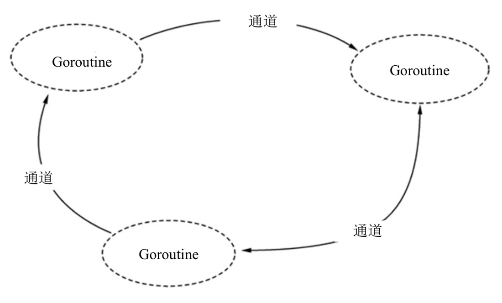

# 并发编程
## 异步的概念
并发编程是异步编程的功能之一，异步是所有编程语言都具备的语法之一，它是在不影响主程序执行的情况下独自执行某段代码完成某个功能，在执行过程中可能会占用主程序的某些资源，如主程序的数据、文件对象等。

异步编程在开发中十分常用，以网站的短信验证码为例，当我们获取验证码的时候，为了使用户能正常访问其他网页，验证码发送到手机的过程必须进行异步处理，因为手机接收短信会有网络延时，如果这个过程在主程序执行，用户便无法浏览其他网页，浏览器也会处于卡死状态。

用生活例子说明异步编程，以吃饭为例，吃饭主要靠嘴巴完成，在吃饭过程中可能会观看电视，看电视这个过程是由眼睛完成的，一边吃饭一边看电视是两件不太相关的事情，但它们都是由大脑控制的。若将大脑当作计算机的CPU，吃饭是正在运行的主程序，看电视是在吃饭过程中附加的事情，可视为主程序的异步功能。

学习并发编程之前，我们必须了解异步编程的相关术语：并行、并发、进程、线程和协程等概念，说明如下：

1）并行是指不同的代码块同时执行，它以多核CPU为基础，每个CPU独立执行一个程序，各个CPU之间的数据相互独立，互不干扰。

2）并发是指不同的代码块交替执行，它以一个CPU为基础，使用多线程等方式提高CPU的利用率，线程之间会相互切换，轮流被程序解释器执行。

3）进程是一个实体，每个进程都有自己的地址空间（CPU分配），简单来说，进程是一个“执行中的程序”，打开Windows的任务管理器就能看到当前运行的进程。

4）线程是进程中的一个实体，被系统独立调度和分派的基本单位。线程自己不拥有系统资源，只拥有运行中必不可少的资源。同一进程中的多个线程并发执行，这些线程共享进程所拥有的资源。

5）协程是一种比线程更加轻量级的存在，重要的是，协程不被操作系统内核管理，协程完全是由程序控制的，它的运行效率极高。协程的切换完全由程序控制，不像线程切换需要花费操作系统的开销，线程数量越多，协程的优势就越明显。协程不受GIL的限制，因为只有一个线程，不存在变量冲突。

## Goroutine
Goroutine是Go语言的一大特色，也可以说是最大的特色，它是Go语言设计的调度器，包括3个基本对象：M、G、P。

Goroutine的基本对象为M、G、P，也称为GPM模型，说明如下：

1）M代表一个线程，G所有的任务最终是在M上执行的。

2）G代表一个Goroutine对象，每次调用的时候都会创建一个G对象，主要为M提供运行环境和程序调度。启动一个G很简单，在程序中使用go function即可，function代表函数名称。

3）P代表一个处理器，运行每一个M都必须绑定一个P，就像线程必须在一个CPU核上执行一样。P的数量可以通过GOMAXPROCS()设置，它的默认值为CPU核心数，它代表了真正的并发数量，即有多少个G可以同时运行。

Go语言的并发编程除了Goroutine之外，还包括通道、分配器和GC等功能，具体说明如下：

1）通道用于实现数据共享，为正在执行的并发程序提供数据资源共享支持，确保程序能分而治之。

2）分配器是为各个程序提供内存分配，保证各个并发程序能正常执行，充分利用计算机资源。

3）GC是垃圾回收机制，确保能及时回收程序不再使用的资源，防止程序长期占用资源而导致宕机。

总的来说，Go语言调度机制将计算机的进程、线程、协程等各个资源都充分调用，使程序能在计算机有限的资源下充分利用，从而达到高并发状态。

Go语言的高并发优势是其他编程语言无法比拟的，以Python和Java为例，它们的多进程、多线程和协程需要自行编写程序，Go语言只需使用关键字go function就能自动执行并发，以最少的代码执行最大的并发。

如果读者想深入了解Goroutine的底层原理，可以自行在网上搜索相关资料，也可以从Goroutine的源码文件分析调度过程。

## 函数创建Goroutine
Go语言是从main()函数开始执行，程序启动默认为main()函数创建一个Goroutine，只要函数中使用关键字go即可创建新的Goroutine执行并发。关键字go后面设置某个函数，让Goroutine对该函数执行并发操作，其语法如下：
```go
go func(parameter)
```
语法格式说明如下：

* 1）go代表Go语言关键字，用于实现高并发。
* 2）func代表已定义的函数名称，为并发执行提供程序入口。
* 3）parameter代表函数参数。

按照关键字go的语法格式，通过示例说明如何实现Go语言的并发编程，示例如下：
```go
package main

import (
    "fmt"
    "time"
)

func running() {
    // 循环5次
    for i := 0; i < 5; i++ {
        fmt.Println("tick", i)
        // 延时1秒
        time.Sleep(1 * time.Second)
    }
}

func main() {
    // 并发执行程序
    go running()
    // 主程序
    for i := 0; i < 5; i++ {
        time.Sleep(1 * time.Second)
        fmt.Println("Waitting for you")
    }
}
```

```
tick 0
tick 1
Waitting for you
Waitting for you
tick 2
tick 3
Waitting for you
Waitting for you
tick 4
Waitting for you
```
从运行结果看到，程序首先为main()函数创建一个Goroutine，然后使用关键字go为函数running()创建新的Goroutine，Go语言的调度机制自动为两个Goroutine进行资源调度，从而完成并发过程。

我们知道函数定义可以分为4种类型，分别是：

·无参数，无返回值。
·有参数，无返回值。
·无参数，有返回值。
·有参数，有返回值。

在并发操作中，有返回值的函数会被忽略返回值，如果需要从并发中返回数据，只能使用通道实现，将需要返回的数据写入通道，主函数或其他并发函数都能从通道读取数据，从而实现数据共享。

定义并发函数只需要考虑是否需要设置函数参数，下面通过示例讲述带参数的函数如何实现并发过程：
```go
package main

import (
    "fmt"
    "time"
)

func running(name string) {
    // 循环5次
    for i := 0; i < 5; i++ {
        fmt.Printf("tick %v, %v\n", i, name)
        // 延时1秒
        time.Sleep(1 * time.Second)
    }
}

func main() {
    // 并发执行程序
    var name = "Tom"
    go running(name)
    // 主程序
    for i := 0; i < 5; i++ {
        time.Sleep(1 * time.Second)
        fmt.Println("Waitting for you")
    }
}
```

```
tick 0, Tom
tick 1, Tom
Waitting for you
Waitting for you
tick 2, Tom
tick 3, Tom
Waitting for you
Waitting for you
tick 4, Tom
Waitting for you
```

## 匿名函数创建Goroutine
关键字go还可以使用匿名函数实现并发操作，但关键字go后面必须包含匿名函数的定义和调用，具体语法如下：
```go
go func(parameter){
    func field
}(para)
```
语法格式说明如下：

* 1）go代表Go语言关键字，用于实现高并发。
* 2）func代表Go语言关键字，用于定义匿名函数。
* 3）parameter代表函数参数。
* 4）func field代表匿名函数的定义过程。
* 5）para代表匿名函数被调用时所需设置的参数。

按照语法格式，通过简单示例加以说明，示例如下：
```go
package main

import (
    "fmt"
    "time"
)

func main() {
    // 并发执行程序
    go func() {
        // 定义匿名函数
        for i := 0; i < 5; i++ {
            fmt.Println("tick", i)
            // 延时1秒
            time.Sleep(1 * time.Second)
        }
    }() // 小括号调用匿名函数
    // 主程序
    for i := 0; i < 5; i++ {
        time.Sleep(1 * time.Second)
        fmt.Println("Waitting for you")
    }
}
```

```
tick 0
Waitting for you
tick 1
tick 2
Waitting for you
Waitting for you
tick 3
tick 4
Waitting for you
Waitting for you
```
由于匿名函数具有即时定义、即时调用的特性，从代码编写规范来说，使用匿名函数实现并发操作容易造成代码冗余，不利于代码复用、维护和阅读。

## 通道
在任何编程语言中，只要存在并发就会出现数据和资源争夺的情况，比如程序执行了两个并发操作，每个并发都是对同一个文件进行读写处理，这样很容易出现文件数据异常。

假如并发A读取文件A之后，再由并发B读取和修改文件A，此时文件A的数据已经发生变化，但是并发A读取的文件内容仍然是未修改之前的数据，只要并发A修改文件内容，最终并发B修改的内容将被并发A覆盖。

为了解决数据和资源的不同步，大多数编程语言都会为数据资源加上锁，每次并发的时候确保只有一个并发占用数据资源，从而确保数据资源的同步性。

Go语言为了解决数据资源的同步问题，引入了通信机制——通道，它是Go语言中一种特殊的数据类型，为多个Goroutine之间提供数据资源共享，如图所示。



在并发过程中，多个Goroutine为了争抢数据资源必然造成阻塞，降低了执行效率，为了保证执行效率，同一时刻只有一个Goroutine访问通道进行写入和读取数据，Goroutine之间也能实现数据通信。通道遵循先入先出（First In First Out）的原则，保证收发数据的顺序。

通道是一个特殊的数据类型，在使用之前必须定义和创建通道变量，定义通道的语法如下：
```go
var name chan type
```
语法格式说明如下：

1）var是Go语言关键字，用于定义变量。
2）name是通道变量名称，可自行命名。
3）chan是Go语言关键字，将变量定义为通道类型。
4）type是通道存放的数据类型。

通道定义之后，还需要使用关键字make创建通道，通道的创建语法如下：
```go
name := make(chan type, num)
```

语法格式说明如下：

1）name是通道变量名称，可自行命名。
2）make是Go语言关键字，用于创建通道。
3）chan type的chan是Go语言关键字，type是通道能存放的数据类型。
4）num是通道存放数据的数量上限。

在实际编程中，我们直接使用关键字make创建通道即可使用，这样能省去定义通道的过程，示例代码如下：
```go
// 定义和创建通道
var ch chan string
ch = make(chan string)

// 直接创建通道，无须定义
ch := make(chan string)
```
通道创建之后，使用通道完成写入和读取数据操作。在通道里面写入和读取数据需要由<-操作符实现，使用说明如下：
```go
// 构建通道
ch := make(chan string)

// 往通道写入数据
ch <- "Hello"

// 从通道获取数据，赋予变量s
s := <- ch
```
从示例代码看到，在通道里面写入和读取数据的区别是通道变量在<-操作符的位置。如果通道变量在<-操作符的左边，说明是往通道里面写入数据；如果通道变量在<-操作符的右边，说明是读取通道里面的数据。

关键字make创建通道默认为双向通道，双向通道可以执行写入和获取。此外，我们还可以定义单向通道，它只能写入数据，不能获取数据，或者只能获取数据，不能写入数据。单向通道的定义与创建如下：
```go
ch := make(chan int)

// 定义只能写入不能获取的单向通道
var only_wirte chan<- int = ch

// 定义只能获取不能写入的单向通道
var only_read <-chan int = ch

// 对只能写入不能获取的单向通道写入数据
only_wirte <- 10

// 对只能写入不能获取的单向通道获取数据
<- only_wirte
```

单向通道只能执行特定的操作，比如只能写入不能获取的单向通道只能写入数据，如果获取数据将会提示异常：invalid operation: <-only_wirte (receive from send-only type chan<- int)。

单向通道在开发中有较大的局限性，应用场景也比较少，因此读者了解相关概念即可。

## 无缓冲通道
通道是通过关键字make创建的，在创建过程中，如果没有设置参数num，则视为创建无缓冲通道。无缓冲通道（Unbuffered Channel）是指在获取数据之前没有能力保存数据的通道，这种类型的通道要求两个Goroutine同时处于执行状态才能完成写入和获取操作。

如果两个Goroutine没有同时准备，某一个Goroutine执行写入或获取操作将会处于阻塞等待状态，另一个Goroutine无法执行写入或获取操作，程序将会提示异常，这种类型的通道执行写入和获取的交互行为是同步，任意一个操作都无法离开另一个操作单独存在。

当我们使用无缓冲通道的时候，必须注意通道变量的操作，确保程序中有两个或两个以上的Goroutine同时执行通道的读写操作，读写操作必须是一读一写，不能只读不写或只写不读，示例如下：
```go
// 只写入数据，不读取
ch := make(chan string)
ch <- "Tom"
fmt.Println("wait goroutine")

// 只读取数据，不写入
ch := make(chan string)
<- ch
fmt.Println("wait goroutine")
```

通道数据只写入不读取或者只读取不写入都会提示fatal error: all goroutines are asleep–deadlock异常，如果需要实现通道数据获取超时检测，可以使用关键字select实现。

如果程序中仅有一个Goroutine，使用通道读写数据也会导致异常，比如在主函数main()中对通道写入数据，再读取通道数据，示例如下：
```go
package main

import (
    "fmt"
)

func main() {
    // 构建通道
    ch := make(chan string)

    // 写入通道数据
    ch <- "Tom"
    // 读取通道数据
    <-ch

    fmt.Println("wait goroutine")
}
```
根据无缓冲通道的语法特点，我们在程序中使用3个Goroutine依次执行通道的读写操作，示例如下：
```go
package main

import (
    "fmt"
    "time"
)

func Goroutine1(ch chan string){
    fmt.Println("start goroutine1")
    // 数据写入通道，由Goroutine2()读取
    ch <- "goroutine2"
    fmt.Println("goroutine1 send channel: goroutine2")
    // 读取Goroutine2()写入的数据
    data := <-ch
    fmt.Printf("goroutine1 get channel: %v\n", data)
    // 数据写入通道，由主函数main()读取
    ch <- "Main goroutine"
}

func Goroutine2(ch chan string){
    fmt.Println("start goroutine2")
    // 读取Goroutine1()写入的数据
    data := <-ch
    fmt.Printf("goroutine2 get channel: %v\n", data)
    // 数据写入通道，由Goroutine1()读取
    ch <- "goroutine1"
    fmt.Println("goroutine2 send channel: goroutine1")
}


func main() {
    // 构建通道
    ch := make(chan string)
    // 执行并发
    go Goroutine1(ch)
    // 执行并发
    go Goroutine2(ch)
    // 延时5秒，使Goroutine1()和Goroutine2()相互读写通道数据
    time.Sleep(5 * time.Second)
    // 读取Goroutine1()写入的数据
    data := <-ch
    fmt.Printf("main goroutine get channel: %v\n", data)
}
```

```
start goroutine2
start goroutine1
goroutine1 send channel: goroutine2
goroutine2 get channel: goroutine2
goroutine2 send channel: goroutine1
goroutine1 get channel: goroutine1
main goroutine get channel: Main goroutine
```
上述代码定义了函数Goroutine1()和Goroutine2()，函数参数为通道变量ch，主函数main()分别对函数Goroutine1()和Goroutine2()执行并发操作，说明如下：

1）主函数main()创建通道变量ch，并对函数Goroutine1()和Goroutine2()执行并发操作，将通道变量ch分别以参数形式传入Goroutine1()和Goroutine2()。

2）函数Goroutine1()往通道变量ch写入数据，再由函数Goroutine2()读取数据；然后到函数Goroutine2()写入数据，由函数Goroutine1()读取；最后Goroutine1()写入数据，由主函数main()读取。

3）主函数main()设置了等待5秒，这是为了让函数Goroutine1()和Goroutine2()有足够的时间写入和读取数据，过了等待时间后，再从通道变量读取数据。

综上所述，在并发编程中，使用无缓存通道必须考虑各个Goroutine之间的数据读取和写入操作，必须遵从先写入后读取，再写入再读取的原则。

## 带缓冲通道
带缓冲通道（Buffered Channel）是在被获取前能存储一个或者多个数据的通道，这种类型的通道并不强制要求Goroutine之间必须同时完成写入和获取。当通道中没有数据的时候，获取动作才会阻塞；当通道没有可用缓冲区存储数据的时候，写入动作才会阻塞。

在无缓冲通道的基础上，只要为通道增加一个有限大小的存储空间就能形成带缓冲通道。带缓冲通道在写入时无须等待获取即可再次执行下一轮写入，并且不会发生阻塞，只有当存储空间满了才会发生阻塞。同理，如果带缓冲通道中有数据，获取时将不会发生阻塞，直到通道中没有数据可读时，通道才会阻塞。

从通道的定义角度分析，带缓冲和无缓冲通道的区别在于参数num。创建通道的时候，如果没有设置参数num，则默认参数值为0，通道为无缓冲通道，所以写入和获取数据必须同时进行才不会因阻塞而异常；如果参数num大于0，则写入和获取数据无须同步执行，因为通道有足够的空间存放数据。

由于带缓冲通道没有读写同步限制，我们可以在同一个Goroutine中执行多次写入和获取操作，具体示例如下：
```go
package main

import "fmt"

func main() {
    // 创建一个3个元素缓冲大小的整型通道
    ch := make(chan int, 3)
    // 查看当前通道的大小
    fmt.Println(len(ch))
    // 发送3个整型元素到通道
    for i := 0; i < 3; i++ {
        ch <- i
    }
    // 查看当前通道的大小
    fmt.Println(len(ch))
    for i := 0; i < 3; i++ {
        fmt.Println(<-ch)
    }
    // 查看当前通道的大小
    fmt.Println(len(ch))
    // 查看当前通道的容量
    fmt.Println(cap(ch))
}
```

```
0
3
0
1
2
0
3
```
上述代码的说明如下：

1）通过for执行了3次循环，每次循环将变量i写入通道，然后通过3次循环从通道获取数据并输出。

2）通道写入和读取数据的时候，使用len()函数获取通道已有的数据量，判断当前通道存储的数据量是否达到上限，这样可以防止程序在运行时提示异常。

3）使用cap()函数能获取通道的容量大小，即获取创建通道make()的参数num的大小。

带缓冲通道在很多特性上和无缓冲通道类似，无缓冲通道可以看作长度为0的带缓冲通道。根据这个特性，带缓冲通道在下列情况下会发生阻塞：

1）带缓冲通道的存储数据达到上限时，再次写入数据将发生阻塞而导致异常。

2）带缓冲通道没有存储数据时，获取数据将发生阻塞而导致异常。

Go语言为什么对通道要限制长度？因为多个Goroutine之间使用通道必然存在写入和获取操作，这种模式类型的典型例子为生产者消费者模式。如果不限制通道长度，当写入数据速度大于获取速度，内存将不断膨胀直到应用崩溃。因此，限制通道的长度有利于约束数据生产速度，生产数据量必须在数据消费速度+通道长度的范围内，这样才能正常地处理数据。

## 关闭通道读取数据
当通道被阻塞的时候，程序为了防止无止境地等待而执行异常提示，在获取通道数据的时候，为了确保通道数据不出现阻塞，可以关闭通道再获取数据。关闭通道是使用关键字close()实现的，其使用示例如下：
```go
package main

import "fmt"

func main() {
    // 创建容量大小为2的通道
    ch := make(chan int, 2)
    // 往通道写入数据
    ch <- 666
    // 关闭通道
    close(ch)
    // 输出通道的长度和容量
    fmt.Printf("通道长度：%v，容量：%v\n", len(ch), cap(ch))
    // 关闭通道后再次写入数据
    ch <- 777
}
```

```
通道长度：1，容量：2
panic: send on closed channel

goroutine 1 [running]:
main.main()
```

从运行结果看到，使用close()关闭通道之后，如果再往通道里面写入数据，程序将提示异常，说明已关闭的通道是不支持数据写入操作的。但已关闭的通道支持数据获取操作，示例如下：
```go
package main

import "fmt"

func main() {
    // 创建容量大小为2的通道
    ch := make(chan int, 2)
    // 往通道写入数据
    ch <- 666
    // 关闭通道
    close(ch)
    // 输出通道的长度和容量
    fmt.Printf("通道长度：%v，容量：%v\n", len(ch), cap(ch))
    // 关闭通道后再次写入数据
    //ch <- 777
    // 关闭通道后获取数据
    fmt.Printf("通道数据：%v\n", <-ch)
    fmt.Printf("通道数据：%v\n", <-ch)
}
```

```
通道长度：1，容量：2
通道数据：666
通道数据：0
```
## Select处理多通道
通道存储数据达到上限的时候，再往通道中写入数据就会提示异常，通道没有存储数据的时候，从通道中读取数据也会提示异常。在程序运行过程中，我们无法准确预估通道是否有数据或者数据存储是否已达上限，为了解决程序执行异常的问题，可以使用关键字select实现。

select是Go语言的一个控制结构语句，语法结构与switch语句相似，但仅适用于通道，它可以与case和default搭配使用，每个case必须是一个通信操作，操作方式是执行数据写入或数据读取，也就是说，select不仅能处理通道阻塞的异常，还能同时处理多个通道变量。select语法如下：
```go
select {
    case ch:
       do something;
    case ch:
       do something;
    /* 定义任意数量的case */
    default : /* 可选 */
       do something;
}
```
语法说明如下：

* 1）select和case是Go语言关键字，一个select可以搭配多个case。
* 2）ch代表通道的数据写入或读取。
* 3）do something用于执行某个操作。
* 4）default是Go语言关键字，它是可选语句。如果select有default，当所有case语句的通道无法操作时，则执行default语句的代码块；如果select没有default并且所有case语句的通道无法操作，则select将阻塞，直到某个case的通道可以执行。

根据select的语法格式，我们使用多通道的方式实现数据的存储和读写，示例如下：
```go
package main

import (
    "fmt"
    "time"
)

func sent_data(ch, ch1 chan int) {
    for i := 0; i < 5; i++ {
        select {
        case ch <- i:
            fmt.Printf("ch写入数据：%v\n", i)
        case ch1 <- i:
            fmt.Printf("ch1写入数据：%v\n", i)
        }
    }
}

func get_data(ch, ch1 chan int) {
    for i := 0; i < 5; i++ {
        select {
        case i := <-ch:
            fmt.Printf("ch接收数据：%v\n", i)
        case i := <-ch1:
            fmt.Printf("ch1接收数据：%v\n", i)
        }
    }
}

func main() {
    // 创建通道
    ch := make(chan int)
    ch1 := make(chan int)
    go sent_data(ch, ch1)
    go get_data(ch, ch1)
    time.Sleep(5 * time.Second)
}
```

```
ch写入数据：0
ch接收数据：0
ch接收数据：1
ch写入数据：1
ch写入数据：2
ch接收数据：2
ch1接收数据：3
ch1写入数据：3
ch1写入数据：4
ch1接收数据：4
```
上述示例定义了函数sent_data()和get_data()，主函数main()分别对函数执行并发操作，说明如下：

1）函数sent_data()设有两个参数，分别为ch和ch1，代表两个不同的通道变量，函数执行5次循环，每次循环使用select和case分别对通道变量ch或ch1执行数据写入操作。

2）函数get_data()的定义过程与sent_data()相似，它对通道变量ch或ch1执行数据读取操作。

3）主函数main()创建通道变量ch和ch1，使用关键字go分别对函数sent_data()和get_data()执行并发操作，最后设置等待延时5秒，主要等待并发程序执行完成。

4）通道变量ch和ch1设为无缓冲通道，通道数据写入和读取必须同步，否则造成阻塞。函数sent_data()和get_data()的select…case语句没有设置default语句，因为通道变量ch和ch1分别由不同函数操作，必然存在阻塞情况，如果设置default语句，程序会因为通道阻塞而无法实现数据的写入和读取。

综上所述，使用select…case…default语句可以防止通道阻塞而提示程序异常，同时还能处理多个通道。如果没有设置default语句，当通道遇到阻塞的时候，select也会处于阻塞，这样很容易造成程序无止境地等待，因此在使用select语句的时候需考虑这种极端情况。

## sync同步等待
主函数main()执行并发之后就会往下执行，当主函数main()的代码执行完成后就会终止整个程序运行，它不会等待并发程序的执行结果，主程序终止后就无法查看和得到并发程序的数据和执行结果。

若要使主程序能够等待并发程序完成执行，可以使用内置包sync的WaitGroup实现。WaitGroup称为同步等待组，它是通过计数器方式实现等待的，计数器的数值代表程序中有多少个并发程序，使用示例如下：
```go
package main

import (
    "fmt"
    "sync"
)

// 创建同步等待组对象
var wg sync.WaitGroup

// 定义函数，用于执行并发操作
func fun1() {
    for i := 1; i <= 3; i++ {
        fmt.Println("fun1。。i，", i)
    }
    // 代表完成并发，同步等待组的等待对象减一
    wg.Done()
}

// 定义函数，用于执行并发操作
func fun2() {
    for j := 1; j <= 3; j++ {
        fmt.Println("fun2。。j，", j)
    }
    // 代表完成并发，同步等待组的等待对象减一
    wg.Done()
}

func main() {
    // 设置同步等待组最大的等待数量
    wg.Add(2)
    // 执行并发
    go fun1()
    go fun2()
    fmt.Println("main进入阻塞状态。。等待并发程序结束。。")
    // 主程序进入阻塞状态，等待并发程序执行完成
    wg.Wait()
    fmt.Println("main解除阻塞。。")
}
```

```
main进入阻塞状态。。等待并发程序结束。。
fun1。。i， 1
fun1。。i， 2
fun1。。i， 3
fun2。。j， 1
fun2。。j， 2
fun2。。j， 3
main解除阻塞。。
```

上述示例的代码说明如下：

* 1）创建同步等待组对象wg，因为对象wg分别在主函数main()、函数fun1()和函数fun2中使用，所以将其定义为全局变量。如果在主函数main()中定义，执行并发的时候，需要以参数形式传递给函数fun1()和函数fun2。
* 2）函数fun1()和函数fun2执行完成后都必须使用wg调用Done()方法，让主程序知道并发程序已完成执行，解除主程序的阻塞等待。
* 3）主函数main()在执行并发之前，必须使用wg调用Add()方法设置等待数量，比如wg.Add(2)是等待两个并发程序执行完成。
* 4）并发程序启动后，主函数main()必须使用wg调用Wait()方法设置等待状态，当所有并发程序执行完成并调用了wg的Done()方法，主函数main()才会解除等待状态。

综上所述，使用内置包sync的WaitGroup实现同步等待的过程如下：

* 1）使用WaitGroup创建同步等待组对象wg。
* 2）wg调用Add()设置并发程序的等待数量，Add()用来设置wg计数器的值。
* 3）wg的等待数量必须与并发程序的数量一致。如果wg等待数量大于并发程序的数量，则提示fatal error: all goroutines are asleep – deadlock异常；如果wg等待数量小于并发程序的数量，主程序只会随机等待其中一个并发程序。
* 4）并发程序启动之后，主程序必须调用wg的Wait()进入阻塞等待状态，直到wg的计数器为0才解除阻塞等待状态。
* 5）并发程序执行完成后必须由wg调用Done()，该方法是将wg的计数器执行减1计算。当wg的计数器为0就会解除Wait()的阻塞等待状态，使主程序继续往下执行剩余的代码。

## sync加锁机制
Go语言的锁机制是为了使多个并发之间能按照一定的顺序执行，加锁后的程序会一直占用数据和资源，直到解锁为止。锁机制是由内置包sync实现的，锁类型分别为sync.Mutex和sync.RWMutex，两者说明如下：

1）sync.Mutex是互斥锁，仅支持一个Goroutine（并发程序）对数据进行读写操作。当一个Goroutine（并发程序）获得Mutex锁之后，其他Goroutine（并发程序）只能等待该Goroutine（并发程序）释放锁，否则将一直处于阻塞等待状态。

2）sync.RWMutex是读写互斥锁，它仅允许一个Goroutine（并发程序）对数据执行写入操作，但支持多个Goroutine（并发程序）同时读取数据，数据读取和写入分别由不同方法实现。如果从底层原理分析，sync.RWMutex是在sync.Mutex的基础上进行功能扩展，使其支持数据多读模式。

实际应用中只需定义结构体Mutex，分别调用结构体方法Lock()和Unlock()即可实现加锁处理，应用示例如下：
```go
package main

import (
    "fmt"
    "sync"
    "time"
)

// 定义互斥锁Mutex的全局变量
var (
    myMutex sync.Mutex
)

func get_data(name string) {
    // 加锁处理
    myMutex.Lock()
    // 程序执行
    fmt.Printf("这是：%v\n", name)
    // 解锁处理
    myMutex.Unlock()
}

func main() {
    // 执行并发
    go get_data("get_data")
    // 加锁处理
    myMutex.Lock()
    // 程序执行
    fmt.Printf("这是：%v\n", "Main")
    for i := 0; i < 3; i++ {
        // 每一秒输出一行数据
        time.Sleep(1 * time.Second)
        fmt.Printf("等待时间：%v秒\n", i+1)
    }
    // 解锁处理
    myMutex.Unlock()
    // 等待延时，为了等待并发程序执行完成
    // 可以改为WaitGroup等待
    time.Sleep(2 * time.Second)
}
```

```
这是：Main
等待时间：1秒
等待时间：2秒
等待时间：3秒
这是：get_data
```
根据运行结果分析上述代码：

1）定义全局变量myMutex，变量类型为sync.Mutex，它将在函数get_data()和主函数main()中使用。

2）定义函数get_data()，由变量myMutex调用Lock()方法执行加锁处理，当函数执行完成后，再调用Unlock()方法执行解锁处理。

3）主函数main()首先执行并发处理，然后由变量myMutex调用Lock()方法执行加锁处理，由主函数main()占用资源执行遍历输出，最后调用Unlock()方法执行解锁处理，将资源释放，由并发程序的函数get_data()占用。

如果程序执行多个并发操作，由于每个并发的执行时间各不相同，sync.Mutex只能保证当前只有一个并发占用资源，但不能改变并发的执行顺序，比如在上述代码的主函数main()中执行函数get_data()的多次并发。主函数main()的修改如下：
```go
package main

import (
    "fmt"
    "sync"
    "time"
)

// 定义互斥锁Mutex的全局变量
var (
    myMutex sync.Mutex
)

func get_data(name string) {
    // 加锁处理
    myMutex.Lock()
    // 程序执行
    fmt.Printf("这是：%v\n", name)
    // 解锁处理
    myMutex.Unlock()
}

func main() {
    go get_data("AAA")
    go get_data("BBB")
    time.Sleep(2 * time.Second)
}
```
```
这是：BBB
这是：AAA
```

运行主函数main()，字符串AAA和BBB的输出顺序各不相同，这也说明sync.Mutex无法保证并发程序的执行顺序。

sync.RWMutex提供了4个常用的结构体方法，分别为RLock()、RUnlock()、Lock()和Unlock()。其中RLock()和RUnlock()支持数据多读模式，Lock()和Unlock()支持数据单写模式，使用示例如下：
```go
package main

import (
    "fmt"
    "math/rand"
    "sync"
    "time"
)

// 全局变量
var count int
// 定义读写锁
var rLock sync.RWMutex
// 定义同步等待组
var wg sync.WaitGroup

// 数据读取函数
func read(i int) {
    // 加锁
    rLock.RLock()
    // 设置延时
    t := time.Duration(i * 2) * time.Second
    time.Sleep(t)
    fmt.Printf("读操作，等待时间：%v 数据=%d\n", t.Seconds(), count)
    // 解锁
    rLock.RUnlock()
    wg.Done()
}

// 数据写入函数
func write(i int) {
    // 加锁
    rLock.Lock()
    // 写入数据
    count = rand.Intn(1000)
    // 设置延时
    t := time.Duration(i * 2) * time.Second
    time.Sleep(t)
    fmt.Printf("写操作，等待时间：%v 数据=%d\n", t.Seconds(), count)
    // 解锁
    rLock.Unlock()
    wg.Done()
}

func main() {
    // 设置同步等待组
    wg.Add(6)
    // 设置随机数种子
    rand.Seed(time.Now().UnixNano())
    // 执行6次并发
    for i := 1; i < 4; i++ {
        go write(i)
    }
    for i := 1; i < 4; i++ {
        go read(i)
    }
    // 等待同步等待组执行并发
    wg.Wait()
}

```

```
读操作，等待时间：2 数据=0
读操作，等待时间：4 数据=0
读操作，等待时间：6 数据=0
写操作，等待时间：2 数据=871
写操作，等待时间：4 数据=428
写操作，等待时间：6 数据=460
```
```
读操作，等待时间：6 数据=0
写操作，等待时间：2 数据=561
读操作，等待时间：2 数据=561
读操作，等待时间：4 数据=561
写操作，等待时间：4 数据=36
写操作，等待时间：6 数据=369
```
## sync.Map的应用
在Go语言1.6版本之前，集合Map在并发程序中支持数据读取，但在写入过程中会存在异常，在1.6版本之后，通过并发读写集合Map都会提示异常，因此在1.9版本之前都是通过加锁处理或者封装成一个新的结构体，具体示例如下：
```go
package main

import (
    "fmt"
    "sync"
    "time"
)

// 定义全局变量
// 定义互斥锁
var s sync.Mutex
// 定义同步等待组
var wg sync.WaitGroup

// 定义并发函数
func set_map(m map[string]int, b int) {
    for i := 1; i < 5; i++ {
        // 加锁处理
        s.Lock()
        m["age"] = i + b
        fmt.Printf("集合map的age数据：%v\n", m["age"])
        // 解锁处理
        s.Unlock()
    }
    // 释放同步等待
    wg.Done()
}

func main() {
    // 记录程序开始时间
    start := time.Now()
    // 设置同步等待组
    wg.Add(2)
    m := map[string]int{"age": 10}
    // 执行并发操作
    go set_map(m, 0)
    go set_map(m, 10)
    // 等待同步等待组
    wg.Wait()
    // 记录程序结束时间并计算执行时间
    end := time.Now()
    consume := end.Sub(start).Seconds()
    fmt.Println("程序执行耗时(s)：", consume)
}
```

```
集合map的age数据：11
集合map的age数据：12
集合map的age数据：13
集合map的age数据：14
集合map的age数据：1
集合map的age数据：2
集合map的age数据：3
集合map的age数据：4
程序执行耗时(s)： 0.0010866
```
在1.9版本之后提供了一种效率较高且支持并发的数据类型——sync.Map。它是以结构体方式定义的，设有4个结构体成员和8个结构体方法

根据sync.Map的定义阐述sync.Map的结构体成员和常用结构体方法。

* 1）结构体成员mu是互斥锁，涉及结构体成员dirty的数据操作都要使用该锁进行锁定处理。
* 2）结构体成员read提供数据只读功能。
* 3）结构体成员dirty是当前集合map的数据，执行数据操作会使用结构体成员mu进行加锁处理，集合map的值为*entry，它是结构体entry。
* 4）结构体成员misses是计数器，它负责处理read、dirty的数据，确保两者的数据能同步更新。
* 5）结构体方法Load(key interface{}) (value interface{}, ok bool)根据键查找对应值，如果键不存在sync.Map，其值为nil（空值）。该方法设有一个参数和两个返回值，参数key代表需要查找的键，返回值value是键对应的值，返回值ok是查找结果。若参数key在sync.Map中，则返回true，否则返回false。
* 6）结构体方法Store(key, value interface{})新增或修改一个键值对。参数key是新增或修改的键，参数value代表键对应的值。如果参数key不在sync.Map中，则执行新增操作，否则修改sync.Map已有的键值对。
* 7）结构体方法Delete(key interface{})删除sync.Map的键值对，参数key是需要删除的键，如果参数key不在sync.Map中，则程序不执行任何操作。
* 8）结构体方法LoadAndDelete(key interface{}) (value interface{}, loaded bool)从sync.Map查找某个键值对，然后删除该键值对。参数key是需要删除的键，返回值value是键对应的值，返回值loaded是查找结果。如果参数key不在sync.Map中，返回值value为空值，返回值loaded为false；若参数key在sync.Map中，返回值value为键对应的值，返回值loaded为true。
* 9）结构体方法LoadOrStore(key, value interface{}) (actual interface{}, loaded bool)从sync.Map读取键值对或新增键值对。参数key是读取或新增的键；参数value是键对应的值，如果键值对不在sync.Map中，则执行新增操作，否则执行读取操作；返回值actual是查找键值对的数据；返回值loaded是查找结果。若参数key在sync.Map中，则返回true，否则返回false。
* 10）结构体方法Range(f func(key, value interface{}) bool)遍历sync.Map所有的键值对。参数f是匿名函数，每次遍历结果都会通过匿名函数返回，匿名函数的参数key和value代表键值对，bool代表该方法返回值的数据类型。

根据sync.Map的语法定义，我们通过简单的例子说明如何使用sync.Map，示例如下：
```go
package main

import (
    "fmt"
    "sync"
)

func main() {
    // 定义sync.Map类型的变量m
    var m sync.Map

    // Store()写入数据
    m.Store("name", "Tom")
    m.Store("age", 10)
    m.Store("address", "beijing")
    m.Store("vocation", "student")

    // Load()读取数据
    name, _ := m.Load("name")
    fmt.Printf("sync.Map的name数据：%v\n", name)
    age, _ := m.Load("age")
    fmt.Printf("sync.Map的age数据：%v\n", age)

    // Delete()删除数据
    m.Delete("address")
    fmt.Printf("sync.Map的数据：%v\n", m)

    // LoadAndDelete()读取并删除数据
    vocation, ok := m.LoadAndDelete("vocation")
    if ok{
        // 读取成功后输出数据
        fmt.Printf("sync.Map的vocation数据：%v\n", vocation)
        // 查看读取成功后是否删除数据
        fmt.Printf("sync.Map的数据：%v\n", m)
    }

    // LoadOrStore()读取或新增数据
    // 新增数据，如果key不存在，将参数key和value作为新的键值对写入
    live, ok := m.LoadOrStore("live", "BJ")
    fmt.Printf("sync.Map新增live数据：%v\n", live)
    fmt.Printf("sync.Map的数据：%v\n", m)
    // 读取数据，如果key已存在直接获取已有的value，参数value的值不起作用
    ages, ok := m.LoadOrStore("age", 15)
    fmt.Printf("sync.Map读取age数据：%v\n", ages)

    // 遍历输出数据
    m.Range(func(key, value interface{}) bool {
        fmt.Printf("sync.Map的key：%v\n", key)
        fmt.Printf("sync.Map的value：%v\n", value)
        return true
    })
}

```

```
sync.Map的name数据：Tom
sync.Map的age数据：10
sync.Map的数据：{{0 0} {{map[age:0xc00000a030 name:0xc00000a028 vocation:0xc00000a040] false}} map[] 0}
sync.Map的vocation数据：student
sync.Map的数据：{{0 0} {{map[age:0xc00000a030 name:0xc00000a028 vocation:0xc00000a040] false}} map[] 0}
sync.Map新增live数据：BJ
sync.Map的数据：{{0 0} {{map[age:0xc00000a030 name:0xc00000a028 vocation:0xc00000a040] true}} map[age:0xc00000a030 live:0xc00000a050 name:0xc00000a028] 0}
sync.Map读取age数据：10
sync.Map的key：age
sync.Map的value：10
sync.Map的key：live
sync.Map的value：BJ
sync.Map的key：name
sync.Map的value：Tom
```

下一步讲述如何在并发中使用sync.Map，示例如下：
```go
package main

import (
    "fmt"
    "sync"
    "time"
)

// 定义全局变量
// 定义同步等待组
var wg sync.WaitGroup

// 定义并发函数
func set_amap(m *sync.Map, b int) {
    // 参数m以指针接收者方式表示
    for i := 1; i < 5; i++ {
        m.Store("age", i+b)
        v, _ := m.Load("age")
        fmt.Printf("sync.Map的age数据：%v\n", v)
    }
    // 释放同步等待
    wg.Done()
}

func main() {
    // 记录程序开始时间
    start := time.Now()
    // 设置同步等待组
    wg.Add(2)
    var m sync.Map
    // 执行并发操作，sync.Map以指针形式作为参数传递
    go set_amap(&m, 0)
    go set_amap(&m, 10)
    // 等待同步等待组
    wg.Wait()
    // 记录程序结束时间并计算执行时间
    end := time.Now()
    consume := end.Sub(start).Seconds()
    fmt.Println("程序执行耗时(s)：", consume)
}
```

```
sync.Map的age数据：11
sync.Map的age数据：12
sync.Map的age数据：13
sync.Map的age数据：14
sync.Map的age数据：1
sync.Map的age数据：2
sync.Map的age数据：3
sync.Map的age数据：4
程序执行耗时(s)： 0.002917
```
使用sync.Map在执行效率上更为高效，并且在使用上无须自行加锁处理，示例说明如下：

1）定义全局变量wg，数据类型为sync.WaitGroup，它为并发程序设置同步等待功能。

2）定义并发函数set_amap()，参数m是指针类型的sync.Map，参数通过指针接收者方式传递sync.Map变量；参数b是整型数据，用来设置sync.Map的age数据。

3）主函数main()首先创建时间变量start和设置同步等待组的并发数量，然后定义sync.Map变量m和执行函数set_amap()的并发操作，将变量m以指针方式作为函数参数，最后设置变量wg的等待状态和计算程序执行时间。

4）sync.Map作为函数参数的时候，参数类型建议使用指针接收者表示，如果参数改用值接收者也能执行，但GoLand中会提示警告信息


```go

```

```

```

